# 🎯 Cracking the GenAI Interview — Series
### 📋 Session 1 Notes — Building the Foundation Roadmap | CampusX

**🎙️ Speaker:** Varun (Masters in Statistics & Financial Engineering · ~7 years Data Science/AI-ML experience · ex-FISERV, HDFC, PRACTIL, IBM)
**⏱️ Duration:** ~2 hours | **🎯 Session Type:** Series Kickoff (1 of 5) — Roadmap & Strategy, Live Q&A

---

## 🧭 What This Series Is (and Isn't)

> ⚠️ **Important disclaimer stated upfront:** This is **not a teaching course**. Questions like *"what is RAG"* or *"what is an agent"* won't be answered here — that's covered elsewhere. This series is purely **interview-preparation focused**.

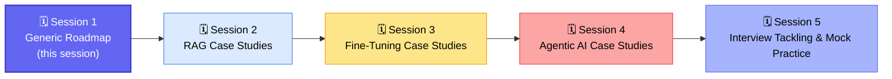

- 🗣️ Language: ~60–70% English, ~20–30% Hindi
- ❓ Doubts: raise hand or use Q&A — answered during breaks, not mid-flow
- 📚 Prerequisite: complete the **Data Science Interview Preparation** course (same platform) if new to the space
- 🖥️ Format: PPT-driven for Session 1; PPT + whiteboard case-study brainstorming from Session 2 onward

---

## ⏳ Why the Nature of GenAI Interviews Has Changed

| | 🕰️ Before 2023 | 🔥 Now (Post-ChatGPT Era) |
|---|---|---|
| Interview style | Typical, syntax-heavy questions | System design & case-study driven |
| Focus | "What is X" definitions | "How would you build X for this scenario" |
| Pace of field | Slow, stable | New models/frameworks daily — extremely rapid |
| Risk | Missing a concept | Getting lost chasing every new tool |

> 💡 **Key mindset:** *"You need to be smart enough to cut the noise and grasp the correct things going on around you — you're not supposed to capture everything."*

---

## 🧩 Why "Pure GenAI Engineer" Roles Barely Exist Yet

The industry is still in an **exploration phase** — companies are testing hardware, tech stacks, and ROI before settling into standardized practices (unlike core ML, e.g. banking credit scorecards, which have been stable for 10–15 years).

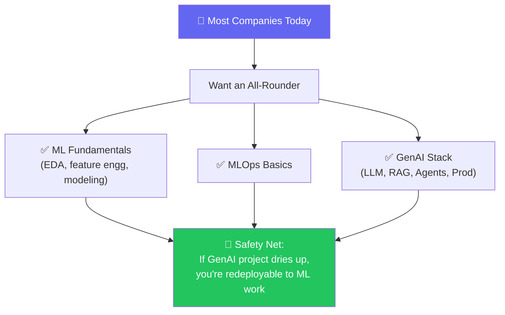

✅ **Takeaway:** Don't skip Python / ML / Statistics fundamentals even if targeting a GenAI-only role — many interviewers still expect this "all-rounder" (Krish's cricket analogy: *"a player who bats, bowls, and fields — not a one-trick specialist"*).

---

## 👥 Roles in the AI Landscape

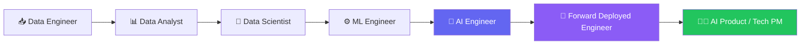

### 🤖 AI Engineer
Builds AI-powered applications using LLMs, RAG, agents & APIs.
- **Must-know:** Prompt engineering, RAG, agents, API design, vector DBs, Python, system design
- **Deliverables:** Chatbots, RAG systems, agentic workflows, APIs
- **Works closely with:** ML engineers, MLOps engineers, product engineers

### 🚀 Forward Deployed Engineer (FDE)
> ⚠️ Commonly misheard as "Foundational Dev Engineer" — actual meaning is **Forward Deployed Engineer**.

Skillset largely overlaps with AI Engineer, but works **inside the client's infrastructure/environment** (on-prem, cloud, hybrid) rather than the home company's stack — so needs stronger software engineering versatility to adapt to varied client setups.

### 🧑‍💼 AI Product Manager / Tech PM
Brings **AI thought leadership**: decides which applications to build, prioritization, ROI expectations, success criteria — and translates business asks (*"reduce fraud by 20–30%"*) into technical targets (*"F1 score above X"*) for the execution team.

---

## 🔄 Traditional Data Science vs. Modern AI Engineer/FDE Interviews

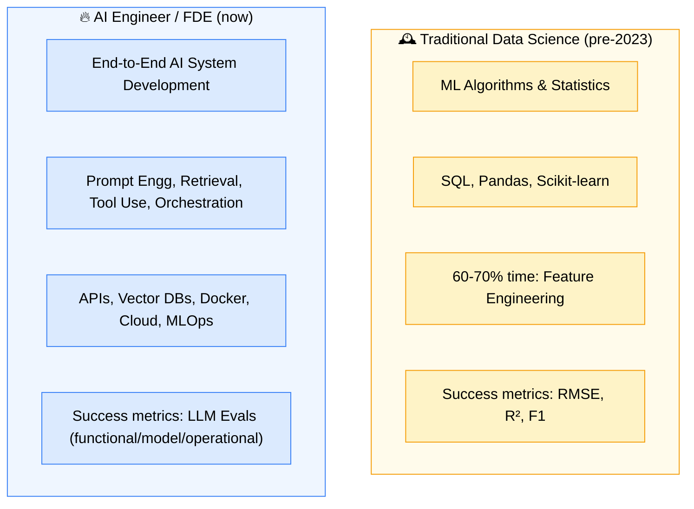

> 🚨 **Red flag habit:** Staying stuck in Jupyter notebooks. Industry expects `.py` project structure (`src/`, `config/`, `.toml`, `.yaml`) — notebooks are for experimentation only, not for interview-ready projects.

---

## 💬 The "Vague Chatbot" Interview Pattern

A classic open-ended prompt: *"Build me a chatbot."* — this is intentionally vague to test structured thinking.

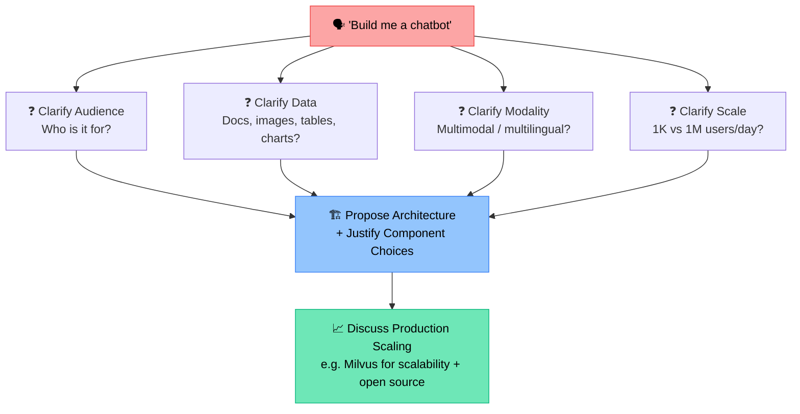

✅ **Golden rule:** Never jump straight to naming tools. Always **ask clarifying questions → discuss scale → then propose architecture with justification.**

---

## 🗣️ Why Communication Skills Are the Real Moat

> *"AI cannot do the translation between technical output and business impact — that is something only a good data scientist/engineer can do."* — Varun

| ❌ Weak Communication | ✅ Strong Communication |
|---|---|
| "F1 score is 0.8" | "This catches 80% of fraud, saving ~$50,000/month" |
| "I used Milvus because I was told to" | "I chose Milvus for its scalability and open-source cost profile for X million users" |
| Random tool-dropping | Structured trade-off explanation with cost/speed/quality reasoning |

🧠 **Why this role is AI-resistant:** Writing `pd.read_csv()` is automatable. Translating "improve fraud detection by 20-30%" into a technical F1-score threshold — and back into business impact — is **not**.

---

## 🤖 How AI Is Reshaping the "Coding Skill" Expectation

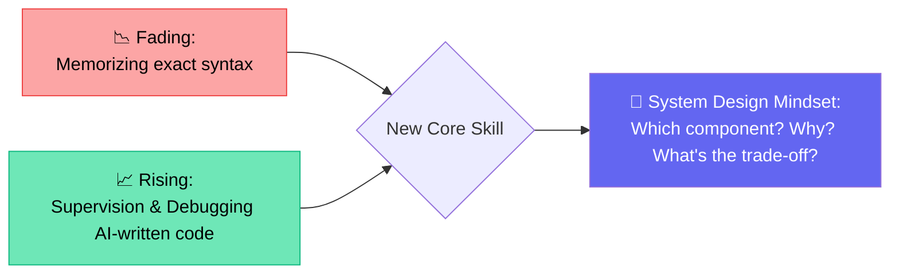

- 🔧 Most orgs now provide Copilot / Cursor / Windsurf / Databricks GME — writing raw syntax from memory is becoming less relevant
- ⚠️ **New challenge:** AI-written code has a different "style" than human code → **debugging AI output is harder**, so always test on edge cases before trusting it
- 🎯 Supervision (testing extreme/edge inputs, validating logic) is the emerging core skill — not syntax recall

---

## 🧱 The Four Pillars of Interview Preparation

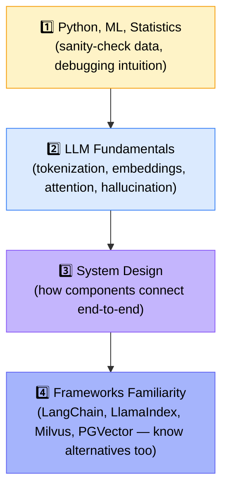

> ⚠️ **Do not master just one tool.** Interviewers won't restrict you to what's on your resume — a candidate who only knows LlamaIndex may still get grilled on LangChain concepts. Learn the *primary* tool deeply, but stay aware of alternatives.

---

## 📚 Main Topics to Prepare (Weighted by Real Interview Focus)

| Topic | Depth Needed | Notes |
|---|---|---|
| 🎛️ **Fine-Tuning** | Conceptual (Lora, QLora, Adapter, Prefix Tuning, LLM Compression/PEFT) | Least emphasized unless targeting an R&D team; do at least 1 hands-on fine-tune (e.g. LLaMA 8B, Granite 8B) |
| 📄 **RAG** | Deep | Architecture, ingestion, chunking, embeddings, retrieval strategies, re-ranking, hallucination mitigation |
| 🤖 **Agentic AI** | Deep, very hot topic | Planner, ReAct, supervisor, reflection patterns; memory, MCP, guardrails, AgentOps monitoring |
| 🏗️ **Engineering & Deployment** | Critical / non-negotiable | System design, APIs, microservices, model serving/inferencing, scalability, rate limiting, observability, security, **cost optimization** |

### 💰 Cost Optimization — The Most Overlooked Skill
> ⚠️ Real anecdote: startups shut down in 2025/early-2026 because expenses (₹80,000) exceeded income (₹50,000) from a chatbot — largely due to unmanaged LLM call costs, memory storage, and conversation history bloat.

- ❌ Don't use "LLM-as-a-judge" everywhere — costs explode at scale
- ✅ Use regex/keyword search/NLP heuristics where an LLM call isn't truly needed
- ✅ Plan for memory & conversation-history storage costs from day one

---

## 🗺️ The End-to-End GenAI Application Stack (Reference Map)

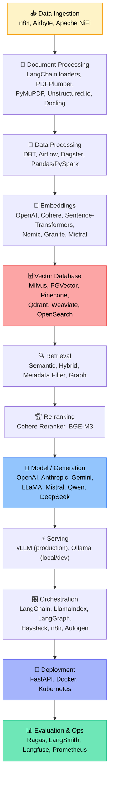

> 💡 **Reality check:** This entire map is just a reference — you're **not** expected to master every tool. Understand the *role each component plays*, not memorize every option.

---

## ⚠️ Real Interview Horror Story: The Vector DB Trap

> 🗣️ A candidate said he used **Milvus** as his vector database. The Google interviewer asked: *"Why Milvus? Why not PGVector, Pinecone, or a graph database?"*
> He had no answer — he was just told to use it. **20 minutes of grilling later → rejected.**

✅ **Lesson:** For every component you name in your project, be ready to justify it on: **cost, latency, scalability, and feature fit** (e.g., inline metadata filtering support or not).

---

## 🎓 Developing a System Design Mindset (Step-by-Step)

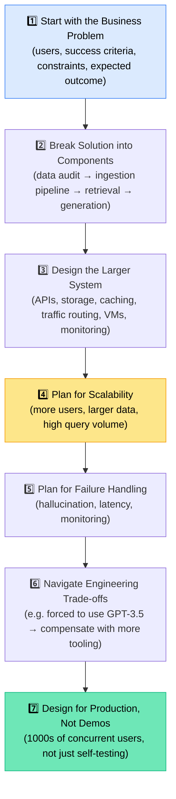

**🌾 Worked Example — "Build a chatbot for farmers at a bank":**
- Clarify: language support, text-vs-voice interface, volume of farmers
- Success criteria ≠ "it gives answers" → success = *"complaint tickets dropped from 100/day to 30-40/day because the chatbot resolves queries instantly"*
- Constraints: e.g., client restricted to GPT-3.5 only (2 years ago) → had to compensate with more tool-calling/MCP rather than relying on the LLM alone

---

## 🎯 The "Secret Sauce": Production Experience

> *"Streamlit chatbots tested by one user won't help you in production."*

| 🧪 POC / Demo Mindset | 🏭 Production Mindset |
|---|---|
| Single user, self-tested | 1,000+ concurrent users, varied queries |
| "It answers, I'm happy" | Data drift, quality monitoring, real impact tracking |
| No load consideration | Scaling, load balancing, traffic routing |

✅ **Build fewer projects — but make each one production-grade.** One deeply engineered, well-documented project beats ten shallow ones.

---

## 🤝 Leveraging AI for Smarter Prep (Speaker's Personal Workflow)

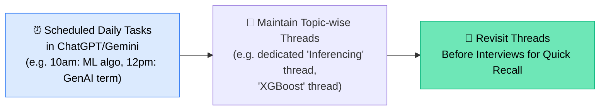

⚠️ **Golden rule:** Use AI as a **personal tutor**, never as a **guru** — it can hallucinate confidently, so always validate. Use AI *"to learn faster, not to think less."*

---

## 🗓️ Building a Realistic Personal Roadmap

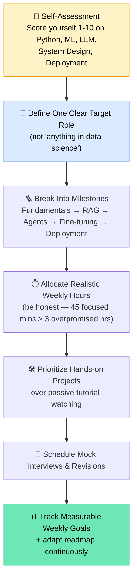

---

## 💼 LinkedIn & Job Portal Optimization

### ✅ Do's
- Clear professional photo + banner
- **Precise headline**: e.g. *"Data Scientist / MLOps Engineer / GenAI / RAG / Python"* — searchable and clickable in recruiter search bars
- Fill the **Experience** section with real bullet points (recruiters often read LinkedIn before the resume)
- Add relevant, specific **skills** (recruiters search by skill tags, e.g. "Data Scientist + Databricks")
- Get endorsements from **credible seniors/managers**, not friend-for-friend swaps
- Post original content — even on common topics (e.g. linear regression assumptions) explained in your own unique way
- Keep Naukri/job portal profiles "recently updated" daily (~9–10 AM) for better visibility

### ❌ Don'ts
- Vague, "mystery" headlines like *"Building Zomato 🚀"* — recruiters skip unclear profiles
- Copy-pasting ChatGPT-written posts directly — reach gets suppressed
- Leaving the Experience section blank

> 💡 **Productivity hack:** Keep Naukri, Indeed, Monster, HireRight, and LinkedIn open simultaneously — copy-paste the same experience text across all portals at once instead of repeating the process per platform.

---

## ❓ Live Q&A Highlights

| Question | Answer |
|---|---|
| Will design-decision reasoning (e.g. why choose a specific vector DB) be covered? | Yes — covered across upcoming case-study sessions |
| PGVector vs Azure AI Search vs Vector DB for a simple Q&A app? | Azure AI Search is fine if you already have an Azure AI ecosystem; PGVector is a solid choice for an isolated/standalone app |
| How to gain production-scale intuition without real production access? | Two paths: learn from a mentor's real production experience, or study scalability/system-design books and parallelism concepts |
| Non-tech analyst (Excel-based) getting GenAI questions in interviews — how deep to go? | Depth depends on target role — for Data Analyst/MIS roles, basic RAG/vector DB understanding is enough; for AI Engineer/Data Scientist roles, go deep |
| How to answer "why this model over that model"? | Frame around 3 factors: **(1)** task fit per model card capabilities, **(2)** infra/resource constraints (can you host it?), **(3)** underlying architecture (Transformer, MoE, Mamba) |
| Expectations from a **Fresher** on system design? | Interviewers are lenient on production-failure specifics (e.g. "why did EC2 fail") but still expect you to explain basic architecture: routing, traffic handling, load balancing |
| How is the Data Scientist role evolving vs AI Engineer? | Heavy overlap in skills; Data Scientist roles still expect strong ML/DL/MLOps as non-negotiable, with GenAI as a valuable add-on |
| Product Manager transitioning to AI PM — expected to code too? | Usually you're given a small execution team; your core job is thought leadership (why build, ROI, stack fit, client communication) — not hands-on coding, though tools like Cursor help if you want to build |
| 16-year Java developer transitioning into AI — what to learn? | Python, Cloud Infra, Networking, LLM fundamentals, RAG, Agentic AI, Fine-tuning — covered across the CampusX cohort |

---

## 🌟 Closing Encouragement

> *"Everyone here is learning to swim in the same water — unlike core Machine Learning, where people have 10-15 years of head start, GenAI is new for everyone. You've made the right decision to enter this field at the right time. In 5 years, the industry will mature and interviews will get much stricter — right now, interviewers are still relatively lenient if you show curiosity, foundational understanding, and the ability to build."*

---

## ✅ Action Items for Learners

- [ ] 📚 Revise RAG, retrieval, and generation concepts **before Session 2** — no theory will be re-taught
- [ ] 🧠 Self-assess your Python / ML / LLM / System Design / Deployment skills on a 1–10 scale
- [ ] 🎯 Pick **one specific target role** (AI Engineer / Data Analyst / FDE, etc.) to streamline prep
- [ ] 🏗️ Stop relying on Jupyter notebooks — practice `.py` project structures (`src/`, `config/`, `.yaml`)
- [ ] ☁️ Set up a free-tier AWS/GCP/Azure account and build at least one **production-flavored** end-to-end project (with observability, deployment, inferencing)
- [ ] 💰 Study cost-optimization strategies for LLM calls, memory, and vector storage
- [ ] 💼 Rewrite your LinkedIn headline and Experience section with clear, searchable, jargon-free language
- [ ] 🤖 Set up scheduled AI "tutor" tasks + maintain topic-wise chat threads for revision
- [ ] 🗣️ Practice explaining trade-offs for every tool/component in your existing projects (cost, latency, scalability, why-not-alternatives)

---

*📝 Notes compiled from the full Session 1 transcript — Cracking the GenAI Interview Series, CampusX (Speaker: Varun).*
