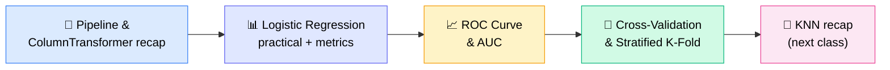
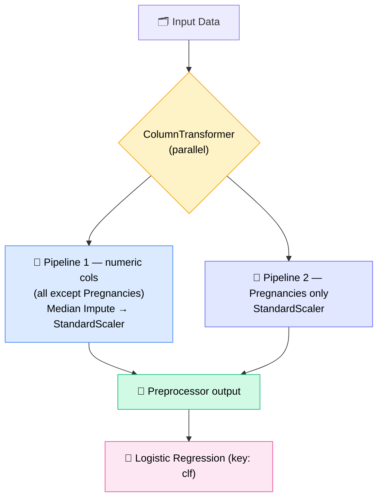
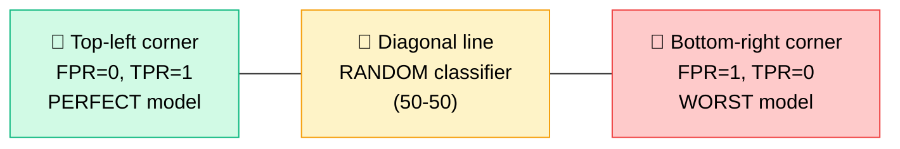
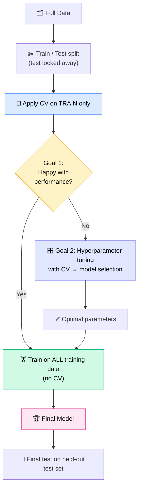

# 🤖 Machine Learning — Session ML10

### 📋 Logistic Regression Wrap-Up • ROC & AUC • Cross-Validation — Lecture Notes

---

## 🧭 Today's Agenda

> 💡 **Big picture:** Logistic regression is now _completely_ done — from feature engineering to saved model to evaluation.

---

## 📢 Schedule & Pace Announcement

- 🚫 **Next week only:** no Wednesday class
- ✅ **After that:** Wednesday classes run **every week** (no more alternate Wednesdays)
- ⚡ **Why:** the pace has been slow — ~1.5 classes each for linear and logistic regression. Need to speed up.
- 🎯 **Target:** finish the course around **October**
- 📚 **Promised extras:** FastAPI (as needed for projects), a little Docker (~½ hr, flow only), Git/GitHub already covered

---

## 🔗 Pipeline vs ColumnTransformer (Recap)

The mentor re-explained this with a dry-run: **the key question is always "are these tasks dependent (sequence) or independent (parallel)?"**

|              | 🔗 `Pipeline`                                        | 🧩 `ColumnTransformer`                                   |
| ------------ | ---------------------------------------------------- | -------------------------------------------------------- |
| Runs tasks   | **Sequentially** — output of step 1 feeds step 2     | **In parallel** — independent tasks on different columns |
| Use when     | Task B's output is input to Task C                   | Task A and Task D are unrelated                          |
| Example here | Impute (median) → Scale                              | Numeric columns branch ‖ Pregnancies branch              |
| Internally   | Stores `(key, transformer)` tuples like a dictionary | Same idea — key + transformer + columns                  |

### 🩺 Our Diabetes Dataset Design

> ❓ **Why no imputation on Pregnancies?** Zero is a **valid value** (a person need not be pregnant). Imputing would wrongly force everyone toward being pregnant. The dataset has both diabetic and non-diabetic classes.

- Feature engineering → model training are **linked (sequential)**, so they are wrapped in one outer `Pipeline`
- `pipeline.fit()` → preprocessor does fit+transform, classifier does fit
- `pipeline.predict()` → preprocessor has no predict, so `clf.predict` is called at the end
- Split used: **stratified train-test split**

---

## 📊 Logistic Regression — Prediction & Evaluation

### 🎚️ Controlling the Output Yourself

- `predict()` → gives hard 0/1 labels
- `predict_proba()` → gives probabilities (column 0 = no diabetes, **column 1 = diabetes**)
- Build your own 0/1 using a **custom threshold**

### 🧪 Result Tables

Copies of train and test were created with 3 new columns each: **actual**, **predicted**, **predicted probability**. Mismatches can be filtered with a simple pandas condition (`actual != predicted`), and a custom confusion matrix can even be built via `groupby`.

### 📏 Metrics (from `sklearn.metrics`)

| Metric                | Notes                                                                        |
| --------------------- | ---------------------------------------------------------------------------- |
| Accuracy              | Train ≈ **77%**, Test ≈ **81%**                                              |
| Precision, Recall, F1 | Single-value metrics                                                         |
| Confusion Matrix      | Multi-value — computed separately for train/test                             |
| Classification Report | A "fancy function" — precision/recall/F1 per class + overall accuracy (~81%) |
| ROC curve, ROC-AUC    | Covered in detail below                                                      |

> 🔎 In the confusion matrix, the **diagonal = correct predictions**; off-diagonal = errors.

---

## 💾 Saving the Model

- ✅ **Save the entire pipeline** — feature engineering + model in _one_ artifact
- ❌ Without Pipeline/ColumnTransformer you'd need to save **4 artifacts** (pregnancy scaler, median imputer, numeric scaler, model) and load/apply them in the right order
- 🛠️ Saved with **`joblib`** using a `.pickle` extension (e.g., `logisticpipeline.pickle`)
- 🔑 Column names must match for the preprocessor to route data correctly

### 🔍 Extracting Coefficients from a Pipeline

- Access the model via its **key** (`clf`), then read `coef_` and `intercept_`
- `coef_` comes out **2-D** → use **`.flatten()`** (or `reshape(-1)`) to make it 1-D
- Logistic regression learns the same kind of parameters as linear regression (M0, M1, M2…)

---

## 🆚 Q&A: "Why Machine Learning When We Have LLMs?"

| Reason                     | Explanation                                                                                    |
| -------------------------- | ---------------------------------------------------------------------------------------------- |
| 🔍 **Explainability**      | ML models can be explained; LLMs with billions of parameters cannot                            |
| 💸 **Right-sized tool**    | A 400-feature tabular problem doesn't need a 20 GB LLM — _"like cutting an apple with a tank"_ |
| 🧠 **Different mechanism** | LLMs predict the next token from context; they don't suit classic tabular ML                   |
| 🛠️ **Foundations**         | Building custom knowledge systems benefits from ML understanding                               |

---

## 🎯 The Threshold Problem

- Default threshold is **0.5**, but it is **not always optimal**
- Data showed correct predictions at probabilities like 0.11 (class 0) and 0.78+ (class 1) — no guarantee 0.5 is best
- 👉 **Solution:** use the **ROC curve** to pick a threshold

---

## 📈 ROC Curve & AUC

### 🧮 Confusion Matrix Refresher

| Term   | Meaning                                   |
| ------ | ----------------------------------------- |
| **TP** | Model: positive ✅ — Actual: positive     |
| **TN** | Model: negative ✅ — Actual: negative     |
| **FP** | Model: positive — Actual: **negative** ❌ |
| **FN** | Model: negative — Actual: **positive** ❌ |

### 📐 Formulas

| Rate                          | Formula          | Meaning                                                |
| ----------------------------- | ---------------- | ------------------------------------------------------ |
| **TPR** (True Positive Rate)  | `TP / (TP + FN)` | Of all actual positives, how many did we catch?        |
| **FPR** (False Positive Rate) | `FP / (FP + TN)` | Of all actual negatives, how many did we wrongly flag? |

> ⚠️ **Interview trap:** **TPR = Recall** (same thing). But **FPR ≠ Precision**. Precision = `TP / (TP + FP)`.

### 🧪 Worked Example — 5 Emails

| Email       | A    | B        | C    | D        | E    |
| ----------- | ---- | -------- | ---- | -------- | ---- |
| Actual      | Spam | Not spam | Spam | Not spam | Spam |
| Model score | 0.95 | 0.7      | 0.6  | 0.4      | 0.2  |

**At threshold 0.8:** TP = 1, FP = 0, TN = 2, FN = 2 → **TPR = 1/3 ≈ 0.33, FPR = 0**

Repeating for multiple thresholds builds the table:

| Threshold | TPR  | FPR |
| --------- | ---- | --- |
| 0         | 1.0  | 1.0 |
| 0.4       | 0.67 | 1.0 |
| 0.6       | 0.67 | 0.5 |
| 0.8       | 0.33 | 0   |
| 1.0       | 0    | 0   |

Plot **FPR (x-axis) vs TPR (y-axis)** and connect the points → that is the **ROC curve**.

> 📝 **ROC = TPR vs FPR across all thresholds**

### 🗺️ Reading the ROC Plot

- 📈 The more the curve bulges toward **top-left**, the better the model
- 🟢 A **diagonal** line = random classifier
- 🎚️ Goal: choose the threshold with **high TPR and low FPR**

### 📏 AUC — Area Under the Curve

- Single number = area under the ROC curve
- **AUC = 1** → perfect separation; **0.5** → random; lower → poorer
- ✅ Used to **compare different models** (higher AUC = better)
- In our run, the **test** curve covered more area than train (can happen due to randomness in the split)

### 💻 In Code (`sklearn.metrics`)

- `roc_curve(y_true, y_scores)` returns **FPR, TPR, thresholds**
- ⚠️ Pass **predicted probabilities**, not hard 0/1 labels — hard labels give only ~3 points; probabilities give a smooth curve (first threshold shows as infinity)
- `roc_auc_score` gives the AUC value
- Plot FPR vs TPR for train and test to see curves

### 🏁 Finding the Optimal Threshold Programmatically

| Method                   | Formula                | Goal                                             |
| ------------------------ | ---------------------- | ------------------------------------------------ |
| **Youden's J statistic** | `TPR − FPR`            | **Maximize**                                     |
| **Distance to corner**   | `√((1 − TPR)² + FPR²)` | **Minimize** _(more balanced, more recommended)_ |

> 📝 **Assignment:** Write a function that computes these over all thresholds (keep a dictionary/list of FPR, TPR, threshold), then returns the threshold giving the best value.

---

## 🔀 Cross-Validation (CV)

> 🎯 **CV is for EVALUATION (and model selection) — NOT for model training.** Apply it **only on the training data**, never on the test set.

### ❓ Why We Need It

- A single train/test split can't guarantee the test set is a fair mix of easy and hard cases
- Different random seeds can give very different scores (e.g., train 80 / test 90 vs train 76 / test 80)
- Tuning hyperparameters on one fixed split may just overfit to _that_ split
- We'd never discover the "hard cases" where the model fails

### ⚙️ How K-Fold Works

`K = 5` → data is split into 5 parts; each part serves as the validation set **once**.

- Validation ratio per fold = **1/K** (K=5 → 20%)
- 📦 **Example:** 1000 rows → 800 train / 200 test (original split)
  - 20% of 800 = **160** validation rows per fold
  - Training rows per fold = **640**
- **Mini example (10 items, K=5):**

| Fold | Validation | Training |
| ---- | ---------- | -------- |
| 1    | 9, 10      | 1–8      |
| 2    | 7, 8       | rest     |
| 3    | 5, 6       | rest     |
| 4    | 3, 4       | rest     |
| 5    | 1, 2       | rest     |

✅ **Guarantee:** every row becomes validation data exactly once.
📌 No `random_state` needed — the folds already cover all data.

### 🔄 The Averaging Idea

Train the same model config on each fold → 5 scores (e.g., 96, 84, 90, 60, 80) → **average** = realistic performance. Compare averages across different parameter settings (X1 vs X2) to pick the better one.

### 🎯 Two Goals of Cross-Validation

| Goal                   | Purpose                                                           |
| ---------------------- | ----------------------------------------------------------------- |
| **1️⃣ Evaluate**        | Get the **actual** model performance (not a lucky-split number)   |
| **2️⃣ Model selection** | Compare models with different hyperparameters and choose the best |

### 🗺️ Where CV Fits in the Flow

### 🎛️ What Are "Parameters" Here?

- **Hyperparameters** = things humans set to control training: learning rate, probability threshold, SGD settings, etc.
- ❌ `random_state` is **not** a hyperparameter (no seed is "better" than another)
- ⚠️ More folds → more datasets → **more computation**
- ✅ CV is used on all data sizes — it's computationally expensive, but correctness matters

### ⭐ Stratified vs Cross-Validation vs Stratified K-Fold

| Concept                    | Purpose                                                                                        |
| -------------------------- | ---------------------------------------------------------------------------------------------- |
| **Stratified split**       | **Balance** — keeps class ratios equal (e.g., 80% of blue _and_ 80% of green marbles in train) |
| **Cross-validation split** | **Evaluation** — two goals above                                                               |
| **Stratified K-Fold** 🏆   | Combines both — the **gold standard for classification**                                       |
| **Plain K-Fold**           | Use for **regression** (continuous target has no classes to stratify)                          |

> 🎤 **Interview line:** _"Cross-validation is for evaluation first; when used in hyperparameter tuning, it helps with model selection."_

---

## 🧠 Learning & Career Advice (End of Class)

- 🧑‍💻 **Read and trace real code.** Demo: a large computer-vision framework's training script — click into every function, print values, follow the flow, keep notes
- 🚫 Don't let AI answers replace your own struggle — _"like giving a smartphone to a kid"_. Do manual work while learning; use AI freely **after** the course
- 🏗️ **Build projects** (Claude/Gemini can help) and put those on your resume
- ⛔ **Never list skills** like "I know cross-validation / logistic regression" on a resume — show projects instead (resume guidance coming before batch ends)
- 😌 **Don't be scared:** computer-vision frameworks are the complex ones; GenAI/RAG code is much simpler (e.g., an MCP server in ~50 lines)
- 🔭 Upcoming: deep learning from **Paul Sir**; CV & NLP taught "to an extent" (specialize later if interested)

---

## ❓ Quick Q&A Highlights

| Question                                          | Answer                                                                                                             |
| ------------------------------------------------- | ------------------------------------------------------------------------------------------------------------------ |
| Why not impute Pregnancies?                       | Zero is a valid value; imputing would be wrong                                                                     |
| Can sigmoid and threshold be visualized together? | They're separate: sigmoid is part of **training** (outputs probabilities); threshold is applied **after** training |
| Is cross-validation only for small data?          | No — used on all data; just expensive                                                                              |
| Is CV only for finding best hyperparameters?      | No — Goal 1 is evaluation; tuning is Goal 2                                                                        |
| Do we need random state in CV?                    | No — folds already cover all data                                                                                  |
| Why videos "corrupted" on the platform?           | Often a browser issue — try multiple browsers                                                                      |

---

## ✅ Action Items for Learners

- [ ] 🔁 Re-watch last class's pipeline/transformer code and do a **dry run**
- [ ] 🧮 Assignment: write a function to find the optimal threshold (**Youden's J** + **distance to corner**) using a dict/list of FPR, TPR, threshold
- [ ] 📓 Re-run the ROC/AUC notebook and plot train vs test curves
- [ ] 📝 Write the TP/TN/FP/FN, TPR, FPR formulas somewhere handy (interview favorite)
- [ ] 🔀 Revise cross-validation flow diagram + stratified K-Fold vs K-Fold
- [ ] 🐍 (Optional) Finish advanced Python videos — multithreading/multiprocessing from Batch 1
- [ ] 🧠 Skim the earlier KNN/imputation class — KNN recap is next
- [ ] 🏗️ Start planning a personal ML project and tag the mentor on LinkedIn

---

_📝 Notes compiled from the ML10 live-class transcript — Logistic Regression, ROC/AUC & Cross-Validation._
