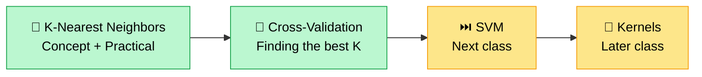
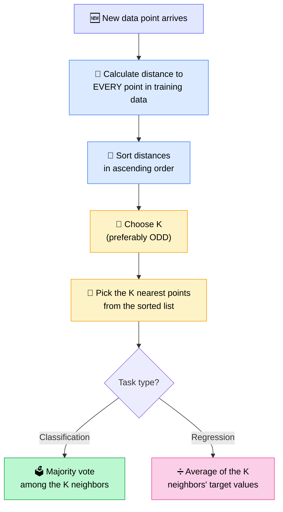
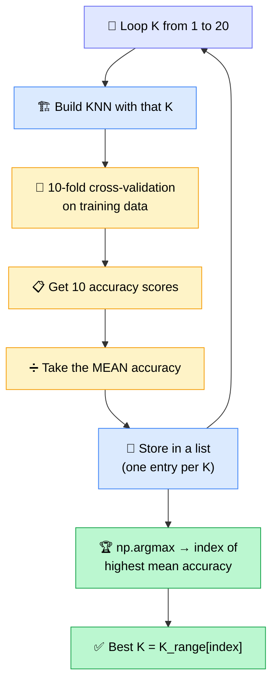
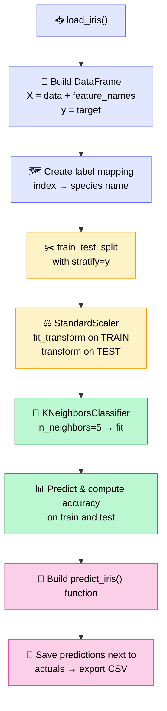
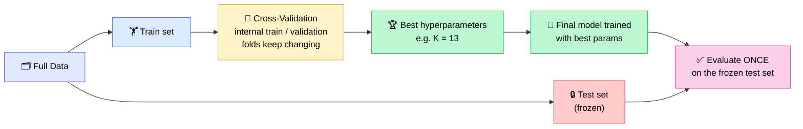

# 🚀 K-Nearest Neighbors & Cross-Validation for Optimal K

## 🧭 Today's Agenda

The plan was **KNN → Cross-Validation → SVM**. KNN and cross-validation (shown inside the KNN practical) were completed; **SVM was pushed to the next class**.

> 💡 **Teaser for SVM:** it uses "kernels" to change the data's dimension so it can be separated better — a favorite interview question, and hard to grasp, so it gets its own class. Intuition first, then practicals.

---

## 💬 Session Opener — Batch Feedback & Logistics

The instructor opened by asking for informal feedback on the whole ML journey.

| Topic              | Takeaway                                                                                                   |
| ------------------ | ---------------------------------------------------------------------------------------------------------- |
| ⏳ Class length    | Can't shorten much — drawing live keeps it interactive; can't extend either (a 2-year course helps nobody) |
| 🧪 More practicals | Not possible within the time limit → students must do practice/assignments/side-quests on their own        |
| 🔁 Revision        | Next batch will have a revision session **every Wednesday** (not alternate Wednesdays)                     |
| 📼 Catch-up        | Missed classes can be watched from recordings                                                              |
| 🌐 Big picture     | Don't restrict yourself to "AI engineer" — development is one big circle (AI, software, etc.)              |

---

## 🧠 Part 1 — What is K-Nearest Neighbors (KNN)?

**K = number of neighbors** (not "classes" or "groups").

### 🔑 Core Properties

- Works for **both classification and regression**
- Uses **no equation of a line or curve** — no parameters (α, β, weights, learning rate) are learned
- Best when data is **spread out / non-linear** and no clean line can be fitted
- Called a **lazy learner** — it learns nothing, it just stores the data
- Still a **supervised** algorithm, because the data has labels

> 🧩 **Human intuition:** Given 3 apples, 3 oranges and a new fruit, you'd say "it looks closer to orange" — you use the data in your head, not a formula. KNN does the same, mathematically.

### 🔄 The KNN Algorithm (Step by Step)

### 📏 Distance Formulas

| Distance      | Formula           | Notes                       |
| ------------- | ----------------- | --------------------------- |
| **Euclidean** | √( Σ (xᵢ − xⱼ)² ) | Most common                 |
| **Manhattan** | Σ \|xᵢ − xⱼ\|     | Sum of absolute differences |

- Neither is "better" — **try multiple and pick what performs best** on your dataset
- Works in **any number of dimensions** (X1 … X40); the formula just sums over more terms
- Example from class: point N = (2, 1), point A = (1, 2) → distance = √(1² + 1²) = **1.414**

### 🎨 Worked Example — Classification

With **K = 3**, the 3 closest points to the new point were **F (green), E (green), J (orange)** → majority is **green** → new point is classified **green**.

### 💰 Worked Example — Regression (Salary)

| K   | Nearest neighbors           | Prediction              |
| --- | --------------------------- | ----------------------- |
| 1   | Single closest person       | That person's salary    |
| 2   | Two closest (₹40K and ₹30K) | (40 + 30) / 2 = **35K** |

> Only the **last step changes** for regression: instead of a majority vote, take the **average**.

---

## ⚖️ Choosing K & Handling Ties

### Why Odd K?

An odd K avoids ties in binary-style votes. With K = 2 you might get 1 green + 1 orange → tie.

> ⚠️ Odd K does **not** fully prevent ties with 3+ classes (e.g., K = 5 → 2 green, 2 orange, 1 yellow).

### 🪢 Tie-Breaking Strategies

1. **Reduce K** to a smaller odd number (e.g., 5 → 3) and re-vote
2. **Compare average distances** of the tied groups and pick the closer one
3. In scikit-learn, set **`weights='distance'`** so closer neighbors count more (`'uniform'` treats all equally and falls back to alphabetical/random on ties)

### 📊 Bias–Variance View of K

| K value                 | Behavior                               |
| ----------------------- | -------------------------------------- |
| Very **small**          | High **variance** (sensitive to noise) |
| Very **large**          | High **bias** (over-smoothed)          |
| **Balanced (5, 7, 9…)** | A sensible default starting range      |

> There is **no universal best K** — it depends on the dataset. Other methods (like the _elbow method_) come later with K-Means clustering.

---

## ✅ Advantages vs ❌ Disadvantages

| ✅ Advantages                                   | ❌ Disadvantages                                                       |
| ----------------------------------------------- | ---------------------------------------------------------------------- |
| Very simple to understand                       | Must store **all** training data in the saved model                    |
| Easy to **interpret & explain** to stakeholders | **N distance calculations per prediction** (1M rows → 1M calculations) |
| No training/learning phase                      | Memory-heavy & computationally expensive on large data                 |
| Works when data isn't linear                    | Scaling matters when features have very different ranges               |

### 💡 Insight: "Equations are compressed data"

- A trained regression model **compresses** the dataset into a small equation (parameters)
- Deep learning does the same at massive scale — e.g., LLMs compress huge text corpora into one giant equation
- KNN has **no compression**, so nothing is simplified → heavy at inference time
- 🧠 Analogy: your brain remembers _concepts_ from a live class, not every pixel — that's compression

### 🔬 Scaling Note

Because KNN is distance-based, features with much larger ranges can dominate. **Try with and without scaling**, but scaling is generally advisable.

---

## 🔁 Part 2 — Cross-Validation to Find the Optimal K

### The Idea

### ⚠️ Don't Confuse These Two "K"s

| K in KNN                    | K in K-Fold               |
| --------------------------- | ------------------------- |
| Number of **neighbors**     | Number of **data splits** |
| Hyperparameter we're tuning | Fixed (e.g., `cv=10`)     |

> 🚫 K-Fold is **not** an epoch — revisit the cross-validation class if this is fuzzy.

### 🧪 Result on the Iris Dataset

- **Best K = 13** with mean CV accuracy ≈ **98%**
- K = 3 to 8 all hovered around 96%; K = 9 also scored high (~97%)
- Conclusion: 3, 5, 7 are still **very good** choices — small differences can be down to chance
- Runtime was tiny (~0.5 seconds without the artificial `time.sleep`)

### 📈 Plot Insight

Plotting **K vs mean CV score** shows the peak near 13, a plateau across roughly K = 3–8, and a couple of other high points. Increasing the K range (e.g., to 100) could shift the result.

---

## 💻 Part 3 — Practical: KNN Classification on Iris

### 📦 Dataset

- **Iris** from `sklearn.datasets` — **150 rows × 4 features**, **3 classes**
- Features: sepal length, sepal width, petal length, petal width (cm)
- Classes: `0 = setosa`, `1 = versicolor`, `2 = virginica`
- Versicolor and virginica overlap → a straight line can't separate them well (good KNN use case)

### 🛠️ Workflow Followed

### 🔑 Key Practical Points

| Question                            | Answer                                                                                                          |
| ----------------------------------- | --------------------------------------------------------------------------------------------------------------- |
| `fit_transform` on test data?       | ❌ **No** — `fit_transform` on train only, just `transform` on test (avoids leakage)                            |
| Why not scale `y`?                  | The model learns parameters from X, not y; scaling y would need inverse-transforming outputs — unnecessary work |
| Need pipeline/ColumnTransformer?    | Not here (one scaler, all numeric) — but a pipeline bundles scaler + model into one object                      |
| Why `stratify`?                     | Keeps class proportions equal in train and test                                                                 |
| `weights='uniform'` vs `'distance'` | Distance-weighted is generally the better metric                                                                |
| What does the fitted model store?   | Classes, sample count, feature count — internally the training data itself                                      |
| Accuracy formula                    | **(TP + TN) / all cases**                                                                                       |
| Train vs test fit?                  | Judged as an **ideal fit** (learning behaves similarly on both)                                                 |

### 🧩 The Prediction Function

- Takes `sepal_length, sepal_width, petal_length, petal_width`
- Builds a DataFrame with the **same column names and order** as the training data
- Scales it with the fitted scaler → `knn.predict` → takes the `[0]` element
- Returns predicted **species name** and **class index**

> 📝 Then it was looped over the whole `X` to store `predicted` and `predicted_index` columns beside `actual`, and exported to CSV for review/sharing.

---

## 🏗️ Part 4 — Real-World Best Practices (from Q&A)

### 🧊 The "Frozen Test Set" Principle

- **Test = one final exam.** It should **not change** when you change algorithms or parameters
- Train/validation splits can be shuffled freely (that's what CV does internally); the **test split stays fixed**
- When new data arrives: keep the old test set, and add a **new test slice from the new data only** → compare against previous scores to make sure the new model didn't get worse
- Check that train and test **distributions match** (e.g., same value ranges) — a bad split makes the test meaningless
- Very few teams do this, but it's the right practice for teams that care about model quality

### 🧱 Where Each Split Is Used

> 📌 In the demo the whole Iris data was used for CV because it's tiny. In real projects: **split first, run CV only on the train portion.**

### 🗂️ Notebook & Project Workflow

| Stage                        | Notebook / Artifact  | Output                                              |
| ---------------------------- | -------------------- | --------------------------------------------------- |
| 1️⃣ EDA + Feature Engineering | Notebook 1           | Cleaned, encoded, scaled data → saved as **CSV**    |
| 2️⃣ Model experimentation     | Notebook 2           | Loads the CSV; runs CV / training; best model saved |
| 3️⃣ Production                | Notebook 3 / scripts | Loads saved model, exposes a prediction function    |

- Re-running Notebook 1 the next day is normal — "Run All" / Shift+Enter, usually < 1–2 minutes
- Record EDA findings and feature-engineering decisions in **notes**
- Optional advanced setup: convert repeated steps into modular `.py` files (OOP) controlled by a **JSON config** — but only worth it if the same pipeline is reused; not for constantly changing projects

---

## ❓ Live Q&A Highlights

| Question                                        | Answer                                                                                                                                                             |
| ----------------------------------------------- | ------------------------------------------------------------------------------------------------------------------------------------------------------------------ |
| Is CV part of model _training_ or _evaluation_? | It's **model selection**: you train multiple models (one per hyperparameter value), evaluate each with CV, then train one **final model** with the best parameters |
| Why isn't the K=13 model much better on test?   | The goal wasn't to boost accuracy — it was to verify we chose the right parameter; test accuracy stays the same since the test set is unseen                       |
| Can CV cause data leakage?                      | No, the internal train/validation split prevents it                                                                                                                |
| How to track the second-best K?                 | Store a dictionary `{K: score}` and sort it, so you keep the K ↔ score mapping                                                                                     |
| Should the K range depend on data size?         | Not directly for KNN; just avoid very large K. Range is your choice (20 was arbitrary)                                                                             |
| Spam model stuck at 80% accuracy — what now?    | Investigate why (encoding, features), then try **simple → medium → complex models**; vary model _type_, not just parameters                                        |
| Is 100% accuracy possible?                      | Yes, but check for overfit/underfit; 60% can also be acceptable depending on the problem                                                                           |
| Where's the biggest KNN computation?            | Distance to **all** data points for **every** prediction — not the top-K selection                                                                                 |

---

## 📝 Assignment — Learn to Read Code Fast

> 🎯 **Why:** AI can write 1,000 lines in 5 minutes, but you must be able to **read and follow code flow** quickly. Students are good at ML concepts but struggle with reading code.

**Task (no solution provided):**

1. Open the shared project's `main.py` (from Batch 1's project, e.g. database manager, repo insertion)
2. **Without watching the recording**, trace what each import, method and file does
3. Write a **flow map** in notes/comments: "line X reads a file → handled in `file.py` → calls …"
4. Go deeper into `src/database/` etc. to understand what each function does at a high level
5. Skip parts you don't understand, but capture the overall flow (you may use Claude to generate a diagram, then verify it makes sense)
6. **After** finishing, watch the Batch 1 recording and try rebuilding the project

⏳ Estimated time: 1–2 weeks. No deadline — but the faster you practice, the better your code-reading gets. Assignment URL will be shared as a `.txt` in the Resources section.

---

## ✅ Action Items for Learners

- [ ] 🔁 Revise **cross-validation** (K-Fold) — it's used in all upcoming tree-based models
- [ ] 📓 Re-run the KNN notebook; try `weights='distance'`, Manhattan distance, and a wider K range
- [ ] 📈 Plot K vs CV accuracy yourself and pick a K
- [ ] 🧊 Practice making a proper train/test split and keep the test set frozen
- [ ] 🐍 Revise NumPy (`argmax`), pandas and train-test-split basics
- [ ] 🗺️ Complete the `main.py` flow-mapping assignment
- [ ] 📓 Keep running notes of every concept covered so far
- [ ] 🎥 Catch up on any missed recordings before the next class

---

_📝 Notes compiled from the full session transcript — Ultimate Data Science, Krish Naik Academy (Class of 27 June 2026)._
