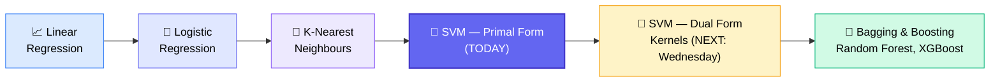
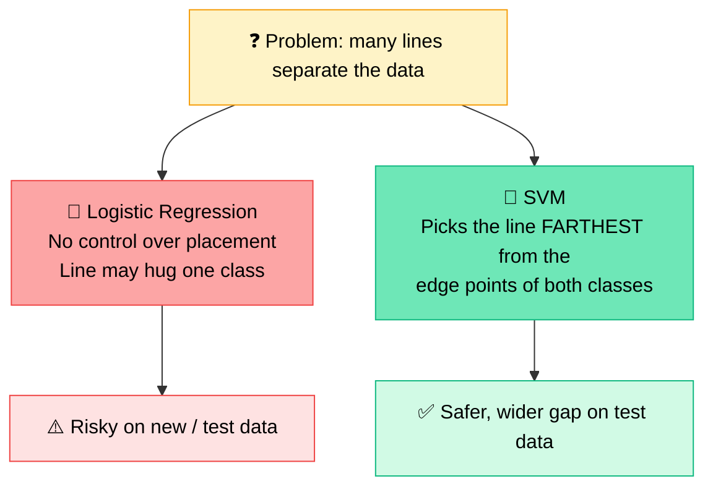
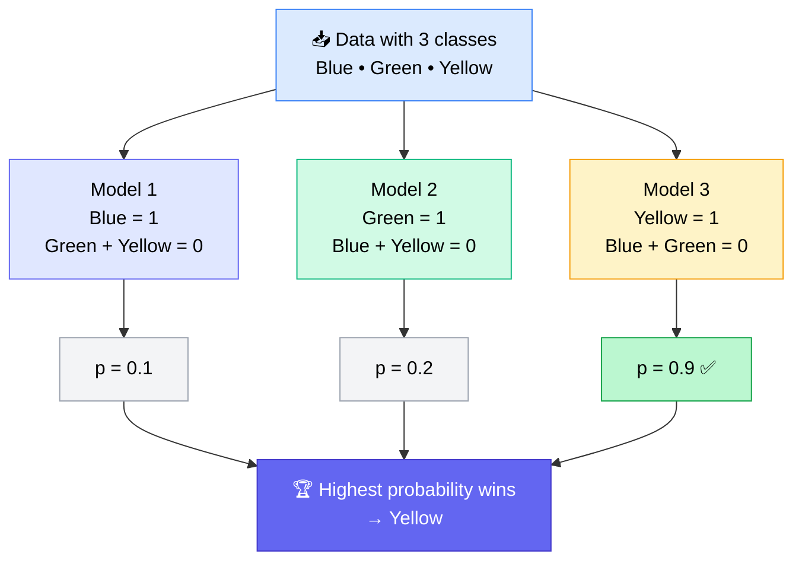
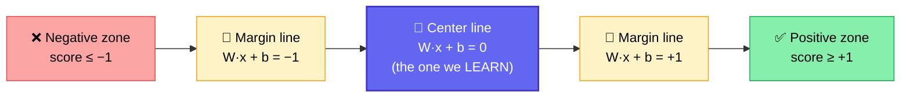
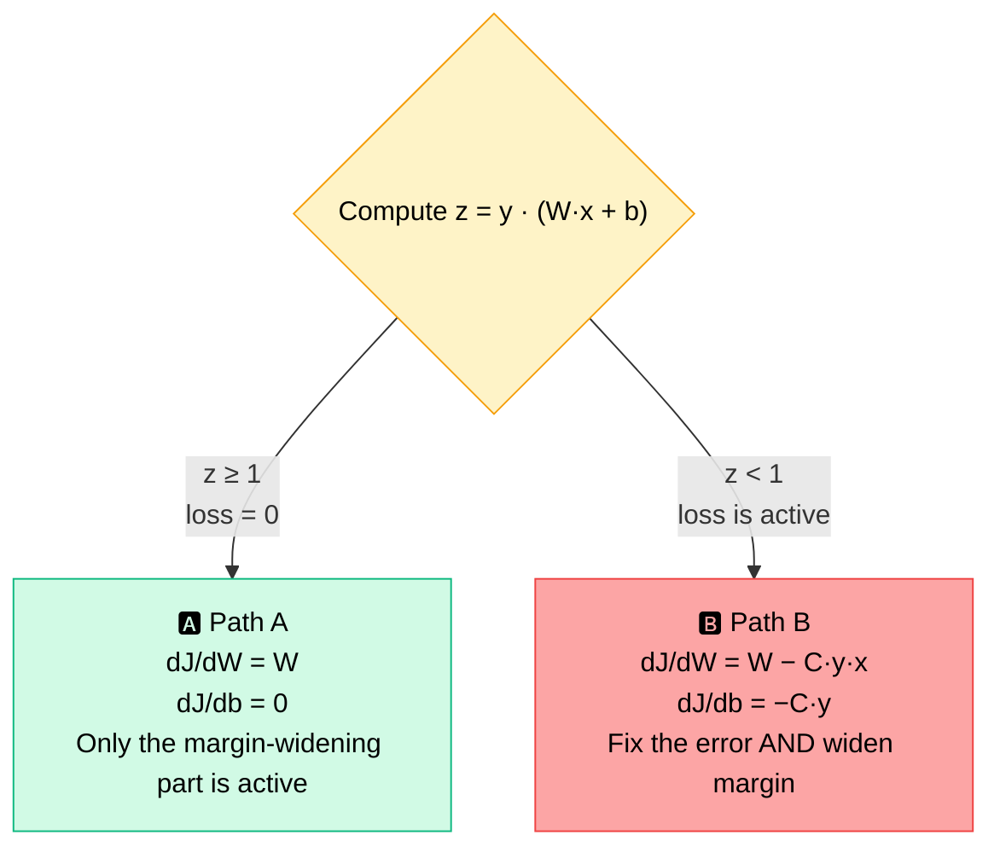
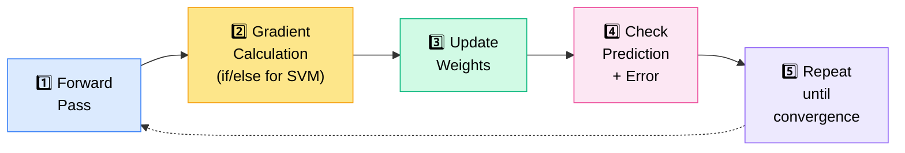

# 🧠 Support Vector Machines (SVM) — Machine Learning Class 12

---

## 🧭 Where This Class Fits

SVM is the **4th supervised ML algorithm** in the series (after Linear Regression, Logistic Regression and K-Nearest Neighbours). Today covered **only the Primal Form (Linear SVM)**. The **Dual Form (Kernelized SVM)** comes next — and that's why the class ended with a short detour into **dot product & cosine similarity**.



> 💡 **Mentor's warning:** _"This class is a little hectic."_ SVM needs geometry + equation intuition. If it feels heavy, **watch the recording again** — the depth given is already "more than intermediate."

---

## 💬 Warm-Up Chat — Useful Takeaways

| Topic                   | Mentor's Point                                                                                                                                                             |
| ----------------------- | -------------------------------------------------------------------------------------------------------------------------------------------------------------------------- |
| 🤖 Building with AI     | Fine to build without knowing everything — **but you need a design in your head** (modularity, OOP structure), otherwise updates later mean breaking the whole project     |
| 🕸️ Why graph databases? | When **rows have relationships** (e.g., mentor → mentee), traverse **nodes & edges** instead of scanning every row                                                         |
| 🔐 AI security          | A broad domain. Example: restrict MCP tools with **authentication + authorization** so AI can't call tools without a user identity; restrict what AI is allowed to execute |
| 🏗️ Microservices        | Just a different architecture — a _product-building_ topic, **not** taught in this course                                                                                  |
| ⚠️ Reality check        | _"Only ~5% of you are doing practical work, the rest are just learning."_ — **implement, don't just watch.** Share your GitHub                                             |
| 🔗 Learning links       | _"There is no single link that has everything."_ Hard work is the path                                                                                                     |

---

## 📝 Mentor's Note-Making Rule

> Every ML algorithm → **one page (max 1.5 pages)**, in **6–8 steps**: equation → loss → gradient → update, etc. Skip derivation details; keep the _idea_.

---

## 🎯 What is SVM?

- 🧑‍🏫 **Supervised** ML algorithm (needs labelled data)
- 🔀 Used for **both classification and regression**
- 🧩 Has **two forms**:

|                    | 🅰️ Primal Form                   | 🅱️ Dual Form                                        |
| ------------------ | -------------------------------- | --------------------------------------------------- |
| **Also called**    | **Linear SVM**                   | **Kernelized SVM**                                  |
| **What we learn**  | `W` and `b` (equation of a line) | A **weight `αᵢ` for each data point** + a bias term |
| **Idea**           | Like linear/logistic regression  | Only a few points get non-zero importance           |
| **Covered today?** | ✅ Yes                           | ⏳ Next class (only _how_ it solves, not full math) |

---

## 🤔 Why Do We Need SVM When Logistic Regression Exists?

Many different lines can separate two classes with **100% training accuracy**. But in logistic regression **we can't control which line we get** — it's computed automatically. If that line hugs one class, **test data near the boundary may be misclassified.**

**🏠 Neighbour analogy:** You live between two houses — would you rather live _right next to your enemy's house_ or _exactly in the middle, as far as possible from both?_ SVM picks the middle.



### 🔑 Key Vocabulary

- **Support Vectors** → the **edge data points** of each class that SVM uses to build the gap. ("Vector" just means a point in space.)
- **Center line (decision boundary)** → the single line we actually **learn**, defined by `W` and `b`
- **Margin lines** → two lines **parallel** to the center line, passing through the support vectors. They are **constraints, not extra learned lines**
- **Margin** → the distance between those two parallel lines

> ✅ **Only one `W` and one `b` are learned.** The other two lines follow from geometry (same `W`, different intercept).

---

## 🎨 Multi-Class Classification (How SVM Handles 3+ Classes)

The loss function is built for **two classes only**, so for `n` classes SVM (like logistic regression) trains **`n` separate models** — _one class vs. all the rest_.



- 📌 **Interview question:** _"SVM supports binary — how does it do multi-class?"_ → **Split into one-vs-rest models; `n` classes → `n` models.**
- 🧪 In sklearn, use **`predict_proba`** to get probabilities (the sigmoid is hidden internally).
- 🧠 In **deep learning**, **Softmax** is used for multi-class (Sigmoid for binary).
- The mentor skipped the 3-class math: _"Binary is easier to explain."_

---

## ➕➖ Labels Become +1 and −1 (Not 0 and 1)

In SVM, class labels are converted to **+1** and **−1**. (Reason explained below in Q&A and the hinge-loss section: `z = yᵢ × score` needs the **sign** of the label to work.)

---

## 🔬 The Core Experiment — What Does `W·x + b` Tell Us?

The mentor used a **random line** (`W = [1, 1]`, `b = −10`) purely to _prove an interpretation_ (not to fit the data):

| Point (x₁, x₂) | Calculation    | Score  | Position        |
| -------------- | -------------- | ------ | --------------- |
| (2, 7)         | 1×2 + 1×7 − 10 | **−1** | Below the line  |
| (3, 8)         | 1×3 + 1×8 − 10 | **+1** | Above the line  |
| (7, 3)         | 1×7 + 1×3 − 10 | **0**  | **On** the line |

### 📐 Interpretation

| Score `W·x + b` | Meaning                              | Class |
| --------------- | ------------------------------------ | ----- |
| **> 0**         | Point is **above** the line          | +1    |
| **< 0**         | Point is **below** the line          | −1    |
| **= 0**         | Point is **exactly on** the boundary | —     |

➡️ **The score is directly proportional to the distance of a point from the decision boundary.**

---

## 🚧 SVM's Real Goal: Enforce a Minimum Distance

Just getting the score's sign right = plain logistic regression. SVM adds a **restriction**:

```
For every positive point (yᵢ = +1):   W·xᵢ + b  ≥  +1
For every negative point (yᵢ = −1):   W·xᵢ + b  ≤  −1
```



- 📍 Points **exactly on** ±1 = **support vectors** = _lowest acceptable confidence_
- 📈 Points beyond ±1 = **higher confidence**
- 🤷 **Why ±1 and not ±2?** Any value works (it just scales the geometry); ±1 is the **simplest minimum acceptable distance**, and the later formulas are built on it.
- 🔗 **The center line drives everything** — change it and the parallel margin lines move with it.

---

## 📏 Margin Width = 2 / ‖W‖

Margin lines: `W·x + b = +1` and `W·x + b = −1`. Using the geometric formula for the distance between two parallel lines:

```
distance = [ (1 − b) − (−1 − b) ] / ‖W‖
         = 2 / ‖W‖           (b cancels out)
```

### 🎯 Optimization Goal

| Want                  | Means                        | Because                                                            |
| --------------------- | ---------------------------- | ------------------------------------------------------------------ |
| **Large margin**      | Make `2/‖W‖` big             | Bigger gap between classes                                         |
| ⬇️ **Small weights**  | Minimize `‖W‖`               | Large denominator → small margin; small denominator → large margin |
| ✍️ **Minimize ½‖W‖²** | Same goal, easier derivative | The square and the ½ cancel neatly when differentiating            |

> 🧠 **Remember:** **Small weights = Large margin.**
> _(Mentor: the geometry proof of this distance formula is intentionally skipped — just remember the result.)_

---

## 🔻 Hinge Loss — SVM's Loss Function

```
Hinge Loss = max(0, 1 − z)
where  z = yᵢ · (W·xᵢ + b)
```

- `W·xᵢ + b` → model's linear prediction (score)
- `yᵢ` → true label (+1 or −1)

### 🧮 Worked Examples (true label yᵢ = +1)

| Model score | z = yᵢ × score | 1 − z | Loss = max(0, 1 − z) | Verdict                                    |
| ----------- | -------------- | ----- | -------------------- | ------------------------------------------ |
| **+2**      | +2             | −1    | **0**                | ✅ Safely across the boundary — no penalty |
| **−2**      | −2             | 3     | **3**                | ❌ Wrong side — big penalty                |

### 🗺️ Interpretation

| Value of z | Meaning                                                                               |
| ---------- | ------------------------------------------------------------------------------------- |
| **z ≥ 1**  | Point is **safely across the boundary** → **no loss**                                 |
| **z < 1**  | Point is **inside the margin** _or_ **completely on the wrong side** → loss is active |

> 📌 **Interview tip:** Hinge loss is _not_ special to SVM's idea — it's just **another loss function**, like **MSE** or **log loss**. Be ready to answer _"What loss functions do you know?"_

---

## 🧾 Full SVM Cost Function

```
J(W, b) = ½ ‖W‖²  +  C · Σᵢ max(0, 1 − yᵢ(W·xᵢ + b))
          └─ margin widening ─┘   └──── hinge-loss penalty ────┘
```

### 🎛️ The `C` Hyperparameter (Penalty Strength)

|               | 🔼 High C                            | 🔽 Low C                             |
| ------------- | ------------------------------------ | ------------------------------------ |
| **Penalty**   | Heavy                                | Light                                |
| **Margin**    | **Tight / compact (skinny)**         | **Wide**                             |
| **Behaviour** | Tries hard not to violate the margin | Tolerates violations for a wider gap |

- `C` is like the **regularization penalty term** (alpha in L1/L2) seen earlier.
- ⚠️ **`C` ≠ learning rate (α).** `C` controls the **loss penalty**; learning rate controls the **step size of the update**.
- 🤷 We never know the "best" `C` in advance — it's a **hyperparameter**, chosen before training.

---

## 🔀 Gradients — Why There Are Two Paths

The hinge loss behaves differently depending on `z`, so the gradient uses **if / else** (called **sub-gradient descent**).



✨ **Key insight:** The ±1 margin constraint is **already built into the gradient itself** — we only learn `W` and `b`, and the parallel-line structure comes for free.

---

## 🔁 One Full Iteration — Worked Example

**Given:** `x = 2`, `y = +1`, **C = 1**, **learning rate = 0.1**, **W = 0.4**, **b = 0.0**

| Step                | Work                                  | Result          |
| ------------------- | ------------------------------------- | --------------- |
| **1️⃣ Forward pass** | `z = y · (W·x + b) = 1 × (0.4×2 + 0)` | **z = 0.8**     |
| **2️⃣ Choose path**  | Is `0.8 ≥ 1`? No → **Path B**         | Loss is active  |
| **2️⃣ Gradients**    | `dJ/dW = W − C·y·x = 0.4 − 1×1×2`     | **−1.6**        |
|                     | `dJ/db = −C·y = −1×1`                 | **−1.0**        |
| **3️⃣ Update**       | `W_new = 0.4 − 0.1 × (−1.6)`          | **0.56**        |
|                     | `b_new = 0 − 0.1 × (−1.0)`            | **0.1**         |
| **4️⃣ Re-check**     | `z = 0.56×2 + 0.1`                    | **1.22 ≥ 1 ✅** |

- 🎉 The prediction moved from **0.8 → 1.22**, now on the correct side, beyond the margin.
- 🔄 On the **next iteration** this row goes to **Path A** → loss is 0 → only the weights shrink slightly, **which widens the margin**.
- 👀 The ±1 boundary isn't _visible_ in this calculation — it's baked into the loss and gradient.

---

## 🪜 The Universal 5-Step Learning Recipe

> 🗒️ Mentor: _"Write this on the front page of your ML journey."_ Common to most algorithms (**except KNN and tree-based models**).



- Step 4 is for **understanding/monitoring**, not for learning itself.
- What changes between algorithms is **how the gradient is computed** — the flow stays the same.

---

## 🧰 Parameters vs. Hyperparameters

|              | 🎛️ Hyperparameters                                 | 🧠 Parameters                  |
| ------------ | -------------------------------------------------- | ------------------------------ |
| **Set when** | **Before** training                                | **During** training (learned)  |
| **Examples** | `C`, learning rate, number of iterations           | `W`, `b`                       |
| **Role**     | **Control** the training; constant for a whole run | The actual model being learned |
| **Effect**   | Changing them changes penalty/errors/behaviour     | Updated every iteration        |

---

## 🎬 Side Quest: Recommendation System → Dot Product & Cosine Similarity

> 🎯 **Why this detour?** The **dual form / kernel functions** use the **dot product**. Understanding _why_ a dot product measures "closeness" gives the intuition needed for Wednesday's class.

### 🎞️ Movie-Taste Example

Users rated **Action** and **Comedy** interest:

| User | Action | Comedy | Taste           |
| ---- | ------ | ------ | --------------- |
| A    | 2      | 0      | Mild action fan |
| B    | 10     | 0      | Big action fan  |
| C    | 0      | 10     | Big comedy fan  |

**Dot product = multiply matching features and add up**

| Pair  | Calculation | Result                           |
| ----- | ----------- | -------------------------------- |
| A · B | 2×10 + 0×0  | **20** (similar tastes → larger) |
| A · C | 2×0 + 0×10  | **0** (opposite tastes → small)  |

> 💡 Large × large = large; small × large = small. **Similar interests reinforce, opposite interests cancel.** Dot product is just _multiplication done in a vectorized way_ — it isn't "similarity" by itself, **how we use it** makes it a similarity measure.

### 🧭 Direction Matters — Cosine Similarity

When we think in **vector space** (e.g., Action / Comedy / Drama axes), **direction** matters, not just size.

```
cosine similarity = (A · B) / (‖A‖ × ‖B‖)
A–B example: 20 / (2 × 10) = 1.0  →  identical direction (same taste)
```

|                   | ✖️ Dot Product                                                 | 📐 Cosine Similarity                                                      |
| ----------------- | -------------------------------------------------------------- | ------------------------------------------------------------------------- |
| **Considers**     | Direction **and magnitude**                                    | **Direction only**                                                        |
| **A vs B result** | 20                                                             | **1.0**                                                                   |
| **Best used for** | Finding who is _closest_ in intensity (may favour heavy users) | Finding **groups with similar taste** regardless of how much they consume |
| **Risk**          | Heavy users dominate; may miss good items                      | —                                                                         |

- 🛒 **Amazon-style recommendations:** buyer of a smartphone + cover ≈ buyer of just a smartphone (similar direction); a laptop + antivirus buyer points elsewhere.
- 🗄️ **Vector DBs / RAG:** stored embeddings are matched by direction using cosine-type similarity.
- 🧲 Opposite directions give **negative** similarity.
- 💼 Career note: recommendation-system roles are rare (~2–3 in 100 jobs). _Target generic roles first, specialize later._

---

## ❓ Live Q&A Highlights

| Question                                                        | Answer                                                                                                                                                                                                                                                 |
| --------------------------------------------------------------- | ------------------------------------------------------------------------------------------------------------------------------------------------------------------------------------------------------------------------------------------------------ |
| **Is SVM better than logistic? When to choose which?**          | SVM is the **more advanced** algorithm. We start with the simplest ones (_"Nokia 1100 → iPhone 16 Pro"_) and move up in complexity.                                                                                                                    |
| **Then why learn SVM at all?**                                  | Bagging & boosting (**Random Forest, XGBoost**) can solve **90–95%** of problems — but you can't truly understand them without the fundamentals.                                                                                                       |
| **Why labels +1/−1 instead of 0/1? (Amol)**                     | The constraints and `z = y · score` rely on the **sign** of the label. With 0/1, class-0 points would make `z` vanish and the symmetric ±1 boundary wouldn't work. It's the result of "re-engineering" the equations until everything fits.            |
| **Why does `z` include `yᵢ`? (Amol)**                           | Score alone only gives a direction (like regression). Multiplying by the true label tells us whether the point is on the **correct** side (positive `z`) or the wrong side (negative `z`).                                                             |
| **Does the margin apply to regression? (Amol)**                 | Mentor's answer: margin is for **separating classes**; for regression you just need to learn the line, so it behaves much like linear regression.                                                                                                      |
| **Can SVM work on unlabelled data?**                            | **No** — SVM is supervised. Unlabelled data → **unsupervised** methods like **K-Means, DBSCAN** (clustering).                                                                                                                                          |
| **Which distance metric does SVM use (Euclidean / Manhattan)?** | **None.** The "distance" is the **geometric (perpendicular) distance between two parallel lines**.                                                                                                                                                     |
| **Does it consider all points as support vectors?**             | No — **only a few** points become support vectors.                                                                                                                                                                                                     |
| **What do ML pipelines on cloud (Azure) do? (Bhoomika)**        | Choose one cloud ecosystem so everything connects: data lands in **blob storage** → **Azure ML** reads it, trains → model is saved/deployed. Retraining is **scheduled** or triggered only when **data distribution changes** — not necessarily daily. |
| **Does dot product itself find similarity? (Pradeep)**          | No — it's **multiplication**; used a certain way it reflects similarity. Dot product is used for its vectorized form.                                                                                                                                  |
| **Practical difficulty rating?**                                | **Model code: ~1/10** · EDA: ~7.5/10 · Feature engineering: ~7/10 · **Concepts: ~9/10**. SVM practical (e.g., Iris dataset) will just be swapping in an SVM import.                                                                                    |

> 🔎 **Clarifications on mentor's answers (added while compiling these notes):**
>
> - In standard SVM, support vectors are **identified from the data** (points on/inside the margin), rather than chosen randomly — worth confirming with the mentor.
> - Regression with SVMs (**SVR**) does exist as a separate formulation (with an ε-tube instead of a class margin); the mentor kept the answer simple for now.

---

## 🧑‍🤝‍🧑 Individual Student Doubts & Advice

| Student      | Concern                                                                     | Outcome                                                                                                                                                                                                                                          |
| ------------ | --------------------------------------------------------------------------- | ------------------------------------------------------------------------------------------------------------------------------------------------------------------------------------------------------------------------------------------------ |
| **Sandeep**  | Hyperparameters & margin meaning; how to prepare                            | Hyperparams = training controls (see table above). **Keep two sets of notes**: _interview-focused_ (remember margin width, optimization goal, hinge loss) vs. _interest-focused_ (deeper math). Interviews filter with math you won't use daily. |
| **Partha**   | Math-oriented, time-poor; wants reference material & a step-by-step roadmap | Mentor will **think about creating an ML roadmap / step-by-step guide** (possibly after ML series ends, ~7–8 more weekend classes). Partha suggested involving 1–2 students to help build it.                                                    |
| **Sirijyo**  | Unlabelled data, combining classes, distance formulas                       | Covered in Q&A above. Combining all classes into one defeats the purpose of classification.                                                                                                                                                      |
| **Bhoomika** | ML pipelines in production                                                  | Covered in Q&A above.                                                                                                                                                                                                                            |

---

## ✅ Action Items for Learners

- [ ] 📝 Write a **one-page SVM note** (6–8 steps: labels ±1 → constraints → margin `2/‖W‖` → hinge loss → cost function → gradients → update)
- [ ] 🔁 **Re-watch the recording** at your own pace — especially the margin & hinge-loss parts
- [ ] 🧮 Redo the **one-iteration example** by hand (`W=0.4, b=0, C=1, lr=0.1, x=2, y=+1`)
- [ ] 🪜 Write the **5-step learning recipe** on the first page of your ML notes
- [ ] 🎬 Revisit **dot product vs. cosine similarity** before Wednesday (needed for the dual form / kernels)
- [ ] 🗂️ Keep **separate interview notes** vs. deep-understanding notes
- [ ] 💻 **Practice the code** — push your implementations to **GitHub** (the mentor _will_ ask to see it)
- [ ] 📚 Remember **loss functions list**: MSE variants, **log loss**, **hinge loss**

---

## 🔮 Coming Up Next (Wednesday)

- 🧬 **SVM Dual Form / Kernelized SVM** — how dot products inside **kernel functions** let SVM handle non-linear data
- 🧪 SVM practical (same flow as before: import model, `fit`, `predict`)
- ⚡ _No breaks from now on_ — come prepared!

---

_📝 Notes compiled from the full class transcript — Machine Learning Class 12 (SVM, Primal Form), taught by Monal S._
