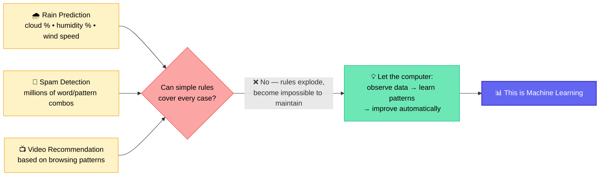
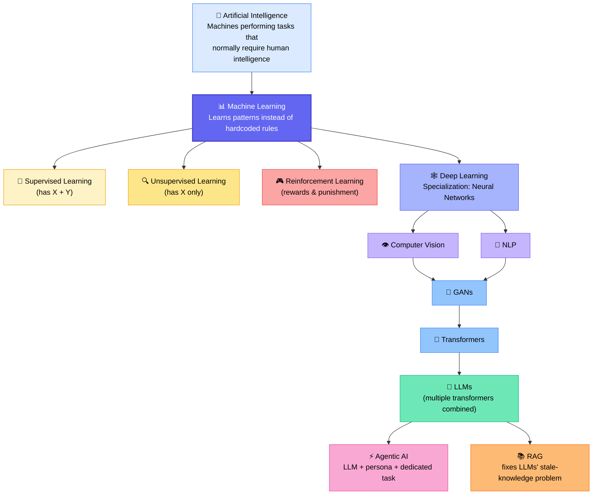
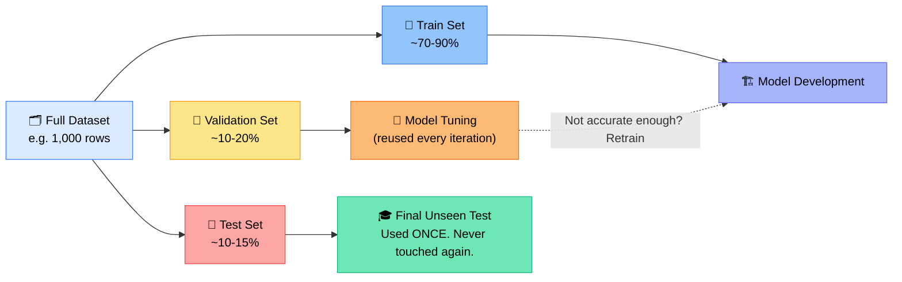

# 🤖 Machine Learning Foundations — Session 1
### 📋 Live Class Notes — Krish Naik Academy (Data Science / Agentic AI Track)

**🎙️ Mentor:** Monal S
**📅 Date:** May 24, 2026
**⏱️ Duration:** ~4 hours (incl. break) | **🎯 Session Type:** Live Weekend Class — Theory + Live Q&A

---

## 🧭 Where This Class Fits

This is **Session 1 of the Machine Learning module**, following ~5 months of prior groundwork in Python, Statistics, Feature Engineering, and EDA. Today is **pure theory — no coding, no algorithms yet**.

> 💡 **Mentor's framing:** "From the next class, I will not re-teach feature engineering or Pandas — those are now assumed defaults, just like I never taught you basic Python syntax while teaching feature engineering. Our focus in this module is the *algorithms* and the *mathematics* behind them."

---

## 🤔 Why Do We Even Need Machine Learning?

The class opened with three real-world problems to expose the limits of pure rule-based programming:

| Problem | Why hardcoded rules fail |
|---|---|
| 📺 How does YouTube recommend videos? | Based on browsing/watch history — too many patterns to hand-code |
| 📧 How does Gmail detect spam? | Would need millions of `if` conditions for every word/pattern combination |
| 🌧️ Rain prediction (cloud %, humidity %, wind speed) | Simple thresholds fail on edge cases, and rules differ by region (Rajasthan ≠ Bangalore) |

**The problem, in one line:** *Rules become huge, difficult, and impossible to maintain.*
**The solution, in one line:** *Let computers observe data, learn patterns, and improve automatically.*

---

## 🧒 The Analogy That Makes It Click

How do you teach a child what a "dog" is?

**Not** with rigid logic: *"if 4 legs AND tail AND fur → dog"* — because a cat and a toy dog satisfy the same conditions too.

**Instead**, you show examples: *"this is a dog"* → *"this is not a dog (it's a cat)"* → and the child learns the underlying **pattern**, not a rulebook.

> That's exactly how Machine Learning works: it learns from patterns in examples, instead of being handed explicit logic.

---

## 🧠 What Artificial Intelligence Actually Means

> **AI is the broader field of making machines perform tasks that normally require human intelligence.**

🚫 **Common misconception (addressed directly in class):** AI does **not** mean emotional or self-aware machines. That idea — a machine that can reason and act just like a human across any domain — is what the class referred to as **General AI (AGI)**, and it does not exist yet. Everyday AI is task-specific ("**Narrow AI**"); a model like Gemini that handles text, images, and video together is closer to "**Broad AI**" — still not AGI.

### 🔧 AI Tasks Behind Familiar Applications

| Application | Underlying AI Task | Specialization |
|---|---|---|
| 📱 Face unlock | Face recognition | Computer Vision |
| 🌐 Google Translate | Language understanding | NLP |
| 🔊 Alexa | Speech understanding | NLP / Speech |
| 🚗 Self-driving car | Decision-making | Reinforcement Learning + others |
| 🤝 Agentic AI (general) | Decision-making **+ taking action** | LLM-driven agents |

> 💡 **Key distinction drawn in class:** Decision-making alone isn't Agentic AI — it's decision-making **plus acting on that decision** (e.g., seeing an obstacle → braking, not just recognizing "there is an obstacle").

---

## 🗺️ The Full AI Family Tree

**📚 What is RAG, quickly?** LLMs are trained up to a cutoff date, so they don't know anything after that — and retraining an LLM costs millions of dollars. RAG solves this cheaply: feed the LLM external documents (PDFs, text) at query time, and ask it to reason over *that* information. Also noted: **LLMs cannot browse the web on their own** — that only happens through tools given to them.

---

## 🎯 The Three Types of Machine Learning

| Type | What data you have | Goal | Analogy used in class |
|---|---|---|---|
| 🏷️ **Supervised** | Features (X) **+** Labels (Y) | Predict Y for new X | A mentor giving you a question *and* its answer |
| 🔍 **Unsupervised** | Features (X) only | Discover hidden groups/patterns | Grouping people by traits with no predefined categories |
| 🎮 **Reinforcement** | No fixed dataset — an environment | Maximize cumulative reward | Training a dog with rewards, not fixed Q&A |

### 🏷️ Supervised Learning — Regression vs. Classification

Mathematically: **Capital X** = features (can be many), **small y** = the single target.

| | 📈 Regression | 🗂️ Classification |
|---|---|---|
| Output type | Continuous | Categorical |
| Examples | Salary, temperature, stock price, house price, marks | Spam/not spam, cat/dog, fraud/not fraud, defaulter/non-defaulter, disease type |

**⚡ Quick-fire quiz from class:**
- Predict **age** → ✅ Regression (infinite possible values)
- Predict **gender** → ✅ Classification ("we don't have infinite categories — we have finite values")

### 🔍 Unsupervised Learning — Finding What Isn't Labeled

**Example used:** A supermarket dataset with `age`, `spending frequency`, `location` — but **no column** for "rich customer," "discount hunter," or "spending behavior." Since the answer isn't in the raw data, the only option is to group similar data points together and let the patterns emerge.

**Real-world examples covered:**
- 🛒 **Customer segmentation** — grouping customers with no predefined labels
- 🚨 **Anomaly detection** — e.g., a bank flagging an unusually large transaction. **Why not supervised?** Fraud/anomaly cases are extremely rare (maybe 1 in 20,000 transactions) — a supervised model trained on that imbalance would just learn to always predict "normal" and still show 99.99% accuracy, which is useless.
- 🎯 **Recommendation grouping** — Monal shared a personal example: for a past Computer Vision batch, he collected experience data via a Google Form and used clustering to fairly distribute freshers/mid-level/senior learners evenly across project groups — because the "how many of each level" grouping wasn't available in the raw signup data.

### 🎮 Reinforcement Learning — Learning by Trial and Error

> Learning happens through **rewards, punishment, and trial and error** — like training a dog: correct action → reward; wrong action → no reward (never punishment).

**Snake-game walkthrough used in class:**
- Entity starts with 0 reward
- Moves closer to the goal → **+1**
- Moves farther away → **−1**
- Hits the "wall"/obstacle → **Game Over (0)**, and the model remembers not to repeat that path
- Over many iterations, it learns the path that maximizes total reward

**Where it's used:** Game NPCs and chess engines, and — a classic example — **robots learning to walk**, since no one can hand-code the thousands of micro-adjustments needed for balance.

> ⚠️ **Important terminology distinction raised in class:** A Reinforcement Learning "**agent**" (a movable state/entity) is **not the same thing** as an "**agent**" in Agentic AI (an LLM with a persona and a dedicated task). Same word, different concepts.

---

## 🧩 Quick Recap: Classify These Real-World Systems

| System | Type | Why |
|---|---|---|
| 🎬 Netflix recommendations | Supervised | Built from "someone who watched X also watched Y" pairs — that pairing *is* the label |
| 📧 Spam detection | Mostly Supervised | Can technically be done unsupervised too, but supervised gives higher accuracy |
| 🤖 Robots learning to walk | Reinforcement | No fixed dataset — learns via reward/failure over time |
| 🛒 Customer clustering | Unsupervised | No predefined target column exists |

---

## 📊 Data Splitting: Train / Validation / Test

**The exam analogy:** If a teacher gives students the exact exam questions beforehand, everyone scores well — but they've **memorized answers, not learned patterns**. Same risk in ML: if you train and test a model on the *same* data, it will report near-100% accuracy without proving it can generalize.

**The teacher analogy, extended:**
- 📘 **Train** = the teacher teaching chapters 1–10
- 📗 **Validation** = the *same* teacher's mock tests — you relearn based on this feedback, so it directly shapes your improvement (this is where **data leakage** creeps in)
- 📕 **Test** = the final board exam, set independently, taken **once** — never used to relearn, regardless of the result

### 🚨 What Is Data Leakage?

> **Data leakage isn't about literally mixing rows** — it's about using *any* information (like validation accuracy/error) to update or improve the model. If a number influences a retrain decision, that dataset has "leaked" into the model, directly or indirectly.

This is exactly why the **test set must never be used to tune anything** — the moment it influences the model, it stops being a true measure of real-world performance.

### 📏 Split Ratio Guidance

| Data volume | Recommended split | Notes |
|---|---|---|
| Large dataset | **70 / 30** (ideal baseline) | Split the 30% between validation & test |
| Moderate dataset | **80 / 20** | Slightly more training share |
| Smaller dataset | **90 / 10** | Preserve as much signal for training as possible |
| ❌ Avoid | 60 / 40 or lower | Wastes too much data the model could have learned from |

> ⚠️ **Real-world caveat shared candidly by Monal:** Sometimes a business unit hands over very limited data and doesn't understand ML concepts. In that situation, practitioners may pragmatically train on Train + Validation only (skipping a dedicated Test set early on) to preserve signal — but this is *not* fully correct practice, and the accuracy reported should honestly be labeled as validation accuracy, not final real-world testing.

---

## 💼 Career & Industry Notes (Monal's Asides)

> *"Even if the actual problem is Machine Learning, businesses often want to hear 'we used Generative AI' — because it looks better for their budget allocation. Be smart about office politics, but always know what you're actually doing."*

- 🔻 **Gen AI hype warning:** Teams are increasingly forcing GenAI/Agentic AI onto problems that plain ML or even statistics would solve better — driven by internal politics and visibility, not technical fit.
- 🏢 **Real learning happens on the job:** According to Monal, deep expertise (e.g., in Computer Vision) came from joining organizations with experienced mentors — not from a single project or self-study alone. He recommends joining an organization *knowing exactly* what you want to learn there, rather than hoping the right opportunities will appear.
- 🚀 **Startups vs. service-based companies:** Startups can offer more direct, hands-on exposure (less politics) but come with more uncertainty; service-based companies tend to offer very limited depth of learning.
- 🔄 **On career breaks:** Don't lead with salary expectations — focus on proving capability first, even at a smaller company, to re-enter the industry.

---

## ❓ Live Q&A Highlights

| Student | Question | Answer |
|---|---|---|
| Pritam | Is the validation set also "new" data for the model, like the test set? | Yes conceptually — but unlike the test set, validation *is* used to drive re-training/tuning. This connects to K-Fold cross-validation, covered in a future class. |
| Vishal Singh | Is the same validation subset reused for every improvement cycle, or does it change? | Within one basic train/val/test split, it stays fixed. Randomized re-splitting (e.g., cross-validation) is a separate, more advanced technique covered later. He also asked about finding automotive-specific datasets — Monal noted sensor/automotive data is largely proprietary, but self-driving/computer-vision datasets are publicly available. |
| Geetanjli Mathur | What is overfitting? (mentioned briefly in passing) | Deferred to a future class — not needed to understand today's core concept of data splitting. She also asked about skipping the test set for a business deadline — Monal clarified this should never be represented to the business as "real testing," only as validation-based accuracy. |
| Sai Shanmukhi | How is Netflix recommendation "supervised" if there's no obvious label? | The label comes from co-occurrence pairs — "someone who watched X also watched Y" — similar to Amazon's "customers who bought this also bought that." |
| Misha Verma (new learner) | I'm 4.5 months behind and feel overwhelmed attending live classes without the Python/Stats foundation — what should I do? | Fast-track through existing free YouTube playlists (Python, NumPy/Pandas, Stats) in 1–2 weeks instead of the full in-depth track, just to catch up to live pace; go back and deepen specific gaps later as needed. She also asked about data privacy vs. data leakage — Monal clarified these are unrelated: privacy is a governance/permission issue *before and after* modeling, while leakage is a technical correctness issue *within* modeling. |
| Siri | My voice-based bird identification app works for images (YOLOv8) but fails on audio — why? | Image classification is comparatively straightforward with modern frameworks; audio classification is much harder — recommended checking per-class accuracy to isolate failure patterns, and exploring speech-to-text models (e.g., Whisper) with a custom classification head. |
| Partha | What's the difference between Narrow AI, Broad AI, and General AI? Also — can we identify bird species from audio/image recordings? | Narrow AI = solves one specific task only; Broad AI = handles multiple modalities (like Gemini); General AI (AGI) = human-level reasoning across any domain, not yet achieved. For his bird-ID idea: image classification is very feasible (YOLO-style models), but audio classification requires far more data collection and specialized STT-based architectures. |
| Amol | Do all three sets (train/val/test) need a Y column? What exactly counts as "leakage"? | Yes, all three need Y to measure correctness. Leakage = using feedback (like validation error) to influence retraining — it's the *information*, not just raw rows, that leaks into the model's improvement loop. |
| Shiva Sankar | Is it safe to use Claude Code connected to external tools, from a privacy standpoint? | Safe as long as no sensitive credentials, passwords, or API keys are being shared — but always check the specific tool's privacy policy. |

---

## 📚 Community Resources Mentioned

- 📝 **Student-maintained notes:** Shahul Hameed shared a Substack + a custom AI-generated website compiling ML session notes — built by revising videos, refining notes through multiple AI tools (Copilot, Gemini, Claude), then generating the site in HTML. He was clear that **Monal's live videos remain the source of truth**; his notes are a supplementary, more visual revision aid.
- 💬 **Official community:** Krish Naik Academy's in-app **Messages** section — the official channel for doubts and peer help between live sessions.

---

## ✅ Action Items for Learners

- [ ] 📄 Download and review the PDF notes shared at the end of class
- [ ] 🧠 Revisit today's theory before the next class — no coding was covered, but every concept here is foundational for the algorithms coming next
- [ ] 🔁 Be ready to explain, in your own words: why data leakage happens in a validation set (using the mock-test analogy)
- [ ] 🧩 If you're behind on Python/NumPy/Pandas/Stats, fast-track via free YouTube playlists rather than trying to complete every module in full depth before returning to live classes
- [ ] 📅 Watch for confirmation on the Wednesday class — it may shift due to the Eid holiday (confirmed as Thursday in India); no cancellation email means the class is on as usual
- [ ] 💬 Bookmark Shahul's Substack/notes site as a supplementary (not primary) revision resource
- [ ] 🐦 If pursuing personal projects (e.g., audio/image classification like the bird-ID case), start by validating accuracy **per class**, not just overall accuracy

---

*📝 Notes compiled from the full session transcript — Machine Learning Foundations, Session 1, Krish Naik Academy.*
