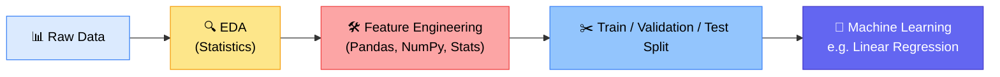
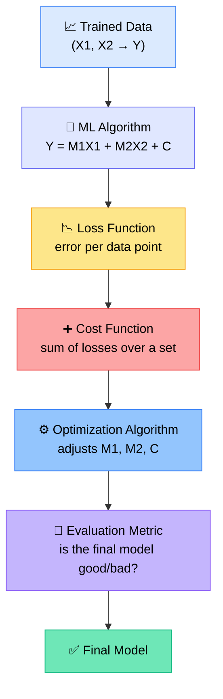
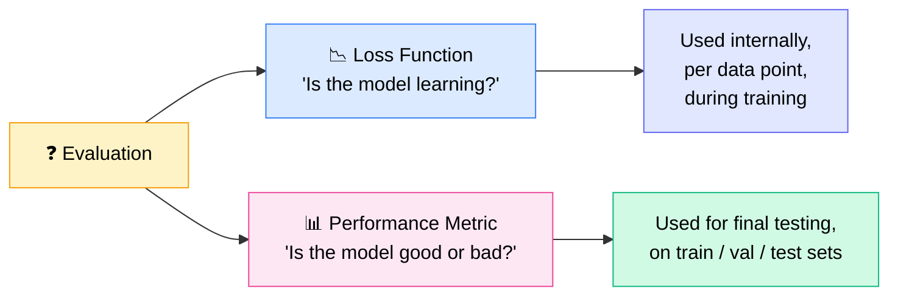
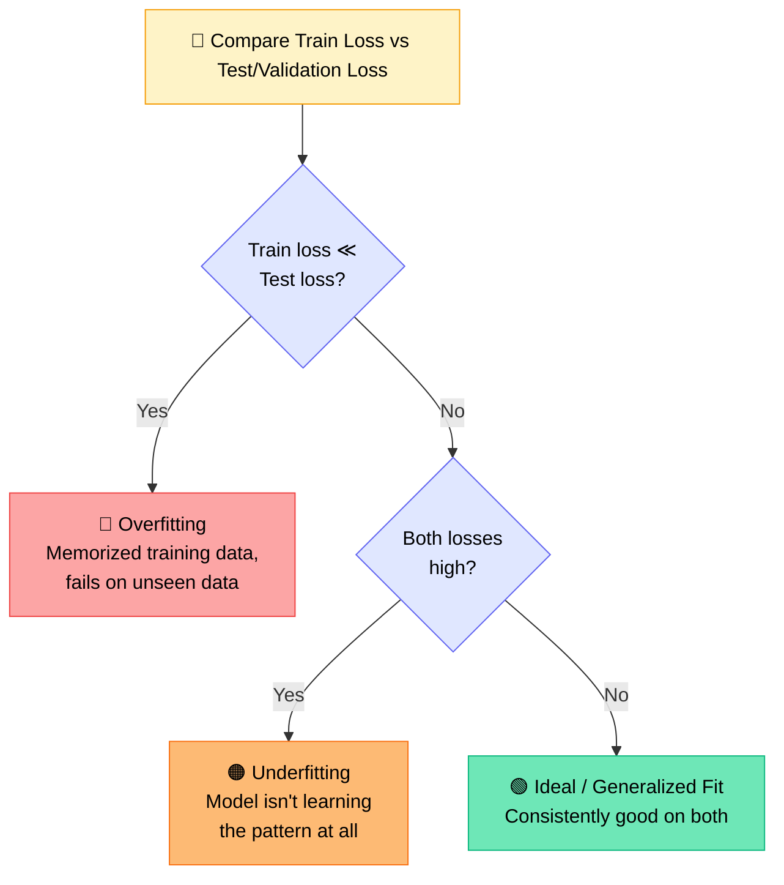
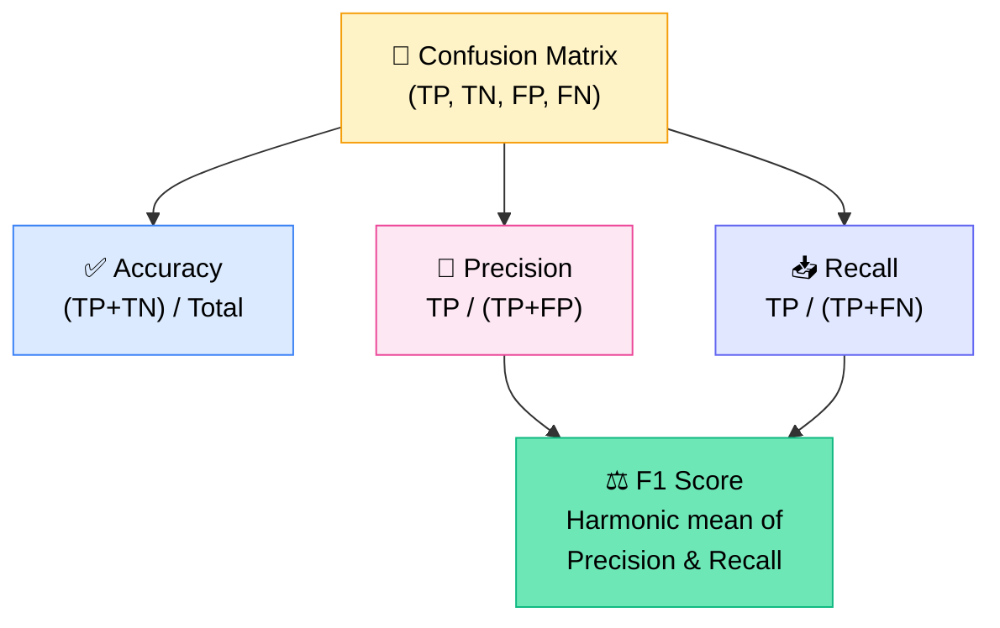

# 📊 Machine Learning 2 — Loss, Cost, Overfitting & Evaluation Metrics
### 📋 Live Class Notes — Data Science Batch (Krish Naik Academy)

**🎙️ Mentor:** Monal S
**⏱️ Duration:** ~4 hours (incl. 20-min break + live Q&A) | **🎯 Session Type:** Live Class + Doubt-Clearing Q&A

---

## 🧭 Where Today's Class Fits

Before touching any algorithm, the class first builds the **evaluation vocabulary** that every machine learning model — regression, classification, or later deep learning — depends on. As Monal put it early on:

> 💬 *"Machine learning is 2–3 lines of code. But there are a lot of components before we apply that algorithm, and a lot after the model is created. We need to understand the whole thing."*



✅ **Recap confirmed before starting:** what is ML, why it exists, types of learning (supervised/unsupervised/reinforcement), and train-test splitting.
✅ **Today is a no-practical, pure-intuition class** — the goal is to understand *why* formulas exist before writing any code.

---

## 🗺️ Today's Agenda

| Topic | Purpose |
|---|---|
| 📉 Loss Function vs Cost Function | Understand what tells ML "you're wrong" |
| ⚖️ Overfitting / Underfitting / Ideal Fit | Read training vs test error correctly |
| 📐 Regression Evaluation Metrics | MAE, MSE, RMSE, Modified MSE |
| 🧮 Classification Evaluation Metrics | Confusion Matrix, Accuracy, Precision, Recall, F1 |
| 🎯 Linear Regression foundation | Y = M1X1 + M2X2 + C (recap, needed for tomorrow) |

---

## 🧩 The Core Idea: Every ML Model Predicts, Then Gets Checked



> 💡 **Key definition given:** M1, M2 are **parameters**; C is the **intercept/constant** — the same Y = MX + C from earlier classes, just extended to multiple features.

---

## 🎯 Two Completely Different Questions Evaluation Answers

Monal repeatedly stressed that "evaluation metric" is an umbrella term covering **two different jobs**, done at **two different stages**:



**Teacher-student analogy used in class:** if a teacher checks marks improving over repeated attempts on the *same* material, that's checking **learning** (loss function). The **final exam** on unseen questions is checking **performance** (evaluation metric).

| Term | Formula shape | What it measures |
|---|---|---|
| 🔹 **Loss Function** | `Y − Ŷ` (single point) | Error of *one* data point — is the model learning? |
| 🔹 **Cost Function** | `Σ (Y − Ŷ)` over a dataset | Overall error on a set (train / val / test) |

> ⚠️ **Interview trap flagged by Monal:** Beginners interchange "loss" and "cost." Loss = individual point error. Cost = summed/aggregated error over a dataset.

---

## ⚖️ Overfitting vs Underfitting vs Ideal Fit

This is the section Monal called *"the whole point of today's class."* Read training loss against test/validation loss:



| Fit type | Train error | Test error | What's happening |
|---|---|---|---|
| 🔴 **Overfitting** | Very low | High | Model memorized training points too well — no generalization |
| 🟠 **Underfitting** | High | High | Model failed to learn any real pattern |
| 🟢 **Ideal / Good Fit** | Reasonably low | Reasonably low & close to train | Model learned the *pattern*, not the exact points |

### 🍎 Real-World Analogies Used in Class

- **📚 Teacher-student:** A student who memorizes the same 30 practice questions word-for-word scores high on a repeat test but fails a *real* exam with new questions — that's overfitting. A student who understands the underlying concept performs consistently on both.
- **📷 Smartphone camera:** A camera trained to be flawless on dog/human/cloud but terrible on cat/truck (overfit to specific cases) makes for a worse product than one that performs *consistently okay* across all real-world scenarios (generalized/ideal model).
- **🏥 Distribution mismatch:** If test data comes from a genuinely different distribution than training data, no evaluation trick fixes it — the real solution is asking for more representative training data.

> 💬 *"Overfitting is learning the pattern word by word. A generalized model learns the pattern, the flow — even if it makes small mistakes everywhere, it makes a fair guess anywhere."*

---

## 📐 Regression Evaluation Metrics

All formulas build on the same base: **`Y − Ŷ`** (Actual − Predicted).

| # | Metric | Formula | Why it matters |
|---|---|---|---|
| 1 | **Simple Error Sum** | `Σ (Y − Ŷ)` | Raw total error; can cancel out with mixed +/− signs |
| 2 | **Average Error** | `(1/N) Σ (Y − Ŷ)` | Gives an aggregated per-point sense of error |
| 3 | **MSE** (Mean Squared Error) | `(1/N) Σ (Y − Ŷ)²` | Squaring removes sign cancellation *and* penalizes large errors much more than small ones — good for model *learning* |
| 4 | **MAE** (Mean Absolute Error) | `(1/N) Σ \|Y − Ŷ\|` | Keeps the original unit (more human-readable) — good for *reporting* |
| 5 | **RMSE** (Root Mean Squared Error) | `√[(1/N) Σ (Y − Ŷ)²]` | A middle ground between MAE and MSE — same unit as data, still penalizes big errors |
| 6 | **Modified MSE** | `(1/2N) Σ (Y − Ŷ)²` | Used internally by ML algorithms — the extra ½ cancels neatly when taking a derivative |

### 🧮 Why Squaring Matters
- Removes the sign problem (`Y − Ŷ` could be negative and falsely cancel out other errors).
- **Small errors stay small, large errors blow up** — this tells the model *where* to focus its correction effort.

### 🧮 Why "Modified" MSE Exists
When deriving the cost function (needed for gradient descent, taught next class), the power rule brings the exponent `2` down as a multiplier:

```
d/dx (Y − Ŷ)² → 2(Y − Ŷ)
```

Using **1/2N instead of 1/N** in the formula means that `2` cancels out cleanly during differentiation — pure mathematical convenience, not a different concept.

> 💬 *"Everything in mathematics has a reason. It's not that we can't use MSE — using the modified version just makes the derivative calculation simpler."*

### 📏 One Critical Caveat: Units Matter
Monal stressed that **10 is not inherently "good" or "bad"** — a cost of 10 in kilometers is tiny, but 10 in salary units ($10) is meaningless, while 10 in height (inches) could be huge. Always interpret error magnitude relative to the unit of `Y`.

---

## 🧮 Classification Evaluation Metrics: The Confusion Matrix

> 💬 *"It is confusing — that's why it's called a confusion matrix."*

Since classification labels (spam/not spam, cancer/not cancer) aren't numeric, `Y − Ŷ` doesn't apply. Instead, every prediction falls into one of four buckets:

| | **Predicted: Positive** | **Predicted: Negative** |
|---|---|---|
| **Actual: Positive** | ✅ **True Positive (TP)** — truly classified as positive | ❌ **False Negative (FN)** — falsely classified as negative |
| **Actual: Negative** | ❌ **False Positive (FP)** — falsely classified as positive | ✅ **True Negative (TN)** — truly classified as negative |

📌 **Memory trick taught in class:**
- The **2nd letter** (P/N) = what the model *predicted*.
- The **1st letter** (T/F) = whether that prediction was *correct*.
- The **diagonal is always the correct/true cases** (same logic as a correlation matrix diagonal being 1).

### 🏥 Why This Isn't Just Academic: Cancer Detection Example

| Case | Meaning | Danger Level |
|---|---|---|
| **False Negative (FN)** | Person *has* cancer, model says they don't | 🔴 **Most dangerous** — person goes untreated |
| **False Positive (FP)** | Person doesn't have cancer, model says they do | 🟠 Dangerous, but leads to unnecessary treatment, not neglect |

> 💬 *"In healthcare, the majority of the focus should be on minimizing false negatives."*

---

## 📊 Accuracy, Precision, Recall & F1 Score



| Metric | Formula | Answers the question |
|---|---|---|
| **Accuracy** | `(TP + TN) / (TP+TN+FP+FN)` | "Overall, how correct is the model?" |
| **Precision** | `TP / (TP + FP)` | "Of everything I *called* positive, how often was I right?" |
| **Recall** | `TP / (TP + FN)` | "Of all *actual* positives, how many did I catch?" |
| **F1 Score** | `2 × (Precision × Recall) / (Precision + Recall)` | "Best of both worlds" — single balanced number |

⚠️ **Important:** Accuracy is a **classification-only** concept — regression models use MAE/MSE/RMSE instead, never "accuracy."

✅ **Confirmed generalizes to multi-class problems** (e.g. car / bicycle / truck / other) — the same TP/FP logic is just applied per-class, one row at a time, treating each class as "positive" against all others as "negative."

---

## ❓ Live Q&A Highlights

| Question | Answer |
|---|---|
| If we keep feeding all new data (train + test) into the model over time, will training ever become unnecessary? | Not entirely — user behavior and data distributions shift over time (e.g. Instagram's audience aging), so periodic retraining is still needed. Teams first check if the new data's distribution matches the old training distribution before deciding to retrain. |
| Do confusion matrix concepts change for more than 2 classes? | No — the underlying logic (true/false, positive/negative) stays the same; it's just applied row-by-row per class, increasing the matrix size (e.g. 4×4 for 4 classes) rather than changing the formulas. |
| I'm behind on EDA/feature engineering videos — can I still follow Machine Learning classes? | Yes. ML doesn't heavily depend on EDA; catching up on Feature Engineering is more useful, and EDA can be revisited later in free time. |
| How do you explain overfitting/underfitting or MSE/MAE to a non-technical business stakeholder? | Use visualizations (predicted vs actual line/trend graphs) rather than raw metric numbers; for stakeholders who want numbers, bucket errors into bins/regions so they can see where performance is weak vs strong. |
| Do ML/data science interviews expect deep system design knowledge? | Not typically ML-specific system design — that's covered under MLOps (roughly 70% DevOps + 30% ML-specific concepts), which will be taught later alongside RAG/Generative AI deployment topics. |
| (Stats follow-up) In a hypothesis test, if the calculated Z-score falls inside the confidence interval, do we reject or fail to reject the null hypothesis? | We **fail to reject** the null hypothesis — the observed difference is within the acceptable random-chance range, so there's no statistical evidence the company's claim is false. |
| How do train/validation/test sets get used differently in ML vs Deep Learning? | In classic ML, the model doesn't automatically use validation error to re-adjust itself. In Deep Learning, validation loss is explicitly used to adjust training parameters in a feedback loop. |
| Who decides the data type (supervised/unsupervised) for a project? | The business problem statement decides it — if there's a target/label to predict, it's supervised; if not, it's unsupervised. This isn't a data scientist's arbitrary choice. |

---

## ✅ Action Items for Learners

- [ ] 🔁 Revise today's confusion matrix diagram until TP/TN/FP/FN can be recalled from memory (Monal warned this concept is easy to forget even with years of experience)
- [ ] 📝 Rebuild the diagonal-mnemonic table (Actual × Predicted → Positive/Negative → True/False) in your own notes
- [ ] 🧮 Practice manually calculating Accuracy, Precision, Recall, and F1 on a small dummy confusion matrix
- [ ] 🐍 If not already done: install UV, set up a Python environment, and get Jupyter/VS Code notebooks running (not urgent for tomorrow's math-heavy class, but needed soon for practicals)
- [ ] 📂 For anyone with an in-progress project: add a README with screenshots/accuracy tables, modularize code, and deploy a Streamlit demo link before resharing for feedback
- [ ] 📚 Come prepared for the next class — it will build directly on loss/cost functions (derivatives, gradient descent) with **no re-explanation of today's formulas**

---

*📝 Notes compiled from the full live class transcript — Machine Learning 2: Evaluation Metrics, Loss & Cost Functions, Overfitting/Underfitting, and Confusion Matrix — Krish Naik Academy, Data Science Batch, mentored by Monal S.*
