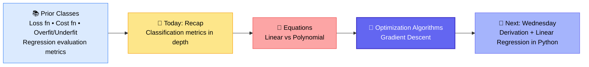
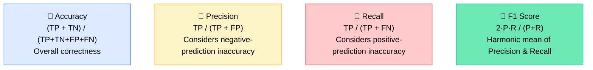
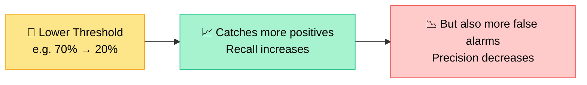
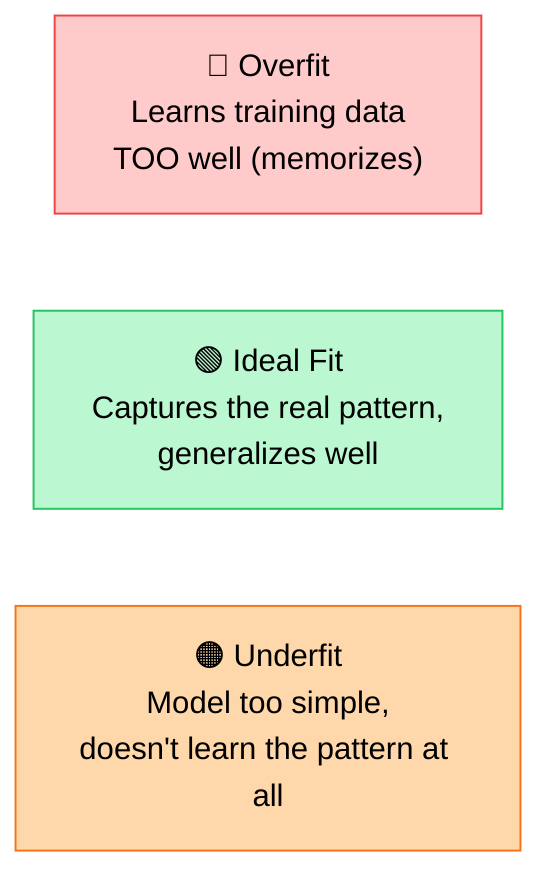
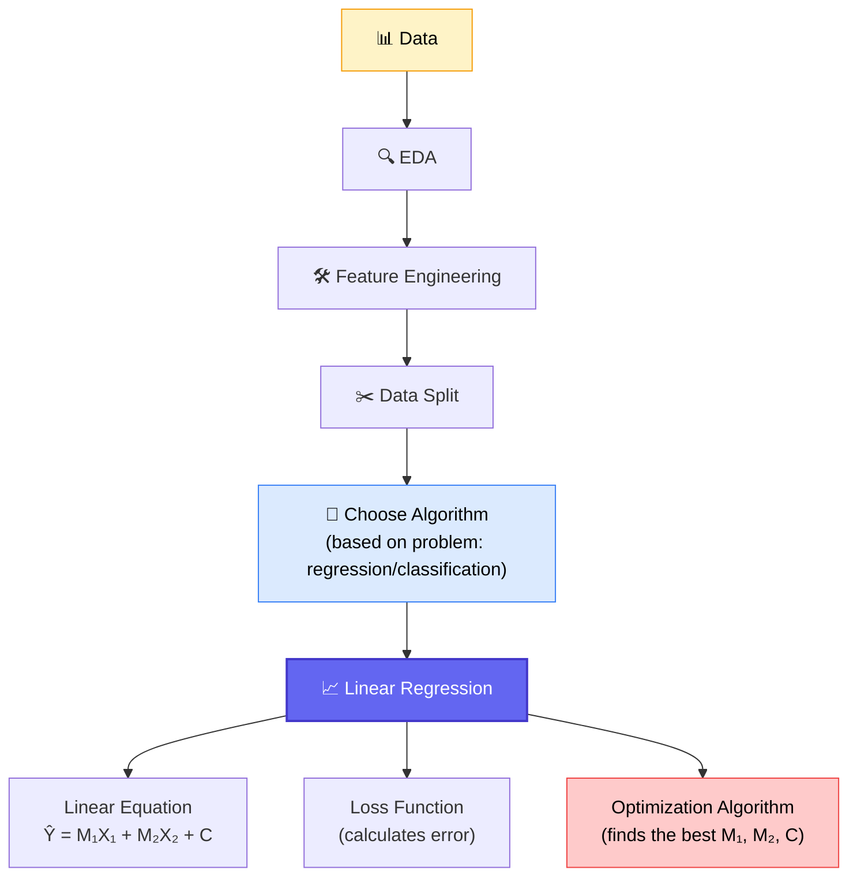
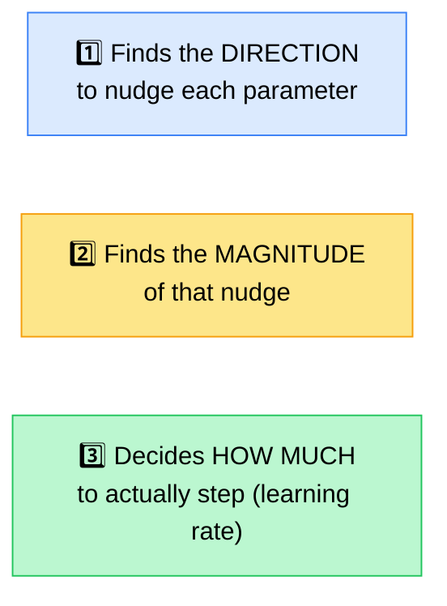
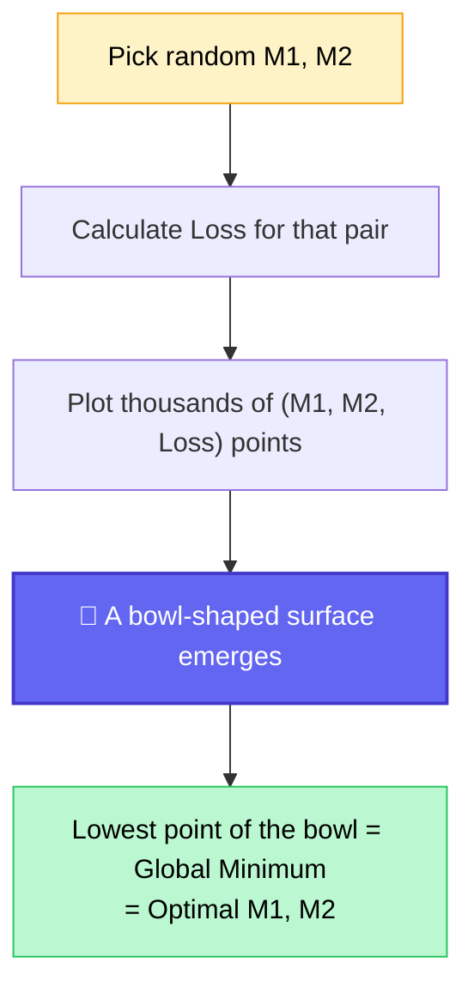
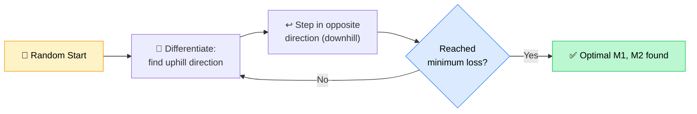
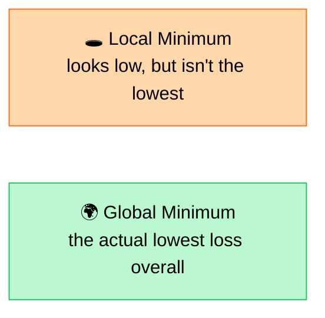

# 📊 Data Science Bootcamp — Evaluation, Equations & Optimization
### 📋 Live Class Notes — Precision/Recall Deep Dive, Linear vs Polynomial, Gradient Descent

**🎙️ Instructor:** Monal S
**⏱️ Duration:** ~4 hours (incl. break) | **🎯 Session Type:** Live Lecture + Extensive 1-on-1 Q&A

---

## 🧭 Where Today's Class Fits

> 💡 **Teaching philosophy shared today:** Instead of teaching evaluation, optimization, and algorithms all mixed together (like most YouTube tutorials), Monal is teaching each **building block separately first** (loss function → cost function → evaluation metrics → optimization algorithm) so that once actual ML algorithms (Linear Regression, SVM, etc.) begin, students already understand every component being reused.

---

## 🔁 Quick Recap — What Was Covered Before Today

| Concept | Key Idea |
|---|---|
| **Evaluation** | Happens in 2 places: (1) *while* the model is learning, (2) *after* the model has learned |
| **Loss Function** | Formula to calculate error for a single data point |
| **Cost Function** | Sum/aggregation of loss over *all* data points — the "total error" |
| **Overfit / Underfit / Ideal** | Comparing training vs validation accuracy tells us which state the model is in |
| **Regression Metrics** | MAE, RMSE, MSE, and Modified MSE (uses 1/2N instead of 1/N) |
| **Classification Metrics** | Needs a different approach since outputs aren't continuous — hence the Confusion Matrix |

---

## 🎯 Deep Dive: Classification Evaluation Metrics

### The Confusion Matrix, in Plain English

| Case | Meaning | Example (Spam Detection) |
|---|---|---|
| ✅ **True Positive (TP)** | Actual = positive, Predicted = positive | Actual spam → predicted spam |
| ✅ **True Negative (TN)** | Actual = negative, Predicted = negative | Actual not-spam → predicted not-spam |
| ❌ **False Negative (FN)** | Actual = positive, Predicted = negative | Actual spam → predicted not-spam (**missed it**) |
| ❌ **False Positive (FP)** | Actual = negative, Predicted = positive | Actual not-spam → predicted spam (**false alarm**) |

### The Formulas

**Worked example (spam dataset):** Model predicted 700 "spam" total, of which 600 were truly spam → **Precision = 600/700**. Actual spam total was 900, of which the model caught 600 → **Recall = 600/900**.

### Visual Intuition: Two Detection Models

| | Model 1 | Model 2 |
|---|---|---|
| **Behavior** | Misses some real detections | Detects everything, but also flags empty space |
| **Failure Type** | High **False Negatives** | High **False Positives** |
| **Metric it hurts** | Low **Recall** | Low **Precision** |
| **Best used for...** | Cases where a false alarm is cheap | Cases where **missing** a positive is dangerous (e.g. cancer detection) |

> ⚠️ **There is always a trade-off:** a model will either have *high recall + low precision*, or *high precision + low recall*. A model that scores high on **both** is rare and depends heavily on data quality — not something to expect by default.

### Precision–Recall Trade-off via Threshold

**Why this matters for cancer detection:** A false negative (telling a cancer patient they're clear) is far more harmful than a false positive (sending a healthy patient for extra tests). So for high-stakes screening problems, engineers deliberately **lower the threshold** to boost recall, accepting more false positives as the trade-off. *This decision is made by the ML engineer based on the problem statement — the model itself is static once trained.*

---

## 📐 Linear vs Polynomial Equations

| | 📏 Linear Equations | 🌊 Polynomial Equations |
|---|---|---|
| Highest exponent | **1** | **≥ 2** |
| Graph shape | Straight line | Curves — peaks, valleys, U-shapes |
| Examples | `y = mx + c`, `2x − 4y = 8` | `y = x² + 3x + 2` (quadratic), `x³ − 4x² + x − 5` (cubic), degree-4 = quartic |
| Behavior far from training data | Extends predictably in the same direction | Can **abruptly shoot to ±infinity** outside the observed range |
| Best for | Data that's genuinely straight-line shaped | Data with real curvature |

> 🎯 **Key insight from the practical demo:** A polynomial curve can fit the training data beautifully, but immediately outside that range it can rocket to an unrealistic value for any new/unseen data point. A straight line, even if a slightly worse fit, stays far more **stable for unseen data** — this is exactly why linear regression is usually tried first before reaching for higher-degree polynomials.

### Overfitting, Underfitting & Ideal Fit

- **Overfitting** = the model memorizes the training data instead of learning the underlying pattern (training error ≈ 0, but test performance collapses).
- **Underfitting** = the model fails to learn even the training data's pattern (e.g., predicts "cat" for a dog image).
- **With outliers present**, a simpler (more linear) model is usually safer — it won't distort itself trying to accommodate one extreme point the way a high-degree polynomial will.
- Both overfit and underfit are "bad," but when forced to choose, **prefer whichever model demonstrates it has learned *some* real pattern** over one that hasn't learned anything at all.

---

## 🚀 Today's Main Topic: Why We Need Optimization Algorithms

### The ML Pipeline So Far

### The Manual (Human) Way — And Why It Fails

Monal walked through manually guessing values of M1, M2, calculating Ŷ, comparing to actual Y, computing error, and then randomly trying a *different* set of values to see if the total cost went up or down.

| Problem With Manual "Hit and Trial" | Why It Breaks Down |
|---|---|
| **No direction** | We don't know for sure whether increasing or decreasing M1/M2 will reduce error |
| **No idea how much to move** | Even if the direction is right, the step size is a guess |
| **Doesn't scale** | With 2 parameters it's tedious; with 40 features (like in real datasets), it's practically impossible by hand |

> 🗣️ *"For a single, perfect linear equation, we have to do this much manual work — and this is what an Optimization Algorithm solves."* — Monal S

### What an Optimization Algorithm Actually Does

---

## ⛰️ Gradient Descent — The Core Algorithm

### Visualizing the Loss Landscape

For every possible pair of (M1, M2), there is a corresponding total loss. Plotting **thousands** of these combinations creates a 3D "bowl" shape — this is called the **contour of the loss function**.

> This contour shape depends on **two things only**: the **data** itself, and the **loss function** chosen. Change either one, and the shape of the bowl changes.

### How Gradient Descent Navigates the Bowl

| Step | What Happens |
|---|---|
| 🎯 **Goal** | Find the minimum loss point |
| 📐 **Method** | Uses **differentiation** to calculate the *slope* of the cost function at the current position |
| ⬆️ **Slope tells us** | The direction of **steepest ascent** (uphill) |
| ⬇️ **Then we move** | In the exact **opposite** direction → steepest descent (downhill) |
| 🔁 **Repeat** | Find hill → step opposite → find hill → step opposite → until the bottom is reached |

### The Learning Rate — Controlling Step Size

> 🏍️ **Analogy used in class:** *"Your bike can hit 240 km/h, but if you only need to travel 40 meters, will you drive at full speed? No — you'll overshoot your stop. Gradient descent tells you a direction and a raw magnitude, but we scale that magnitude down (e.g., use only 0.01% of it) so we take small, controlled 'baby steps' instead of overshooting the minimum."*

- This scaling factor is called the **learning rate**.
- **Big steps** → faster movement, but risk of jumping past the minimum repeatedly without ever settling.
- **Small steps** → slower, but far more precise convergence.
- In basic Gradient Descent, the learning rate is a **constant**. Advanced optimizers (Adam, AdaGrad, etc. — covered later in Deep Learning) make it **adaptive**, shrinking automatically as the model gets closer to the minimum.

### Global Minimum vs Local Minima

For simple/convex data, there's just one bowl shape (one global minimum). But for complex, real-world datasets, the loss surface can have **multiple valleys**:

Plain Gradient Descent can get "stuck" in a local minimum. This is one reason more advanced optimizers exist.

### Batch Size Variants of Gradient Descent

| Variant | How It Updates Parameters |
|---|---|
| **Batch Gradient Descent** | Uses the *entire* dataset (e.g., all 100,000 rows) before each parameter update |
| **Mini-Batch Gradient Descent** | Updates parameters after each smaller batch (e.g., every 1,000 rows) |
| **Stochastic Gradient Descent (SGD)** | Updates parameters after *every single row* (batch size = 1) |

---

## 🧠 Analogies Used to Build Intuition

| Analogy | Concept It Explains |
|---|---|
| 🏍️ Bike at 240 km/h for a 40m trip | Why we scale down the gradient with a learning rate |
| 🎯 Detecting people in photos (2 models) | Precision vs Recall trade-off |
| 🩺 Cancer screening threshold | Why recall matters more when false negatives are dangerous |
| 🥣 3D bowl / contour plot | The loss surface across all parameter combinations |
| 🍎🍌🍉 Apple/Banana/Watermelon/Muskmelon errors | Why squaring errors (MSE) prioritizes fixing the *biggest* mistakes first |
| ⛰️ Hills and valleys | Steepest ascent (uphill) vs steepest descent (downhill) |

---

## ❓ Live Q&A Highlights

| Student | Question | Answer |
|---|---|---|
| **Sandip** | How do we decide which model (linear, SVM, etc.) fits our data? | Feature engineering checks feature–target *relationships* to pick good features — it does **not** decide the algorithm. Instead, try multiple algorithms and compare accuracy directly. |
| **Sandip** | How do we know the model will generalize to the full population, not just train/test? | You can't fully guarantee it without real-world labels. After deployment, monitor for distribution drift between original training data and incoming production data — retrain if it's shifted. |
| **Rachna** | Why do we add a dummy `X0 = 1` column? | Purely for vectorized matrix multiplication — it lets the intercept term (M0/C) be included in the same matrix operation as M1, M2, etc. |
| **Rachna** | Is the "uphill" calculation just an average of losses? | No — it's a **derivative**, which gives a mathematical direction of change, not a simple average. |
| **Santosh** | Why would the model ever move "uphill" again after finding a good point? | Because complex, real datasets can have **multiple valleys** (local minima) — the model can get stuck in a local minimum instead of the true global minimum. |
| **Aditya** | How does the algorithm decide how big a step to take? | Explained via the bike-speed analogy — large steps move fast but overshoot; small steps (low learning rate) are slower but far more precise. |
| **Aditya** | Does this get harder with huge feature counts (like images)? | Yes — a single 512×512 color image already has ~786,000 pixel values. At that scale, simple Gradient Descent isn't enough; this is exactly where Deep Learning and more advanced optimizers take over. |
| **Partha** | How do you handle a non-technical client who expects "AI magic" with perfect accuracy? | Sometimes you make pragmatic (if imperfect) trade-offs — e.g., lowering a detection threshold to satisfy an urgent client demo — while planning faster model-improvement cycles afterward. |
| **Partha** | How does non-linearity emerge in Deep Learning if each node is just `Y = MX`? | Each node is a linear function, but **activation functions** (e.g., sigmoid) introduce non-linearity, letting combinations of simple linear nodes model complex, non-linear patterns. |
| **Sirijyo (Jyoti)** | Does the "threshold" concept apply to regression too? | No — thresholds apply to **classification** (probability-based outputs). Regression outputs are continuous numbers, not probabilities. |
| **Sirijyo (Jyoti)** | With outliers present, should we prefer an overfit or underfit-leaning model? | Prefer the **simpler** model — it won't distort itself chasing one extreme outlier the way a complex/overfit model will. |
| **Misha Verma** | How do you decide linear vs. polynomial in practice? | In real projects, you rarely fix one model manually — you train **several algorithms in parallel** (Linear Regression, SVM, XGBoost, etc.) and pick whichever gives the best test accuracy. |
| **Misha Verma** | Why square the error (MSE) instead of just using RMSE from the start? | Squaring **inflates larger errors** disproportionately, effectively telling the optimization algorithm to prioritize fixing the biggest mistakes first. RMSE is mainly used afterward to interpret performance in original units. |
| **Misha Verma** | What's the fix when a model is under/overfitting? | First verify train/test data have a similar distribution (fix sampling if not). If the issue persists, increase model complexity so it can actually capture the pattern. |

---

## ✅ Action Items for Learners

- [ ] 🔁 Revisit precision, recall, and F1 score — focus especially on the **trade-off** and threshold example
- [ ] 📐 Review linear vs. polynomial equations and *why* polynomials can be unstable outside the training range
- [ ] ⛰️ Re-watch the gradient descent section if any part felt overwhelming — it's one of the most conceptually dense topics in ML
- [ ] 🧮 Come prepared for **Wednesday's class** — it will cover the mathematical derivation (differentiation) behind gradient descent
- [ ] 🐍 No Python implementation yet — that comes once the intuition is locked in
- [ ] 📝 Complete pending assignments before the next session

---

*📝 Notes compiled from the full live class transcript — Data Science Bootcamp, "Evaluation Metrics, Equations & Gradient Descent" session.*
