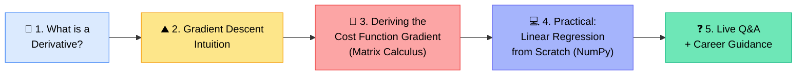
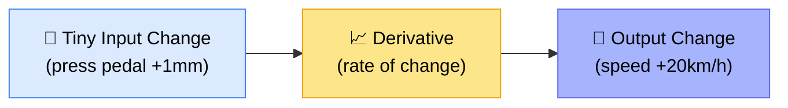
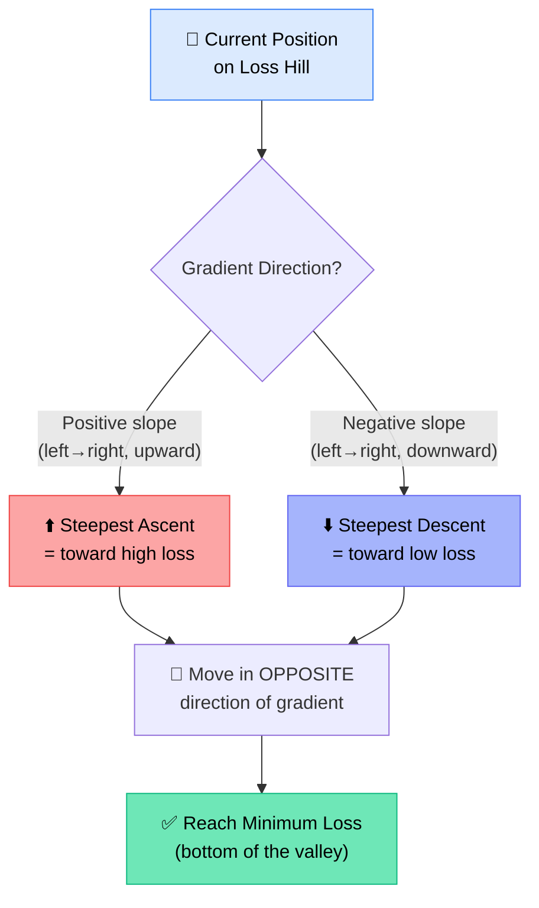
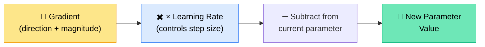
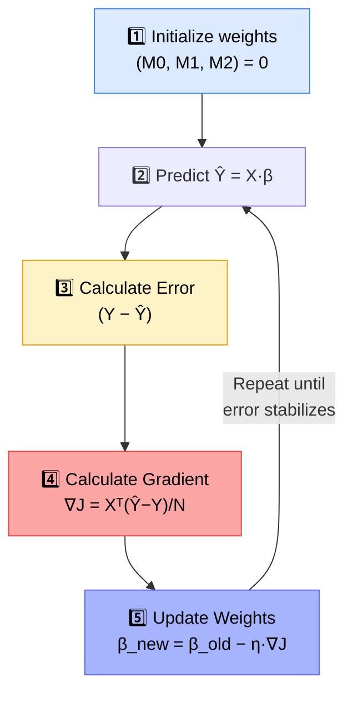

# 📐 Machine Learning 4 — Derivatives, Gradient Descent & Linear Regression from Scratch

---

## 🧭 Session Roadmap



> ⚠️ **Note:** Class started ~15 minutes late due to audio/video lag issues (Zoom link visibility problems, mic noise). Instructor used NVIDIA Broadcast for noise removal throughout.

---

## 🎯 What Is a Derivative? (The Accelerator Pedal Analogy)

The instructor built intuition from scratch — no formulas memorized, only "why."

> _"A derivative measures the instantaneous rate of change of a function — it tells us exactly how fast output changes for a tiny change in input."_

### 🚗 Core Analogy: Car Accelerator Pedal

| Concept     | Car Analogy                                                                 |
| ----------- | --------------------------------------------------------------------------- |
| Input (X)   | How much you press the accelerator pedal                                    |
| Output      | Speed of the car                                                            |
| Derivative  | How much speed changes for a tiny press change                              |
| Key insight | A 1mm press ≠ 1mm of speed — the _relationship_ is what derivative captures |



### 🧮 Manual Derivation (from First Principles)

Worked example using **f(x) = 3x² + 5**:

1. Nudge input: `x → x + h`
2. Expand: `3(x+h)² + 5 = 3x² + 6xh + 3h² + 5`
3. Change = New output − Old output = `6xh + 3h²`
4. Rate of change = Change ÷ h = `6x + 3h`
5. As **h → 0**: Rate of change = **6x**

✅ **Conclusion:** The derivative of `3x² + 5` is `6x` — this tells you the _slope_ at any point X.

---

## 🌄 Partial Derivatives — Multiple Parameters

When a function has more than one variable (e.g., `f(x,y) = 3x² + 5xy + y³`), a single derivative isn't enough — you need **partial derivatives**, one per variable.

| Analogy                            | Explanation                                        |
| ---------------------------------- | -------------------------------------------------- |
| 🚗 One pedal                       | One variable → simple derivative                   |
| 🚗🚗 Two pedals (front/back wheel) | Two variables → partial derivatives (∂f/∂x, ∂f/∂y) |

**Example:** For `f(x,y) = 3x² + 5xy + y³`:

- ∂f/∂x = 6x + 5y
- ∂f/∂y = 5x + 3y²

At (x=1, y=2): gradient = **(16, 17)** → meaning "move 16 steps right, 17 steps up" to reach the steepest ascent (top of the hill).

> 💡 **Gradient = Derivative = Rate of Change** — all the same concept, just extended to multiple dimensions.

### 🏔️ Real-World Example: BMI

`BMI = Weight / Height²` — Height is treated as **constant** (doesn't change day-to-day), so only the partial derivative with respect to Weight matters:

```
∂BMI/∂W = 1/Height²  →  1/(1.8)² = 0.309
```

**Interpretation:** If weight increases by 1 unit, BMI increases by ~0.309 (30.9%).

---

## ⛰️ Ascent vs. Descent



> 🎓 **Key Rule:** Gradient always points toward the steepest **ascent** (uphill/high loss). Since our goal is minimum loss, we always move in the **opposite** direction (subtract the gradient).

---

## 🧮 Deriving the Gradient of the Cost Function (Matrix Calculus)

The instructor derived the **Modified Mean Squared Error (MSE)** gradient fully, using vectorized (matrix) notation.

### Starting Point

```
J(β) = 1/(2N) · (Y − Xβ)ᵀ(Y − Xβ)
```

### Rules Applied

| Rule                              | Formula                                  |
| --------------------------------- | ---------------------------------------- |
| Rule 1 (Transpose of subtraction) | (A − B)ᵀ = Aᵀ − Bᵀ                       |
| Rule 2 (Transpose of product)     | (AB)ᵀ = BᵀAᵀ                             |
| Scalar Rule                       | A scalar always equals its own transpose |
| Reversal Property                 | (ABC)ᵀ = CᵀBᵀAᵀ                          |
| Derivative of constant            | d(1)/dX = 0                              |
| Derivative of Aᵀx                 | d(Aᵀx)/dx = A                            |
| Derivative of xᵀAx                | d(xᵀAx)/dx = Ax + Aᵀx                    |

### Final Derived Gradient

```
∇J(β) = (1/N) · Xᵀ(Ŷ − Y)
```

✅ In **Python/NumPy**:

```python
gradient = (X.T @ (y_pred - y)) / N
```

> 🗝️ **Instructor's reassurance repeated throughout:** _"You don't have to remember any of this formula. Just understand the intuition — this is not a calculus class."_

---

## 🎛️ The Learning Rate

Gradient gives you **direction + magnitude** (how far to jump). But taking the _full_ jump is dangerous — so we scale it down:

```
step = gradient × learning_rate
new_parameter = old_parameter − step
```



- **Smaller learning rate** → slower, more precise
- **Larger learning rate** → faster, riskier (can overshoot)

---

## 💻 Practical: Linear Regression from Scratch (NumPy Only)

### Dataset Setup

```python
import numpy as np

X = np.array([
    [1, 1, 0],
    [1, 2, 1],
    [1, 3, 2],
    [1, 4, 3],
    [1, 5, 4],
    [1, 6, 4]
])  # Column of 1s + years_experience + completed_projects

y = np.array([39, 47, 56, 68, ...])  # salary (target)

beta = np.zeros(3)      # [M0, M1, M2] initialized to 0
learning_rate = 0.01
N = len(y)
```

### Gradient Descent Loop

```python
for i in range(1000):
    y_pred = X @ beta.T
    error = y - y_pred
    gradient = (X.T @ (y_pred - y)) / N
    beta = beta - learning_rate * gradient
```

### Prediction Function

```python
def prediction_method(years_of_experience, completed_projects):
    salary_predicted = (1 * M0) + (years_of_experience * M1) + (completed_projects * M2)
    print("Predicted salary is:", salary_predicted)
```

### 📊 Full Algorithm Flow (What to Say in Interviews)



> 🏆 **Instructor's key teaching point:** _"This is what you need to explain in an interview — not the calculus derivation, just this 5-step flow."_

### 🛑 When to Stop Iterating?

Libraries handle this internally, but manually you'd:

1. Store the last 5 iteration errors
2. Check the % difference between consecutive errors
3. If error isn't decreasing beyond a threshold → **stop** (learning is complete)

---

## 📊 Complexity Self-Rating

| Metric                                     | Instructor's Rating                  |
| ------------------------------------------ | ------------------------------------ |
| Full calculus derivation (matrix calculus) | 🔴 9–10 / 10 (hardest possible)      |
| Actual algorithm to _implement_            | 🟢 2–3 / 10 (very simple, 5–6 lines) |

> 💬 _"Calculus itself is already level 10 — the hardest you can get. But if I ask you to write linear regression without derivatives, this is only 2 or 3 lines of logic."_

**Instructor's advice:** It's 100% fine to skip the full derivation if it feels overwhelming — just remember:

1. The derivative of the loss function (Python-implementation level)
2. The weight update formula: `new = old − learning_rate × gradient`

---

## 💼 Career & Certification Advice (Q&A Highlights)

| Question                                                                   | Instructor's Answer                                                                                                                                                                                                       |
| -------------------------------------------------------------------------- | ------------------------------------------------------------------------------------------------------------------------------------------------------------------------------------------------------------------------- |
| Are Claude/Anthropic AI certifications valuable for AI engineers?          | Not particularly — they're aimed at **non-tech managers/freshers** wanting to show AI familiarity. For an AI engineer, having a "Claude Code certification" isn't impressive; **projects** matter more than certificates. |
| Should I pay for certifications?                                           | Only if a company sponsors/reimburses it. Paying $200–300 out-of-pocket for something like AWS certs is discouraged unless it's genuinely useful and free/cheap options aren't available.                                 |
| How do I improve at exploratory data analysis (EDA) / feature engineering? | No shortcut — comes from **iteration and exposure**. Practice with Kaggle datasets (they include column explanations). Combine 3 skill types: programming, business understanding, domain expertise.                      |
| Career transition advice (non-tech background wanting to re-enter tech)    | Don't wait for "complete" skills before job hunting — the market moves faster than any syllabus. Get into _any_ relevant role first, then upskill and pivot internally or switch companies.                               |
| Is a no-code AI path a good fit?                                           | No-code is best suited for **business leaders/non-technical managers** who need conceptual understanding, not for someone building deep technical expertise.                                                              |

### 🏗️ Bonus: Rachana's RAG Agent Project Advice

For a KT (Knowledge Transfer) document Q&A agent with diagrams + text:

1. Use a **simple RAG** workflow (MCP/agents are overkill here)
2. **Parse documents before ingestion** — separate text vs. images
3. For diagrams/flowcharts: use OCR + pass image to a **multimodal LLM** for logical flow reconstruction
4. Automatically re-trigger ingestion when the source document updates
5. 🔑 **Golden rule:** _"Before RAG, your data should be ready. If ingestion is wrong, RAG output will be wrong."_

---

## ✅ Action Items for Learners

- [ ] 🐍 Complete basic Python (loops, conditions) — OOP not required yet
- [ ] 📊 Learn **NumPy** (1-hour YouTube crash course recommended) before next class
- [ ] 🐼 Learn **Pandas** basics before next class
- [ ] 🔁 Revise today's derivative & gradient descent notes — don't stress if matrix calculus wasn't 100% clear
- [ ] 🧠 Memorize only 2 things: (1) derivative of the loss function in code form, (2) the weight update formula
- [ ] 📼 Ask academy team for transcripts to be uploaded going forward
- [ ] 💼 For career-transition learners: prepare resume + local market research to discuss 1:1 with instructor

---

## 🗒️ Key Formulas Cheat-Sheet

| Concept                      | Formula                      |
| ---------------------------- | ---------------------------- |
| Basic derivative definition  | lim(h→0) [f(x+h) − f(x)] / h |
| Cost Function (Modified MSE) | J(β) = 1/(2N) · Σ(Y − Ŷ)²    |
| Gradient of Cost Function    | ∇J(β) = (1/N)·Xᵀ(Ŷ − Y)      |
| Weight Update Rule           | β_new = β_old − η · ∇J(β)    |
| Prediction                   | Ŷ = Xβ                       |

---

_📝 Notes compiled from the full class transcript — Machine Learning 4: Derivatives, Gradient Descent & Linear Regression, Krish Naik Academy._
