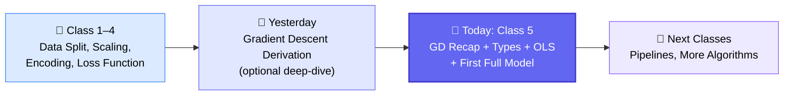
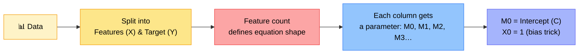
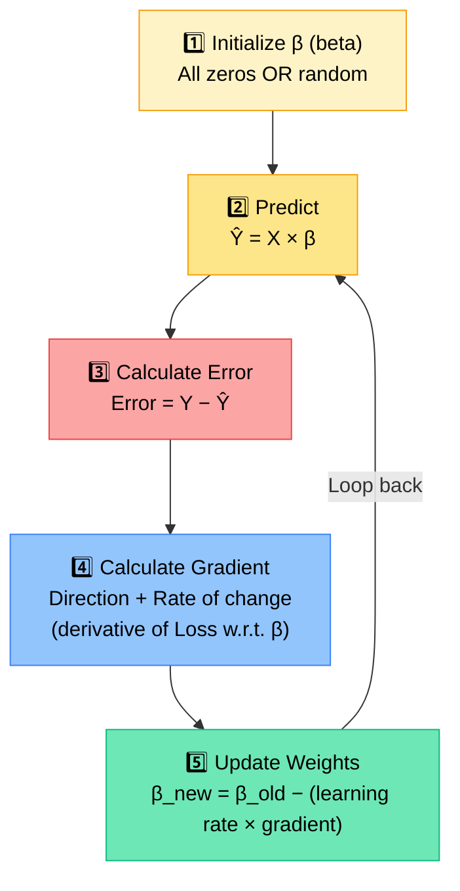
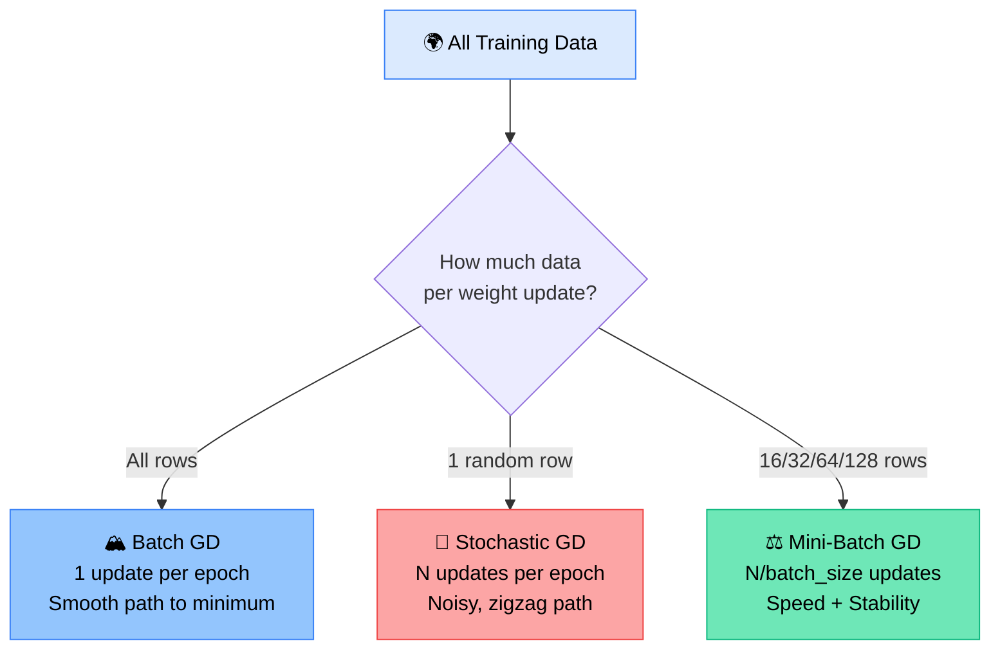
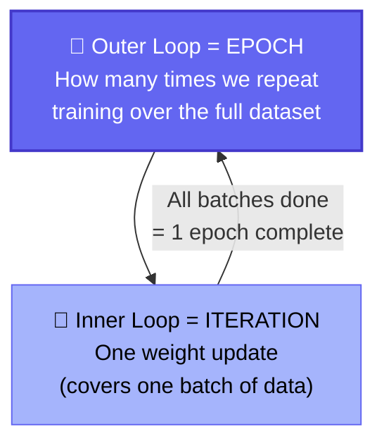
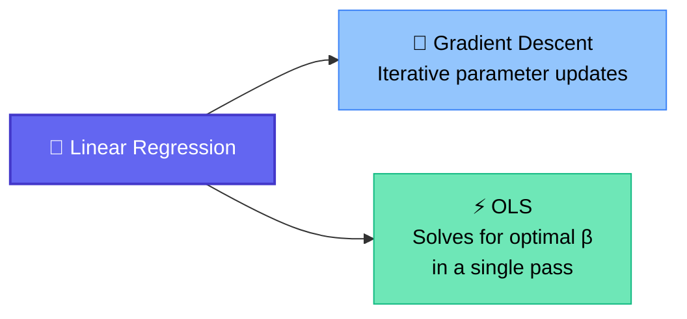
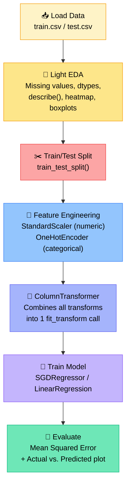
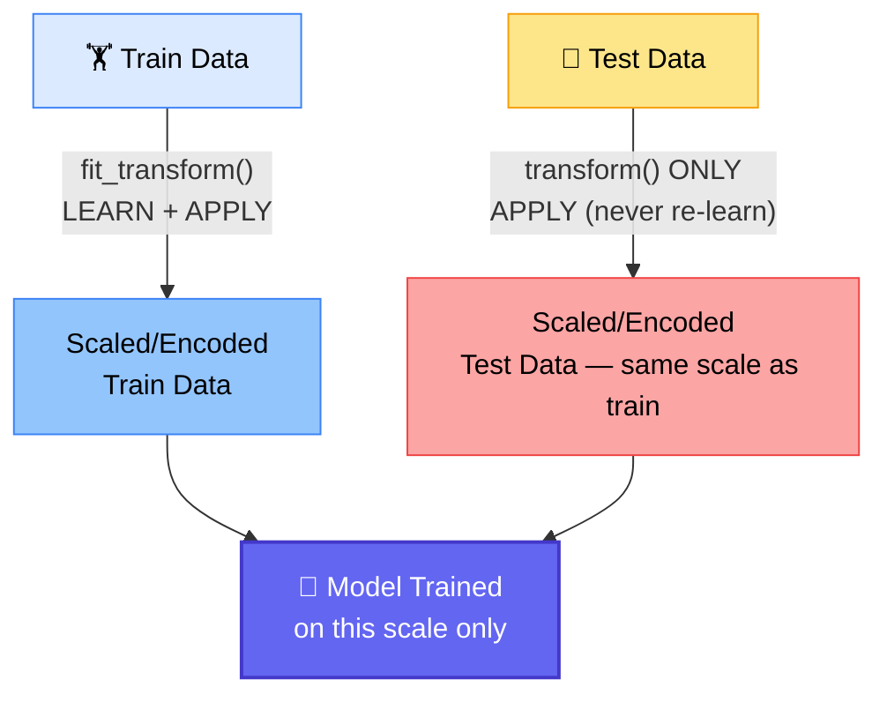

# 📐 Machine Learning — Class 5
### 📋 Gradient Descent Deep-Dive, OLS & Boston Housing Practical — Krish Naik Academy

**🎙️ Speakers:** Monal S (Lead Mentor — main instructor) & Krish Naik (Founder — joined mid-session for wrap-up + live Q&A)
**📅 Date:** Sunday, 7 June 2026 | **⏱️ Duration:** ~4 hours 20 minutes | **🎯 Session Type:** Live Class + Open-Mic Doubt Round

---

## 🧭 Where This Class Sits

This is **Class 5 of the Machine Learning module**, sitting right after the batch had its first hands-on brush with the maths behind linear regression. Monal opens by reassuring the room that **yesterday's calculus was optional depth, not a requirement** — the real deliverable is intuition, not derivations.



> 💡 **Golden rule repeated all class:** *"Don't remember the derivation, remember the flow."* You need to be able to say **what gradient descent does**, not re-derive it on a whiteboard.

---

## 🗓️ Admin Notes

| Item | Detail |
|---|---|
| 📼 Recording tool | Fireflies.ai is used for auto-transcription (visible in Zoom notifications) |
| 🔗 Zoom link issue | Reported missing from the Krish Naik Academy website — team to be notified |
| 📝 Transcripts | Already available in the **Resource section** even when links go missing |
| 📅 Wednesday class | **No class this Wednesday** — alternate-week schedule (make-up from a missed sick day) |
| 🧑‍🏫 Mentor rotation | Monal teaches ML; Deep Learning will be handed off to **"Paul sir"** — different mentors bring different industry flavors on purpose |
| 📊 Pace note | This batch feels "behind" UDS1 only because classes are more frequent — not actually behind |

---

## 🧠 Part 1 — Gradient Descent, Properly Recapped

### 🎯 The Goal of Linear Regression

> Linear regression exists **to understand the pattern in data using a linear equation.**



### 🔁 The 5-Step Algorithm (this is the part to memorize for interviews)



> 🔑 **Steps 2 → 5 run in a loop.** Step 1 happens once. Everything else — the math of *how* the gradient is derived — is background detail you can look up, not something to reproduce in an interview.
>
> **Interview line to remember:** *"Gradient is nothing but the derivative of the loss function with respect to the parameters (beta)."* That's it — you don't need to re-derive it live.

---

## 🌀 Types of Gradient Descent

All three types run the **exact same algorithm** above. The only thing that changes is **how much data is looked at per weight update.**

| Type | Data used per update | Nickname | Behavior | Best for |
|---|---|---|---|---|
| 🏔️ **Batch GD** | All data at once | "Vanilla" / default | Smooth, stable — like averaging exam scores of a whole class | Small/medium data that fits in memory |
| 🎲 **Stochastic GD (SGD)** | One random row | — | Zigzag / noisy, but fast, memory-light, avoids overfitting, finds more generalized solutions | Very large datasets, deep learning |
| ⚖️ **Mini-Batch GD** | A batch (16 / 32 / 64 / 128…) | Middle ground | Faster than Batch, more stable than SGD | Deep learning — the industry default |



### 🍎 Why Batch Size Even Matters — The RAM Reality Check

Monal ran the numbers live: one 540×540×3 image in `int8` ≈ **0.83 MB**. For a dataset of **100,000 images**, that's:

> 0.83 MB × 100,000 = **~83 GB** — far more than most machines have in RAM.

That's *why* mini-batch and stochastic methods exist: **if you can't fit all the data in memory, you can't even compute `X × β` in one shot**, let alone the gradient. Batch size becomes a hardware constraint, not just a modeling choice.

---

## ⏱️ Epoch vs. Iteration (the jargon everyone mixes up)

> 🍏 **Analogy used in class:** *"If I have 160 apples and can only eat 16 at a time, I need 10 turns to finish them all. If I want to repeat that whole process 11 more times, that outer repeat is the epoch."*



| Gradient Descent Type | Iterations per Epoch (for 160 rows) |
|---|---|
| Batch GD | **1** iteration (all 160 rows in one go) |
| Mini-Batch (size 16) | **10** iterations |
| SGD (size 1) | **160** iterations |

> ⚠️ **Practical reassurance:** Modern ML/DL libraries implement **early stopping** — even if you set 100,000 epochs, training halts automatically once metrics stop improving. Picking the "perfect" epoch count is not something you need to agonize over in practice.

**Training-time reality check shared from experience:**
- 🧮 Classic ML models: minutes to ~1–2 hours
- 🖼️ A Super-Resolution GAN (personal project): **3 days** on a local machine
- 🤖 Large Language Models: **2–3 months** on hundreds of cloud GPUs

---

## 🧮 Part 2 — Ordinary Least Squares (OLS): The Other Way to Do Linear Regression

Gradient Descent isn't the only route to a trained linear regression model. OLS is a **closed-form solution** — no looping required.



### ⚖️ Gradient Descent vs. OLS

| | 🔁 Gradient Descent | ⚡ OLS |
|---|---|---|
| Approach | Iterative, parameter updates over many passes | Closed-form — one calculation |
| Formula | β_new = β_old − α·gradient | **β = (XᵀX)⁻¹ XᵀY** |
| Loss function | Modified MSE (1/2N · Σ(Y−Ŷ)²) | Simple Sum of Squared Errors: Σ(Y−Ŷ)² |
| Speed on small data | Feels like "cutting an apple with an axe" — overkill | Fast, elegant, exact |
| Large datasets / many features | ✅ Scales well | ❌ Expensive — matrix transpose + inverse is computationally heavy |
| Best for | Medium–large datasets | Small–medium datasets |
| Scikit-learn class | `SGDRegressor` (does gradient-descent-style regression) | `LinearRegression` (uses OLS by default) |

> 🥥 **Analogy used in class:** *"OLS is a knife — great for an apple, but you can't cut a coconut with it. Gradient descent is an axe — it can cut anything, but it's overkill for something small."*

### 🧾 The OLS Derivation (walked through, but "don't memorize the steps — just trust the destination")

1. Cost function: **(Y − Xβ)ᵀ(Y − Xβ)**
2. Expand: **YᵀY − 2βᵀXᵀY + βᵀXᵀXβ**
3. Differentiate with respect to β and set to **0**
4. Solve: **−2XᵀY + 2XᵀXβ = 0**
5. Final closed-form result: **β = (XᵀX)⁻¹ XᵀY**

> ✅ Notice: **there's no error term or learning rate anywhere in the final formula.** That's exactly why OLS needs no iteration — calculus already found the optimum directly.

---

## 🏗️ Part 3 — Hands-On: Predicting Boston Housing Prices

After the break, the class built a full pipeline end-to-end on the classic **Boston Housing dataset** (506 rows, 14 columns; target = `MEDV`, median home value in $1,000s).



### 📌 Working Philosophy for Iteration 1

> *"At the start, we don't do heavy outlier removal or feature engineering. Keep iteration 1 simple. If a simple model already gives 98% accuracy, why add overhead?"*

For a clean, mostly-numeric dataset like Boston Housing, deep EDA was intentionally skipped — the class's real focus was the **machine learning workflow**, not exploratory analysis.

### 🔑 The Most Important Lesson of the Practical: Fit vs. Transform

This is the one concept Monal stressed **must never be gotten wrong**:



| Method | Meaning | Use on |
|---|---|---|
| `fit_transform()` | **Learn** the parameters (e.g., min/max, mean/variance) **and apply** them | ✅ Train data only |
| `transform()` | **Apply** parameters already learned — no new learning | ✅ Test data only |

> ❌ **Never scale the whole dataset before splitting into train/test.** If you do, the scaler "sees" test data statistics (min/max/mean) before training even happens — this is **data leakage**, and it quietly inflates reported performance. *"People with 7–10 years of experience still make this mistake — it's taught wrong in a lot of places."*
>
> **Why it matters, concretely:** if train data spans 0–10 and test data spans 0–20, scaling each independently means the number "10" maps to a *different* scaled value in each set. The model only understands the scale it was trained on — feeding it a differently-scaled test set makes its predictions meaningless.

### 🧵 Why `ColumnTransformer`?

Without it, applying different transformations (scaling vs. encoding) to different columns means writing `fit_transform`/`transform` pairs over and over — this explodes quickly once you have many features needing different treatments (min-max here, standard scaling there, one-hot encoding elsewhere, target encoding somewhere else).

`ColumnTransformer` lets you declare, once:
> *"Apply **this** transformation to **this** set of columns"* — for every group — and then call `fit_transform` **one time** on train and `transform` **one time** on test.

### ⚙️ Model Setup Used

```python
model = SGDRegressor(
    max_iter=1000,       # epochs
    eta0=0.01,            # learning rate
    learning_rate='constant',
    random_state=5
)
model.fit(X_train_processed, y_train)   # "fit" = learn only, no transform needed for y
```

- `model.coef_` → learned M1, M2, M3… values
- `model.intercept_` → learned C (M0)
- Evaluated with `mean_squared_error(y_true, y_pred)` on both train and test
- Visualized with a line plot of **actual vs. predicted** values

### 📈 The Live Experiment: Does More Data Fix Underfitting?

| Change Made | Result |
|---|---|
| Test size = 20% (small test set) | Train/test MSE gap visible; test predictions noisier |
| Increased training iterations (1,000 → 10,000) | ❌ No meaningful improvement — **more training was never the bottleneck** |
| Test size changed to **30%** (more diverse split) | ✅ Train/test MSE gap shrank; actual-vs-predicted plot visibly tighter |

> 🎯 **Key takeaway:** *"Training for longer was never the issue — data quality and a more diverse/representative split was."* This is a lesson in diagnosing underfitting correctly before throwing more compute at a problem.

---

## 🚫 Common Mistakes Flagged in Class

| Mistake | Why It's Wrong |
|---|---|
| Scaling the **entire dataset** before train/test split | Leaks test-set statistics into training → invalid evaluation |
| Re-fitting the scaler/encoder on test data | Test data gets its *own* scale, which the trained model was never taught to interpret |
| Memorizing every optimizer's derivative (Adam, RMSprop, AdaGrad) | Only gradient descent's logic is expected — interviewers check understanding, not recall |
| Deep-diving into EDA/feature engineering before a baseline model exists | Wastes time if a simple first-iteration model is already good enough |

---

## ❓ Live Q&A Highlights (Open-Mic Round)

| Who | Question | Krish Naik's Guidance |
|---|---|---|
| **Prashanth** (7 yrs QA/SaaS, career switcher) | How to actually land a job after finishing the course? | Pitch an AI/agentic solution inside your *current* company first; build a portfolio that reads like a professional's, not a fresher's; never say "I have no relevant experience" — reframe it |
| **Partha** | Does random-row SGD work for time-series data? | No — time series needs order preserved; frameworks like PyTorch let you control data loading to avoid random shuffling |
| **Sirijyo** (former engineering lecturer) | Clarifying epoch/learning-rate/train-test-split conventions | Confirmed 0.01 is a solid default learning rate; split ratio (70-30, 80-20, 90-10) is flexible as long as the test set stays diverse |
| **Pradeep** | Can an agent pull status updates from Rally via a Teams voice bot? | Check first whether Teams/Rally expose the needed APIs — "AI needs hands" (i.e., tool access); also confirm the company will fund the API/token costs before pitching |
| **Shahul** | Why does he keep forgetting NumPy/Python concepts between sessions? | Completely normal without daily use; keep concise, evolving notes rather than rewatching full videos; even experienced practitioners "look things up," they don't memorize everything |
| **Misha Verma** | Confused on epoch vs. iteration across GD types; also worried about job prospects with zero experience (based in Toronto, Canada) | Re-walked the concept with a fresh 1,500-row example; on jobs — connected her directly with fellow student Partha (relocated from Alberta/Canada to Houston) to share first-hand Canadian job-market experience |
| **Deepak Yakkundi & Partha** | Deep-dive: why must scaling be fit on train only, never on the full dataset? | Detailed walkthrough with a 0–10 vs. 0–20 range example showing how re-scaling test data independently breaks the model's learned reference scale |
| **Partha** | How do you convert model predictions back to original units? | Only **X** is transformed — **Y stays in its original scale** since it's what the model is learning to predict; if you *do* transform Y, you must also implement your own inverse-transform function |

---

## ✅ Action Items for Students

- [ ] 🧠 Memorize the **5-step gradient descent algorithm** (Initialize → Predict → Error → Gradient → Update) — this is the interview-ready version
- [ ] 📝 Note the **one formula that matters for OLS**: β = (XᵀX)⁻¹ XᵀY — no derivation needed by heart
- [ ] 🔁 Get comfortable explaining **epoch vs. iteration** in your own words/analogy
- [ ] ⚠️ Internalize: **fit_transform on train, transform only on test** — never scale before splitting
- [ ] 💻 Re-run the Boston Housing notebook yourself; try changing `test_size` and `max_iter` to see the effects firsthand
- [ ] 🗓️ No class this Wednesday — use the gap to revise NumPy/Pandas fundamentals if rusty
- [ ] 💬 Post progress/doubts only via the official **Messages** tab / community — not ad-hoc groups
- [ ] 🔗 If job-hunting in a specific geography, share market context with mentors so guidance can be targeted (per Krish Naik's advice to Misha)

---

*📝 Notes compiled from the full class transcript — Machine Learning Class 5 (Gradient Descent, OLS & Boston Housing Practical), Krish Naik Academy.*
