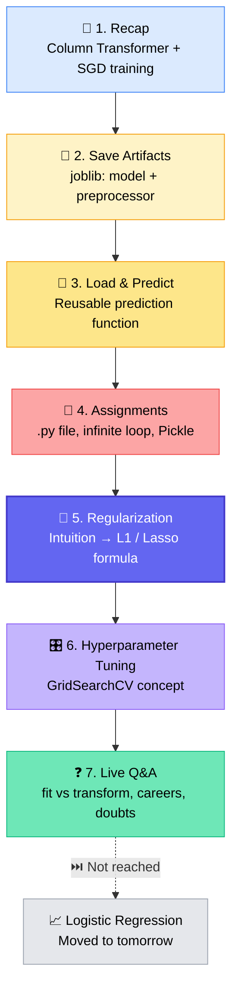
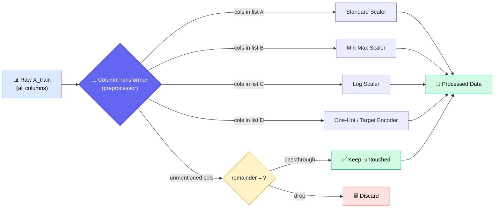
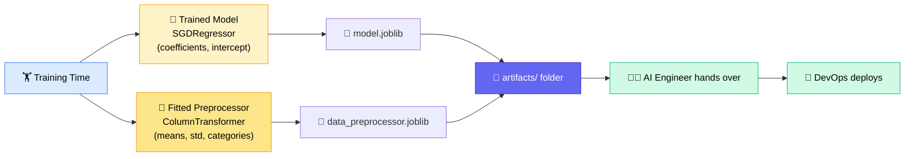
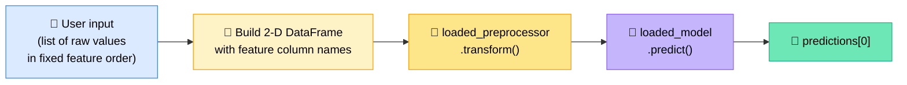
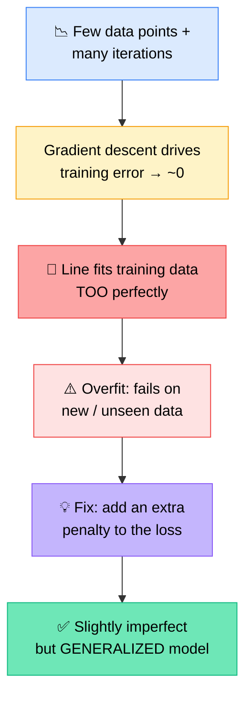
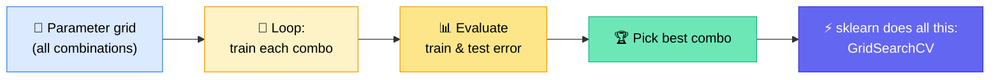
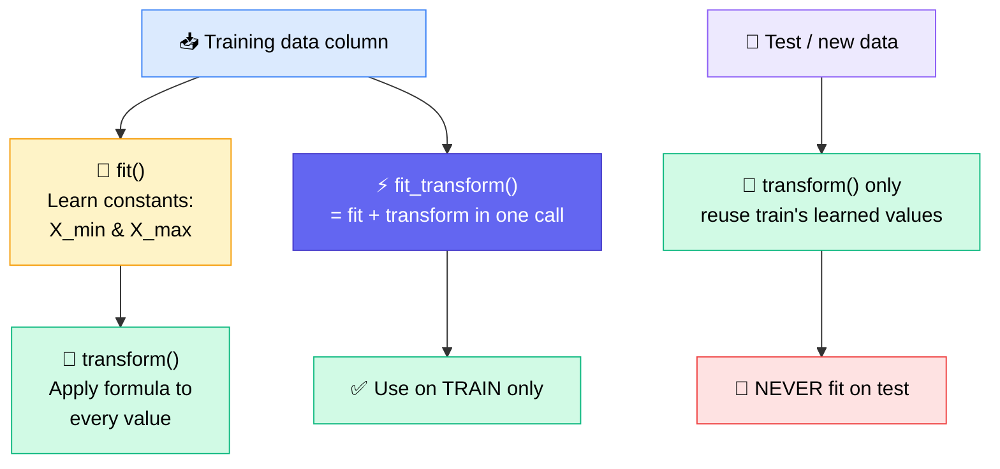

# 🤖 Machine Learning Class 6 (ML6)
### 📋 Lecture Notes — Column Transformer, Saving Artifacts, Regularization (L1 / Lasso) & Hyperparameter Tuning

**🎙️ Instructor:** Monal S (Lead Mentor, Krish Naik Academy)
**🙋 Student voices in Q&A:** Geetanjli Mathur · Gomathi Saranya · S. Jyothi · Amol · Deepak Yakkundi
**📅 Date:** 13 June 2026 | **⏱️ Duration:** ~4 hours (incl. ~20 min break) | **🎯 Session Type:** Concept Class + Live Q&A
**📚 Track:** Traditional route (ML → Deep Learning → GenAI → Agentic AI)

---

## 🧭 Today's Agenda

Monal opened with a quick pre-class industry chat, then laid out the plan: finish linear regression properly (Column Transformer recap + *how to save and reuse a trained model*), then spend the second half on **regularization**, one of the most important ideas in all of ML and deep learning.



> ⚠️ **Heads-up:** Logistic Regression (algorithm #2) was on the agenda but wasn't reached. It will be introduced in the next class, along with code.

---

## 🗞️ Pre-Class Industry Chatter (Quick Takeaways)

Before the official start, Monal and the students talked shop. Not exam material, but useful context:

| Topic | What was said |
|---|---|
| 🆕 **Claude Fable 5 launch** | A student flagged it; Monal saw a status message about a disruption and restoring access. He described it as a Mythos-class model that runs agent loops and workflows with multiple agents. His view: *"These updates are not going to change things."* Opus 4.6 / 4.7 already ran agentic loops. |
| 💸 **Token costs** | Claude Code / CLI burns lots of tokens; "you can hire 2 interns at that price." Many companies now cap tokens (e.g., ~$300/month per person, or push Teams Copilot / Cursor / VS Code Copilot). |
| 🎙️ **Speech-to-text** | Teams usually try several vendors but end up **self-hosting Whisper**: more control, batch-processing variants, cheaper. |
| 🏢 **AI in organizations** | Leaders want "agentic / AI" showcases even without fully understanding them; the industry is still figuring out what to do with AI. Tasks that took weeks now take hours, and management wants minutes. |
| 🏭 **Layoffs** | Plausible in IT; unlikely in manufacturing until AI **and** robots mature together. |
| 🔌 **MCP servers** | Everyone is building them, but Monal doesn't see them as a game-changer: most data already has a front-end dashboard, and tool-calling can create non-standardization and disconnect you from your own team. |

---

## 🔁 Part 1 — Recap: Column Transformer & Model Training

### 🧩 The Problem It Solves

Imagine 8 features, each needing a *different* treatment:

| Features | Type | Treatment |
|---|---|---|
| X1, X2 | Numerical | Standard Scaling |
| X3, X5 | Numerical | Min-Max Scaling |
| X4, X6 | Numerical | Log Scaling |
| Categorical (2 cols) | Categorical | One-Hot Encoding |
| Categorical (1 col) | Categorical | Target Encoding |

**Without** Column Transformer: each group needs its own object, a `fit_transform` on train and a `transform` on test → **~3 lines × 5 groups = 15 lines**, scattered across many cells.

**With** Column Transformer: define a list of `(name, object, columns)` mappings **once**, then call `fit_transform` **once**.



### 🔑 Key Points
- ✅ It is **not magic**: it doesn't make the model faster or better, just makes code **cleaner, more standard, more readable**.
- ✅ The first tuple element (name) is just a label for your own use. **Order matters**: `(name, transformer_object, columns)`.
- ✅ Internally it stores everything in a dictionary-like structure; printing the `preprocessor` shows fitted attributes (means, std, categories…).
- ✅ In the Boston example: **11 numeric + 9 encoded = 20 final features**.
- ✅ Changing a scaler later? Edit **one place** instead of hunting through cells.
- ✅ Works with any number of features, even 1,000: *"If normal code can work, it will work as well."*

### 🧷 `remainder` Explained

| Setting | Meaning |
|---|---|
| `remainder='passthrough'` | Columns **not mentioned** in the transformer list are **kept** in the output, with no transformation |
| `remainder='drop'` | Columns not mentioned are **removed** from the output |

*Example:* 6 columns A–F; A,B numeric, D,E,F categorical, C unmentioned → passthrough keeps C, drop discards it.

### 🏋️ Model Training Recap (Boston Housing)
- Dropped `ID` and the **target column (MEDV)** from features; no feature engineering beyond scaling/encoding.
- `train_test_split` → **70/30** split.
- Trained **`SGDRegressor`** (max iterations = 1000, `eta0` = learning rate, `random_state=5`) and compared with `LinearRegression` (OLS).
- Predicted on **both train and test** → computed **MSE** for each. *Why predict on train too?* To compare train error vs test error (spot overfitting).
- Plotted actual vs predicted (blue = actual, orange = predicted).

---

## 💾 Part 2 — Saving Artifacts (Very Important, Often Skipped!)

### 🌦️ The Weather-App Analogy

> Does your weather app **train** a model every time you open it? **No.**
> The model already exists, either **on your phone (local)** or **in their cloud**. The app just **loads and uses** it.

Variables living in a notebook are stored in **RAM**. Restart your machine → the model is gone. Different file → different memory space. So we need to **save the trained model to disk**, so anyone can load it without retraining.

### 📦 What Must Be Saved?



### ❗ Why Save the **Preprocessor** Too?

- The model was trained on **processed** data, never on raw, human-readable data.
- A real user sends **raw** data → the model can't understand it.
- To convert raw → processed **exactly as during training**, we need the *same fitted preprocessor* (same means, std, encodings).
- 🎓 *Teaching analogy:* You teach a child English, so you can't test them in French.
- 🤖 *ChatGPT analogy:* The website shows text, but behind the scenes an **encoder converts text → numbers**, the model works on numbers, and another step converts numbers → text. The same encoding used in training is used at inference. *"You cannot introduce magic in between."*

### 🏷️ What Is an "Artifact"?

**Artifact = any output file produced by a step in the ML workflow.**

| Step | Example artifacts |
|---|---|
| EDA | Plots (.png/.jpg), reports (.pdf/.html) |
| ML training | Model file (`.joblib`), preprocessor file (`.joblib`) |
| Software builds | Build files |

### 🛠️ Save & Load Workflow

1. `import joblib`
2. Define file paths, e.g. `artifacts/<model_name>.joblib`, `artifacts/data_preprocessor.joblib`
3. **Save:** `joblib.dump(object, path)` → converts in-memory Python object → **binary file** (not readable as text)
4. **Load:** `joblib.load(path)` → back to a Python object in memory
5. Share the file + loading code → the receiver **doesn't need to retrain**

### 🔀 Joblib vs Pickle vs Framework-Specific

| Library | Best for | Notes |
|---|---|---|
| **joblib** | scikit-learn objects with large **NumPy arrays** | Optimized for scientific computing; preferred for sklearn |
| **pickle** | General Python objects/modules | Optimized for plain Python things |
| **PyTorch** (`.pt`) | Deep learning models | Each framework (PyTorch, TensorFlow) has its own save method |

*It's basically a compatibility thing, like editors for `.txt` vs software for `.mp3`.*

---

## 🔮 Part 3 — Load & Predict (Inference Function)



**Function inputs:** `input_list`, `feature_names`, `loaded_model`, `loaded_preprocessor`.

**Key rules stated:**
- ✅ Input must follow the **same column sequence** the model was trained on (CRIM … LSTAT).
- ✅ ML models expect **2-D input** → wrap the list in another list before making the DataFrame.
- ✅ Preprocessor → **`transform`** (never fit). Model → **`predict`** (models have no `transform`).
- ✅ Return `predictions[0]` to get the scalar (the demo returned ≈ **1.49**).
- ✅ Inputs could be dynamic via `input()` prompts, but the demo used a static list.

> 💬 *"Once the model is trained, is this hard? Do we have to worry about all the feature engineering before? No, we only worry about the model."*
> The AI Engineer trains and shares (model + loader code); the **DevOps team** deploys.

---

## 📝 Part 4 — From Notebook to Production Code

After the break, Monal asked: **is a class needed here?** and **what's wrong with running this in an `.ipynb`?**

- 🚫 Production doesn't run cell-by-cell notebooks. It needs a **`.py` file** that runs automatically.
- ⚠️ Current inefficiency: **model + preprocessor get loaded on every call.** They should load **once**.
- 💡 Classes (OOP) are a natural way to load once and reuse (e.g., load in `__init__`, predict in a method).

### ✏️ Assignments (self-practice; not checked)

| # | Task |
|---|---|
| **1** | Convert the notebook code into an **optimized `.py` file**: load model/preprocessor **once**, then run an **infinite `while` loop** asking *"Want prediction? (y/n)"*. Any yes-like input (`y`, `Y`, `yes`) → take input & predict; `n`/`N` → skip and show the menu again. |
| **2** | **Save the artifacts using Pickle** (instead of joblib), then load them and run the prediction function. Just Google it, same idea as joblib. |

> 🐳 **Docker / deployment:** Not part of this course scope. Monal will only *introduce* how to use it later, no deep dive today.

---

## 🧠 Part 5 — Regularization (The Main Event)

> ⚠️ Monal warned: *"This is a little tricky to understand."* And: **write down that this is very important**, since it shows up in deep learning everywhere.

### 🎯 Problem 1: Too Many Valid Solutions, Some With Huge Coefficients

**Setup:** `X1 = 1, X2 = 200, X3 = 1` → target `Y = 2000`, using `Y = M1·X1 + M2·X2 + M3·X3 + C`.

Many parameter combinations all give exactly 2000:

| Case | M1 | M2 | M3 | C | Comment |
|---|---|---|---|---|---|
| A | 0 | 10 | 0 | 0 | 🟢 Simplest, tiny parameters, fast to reach |
| B | 1000 | 0 | 1000 | 0 | 🟡 Larger |
| C | 4000 | −10 | 0 | 0 | 🔴 Huge M1 → needs thousands of steps |
| D | 0 | 0 | 0 | 2000 | 🟡 Everything dumped in the bias |
| E | 500 | 5 | 500 | 0 | 🟡 Mixed |
| F | 4000 | −10 | +999,999 | −999,999 | 🔴 "Exploding" parameters that cancel out |

**Why large coefficients hurt:**
- 🐌 With a small learning rate, reaching M1 = 4000 takes **a huge number of iterations**.
- 🔄 Parameters can swing wildly (+999, −999, +1000…) and **keep repeating**, so the model gets "stuck in a loop".
- 🚫 Plain gradient descent has **no mechanism** to prevent this.

**The intuition:** if we *restrict* how big one parameter can grow (e.g., M1 can't exceed 5), the model is **forced to use M2 and M3 too**, so all parameters are used, stay small, and training needs fewer steps.

> 🎯 **Goal:** *Don't just minimize error. Keep the coefficients under control.*
> *(Precise phrasing Monal gave when challenged: "We are restricting the **growth** of coefficients", not "controlling" them.)*

### 🎯 Problem 2: Overfitting



### 🎓 Three Analogies to Lock It In

| Analogy | Story |
|---|---|
| 👩‍🏫 **Teacher & Student** | Teacher gives only questions A–E and can't add more. If the student scores 100% by memorizing them, they fail in the real world (E might even be an outlier). If the teacher *always* says "you still have 20% to go", the student can't rely on rote learning and must learn the *concept*. **Deliberate imperfection → better generalization.** |
| 💰 **Rich parents** | Parents who say "we're poor" teach kids to value money; if kids know there's plenty, they don't learn. The "poor" claim is a *penalty*. |
| 🐕 **Computer vision** | Training only on certain angles of German Shepherds → overfit; a new angle fails. Keeping some residual error keeps the model flexible about attributes rather than exact views. |

**White vs Yellow line:** The *white* line hugs every training point (overfit); the *yellow* line is not perfect but accommodates new data, the **generalized model** you want.

### 🧪 What Regularization Is (Formula Time)

Regularization = **adding a penalty term to the loss function**, so error can never reach exactly zero and parameters stay small.

**L1 Regularization (a.k.a. Lasso):**

```
Loss_new = Modified MSE + λ · Σ |β|
```

- **β** = the parameter vector (M1, M2, M3, … and C)
- **λ (lambda)** = how strongly we penalize: **higher λ → more penalty**, lower λ → gentler
- λ is a **hyperparameter**, *not learned*. The programmer sets it.
- Both names refer to the same formula: *"tell me L1" or "tell me Lasso" → write this formula*.

**Worked intuition (from the class):**

| Scenario | MSE part | Σ\|β\| | Penalty effect |
|---|---|---|---|
| β = [4000, 0, 1, 2] | ~400 | 4003 | 💥 Huge penalty → model sees a big loss and shrinks parameters |
| β = [0, 10, 0, 0] | ~400 | 10 | ✅ Small penalty → preferred |

Both are valid solutions, but regularization makes the small one **cheaper** in loss, so gradient descent naturally goes there. *"The logic is in the learning, not in the prediction."*

### 🧮 About the Gradient
- We take the gradient of the **new** loss (MSE part + penalty part).
- Derivative of the L1 term: **+1** when weight > 0, **−1** when weight < 0, **undefined** at 0. Computed separately, then combined.
- The gradient still points the same way; the penalty just makes updates shrink large weights.

### ✅ What Regularization Gives You

1. 🛡️ **Safeguard** against parameters exploding in weird directions
2. ⏱️ **Fewer iterations** to reach a solution
3. 🎯 **Better generalization** (*"maybe a 10% gain, and that 10% can be huge on test data"*)

> 🧠 **Interview tip:** Regularization is one formula that solves multiple problems. Know the *intuition* (teacher-student etc.) so you can answer "what problem does it solve?" from several angles.

> 🔮 **Coming later:** L2 (Ridge), Dropout (regularization for neural networks, randomly turning off nodes), and a practical demo of regularized SGD.

---

## 🎛️ Part 6 — Hyperparameter Tuning

Monal demystified it: *"A lot of people put too much concept here. In reality it's nothing."*

**Idea:** a model has many knobs. Try combinations in a loop, evaluate train & test error, keep the best.

| Knob | Options |
|---|---|
| Optimizer | OLS or Gradient Descent (OLS has **no** learning rate) |
| Learning rate | e.g., 0.0001, 0.01… |
| Batch size | 1, 10, 50, 100, or full N |
| Epochs / max iterations | Set a max; training stops early |
| λ (regularization) | 0.1, 0.2 … 1 |
| Loss function | Different variants |



- Writing this by hand is long and computationally expensive, but **`GridSearchCV`** does the loop in ~3 lines.
- Demo (generated via Gemini): `GridSearchCV` around an SGD model with several **penalty types** (incl. L1/L2), several **alpha** values, and several **learning-rate** schedules (fixed, adaptive, initial `eta0`).
- Full teaching of GridSearchCV comes in a later class. Note: **Pipeline ≠ GridSearchCV** (different concept).

### 🏆 Which Model Is "Best"?
Ideal = **train error and test error close to each other**. But if two models both satisfy that (e.g., train 100 / test 104 vs. train 50 / test 64), pick the one with **lower overall error** (50 / 64). Hence you need to compare all combinations.

> ℹ️ *"Parameter tuning" and "hyperparameter tuning" were confirmed as the same concept in Q&A.*

---

## 🔍 Part 7 — Concept Deep-Dive from Q&A: `fit` vs `transform`

Asked by Geetanjli, since this confuses many learners. Monal explained it with **Min-Max scaling**:

**Formula:** `X_scaled = (X − X_min) / (X_max − X_min)`



| Method | Meaning |
|---|---|
| `fit` | **Learn** the constants needed (Min-Max → min & max; Standard Scaler → mean & std) |
| `transform` | **Convert** data using what was learned |
| `fit_transform` | Both in one step (used on **train**) |
| `transform` on test | Uses the **train-learned** values; test data must never be fitted (covered in the 6 June / ML4 class) |

Same parallel to ML: **M1, M2, M3 are learnable parameters**, and X_min/X_max are the "learned parameters" of a scaler.

---

## ❓ Live Q&A Highlights

| Question | Answer |
|---|---|
| Does Column Transformer work with 1,000 features? | Yes, it's just a method; scale isn't an issue. |
| Difference between parameter tuning and hyperparameter tuning? | Same concept. |
| Will L2 be covered? | Yes, later. L1 was covered today; more advanced variants appear in deep learning. |
| Higher λ = simpler model? | No, higher λ means **more penalty**, not necessarily a "simpler model". |
| If we restrict coefficients, will the model fail on real-world data? *(Jyothi)* | No. There are infinite solutions to one equation; regularization just prefers ones with smaller coefficients. Params never become zero, so some error remains, which is intended. Reduces training time and stops one parameter from doing all the work. |
| Are those 6 coefficient cases actual final outcomes? *(Amol)* | Yes, all are valid final solutions. In practice, SGD already has regularization built in as a parameter. |
| Do we always need regularization? *(Amol)* | It's a safety net for weird directions. Here coefficients are already small because we **scaled** features (and used `drop_first` in one-hot encoding, a link Monal will explain later), so performance will be close. |
| Do gradients update only one beta? *(Deepak)* | All betas can move early; gradient can later pull unhelpful ones back near zero. With correlated/redundant features, several solutions exist. |
| Do we differentiate the new loss? *(Deepak)* | Yes, the gradient is computed on the combined loss (MSE + penalty). |
| Doesn't regularization add more variables? *(Deepak)* | It's about safeguarding, fewer iterations, and generalization, not about adding variables. |
| Materials missing from course? | EDA and ML videos appear under Feature Engineering; Monal will check with the team. |

### 👩‍💼 Career-Transition Q&A (Gomathi Saranya)

Gomathi (8+ yrs of software testing experience, mother of a toddler, missed some classes) asked whether to continue toward AI or shift to data engineering.

Monal's guidance:

- 🧭 **Clarity first.** You can't transition without knowing what you want; the market expects expertise, and you build expertise by loving the work.
- 🔬 If unsure, **explore both in parallel** via YouTube (Hadoop/Kafka/pipelines vs GenAI/agents) for a week or two. Don't stress about live-class backlogs.
- 🗄️ Data engineering = storage, pipelines, optimization. Data science/ML = usability, insights, models. *Different kinds of "data".*
- 🚀 The **GenAI bootcamp** starts at an intermediate level (NLP, Transformers from class 1), while this **traditional route** starts from zero. Complete a bit of ML/neural-network basics before jumping in.
- 📌 Some students on the **Modern Route** felt they lacked foundations (e.g., "what's train/test?"). Jason echoed this. Monal's advice: don't jump ahead without prerequisites.
- 💼 With 8 yrs experience you'd be judged as a **senior**: deployment and solution-building skills are expected. Underprepared → risk of bench and client complaints. Compensation depends on expertise.

---

## ✅ Action Items for Learners

- [ ] 🔁 Revise fit / transform / fit_transform and Column Transformer (`remainder`)
- [ ] 💾 Re-create the artifacts folder: save & load model + preprocessor with **joblib**
- [ ] 🐍 **Assignment 1:** Optimize into a `.py` file (load once + infinite `while` loop with y/n prompt)
- [ ] 🥒 **Assignment 2:** Save/load artifacts using **Pickle** and run predictions
- [ ] 🧠 Re-read the teacher–student intuition and be able to explain regularization in your own words
- [ ] ✍️ Memorize: **L1 = Lasso = MSE + λ·Σ|β|**
- [ ] 📦 Download the shared zip (linear regression + linear regression test notebooks) from the community
- [ ] ⏭️ Come ready for **Logistic Regression** tomorrow

---

*📝 Notes compiled from the full class transcript, Machine Learning Class 6 (ML6), 13 June 2026, Krish Naik Academy.*
