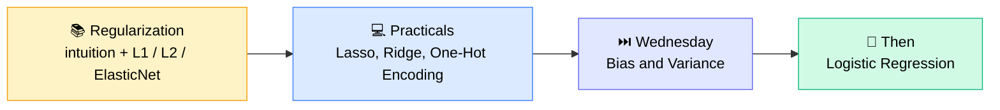
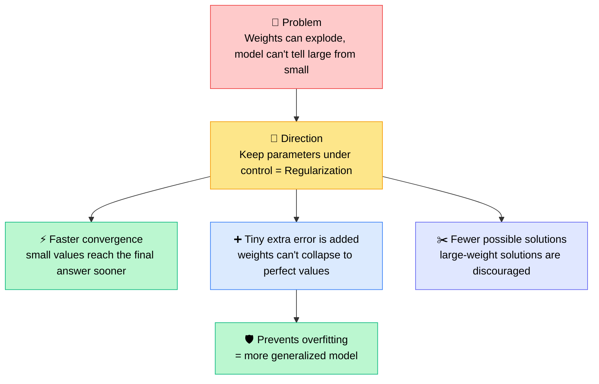
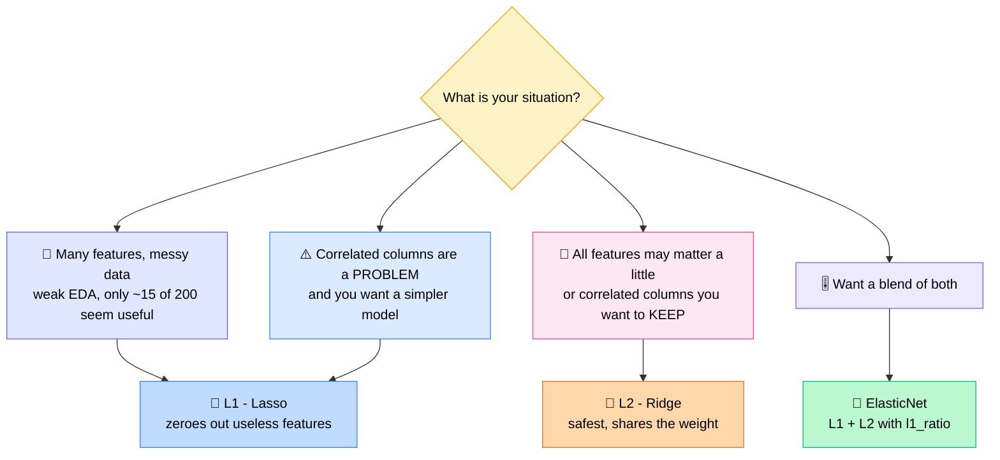
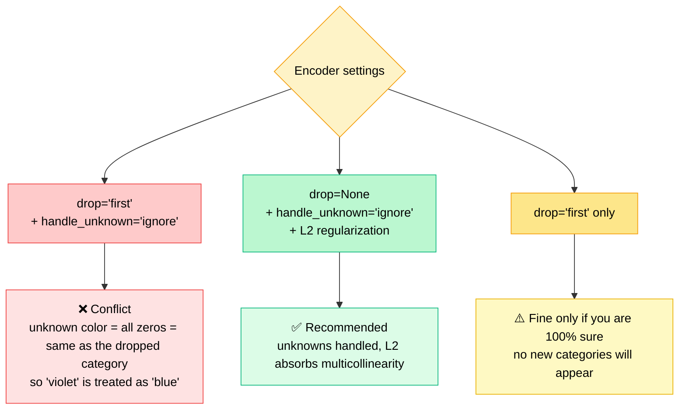

# 🧠 Regularization Deep-Dive: L1, L2 & ElasticNet

## 🧭 Today's Agenda & Where It Fits

Today's session **concluded regularization** (intuition, L1/L2/ElasticNet, interview questions), followed by a **hands-on practical** with Lasso and Ridge. **Bias–Variance was postponed to Wednesday** because regularization took much longer than planned, and it will be followed by **Logistic Regression**.



> 💡 **Teaching philosophy on derivatives:** the derivative is derived only _once_. What matters: **derivative of the loss function = gradient = direction + magnitude (controlled by the learning rate)**. Interviewers ask _"what is the loss function?"_, never _"give me the derivative of logistic regression."_

---

## 🗣️ Career Advice: Communication Beats Pure Tech Skill

Before starting, Monal spent ~10 minutes on a theme he called _"worth more than everything I'll teach today."_

- 🤐 Being an introvert is fine in school/college, but **progression in a real career needs communication**
- 🧑‍💻 A _great developer_ = someone who can **code + collaborate**, and collaboration is mostly communication
- 📊 Communication isn't only verbal: **diagrams, chat messages and written notes** count too
- 👔 **Managers** are valued for handling teams, stakeholders and problems, not for tech depth
- 🏗️ **AI Architect** is a role needing ~10–12 years of experience. An architect sees the _50,000-ft view_: where data flows, is stored, is processed, where AI plugs in, plus **throughput, latency, concurrency, Redis/middleware** and always thinks _at scale_, even for small problems
- ❓ Ask "silly" questions. **Raise your hand** at the end of the session; raised hands are never skipped, while chat questions sometimes are

---

## 🔍 The Problem: Why Do We Need Regularization?

**Toy dataset:** predict **CIBIL score** from `age` (numeric) and `city` (categorical → one-hot encoded into `Mumbai`, `Delhi`).

| Age | City   | CIBIL score |
| --- | ------ | ----------- |
| 23  | Mumbai | 700         |
| 42  | Mumbai | 700         |
| …   | Delhi  | 600         |

By inspection: **age is uncorrelated with the score; Mumbai → 700, Delhi → 600.**

Prediction: `ŷ = m_age·age + m_Mumbai·Mumbai + m_Delhi·Delhi + c`

|               | m_age | m_Mumbai | m_Delhi | Intercept | Delhi person | Mumbai person |
| ------------- | ----- | -------- | ------- | --------- | ------------ | ------------- |
| ✅ **Case 1** | 0     | 100      | 0       | 600       | 600 ✔️       | 700 ✔️        |
| 💥 **Case 2** | 0     | 1700     | 1600    | −1000     | 600 ✔️       | 700 ✔️        |

Both solutions predict **perfectly**, but Case 2 has **exploded weights**.

### 🚨 Issue #1: The model wanders in a "universe of parameters"

The model only cares about **error**. It has no idea whether a weight is "large" or "small", so it can drift toward huge weights, which takes much longer to converge.

### 🧭 Direction for the solution

**Keep parameter explosion under control**, and this unlocks _extra_ benefits nobody was looking for:



> 🔑 **Key insight:** we don't add a bit of error _because we can_. We add a penalty to **control parameter explosion**, and the tiny extra error (and hence overfitting protection) is a _by-product_.

**Extra intuition points**

- 🔢 A linear equation can have _n_ possible solutions. Regularization **reduces the options**, like going from "15 factorial" ways to "4 factorial"
- 🎯 It doesn't delete the solution; it **moves it in the direction of the smallest possible weights**
- 🧨 In _deep learning_ you'll meet **exploding** _and_ **vanishing** gradients. Here we're only handling the exploding side
- 🧪 Regularization is a **training-time technique** (it lives in the loss function → gradient). It is _not_ about train/test data splits

---

## ⚖️ L1 (Lasso) vs L2 (Ridge)

|                       | 🔷 **L1 / Lasso**                                                                    | 🔶 **L2 / Ridge**                                |
| --------------------- | ------------------------------------------------------------------------------------ | ------------------------------------------------ |
| **New loss**          | Modified MSE + λ·Σ\|β\|                                                              | Modified MSE + λ·Σβ²                             |
| **Modified MSE**      | 1/(2N)·Σ(y − ŷ)²                                                                     | same                                             |
| **Gradient**          | (1/N)·Xᵀ(ŷ − y) + λ·**sign(β)**                                                      | (1/N)·Xᵀ(ŷ − y) + **2λβ**                        |
| **Penalty behaviour** | Constant push: **+1 if β>0, −1 if β<0**, undefined/stop at 0                         | Push **scales with the weight itself**           |
| **Effect on weights** | Can drive weights **exactly to 0**                                                   | Shrinks weights to **small but non-zero** values |
| **Superpower**        | ✂️ **Automatic feature elimination**                                                 | 🤝 **Shares weight** among correlated features   |
| **Role of λ / α**     | Controls penalty strength, _just like the learning rate controls gradient magnitude_ | same                                             |

**Numerical intuition (λ = 1)**

- Start at **β = 10** → L1 adds **1**, L2 adds **2·1·10 = 20** (L2 punishes big weights much harder)
- Near convergence (β tiny) → L1 _still_ applies a constant ±1·λ push, which lets it reach **exactly zero**; L2's push fades with the weight, so weights end up small but **not exactly zero**

> 📝 **Compiler's note:** in class the "L2 grows" explanation was a bit tangled. The clean takeaway: the L1 gradient has _constant magnitude_ (so it can finish the job and hit 0), while the L2 gradient is _proportional to β_ (so it shrinks weights smoothly but never fully zeroes them). Whether a weight hits exactly 0 also depends on λ and the limited number of iterations.

**Why does the sign rule exist?** The _loss function_ uses |β|, but its _derivative_ doesn't contain an absolute value, so β can be negative and the sign flips to −1. The loss measures overall error; the derivative gives the _direction_ to move.

---

## 🎯 When to Use Which? (Interview Gold)



### 🎤 The 4 Interview Questions Monal Asked

| #   | Question                                                                         | Answer         | Why                                                                                                            |
| --- | -------------------------------------------------------------------------------- | -------------- | -------------------------------------------------------------------------------------------------------------- |
| 1   | Which regularization for a **simple / small** model?                             | **L1 (Lasso)** | Zeroed weights mean you can skip collecting those inputs (default them to 0) and the model has less to compute |
| 2   | I have **many columns and want to keep all** of them                             | **L2 (Ridge)** | Can't make anything exactly 0                                                                                  |
| 3   | I want to **keep highly correlated columns** (e.g. _years of education_ & _age_) | **L2**         | Both columns **share the workload** instead of one being deleted                                               |
| 4   | Highly correlated columns are a **problem** I want to solve                      | **L1**         | It drops one (you can't control _which_)                                                                       |

> ⚠️ **Watch the wording:** the word **"keep"** signals L2. "Highly correlated" here means **multicollinearity** (X's correlated _with each other_), **not** correlation with Y.

**Example of weight sharing:** vehicles-in-city vs. pollution are highly correlated. Without L2 one might get weight 100; with L2 the weights may split like 50/50. Multicollinearity isn't _removed_, it's **dealt with**.

---

## 🧬 ElasticNet: Best of Both Worlds

- Uses **both L1 and L2 penalties** in the loss/gradient; it has no formula of its own
- Controlled by **`l1_ratio`** (like `test_size` in train/test split):
  - `l1_ratio = 0.3` → **30% of penalty from L1, 70% from L2**
- 🧰 **L2** is good at _shrinking_ variables; **L1** is good at _deleting_ them
- Weighting (Monal's gamma intuition): `γ·L1 + (1−γ)·L2`
- The ratio isn't fixed; treat it as a **hyperparameter to tune**
- Used in the real world, and a common interview topic

---

## 💻 Practical Session: Lasso & Ridge in scikit-learn

```python
from sklearn.linear_model import Lasso, Ridge
from sklearn.metrics import mean_squared_error, r2_score
import numpy as np

lasso = Lasso(alpha=..., random_state=42, max_iter=10000)
lasso.fit(X_train_processed, y_train)

y_train_pred_lasso = lasso.predict(X_train_processed)
y_test_pred_lasso  = lasso.predict(X_test_processed)   # test set: predict only, never fit

lasso_rmse = np.sqrt(mean_squared_error(y_train, y_train_pred_lasso))
lasso_r2   = r2_score(y_train, y_train_pred_lasso)

# Ridge: identical workflow, just swap Lasso -> Ridge
```

### 🔎 Findings

- 📈 **Both Lasso and Ridge showed slightly higher error than the SGD baseline**, which is expected because of the penalty
- 🔷 **Lasso:** `lasso.coef_` showed **several coefficients exactly 0** (automatic feature elimination confirmed)
- 🔶 **Ridge:** `ridge.coef_` showed **no true zeros**, only very small values (a `-0.0` is just a rounded negative number)
- 🏆 **Ridge/L2 explained more test variance (~63% R²) than Lasso (~60%)**, so **Ridge was chosen** for this dataset
- 📊 R² tells you **how much of the variance in actual Y the model explains**, a percentage that is easy to explain to business people. MSE alone is only meaningful when compared with other runs

> 🧠 **`Lasso` / `Ridge` = linear regression + penalty, built in.** You don't stack `LinearRegression` on top. Gradient descent (or another optimizer) still finds the parameters inside; regularization just changes the loss being optimized.

### 🔧 Using regularization with `SGDRegressor`

- Set `penalty="l1" | "l2" | "elasticnet"`
- `alpha` = penalty strength (usually **small**, e.g. 0.0001–0.0002)
- `l1_ratio` is only needed when `penalty="elasticnet"`
- 💡 `SGDRegressor` uses **L2 by default**. That's why L2 is called the _safest_ option.

### 📐 Scikit-learn method conventions

| Method          | Use for                                | Applies to                             |
| --------------- | -------------------------------------- | -------------------------------------- |
| `fit`           | Learn / train                          | Everything                             |
| `transform`     | Return output using learned parameters | **Pre-processors** (scalers, encoders) |
| `fit_transform` | Learn _and_ return                     | Pre-processors                         |
| `predict`       | Return predictions from trained model  | **ML models**                          |

---

## 🎨 One-Hot Encoding: Dummy Variable Trap & Production Safety

### 1️⃣ The multicollinearity problem

For `blue / green / red` one-hot columns:

- If blue = 1, the others are 0, and **each row sums to 1**
- One column can be perfectly predicted from the others → **multicollinearity**
- **Fix:** `drop="first"`. With 3 colors you still uniquely identify all: blue = (0,0), green = (1,0), red = (0,1)

### 2️⃣ The production problem

A user sends a **new category** (e.g. _purple_) that wasn't in training → the encoder **throws an error** and your system crashes.

**Fix:** `handle_unknown="ignore"` → unseen categories become an **all-zeros vector**, so the calculation still runs (the prediction may be off, but the system stays stable).



- 🛡️ Alternative: wrap in `try/except` and return _"Unknown color identified"_, fine unless a downstream system needs a numeric output
- 🧪 `handle_unknown` = about **production/unseen categories**; `drop` = about **multicollinearity**. They are unrelated problems.

---

## 🧪 Recommended Model-Selection Workflow

> _"The answer does not lie in the coefficients. Coefficients are just the end result of your loss function and optimizer. Decide based on **performance**."_

```mermaid
flowchart LR
    A["1️⃣ Plain OLS<br/>no regularization"] --> B["2️⃣ SGD<br/>L2 by default"]
    B --> C["3️⃣ Lasso"]
    C --> D["4️⃣ Ridge / ElasticNet"]
    D --> E["📋 Log train and test<br/>R2, RMSE in one table"]
    E --> F["⚖️ Keep balanced<br/>train vs test models"]
    F --> G["🏆 Pick highest<br/>test score"]

    style A fill:#dbeafe,stroke:#3b82f6,color:#000
    style B fill:#e0e7ff,stroke:#6366f1,color:#000
    style C fill:#ede9fe,stroke:#8b5cf6,color:#000
    style D fill:#fce7f3,stroke:#ec4899,color:#000
    style E fill:#fef3c7,stroke:#f59e0b,color:#000
    style F fill:#fed7aa,stroke:#f97316,color:#000
    style G fill:#bbf7d0,stroke:#10b981,color:#000
```



- 🗂️ Keep the **test set static** across all trials and record every experiment in a table (Monal marks the best cells green)
- 🎛️ You can't guess the best λ or `l1_ratio` by looking at numbers; **tune hyperparameters** (e.g. GridSearchCV)
- 📏 Model size means nothing (_"a 500-billion-parameter model"_) until you show how it **performs**

---

## ❓ Live Q&A Highlights

| Question                                                              | Answer                                                                                                                                                                                                                                                            |
| --------------------------------------------------------------------- | ----------------------------------------------------------------------------------------------------------------------------------------------------------------------------------------------------------------------------------------------------------------- |
| **Sandeep:** Are "Lasso" and "Lasso regression" the same?             | Yes. Lasso = linear regression + L1 penalty, all built in. Gradient descent still runs inside to find the weights                                                                                                                                                 |
| **Sandeep:** How to choose Lasso vs Ridge?                            | Compare **train/test performance**. In this case Ridge explained more test variance, so Ridge                                                                                                                                                                     |
| **Sandeep:** Same company appears under multiple names in EDA. Merge? | It's **manual + needs domain knowledge**. Merge if your goal doesn't need the distinction (e.g. "green/red apple" → "apple" for fruit classification). If unsure, compare `describe()` stats of each group: similar stats → merge, very different → keep separate |
| **Rachana:** What does ignoring "purple" mean?                        | The model never saw it in training, so it gets an all-zero vector to keep the pipeline running (like asking a data-science student a data-engineering question)                                                                                                   |
| **Deepak:** Doesn't L1 remove multicollinear columns?                 | L1 removes features **irrelevant to the target (Y)**, not columns correlated with each other. OHE columns are always correlated with each other, so L1 won't reliably drop them. Use `drop='first'` with L1, or L2                                                |
| **Deepak:** Why is L2 the default?                                    | It's the safest and needs the least worry. For 200+ features, try L1 to simplify, then make a leaner model version                                                                                                                                                |
| **Amol:** Why R² over MSE?                                            | R² is a percentage that tells you if the model captures the data's **variance**, which is easy to explain to business stakeholders. MSE only makes sense when compared with other runs                                                                            |
| **Amol:** Is VIF the same as multicollinearity?                       | VIF (Variance Inflation Factor) is **another way to measure/talk about** multicollinearity, commonly used during feature selection                                                                                                                                |
| **Sjyothi:** Should we check multicollinearity before regularizing?   | Ideal: yes, in EDA/feature engineering. If not removed, use L2. Monal trains both versions (with/without) and compares results. **Tree-based models** handle multicollinearity well                                                                               |
| **Sjyothi:** Use regularization for underfitting?                     | No. Underfitting needs a **better model or more data**, not a formula                                                                                                                                                                                             |
| **Sjyothi:** Will XGBoost / LSTM be covered?                          | **XGBoost: yes** (one method, later in the course). **LSTM** belongs to deep learning, taught by another mentor                                                                                                                                                   |
| **Soumita:** How to set the L1/L2 weighting in ElasticNet?            | Treat as a **hyperparameter**, run experiments, compare in a table                                                                                                                                                                                                |
| **Soumita:** Can I get my notes reviewed?                             | Yes, or build an **"LLM-as-judge"** prompt/workflow (also a good intro to GenAI). Monal will also try to share an **assignments folder** going forward                                                                                                            |

---

## 🗂️ Platform Tips Shared

- 🌐 **learn.krishnaacademy.com** → _Messages_ section = community chat (doubts, help, and where the class **zip** is shared)
- 📚 **Courses** → search _"Ultimate"_: **V1.0** (last year, completed) and the **current ongoing batch**
- 🎞️ Recorded ML classes (ML5, ML6, …) live inside the **Feature Engineering** section
- 📝 **Notion notes link:** _Miscellaneous → Mentor 1 References_
- 🚀 **Get Started** section = Krish's YouTube playlists (RAG, GenAI, etc.) for fast-track learners; **not** part of the live course

---

## ✅ Action Items for Learners

- [ ] 📓 Re-read the regularization intuition (_Problem → Direction → Solution_) until you can explain it without the math
- [ ] 🎤 Memorize the **4 interview questions** and their L1/L2 answers
- [ ] 💻 Re-run the Lasso/Ridge practical from the shared **zip**; inspect `coef_` for zeros
- [ ] 🎨 Experiment with `OneHotEncoder(handle_unknown="ignore", drop=None)` + L2
- [ ] 📊 Build a small results table comparing OLS vs SGD vs Lasso vs Ridge (train/test RMSE & R²)
- [ ] 📺 Review **collinearity / multicollinearity** in the feature-engineering recordings (`14062026_notes`)
- [ ] 📝 Finish the previous day's assignment if pending
- [ ] 🙋 Raise your hand at the end of class if you have a doubt, and **only** if you have one

---

_📝 Notes compiled from the full session transcript: Ultimate Data Science ML7 (Regularization), Krish Naik Academy._
