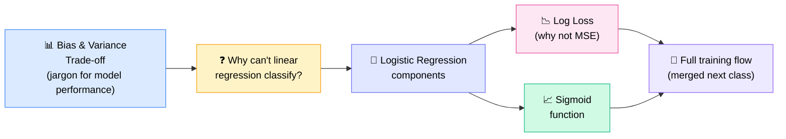
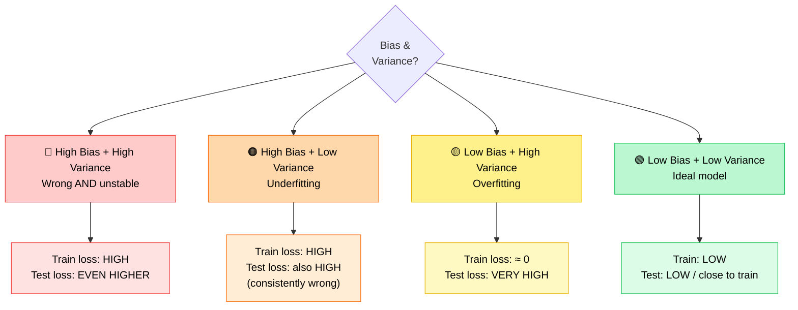
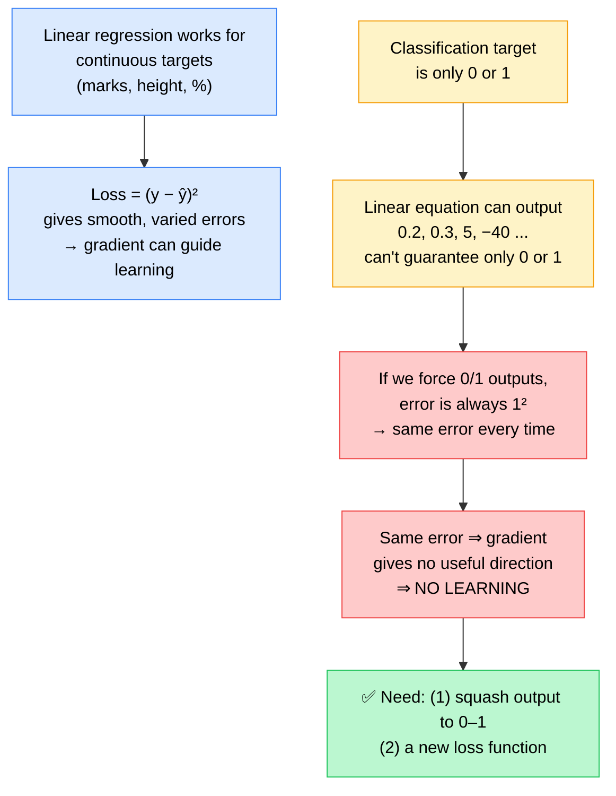
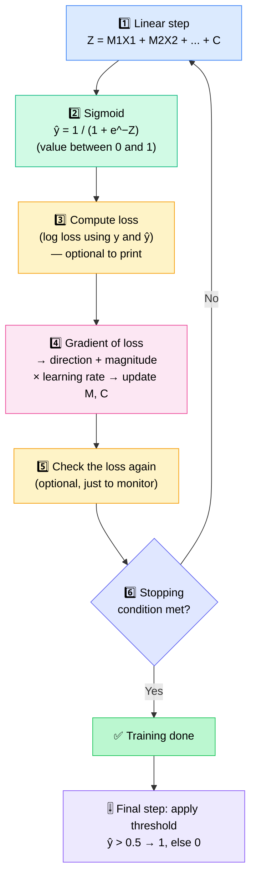

# 🎯 Bias–Variance Trade-off & Intro to Logistic Regression

---

## 🧭 Today's Agenda

Two topics, one bridge: first a **language for describing model performance** (bias & variance), then a **new algorithm for classification** (logistic regression) and _why_ linear regression can't do that job.

> 💡 **Side note:** The instructor plans to teach **FastAPI** later (not in the syllabus) to support more advanced projects.

---

# PART 1 — Bias & Variance Trade-off

## 🧠 The Mindset

- 🎭 Think of **yourself as the ML model** — the fit line / curve / formula.
- 🗣️ Bias–variance is **not a technique you implement**. It's a **vocabulary** to _describe_ model performance — in words instead of numbers.
- 💼 Useful for interviews (a favourite question!) and for explaining results to managers / business people.

> _"Instead of saying my test is 100 and train is 24, you will say it in terms of bias and variance."_

---

## 🎯 The Bullseye Diagram

The centre of the target = **the goal** (low loss, well-fit model).

|                            | 🎯 Bias                                                                     | 🌪️ Variance                                                               |
| -------------------------- | --------------------------------------------------------------------------- | ------------------------------------------------------------------------- |
| **Instructor's intuition** | Model is _biased_ toward the wrong direction / corner instead of the centre | Model's "arrows" are _scattered_ all over — it reacts to noise & outliers |
| **What it tells you**      | How well the model **fits the TRAIN data**                                  | How well the model performs on **TEST data**                              |
| **High value means**       | ❌ **Underfitting** — model isn't learning the whole pattern                | ❌ **Overfitting** — model memorises training data, fails on new data     |
| **Low value means**        | ✅ Good fit on train                                                        | ✅ Good performance on test                                               |
| **Fix**                    | More capacity, better features                                              | Regularization, feature engineering, cross-validation                     |

> 🔑 **Golden rule to remember:** _High = bad. Low = good._ (Applies to both bias and variance.)

---

## 🔀 The 4 Combinations

| Case                        | Bullseye picture                             | Diagnosis                                                    | Train loss | Test loss            |
| --------------------------- | -------------------------------------------- | ------------------------------------------------------------ | ---------- | -------------------- |
| 🔴 High bias, high variance | Shots in a wrong corner **and** spread out   | **Worst case** — model is wrong & unstable                   | High       | Even higher          |
| 🟠 High bias, low variance  | Shots tightly clustered in a wrong corner    | **Underfitting** — too simple, misses the truth consistently | High       | High                 |
| 🟡 Low bias, high variance  | Shots centred on target but widely scattered | **Overfitting** — memorised train, fails on new data         | ≈ 0        | Very high            |
| 🟢 Low bias, low variance   | Shots tightly clustered at centre            | **Ideal** — learned true pattern, ignored noise              | Low        | Low (close to train) |

---

## 📈 Reading It from the Error vs Model-Complexity Graph

The instructor drew train (blue) and test (green) error curves and placed three models on it:

| Model       | What the curves showed                                             | Verdict                                         |
| ----------- | ------------------------------------------------------------------ | ----------------------------------------------- |
| **Model 1** | Error high on both train **and** test (around 60 on a 0–120 scale) | 🟠 **Underfitted** — high bias, low variance    |
| **Model 2** | Train error ≈ 0, test error very high                              | 🟡 **Overfitted** — low bias, high variance     |
| **Model 3** | Train error low, test slightly higher but close                    | 🟢 **Optimal / Ideal** — low bias, low variance |

---

## ⚖️ What's the "Trade-off"?

- You can't easily get the best of both worlds at once — pushing one down often pushes the other up.
- To perform better on **unseen** data, a model may need to **give up some over-fitting** on the training data.
- 🧑‍🎓 **Analogy:** Memorising 100 interview questions helps for those exact questions. To handle _new_ questions, you must learn the underlying concepts — you have to "unlearn" pure memorisation and think.
- 🛠️ Regularization exists to nudge models toward the ideal middle.
- 🏭 In practice, training performance is often allowed to lean toward slight overfitting to squeeze out more performance.

> 📌 **Note (added for accuracy):** The instructor deliberately uses a _practical shortcut_ — **bias ≈ fit on train, variance ≈ performance on test**. In textbooks, **variance** is more formally defined as how much a model's predictions change when trained on different samples of data (which shows up as a large train-test gap). The shortcut is a good working memory aid; keep the formal definition in mind for theory-heavy interviews.

---

## 🧪 Practice Examples from Class

Judging **relative to each other** (there's no fixed threshold for "high" or "low"):

| Train                                              | Test | Verdict                                                                             |
| -------------------------------------------------- | ---- | ----------------------------------------------------------------------------------- |
| 100                                                | 50   | High bias (train error high), low variance (test is better)                         |
| 30                                                 | 100  | Low bias (good on train), high variance (bad on test) → **overfitting**             |
| 300                                                | 100  | Alone: high bias, low variance. Compared with a good benchmark model: **both high** |
| Predicts 300 (should be 100) & 600 (should be 400) | —    | Everything is poor → **high bias + high variance**                                  |

💡 _"No one has a threshold. For some people 'high' is infinity, for others it's a hundred — explain your context."_

---

# PART 2 — Introduction to Logistic Regression

## 🧩 What Is It?

- 📛 The name says "regression", but it's used for **classification**.
- 🔢 The base version solves **binary classification** (two classes only: 0/1, True/False, sick/not sick, red/blue).
- 🧮 **High-level one-liner:**

> **Logistic Regression = Linear Regression + Activation Function (sigmoid)**

_(Good for a first understanding — it gets deeper as the math is added.)_

---

## ❓ Why Not Just Use Linear Regression?

- ✅ We **still** need weights: `M1·X1 + M2·X2 + M3·X3 + …` (weightage of each feature).
- ❌ Confusion matrix can't be the training loss — it's only a **frequency count**, not a differentiable mathematical formula. It's an **evaluation metric**, not a loss.

---

## 🔁 The Logistic Regression Flow

- 🔄 The loop that actually repeats is **steps 1 → 2 → 4** (step 3 & 5 are for monitoring).
- 🎯 Stopping condition is based on train/test error, etc.
- 🧑‍💻 Parameters being learned are still **M1, M2, M3, …** (plus C).

---

## 📉 The Loss Function: Log Loss (Binary Cross-Entropy)

$$
L = -\frac{1}{N}\sum_{i=1}^{N}\Big[\,y_i\log(\hat y_i) + (1-y_i)\log(1-\hat y_i)\,\Big]
$$

**How it works — only one term is ever "active":**

| Actual y | Active term        | Inactive term              |
| -------- | ------------------ | -------------------------- |
| **1**    | `y · log(ŷ)`       | `(1−y)·log(1−ŷ)` becomes 0 |
| **0**    | `(1−y) · log(1−ŷ)` | `y·log(ŷ)` becomes 0       |

### 🔬 Live Comparison: Log Loss vs MSE (actual y = 0)

| Case                         | Prediction ŷ | Log loss                  | MSE  | Takeaway                                  |
| ---------------------------- | ------------ | ------------------------- | ---- | ----------------------------------------- |
| **Case 1** (bad prediction)  | 0.9          | **≈ 2.3025** (= −log 0.1) | 0.81 | Log loss reacts strongly to a big mistake |
| **Case 2** (good prediction) | 0.1          | **≈ 0.1054** (= −log 0.9) | 0.01 | Both small — model is nearly right        |

> 🎯 **Point of the demo:** When the error is high, the loss _should_ be high; when error is low, loss _should_ be low. Log loss punishes confident wrong answers much harder, giving stronger learning signal. It is a loss "literally made for binary" problems — MSE might work, but very poorly.

---

## 📈 The Sigmoid Function

$$
\sigma(Z) = \frac{1}{1 + e^{-Z}}
$$

- 🔁 Maps **any real number (−∞ to +∞)** → **a value between 0 and 1** (a probability).
- 🎯 **S-shaped curve**, centred at **σ(0) = 0.5**.
- `Z` is simply the **output of the linear equation** (`MX + C`).

| Input Z       | Approx. sigmoid output | Reading       |
| ------------- | ---------------------- | ------------- |
| ≤ −5 / −6     | ≈ 0.007 → 0            | Practically 0 |
| −4            | ≈ 0.018                | ~2%           |
| −3            | ≈ 0.047                | ~5%           |
| −2            | ≈ 0.12                 | ~12%          |
| **0**         | **0.5**                | Centre point  |
| ≥ +5          | ≈ 0.99 → 1             | Practically 1 |
| ±1000 or more | exactly ~0 or ~1       | Saturated     |

> 🧪 The instructor demoed this live using an online _sigmoid calculator_ (search "sigmoid calculator").
> ⚠️ _Values in the last table are computed precisely; the instructor rounded them verbally in class._

---

## 🎚️ From Probability to Class Label

- Model outputs **probabilities**, never hard 0/1 on its own.
- Developer applies a **threshold**:
  - `ŷ > 0.5 → 1`, else `0` (default)
  - Can be tuned (0.6, 0.8 …) based on business need — validate with a **confusion matrix**.
- 🤖 **ChatGPT analogy:** For the input "hello", the model assigns a probability to every word in its vocabulary; the highest-probability word ("Hello!") wins. _AI works on probabilities — not certainties._

---

## 🧰 Activation Functions — Quick Mentions

| Function                        | Output range | Note                        |
| ------------------------------- | ------------ | --------------------------- |
| **Sigmoid** (logistic function) | 0 to 1       | Used in logistic regression |
| **Tanh**                        | −1 to 1      | Covered in deep learning    |
| **ReLU**                        | max(0, x)    | Covered in deep learning    |

---

## ❓ Q&A Highlights

| Question                                                | Answer                                                                                         |
| ------------------------------------------------------- | ---------------------------------------------------------------------------------------------- |
| How do we check if a model is biased or has variance?   | By comparing **training vs testing performance**                                               |
| Can I get an example to understand variance?            | Variance ≈ test performance: low variance = good on test set; high variance = poor on test set |
| Does bias/variance help _do_ something to the model?    | No — it's terminology to **describe** performance, not a technique                             |
| What about more than two classes (A/B/C)?               | Not covered now — today's logistic regression is **binary only**                               |
| Is confusion matrix the same as an activation function? | No — confusion matrix is an **evaluation metric**; sigmoid is an **activation function**       |

---

## 🚀 Coming Up Next Class

- 🧮 How the **gradient / derivative** is computed for logistic regression (high-level, ~30 min)
- 🔗 **Merge all components** into one complete flow with data
- 📚 Properties of the loss function and sigmoid in more depth

---

## ✅ Action Items for Learners

- [ ] 🔁 Revise the **full class recording** (instructor strongly recommends it)
- [ ] 📖 Revise **linear regression** _and_ today's logistic regression pieces — everything depends on them now
- [ ] 🧠 Be able to answer: **"Why not linear regression / MSE for classification?"**
- [ ] 📈 Be able to explain: **"What is sigmoid and what does it output?"**
- [ ] 🔢 Memorise the 4 bias–variance combinations and the train/test loss pattern for each
- [ ] 📝 Note down doubts → bring them to **Saturday's class** (no doubt session on Wednesdays)
- [ ] 📄 Check the **PDF notes** shared in the group chat
- [ ] 🌐 Search "sigmoid calculator" online and try inputs like −5, −2, 0, 5

---

_📝 Notes compiled from the full lecture transcript — ML8: Bias–Variance Trade-off & Logistic Regression Introduction._
