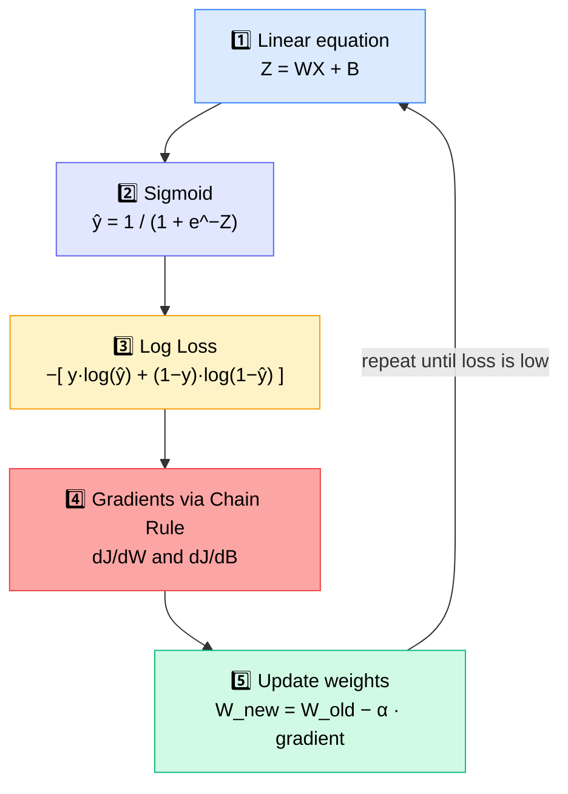
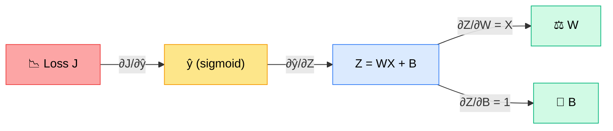
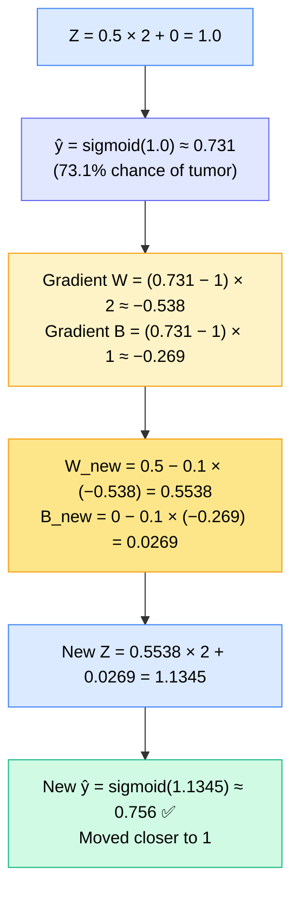
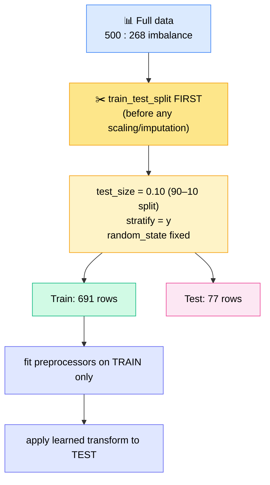
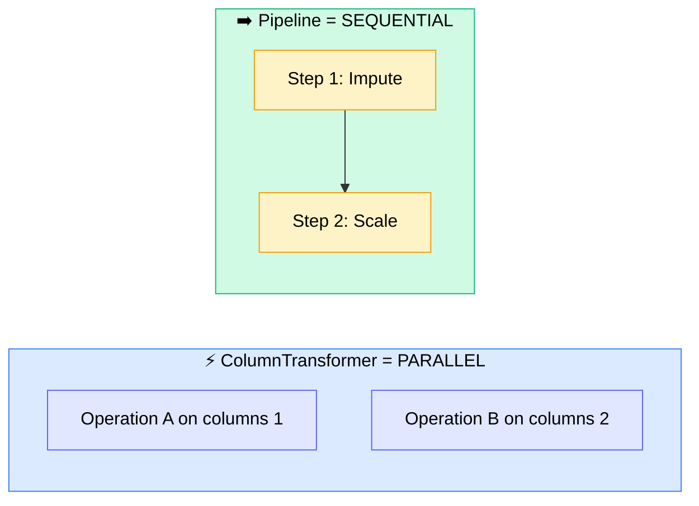
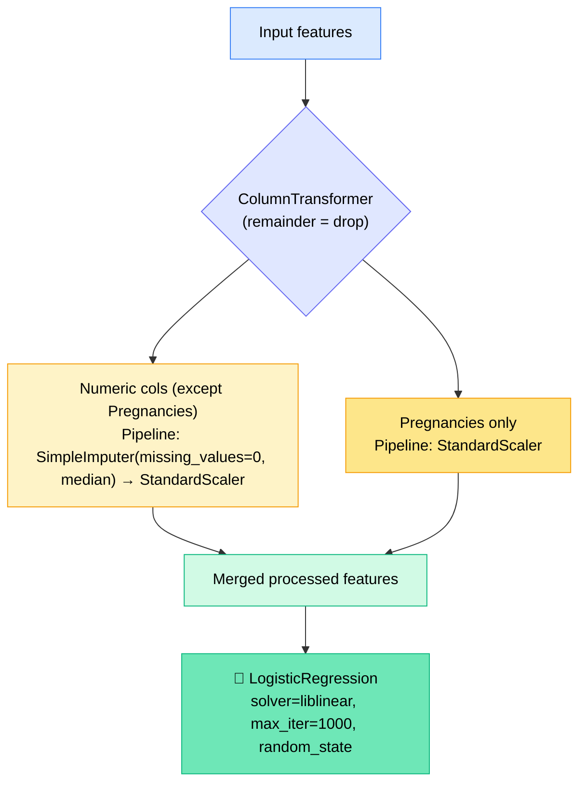

# 🤖 Machine Learning 9 — Logistic Regression Deep Dive + Pipelines

---

## 🧭 Today's Agenda

> 📌 **Deferred to next class:** ROC curve, AUC score (to be taught manually), confusion matrix & classification report in depth.

> 📝 **Prerequisites Monal expects:** confusion matrix, accuracy formula (TP/TN/FP/FN), F1 score, and having watched the previous Wednesday session.

---

## 🔁 Quick Recap

| Concept                                              | One-line takeaway                                                                                   |
| ---------------------------------------------------- | --------------------------------------------------------------------------------------------------- |
| 📉 **High Bias**                                     | Bad fit on **training** data (underfitting). Low bias = good training fit                           |
| 📈 **High Variance**                                 | Bad fit on **test** data. Low variance = model generalizes well                                     |
| ❌ **Why not linear regression for classification?** | It outputs continuous values from −∞ to +∞; we need output capped to **0 or 1**                     |
| 🔀 **Fix**                                           | Pass the linear output through the **sigmoid** activation → squashes any value into (0, 1)          |
| 🎯 **Sigmoid output**                                | Interpreted as a **probability** of class 1, then a threshold (default 0.5) converts it to 0/1      |
| 🧮 **Why not MSE?**                                  | Y and Ŷ live in [0, 1], so their difference is tiny → gradients become tiny → weights barely update |

> 💡 **Interview-ready answer:** _"Can we use MSE for logistic regression? Yes. Should we? No."_ — the gradient becomes too small for the model to learn well, so we use **log loss**.

> 🧠 **Key idea:** Logistic regression does **not** predict 0 or 1. It predicts the **probability of getting 1**. The threshold makes the final call.

---

## 🧱 The Logistic Regression Recipe

- 🔤 **W vs M:** In deep learning we write **W** (weights) instead of **M** (slope/coefficient). Same thing, different name.
- 📏 **Loss vs Cost:** The formula above is the **loss** (per row). **Cost** = the summation over all rows.
- 🧮 **Log loss vs MSE** (worked example in class): when prediction and actual are far apart, log loss penalizes much more strongly than MSE (e.g., MSE gave only 0.81 in the far case) — that difference in gradient strength is what enables learning.

---

## 🔗 Derivation — Why the Chain Rule?

Loss depends on **ŷ** → ŷ depends on **Z** → Z depends on **W** and **B**. Dependencies are **multiplied** (independent contributions would be added).

| Step | Derivative                    | Result               |
| ---- | ----------------------------- | -------------------- |
| 1️⃣   | ∂J/∂ŷ                         | (ŷ − y) / [ŷ(1 − ŷ)] |
| 2️⃣   | ∂ŷ/∂Z (derivative of sigmoid) | ŷ(1 − ŷ)             |
| 3️⃣a  | ∂Z/∂W                         | X                    |
| 3️⃣b  | ∂Z/∂B                         | 1 (coefficient of B) |

### ✨ Final Gradients (the beautiful simplification)

- **∂J/∂W = (ŷ − y) · X**
- **∂J/∂B = (ŷ − y) · 1**

The messy denominators cancel out, and the result looks identical to the linear regression gradient.

> 🎓 **Monal's advice:** Don't worry about doing the calculus yourself — understand ~5% at a high level: _what_ we derive, _why_ (chain rule), and _what the flow looks like_. Nobody will ask you to derive it in an interview. Researchers designed sigmoid using **log-odds**; we're just learning what they built.

---

## ✍️ One Full Iteration — By Hand

**Setup:** Tumor size **X = 2**, Malignant **y = 1** · Init **W = 0.5, B = 0** · Learning rate **α = 0.1**

- ✅ **Proof of learning:** probability rose **0.731 → ~0.756** with the _same input X_, just new W and B.
- 🐢 Learning is gradual — small steps per iteration, controlled by the learning rate. Over many iterations, ŷ converges toward 1.
- 🎯 We wanted ŷ → 1 here **because y = 1**. If y were 0, we'd want ŷ → 0.
- 🎛️ **Choosing α:** There's no single "optimal" value. Use **hyperparameter tuning** over a _range_ of values.
- 📍 **Intercept note:** For simplicity, earlier linear regression only updated W; today's flow shows a **separate gradient for B** too.

---

## 💻 Practical — Diabetes Prediction (Logistic Regression)

### 📦 Dataset

- 🏥 Pima diabetes dataset (originally from the National Institute of Diabetes and Digestive and Kidney Diseases)
- **768 rows × 9 columns**, no null values, all numeric, target `Outcome` already 0/1
- Features: Pregnancies, Glucose, BloodPressure, SkinThickness, Insulin, BMI, DiabetesPedigreeFunction, Age

### 🔍 EDA Findings

| Finding                         | Detail                                                                                                                        |
| ------------------------------- | ----------------------------------------------------------------------------------------------------------------------------- |
| ⚠️ **Hidden missing values**    | Glucose, BloodPressure, SkinThickness, Insulin, BMI have **zeros** — impossible for a living person, so zeros = disguised NaN |
| ✅ **Pregnancies = 0 is valid** | No fix needed                                                                                                                 |
| 🔢 **Zero counts**              | Pregnancies 111, Glucose 5, BloodPressure 35, others also non-zero                                                            |
| ⚖️ **Class imbalance**          | 500 non-diabetic vs 268 diabetic                                                                                              |
| 🔗 **Correlation**              | Glucose most correlated with Outcome (~0.47); BloodPressure & SkinThickness weakest                                           |

> 🧠 **Domain-thinking tip:** Nobody hands you domain knowledge. Ask common-sense questions of the data — _"can this value really be 0?"_

### ⚖️ Split Strategy — The Important Part

- 🚫 **Never scale before splitting** → causes **data leakage** (mean/std learned from test data).
- 📉 **Why 90–10?** Small dataset (only 268 positives). A 70–30 split would starve the model of training data.
- 🎚️ **`stratify=y`** keeps the original diabetic/non-diabetic ratio in **both** train and test (e.g., 90% of each class goes to train).
- 🔁 Two problems in imbalanced data: (1) imbalance itself (fix via balancing techniques — left as **assignment**), (2) random split distorting ratios (fixed via `stratify`).
- 🌍 **Bias isn't always bad:** it reflects the real world. Recommended approach → **first train without balancing, check performance, then fix imbalance in a second iteration.**

---

## 🧩 Pipeline vs Column Transformer (⭐ Key Concept)

|           | ⚡ ColumnTransformer                                                                       | ➡️ Pipeline                                        |
| --------- | ------------------------------------------------------------------------------------------ | -------------------------------------------------- |
| Execution | **Parallel** — branches are independent                                                    | **Sequential** — output of step N feeds step N+1   |
| Use when  | Different operations on **different** columns                                              | Multiple operations on the **same** data, in order |
| ❌ Don't  | Apply two dependent operations to the same columns (e.g., OHE then target-encoding on ABC) | —                                                  |

**🖥️ Parallelism analogy:** Your OS runs many apps simultaneously (multi-threading / multiprocessing), but Python by default executes line by line — because often step 2 needs step 1's output.

### 🏗️ Preprocessor Built in Class

### 🔧 What `pipeline.fit(X_train, y_train)` does internally

1. `preprocessor.fit(X_train)`
2. `preprocessor.transform(X_train)`
3. `clf.fit(transformed X_train, y_train)`

- Model has only `fit`/`predict` (no `transform`) — sklearn links the steps internally, so `pipeline.predict(X)` just works.
- 📦 **Real benefits:** cleaner/readable code, **one object** to save via pickle/joblib instead of many. **No accuracy advantage.**
- ⚖️ Trade-off: _pipelines = harder to create, easier to call; manual = easier to create, harder to call repeatedly._

---

## 📊 Predictions & Evaluation

### 🎲 `predict` vs `predict_proba`

- `predict_proba` returns a list per row: **[P(class 0), P(class 1)]** — they sum to exactly 1.
- Index **1** = probability of **diabetes**; index 0 = not diabetes.
- Default threshold = **0.5** (hidden inside `.predict`). To customize: `(proba >= threshold).astype(int)`.
- Lower/raise the threshold to trade precision vs recall.

### 🧪 Results

| Metric    | Train                             |
| --------- | --------------------------------- |
| Accuracy  | ~77%                              |
| Precision | ~0.72                             |
| Recall    | ~0.56 ⚠️ (weak)                   |
| F1        | ~0.63 (pulled down by low recall) |

- ✅ Test performance was **nearly the same as train** → model is **neither overfit nor underfit**, just has room to improve. (Test looks slightly better partly because only 77 rows.)
- 🔢 Test errors: **14 wrong out of 77** — 5 cases where actual = 0 but predicted = 1, and 9 cases where actual = 1 but predicted = 0. Verified both via `groupby` and via the confusion matrix.
- 🛠️ Helper function bundles accuracy, precision, recall, F1, ROC-AUC, confusion matrix, classification report into a dictionary (`zero_division=0` avoids division errors).

---

## 🐞 Career Wisdom from the Session

- 🖨️ **Print everything.** Shapes, lengths, output structure. Monal once debugged an object-detection model in production by plotting all 42 dimensions of an undocumented tensor one by one.
- 🐛 _"Debug is our friend. Without debugging, you cannot become a developer."_
- 🧠 Expect the real world to have far more errors than successes — seeing the data is how you fix them.
- 🔁 Keep revising; interviewers don't care that you forgot — keep the cycle going until you get the job.

---

## ❓ Live Q&A Highlights

| Question                                                                              | Answer                                                                                                                                                                                                                                                                                                 |
| ------------------------------------------------------------------------------------- | ------------------------------------------------------------------------------------------------------------------------------------------------------------------------------------------------------------------------------------------------------------------------------------------------------ |
| **(Amol)** In linear regression we never separately updated the intercept — why now?  | It was always there. With **vectorization**, intercept is folded in as a weight (M0) with constant feature 1, so one gradient update covers both. Doing it **manually** (non-vectorized) requires separate gradients for W and B                                                                       |
| **(Amol)** We already have accuracy/precision/recall — why a new loss function?       | Those measure **final model performance**. A **loss function** tells you if the model is _learning_ row by row, and — crucially — must be **differentiable** to give a gradient (direction of the hill). Accuracy (TP/TN…) can't be differentiated                                                     |
| **(Rachana)** Where did the error go in the practical?                                | Libraries compute it **internally** inside `.fit()`. Error is never random; earlier we printed it only because we were calculating everything manually                                                                                                                                                 |
| **(Rachana)** What about learning rate?                                               | Library picks a **default**; you can still set it explicitly                                                                                                                                                                                                                                           |
| **(Rachana)** Should biased data be fixed in healthcare?                              | Bias reflects reality, but for modelling: **try without balancing first, then fix class imbalance** and compare                                                                                                                                                                                        |
| **(Rachana)** Why count zeros per column?                                             | To learn _how many_ impossible zeros exist. 5 glucose zeros, 35 BP zeros → fix with **median imputation**. Deleting rows is only OK if few and in the same rows                                                                                                                                        |
| **(Chandra)** How do we improve a ~75% model when data can't change?                  | Improve data quality / generate more data → try more **complex models** → compare algorithms; pick the best                                                                                                                                                                                            |
| **(Sirijyo)** Advantage of pipeline/column transformer?                               | Only **code cleanliness** + single saved preprocessor object. Parallel → ColumnTransformer; sequential → Pipeline                                                                                                                                                                                      |
| **(Rachana)** Does AWS SageMaker Autopilot replace data scientists?                   | Auto-ML runs hyperparameter search in the backend and can be costly; companies wanting **control & insight** still hire ML engineers. Roles are broader than model training (insights, deployment, infra, logs). Agents may get cheaper over time — **keep learning so you understand what agents do** |
| **(Deepak)** Why `pipeline.fit` not `fit_transform` on the preprocessor?              | Pipeline handles both internally. Use `fit_transform` when calling the **preprocessor alone**; use `fit` on the model                                                                                                                                                                                  |
| **(Amol)** Is writing code line-by-line expected in interviews?                       | Mostly **no** — pseudocode/algorithm is fine in ML. Recent-tech roles ask things like _PyTorch DataLoader_ or _a simple LangChain/LangGraph agent_                                                                                                                                                     |
| **(singhsaab)** Which coding agent does the mentor use, and will deployment be shown? | Uses **Claude** at work. Deployment will be **shown on AWS** (not taught in-depth)                                                                                                                                                                                                                     |

---

## 🗓️ Course Logistics & Announcements

- 🟢 **Wednesday classes stay** (the holiday "luxury" was temporary). The goal is to finish sooner since many learners join at very early morning hours from different time zones.
- 📚 **Remaining topics from Monal:** FastAPI (not in syllabus, but he'll teach it) → a project → **NLP for Machine Learning** (final module from his side).
- 🚀 Deployment will be demonstrated with exact steps, but _"deployment is slow to learn — you can't learn it in one day."_
- 📎 Notebook & zip file shared; recordings on the platform under _Courses_.
- 💬 Late joiners: watch Wednesday's recording; YouTube playlists can give ~50–60% quickly, but the live classes go deeper.
- ⭐ A poll was launched at the end — feedback appreciated.

---

## ✅ Action Items for Learners

- [ ] 📼 Watch the Wednesday recording if you missed it (bias–variance, sigmoid, log loss)
- [ ] ✍️ Redo the manual one-iteration calculation from the shared notebook (try y = 0 too!)
- [ ] 💻 Re-run the diabetes notebook line by line; **print shapes and outputs** of every step
- [ ] 🔁 Compare 90–10 vs 80–20 splits and note performance
- [ ] ⚖️ **Assignment:** apply class-imbalance balancing to the training set and compare results
- [ ] 🎚️ Try a custom threshold (e.g., 0.4 / 0.6) on `predict_proba` and see recall/precision change
- [ ] 🧩 Rebuild the same model **without** Pipeline/ColumnTransformer (manual fit_transform) to understand the difference
- [ ] 📚 Review confusion matrix, accuracy/precision/recall/F1 formulas before the next class
- [ ] 🚀 Come prepared for tomorrow's session — ROC/AUC is coming!

---

_📝 Notes compiled from the full session transcript — Machine Learning 9 (Logistic Regression, Pipelines & Column Transformer)._
