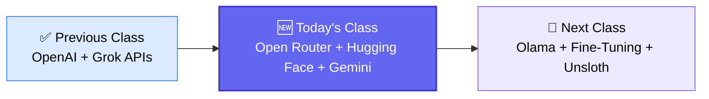
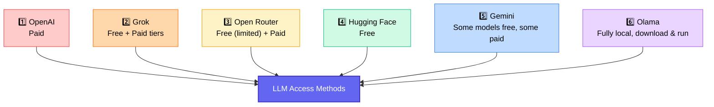
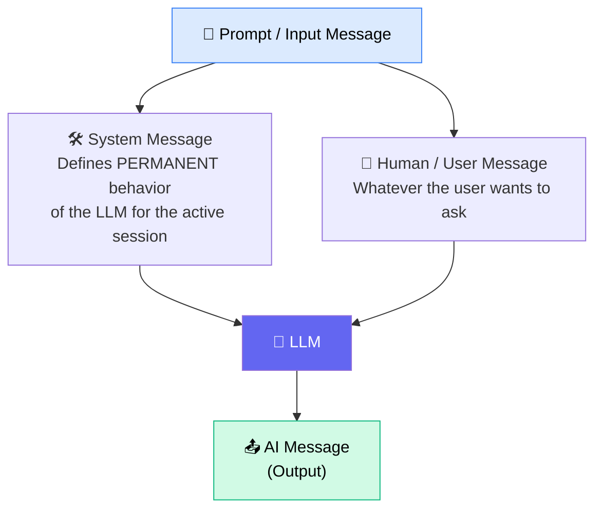
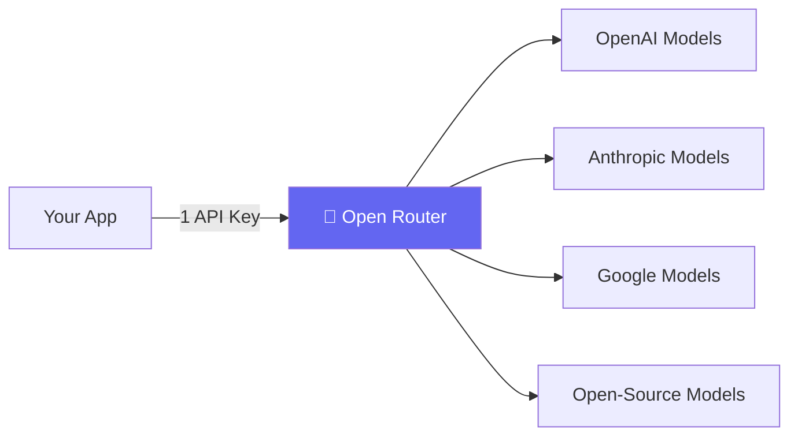
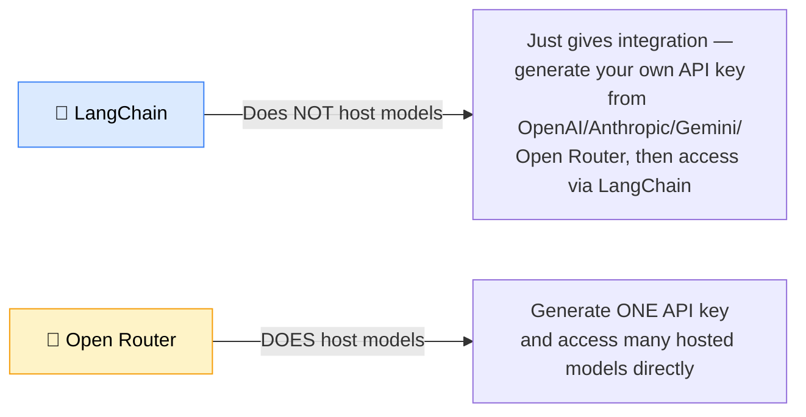
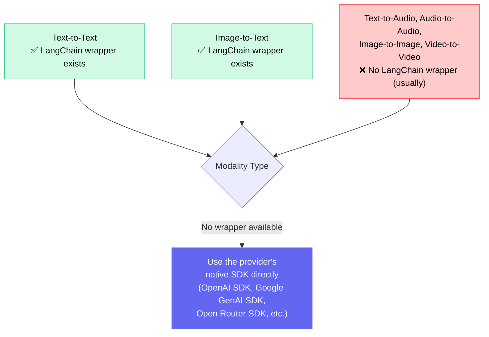

# 🤖 Generative AI Batch — Class 16 & 17
### 📋 Session Notes — Accessing LLMs via Different APIs & Multimodal AI

**🎙️ Instructor:** Sunny Savita
**⏱️ Duration:** ~3.5 hours (incl. dinner break + live doubt session)
**🎯 Session Type:** Live Practical Class + Doubt-Clearing Session

---

## 🧭 Where This Class Fits

This is a continuation of the model-access track. The previous class covered **OpenAI** and **Grok**; this class completes the picture by covering **Open Router, Hugging Face, Gemini,** and sets up **Olama** for the next session — plus a deep dive into **multimodal I/O** (text, image, audio).



---

## 🗺️ The 6 Ways to Access an LLM



> 💡 All of these are consumed through **LangChain**, so once you learn the pattern for one provider, switching providers is just a different import + API key — the `.invoke()` / message format stays the same.

---

## 🔑 Where to Keep Your Keys

All keys are set as **environment variables** inside a single `.env` file:

```
OPENAI_API_KEY=...
ANTHROPIC_API_KEY=...        # optional
GROQ_API_KEY=...             # free
OPENROUTER_API_KEY=...       # free (with limits)
HUGGINGFACEHUB_API_TOKEN=... # free
GOOGLE_API_KEY=...           # free tier available
```

⚠️ **Real incident from class:** Sunny accidentally exposed his Google API key while pushing notes to GitHub — GitHub's secret scanning caught it immediately, and the key had to be revoked and regenerated. **Lesson:** never commit `.env` files; always add them to `.gitignore`.

---

## 💬 Anatomy of a Prompt



Two equally valid ways to write it in LangChain:

| Method | Style | Notes |
|---|---|---|
| **Tuple format** | `("system", "..."), ("human", "...")` | Older syntax — still fully supported |
| **Message classes** | `SystemMessage(...)`, `HumanMessage(...)` | Newer/latest LangChain convention |

- System message = *not mandatory*. Skip it if there's no special behavior to set (e.g., image description tasks often skip it).
- Same rules apply whether you're using OpenAI, Grok, Open Router, Hugging Face, or Gemini — this consistency is **the entire value proposition of LangChain**.

---

## 🌐 Open Router — Deep Dive

**What it is:** A unified API/routing platform giving access to hundreds of LLMs (OpenAI, Anthropic, Google, open-source, etc.) through **one single endpoint and one API key** — functionally similar to Grok, but with a much larger model catalog spanning text, image, audio, video, and document-reading models.



### ⚠️ Free-Tier Limitation Hit Live in Class
While demoing Claude via Open Router, Sunny hit a **token cap error**:
- Free tier caps **input + output combined at ~2,048–2,659 tokens**
- Fix: explicitly set `max_tokens` (e.g., `max_tokens=2048`) in the model config
- Paid tier removes this restriction entirely

> 🔢 **Token counting tip:** Use OpenAI's public token-counter tool (search "OpenAI token counter") to estimate how many tokens a block of text will consume before sending it to any model.

---

## ⚖️ LangChain vs. Open Router — The Core Distinction



LangChain additionally provides, regardless of which model provider you use underneath:
Prompt templates · Memory management · Document loaders · Text splitters · Embeddings · Vector DB integration · Retrievers · Tools · Agentic framework/modules · Tracing & observability (via LangSmith) · Evaluation · Model switching

---

## 🤗 Hugging Face — Deep Dive

- Generate a **read/write token** from Hugging Face settings → store as `HUGGINGFACEHUB_API_TOKEN` in `.env`
- Pattern: `HuggingFaceEndpoint(repo_id=..., task=..., max_new_tokens=...)` → wrap with `ChatHuggingFace(llm=...)` → `.invoke(messages)`
- Any model listed on the Hugging Face Hub can be accessed by copying its **repo ID** (e.g., a DeepSeek or Qwen model) into the `repo_id` parameter
- Primarily demoed for **text-to-text**, but the same pattern extends to text-to-image, image-to-text, audio-to-text, text-to-audio

---

## 🌟 Gemini (Google) — Deep Dive

Pricing tiers: **Free → Paid → Enterprise**. Free tier gives limited access to:
Gemini 2.5 Flash · Gemini 2.5 Pro · Gemini 2.5 Flash-Lite · Flash Native Audio Preview · Gemini Embedding-001

> ⚠️ **"Exhausted resource" errors** on the free tier are common — caused by limited token/time windows on free-tier keys. Fix: generate a fresh API key (from a new ID) if you hit persistent limits.

### 🖼️ Multimodal Capabilities Demoed Live

| Modality | What Was Shown |
|---|---|
| **Image → Text** | Passed an image (6 dogs) + prompt "describe this image in detail" → detailed accurate caption generated |
| **Audio → Text** | Passed a base64-encoded `.mp3` + "transcribe this audio into English text" → accurate transcript matched the original recording |
| **Text → Audio** | Used the **Google GenAI SDK directly** (not LangChain) with a `speech_config` + voice persona (`core` = voice type, e.g., "Kore") → generated playable female-voice `.wav` output |

### 🔑 Key Insight: Not Every Modality Has a LangChain Wrapper



Other production-grade voice/audio platforms mentioned: **OpenAI TTS, ElevenLabs** (industry favorite, costly but high quality), **DeepGram, Azure Speech, AssemblyAI, Sarvam AI, Nova**.

---

## 🧬 Binary Encoding — Why It Matters

- Systems process everything in **0s and 1s**
- Images = collections of pixels → need encoding before being passed to a model
- Audio & video also require the same treatment
- **Base64** is the standard library/technique used to convert images, audio, or video into a binary-safe string that can be embedded in an API payload (`data:image/...;base64,<string>`)
- This same OCR-adjacent capability (extracting data from images) traces back to the **Vision Transformer (ViT)** research paper — previously done with CNNs, now increasingly done with transformer-based models. This is foundational for **multi-modal RAG pipelines**.

---

## 🛠️ Environment/Practical Troubleshooting Log (Live Class Issues)

| Issue | Cause | Fix |
|---|---|---|
| `pydantic_core` version mismatch on Open Router import | Environment created with wrong Python version (3.11 vs 3.12 conflict, since Olama needs 3.12) | Deleted `.env` folder, recreated venv with `uv venv --python <path>`, reinstalled via `uv pip install -r requirements.txt` |
| Google API key "forbidden" / leaked | Key accidentally exposed in a GitHub commit | Deleted key, generated a new one, restarted kernel (always restart after changing keys) |
| Open Router token limit error | Free-tier cap of ~2,048–2,659 combined tokens | Set `max_tokens` explicitly in model init |
| Gemini "API key expired" | Stale key referenced in code after key rotation | Passed key explicitly as `google_api_key=` parameter instead of relying only on env var |
| Streamlit app "file not found" | Wrong working directory when running `streamlit run app.py` | `cd` into the correct folder or pass the full file path |

---

## 🏗️ Homework / Assignments Given in Class

1. **Open Router:** Experiment with different models available on the platform (not just the one demoed).
2. **Hugging Face:** Try a different model per modality — text-to-image, image-to-text, audio-to-text, or text-to-audio — that wasn't used live in class.
3. **🎯 Capstone Assignment:**
   - Build a fresh notebook using models **not used live in class**, covering different modalities (text↔text, text↔image, text↔audio, image↔image, text↔video, etc.)
   - Once each works in the notebook, **convert it into a web app** (Streamlit, React, or plain HTML — your choice) that:
     - Accepts input in **any modality** (text, image, audio, video)
     - Generates the appropriate output accordingly
   - Sunny demoed doing this live using **GitHub Copilot** to auto-generate a `app.py` Streamlit file directly from the notebook — encouraging students to get comfortable with **"vibe coding"** since AI coding assistants (Copilot, Claude Code) are heavily used in industry now.
   - **Not required to deploy/host** — running locally is sufficient for the assignment.

---

## ❓ Live Doubt Session Highlights

| Student | Question | Answer |
|---|---|---|
| Bhagwandas | How do I do Q&A / conversational modeling over a document (e.g., ask "what did Nehru say")? | Requires building memory/state management yourself (per-user session IDs) — LangChain or LangGraph provide the plumbing; this is different from "context engineering," which is about compressing/designing context length to save tokens and cost |
| Yash | Mesh API coupon gave no working free models | Escalate specific feedback via email so it can be routed to the Mesh API partner team |
| Aslam | GitHub merge conflicts when pulling instructor's repo and adding own files | Never edit inside the cloned repo folder — clone into a separate folder, do personal coding in a different folder entirely |
| Kalyan | Gemini "API key invalid" | Was using a key from the wrong Google product page — needed to generate from Google AI Studio's dedicated Gemini key page specifically |
| Susmit | Which framework does the industry actually use — LangChain/LangGraph vs. Google ADK, AutoGen, CrewAI? | LangChain + LangGraph used ~99% of the time in industry; frameworks share similar core goals, so cross-learning is easy |
| Venkata Raju | Is everything before this (classic NLP/SOTA methods) just for interviews, and this section is where real GenAI begins? | Confirmed — yes, this marks the start of the "core Generative AI" track |
| Melwin | Wants to add agentic AI to a personal Angular + Spring Boot + SQL project for auto-generating course content/assignments | Asked to share the existing architecture (RAG vs. simple inference vs. DB-backed) via email so a tailored agentic flow can be suggested |
| Amit | Why is a system prompt needed if models are general-purpose? | System message ≠ domain training — it's runtime behavior/role setting (e.g., "reply only in English," "act as a solution architect") |
| Amit | Can fine-tuning be "undone"? | Yes — deleting the fine-tuned checkpoint/weight files (safetensors/PyTorch/GGUF) restores the original base model |
| Ruchi | GitHub push blocked repeatedly due to leaked secret even after rebase/reset | Recommended abandoning the tangled history — create a fresh repo instead of fighting the rebase |
| Dwipal | Preparing for a Deloitte Lead GenAI Engineer interview | Instructor shared a set of company-specific interview questions in chat |
| Amoljamkar | If system message is empty and instructions go into human message instead, is output the same? | Yes — functionally equivalent |
| Tej | Ran out of OpenAI quota mid-practice — how to keep following along? | Add $10–15 credit to OpenAI billing for practice, or substitute any free-tier provider (Open Router, Grok, Hugging Face) — code structure stays identical, only the model init line changes |
| Lakshmi | Transformer training questions: why is training parallelized but generation sequential (autoregressive)? What data trains coding/math ability in LLMs? | Training happens in parallel across the full input, but **inference/prediction is inherently sequential** (next-token prediction depends on prior tokens); models are pretrained on **broad internet-scale data**, which includes code and math corpora |
| Purna Chandra | Do banks like JPMorgan/Wells Fargo self-host LLMs for confidential data? | Both — many use **managed APIs** (Azure OpenAI, Azure AI Foundry, AWS Bedrock, Vertex AI) which provide enterprise security guarantees, and some also self-host smaller models on their own infra for specific tasks; confidential RAG data is commonly used with managed APIs under those security assurances |

---

## ✅ Action Items for Learners

- [ ] 🔑 Generate API keys for Open Router, Hugging Face, and Gemini; store all in `.env` (never commit this file)
- [ ] 🧪 Complete the Open Router "experiment with different models" homework
- [ ] 🧪 Complete the Hugging Face "try an unused modality/model" homework
- [ ] 🏗️ Build the capstone notebook + web app covering multiple modalities (text, image, audio)
- [ ] 💻 Download and install **Olama** locally ahead of the next class (~2GB download)
- [ ] 📁 Keep your own experiments in a **separate folder**, never inside the cloned course repo
- [ ] 📖 Review the Notion notes (Class 16 & 17) for all API key generation links
- [ ] 📅 Block time for the next 2–3 weeks — **Fine-Tuning, Hugging Face internals, and Unsloth** begin next class

---

*📝 Notes compiled from the full session transcript — Generative AI Batch, Classes 16 & 17, Sunny Savita.*
