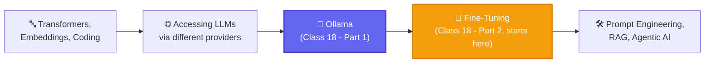
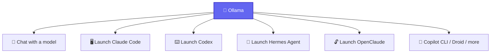
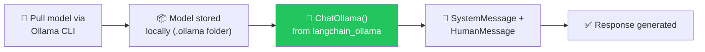
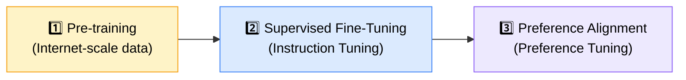
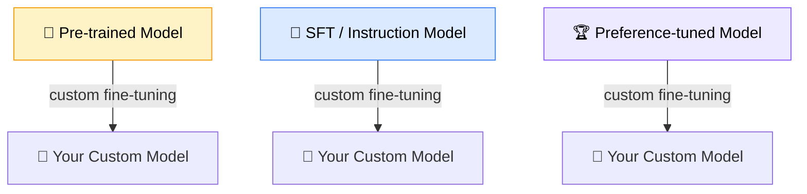
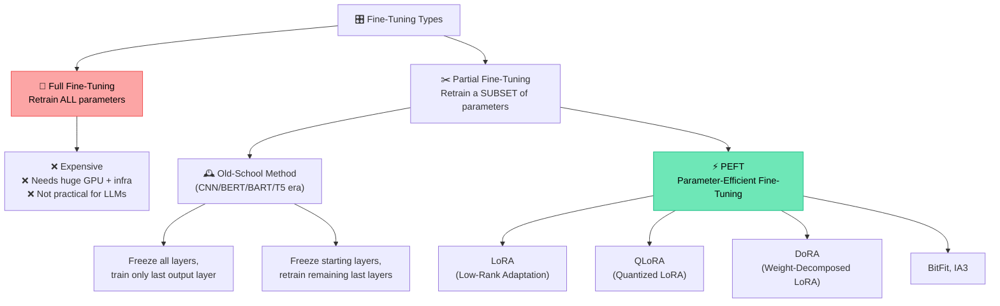

# 🧠 Full Stack GenAI Bootcamp 1.0
### 📋 Class 18 Notes — Ollama Deep Dive + Fine-Tuning Foundations

**🎙️ Instructor:** Sunny Savita
**⏱️ Duration:** ~4 hours (incl. dinner break + doubt session) | **🎯 Session Type:** Live Class + Live Q&A
**🗓️ Date:** 23 May 2026

---

## 🧭 Where This Class Fits

This is **Class 18** of the bootcamp. The instructor recapped that classes 1–17 covered transformers, embeddings, coding, and how to access different LLMs from different providers. Class 18 closes out the "LLM Access" module with a deep dive into **Ollama**, then opens the door into the next major module: **Fine-Tuning**.

> 💡 **Housekeeping:** Recordings appear on the dashboard's Live Class section within ~6–8 hours. Resources (Notion notes, Blackboard notes) live in the **"Full Stack GenAI Bootcamp 1.0"** GitHub repo. Assignments are submitted via a shared Google Form — cash/course prizes will now be given for standout assignment demos shown live in class.

---

## 🦙 Part 1: What Is Ollama?

Ollama started as a way to run LLMs locally, but has evolved into what Sunny calls a **complete AI operating system** — not just a model host.

### 🔌 Two Ways to Access a Model via Ollama

| | 💻 Local Download | ☁️ Ollama Cloud |
|---|---|---|
| Where it runs | Downloaded onto your own server/laptop | Hosted remotely by Ollama |
| Internet needed? | ❌ No — works offline | ✅ Yes |
| API key needed? | ❌ No | ❌ No (just sign in once) |
| Model selection | Any model you pull | **Limited** on free tier; more on paid tier |
| Privacy | ✅ Data stays on your machine | Data leaves your machine |
| Analogy | 🎬 Downloading a movie to watch offline | 📺 Streaming a movie on Netflix |

> 🖥️ **Hardware guidance:** Recommended **16GB RAM minimum** to run Ollama locally. Below that, don't bother — it will slow your system down. Small models (e.g., Llama 3.2 1B ≈ 1.3GB) are fine even on lighter machines; heavier models (5GB+) need real GPU/VRAM headroom.

### 🖥️ Core Ollama Commands (Demonstrated Live)

| Command | Purpose |
|---|---|
| `ollama -v` | Check installed version |
| `ollama list` | List models available locally |
| `ollama run <model>` | Pull (if needed) and chat with a model |
| `ollama pull <model>` | Download a model without starting chat |
| `ollama ps` | Show currently running models + resource usage |
| `ollama serve` | Serve a model over an address/port for HTTP requests |
| `ollama rm <model>` | Delete a locally stored model |

### 🔗 Accessing Ollama Models via LangChain

- Install: `langchain-ollama` must be in `requirements.txt` / your virtual environment.
- Code pattern shown: `from langchain_ollama import ChatOllama`, then instantiate with the exact model name shown in `ollama list`.
- ⚠️ You can only reference models you've already pulled locally (or free cloud models) — an unrecognized model name (e.g., `gpt-oss` without pulling it first) will fail.
- Same LangChain call pattern (SystemMessage/HumanMessage) works whether the model is local or cloud-hosted — LangChain is a **wrapper/common interface**, not a model replacement.

### ✅ Why Run Models Locally? (Q&A Recap)

1. 🔌 **Offline capability** — no internet required
2. 💰 **No API cost**
3. 🔒 **Better privacy** — data never leaves your machine (important for regulated industries like banking/finance)

---

## 🎯 Part 2: Introduction to Fine-Tuning

> *"Fine-tuning is a process of taking an already trained model and training it further on domain-specific/task-specific data so that it performs better for a particular use case."*

### 🏗️ The 3-Stage LLM Training Pipeline

| Stage | What Happens | Output Model |
|---|---|---|
| **Pre-training** | Decoder-only transformer trained on internet-scale data via **next-token prediction**. No input/output pairs — just language/grammar/context understanding. | 🧱 Raw / Pre-trained model |
| **SFT (Instruction Tuning)** | Trained on input→output conversational pairs; teaches the model to *follow instructions* | 💬 Instruction-tuned / SFT model |
| **Preference Alignment** | Trained on human-preference-labeled data (e.g., "Response 1 vs Response 2" — which do you prefer?) — popularized by OpenAI/ChatGPT | 🏆 Preference-tuned / Final model |

> 🔑 **Key insight:** You can pick a model from **any** of these three stages and perform your **own custom fine-tuning** on top of it — this custom step is either your own SFT or your own preference tuning.

### 🦙 Real Example: Meta's Llama Model Family

| Variant (on Hugging Face) | Trained On | Use When |
|---|---|---|
| `meta-llama/Llama-3-8B` | Raw internet data, next-token prediction only | Pure **text/data generation**, not conversational |
| `meta-llama/Llama-3-8B-Instruct` | Instruction (input/output) dataset | Building **chatbots, Q&A, conversational AI** |
| `meta-llama/Llama-3-8B-RLHF` | Human preference data | Best human-aligned responses (latest stage) |

**Worked example — Pharma company use case:**
- Goal: train a model on internal "molecule study" documents.
- Since training an LLM from scratch is impractical, pick an **open-source base model**, download it, and fine-tune on your own dataset.
- 🎯 Decision rule: If your goal is *just data/report generation* → start from the **raw pre-trained model**. If your goal is a *conversational assistant/chatbot* → start from the **instruction-tuned model**, then further fine-tune on your own data.

### ⚖️ Full Fine-Tuning vs. Partial Fine-Tuning

- **Parameters** = weights & biases — found in the Q/K/V weight matrices (self-attention layer) and the feed-forward network.
- Old-school freeze/retrain techniques (used in CNNs, BERT, BART, T5) **fail at LLM scale** — architectures are too huge.
- **PEFT** solves this: train only a small subset/smaller matrix of parameters → makes fine-tuning possible on a **single GPU with small VRAM**.
- 🏭 Industry favorite: **LoRA** (and its evolution, **DoRA**, using weight decomposition). QLoRA adds quantization (converting float weights to lower-precision/integer representations to save memory).
- Frameworks to be used in upcoming sessions: **Hugging Face** (the foundational base) and **Unsloth** (efficient fine-tuning).

### 🏆 Preference Alignment Techniques (Upcoming Topics)

| Technique | Used By | Core Method |
|---|---|---|
| **RLHF** (+ PPO algorithm) | OpenAI | Reinforcement Learning from Human Feedback |
| **GRPO** | DeepSeek | Updated/optimized variant of RLHF |
| **DPO** | Latest LLMs | No reinforcement learning required |
| **ORPO** | — | Updated variant of DPO |

> 📌 The class will hands-on cover **RLHF** and **DPO**; GRPO/ORPO understanding will follow naturally and may be given as self-study/assignment.

### 📝 Fine-Tuning Summary Table

| Concept | Answer |
|---|---|
| Full form of SFT | Supervised Fine-Tuning (= Instruction Tuning) |
| Full form of PEFT | Parameter-Efficient Fine-Tuning |
| Full form of LoRA | Low-Rank Adaptation |
| Is fine-tuning mandatory in real jobs? | No — **~99% of real-world work is RAG/agentic systems**, not fine-tuning. Still valuable for interviews & edge cases. |
| Full fine-tuning used in practice? | Rarely/never for LLMs — too resource-intensive |

---

## ❓ Live Q&A Highlights

| Topic | Answer |
|---|---|
| Is Ollama mandatory if my laptop has only 8GB RAM? | No — not required. Fine-tuning assignments will run on **Google Colab**, not local machines. |
| How to know which model to fine-tune from (raw vs. instruct)? | Depends entirely on use case: raw model → text/data generation; instruct model → conversational AI. Comes from research + experience. |
| Best practice for enterprises with sensitive data (banking, pharma)? | Prefer **managed cloud services** (Azure OpenAI, AWS Bedrock) over exposing data to public APIs; self-hosting is possible but adds heavy DevOps/infra overhead and often underperforms proprietary models. |
| Real-time projects — how many models get compared? | In practice, usually just 2–3: **OpenAI GPT-5**, **Claude (Opus/Sonnet)**, **Gemini (Pro/Flash)** — not dozens of open-source options. |
| Open Router vs. direct provider API? | Direct API (e.g., Anthropic) is best for heavy-reasoning tasks; Open Router / third-party routes are only "good enough" for lower-stakes tasks since they may serve partial/different checkpoints. |
| How much RAM/VRAM to run a model locally? | Rule of thumb: keep VRAM roughly **1.5–2× the model size** (e.g., a 12GB model needs ~16–24GB VRAM). |
| AWS vs Azure vs GCP for GenAI? | All three are comparable; AWS is often easiest to start with. GCP (Vertex AI) is a valid alternative but isn't covered in this course. |
| Is domain expertise (banking, telecom, pharma) required for AI roles? | Not critical for developer-level roles (skills transfer across domains), but **very important for senior/architect/strategist roles** making business decisions. |
| Career roles in AI, per instructor's real-world experience | Mainly two: **AI Developer** (junior/mid) and **AI Architect** (senior, 10–14+ yrs XP). "AI Strategist" exists mostly on paper. |
| Contract roles in AI in India? | Yes — available, especially through **GCCs (Global Capability Centers)**. |
| Should I also join the Agentic AI 3.0 specialization course? | Optional — this bootcamp already covers ~50–60% of agentic concepts; the specialization goes deeper into more frameworks for those who want to specialize specifically in agentic AI. |
| Securing API keys when deploying to Hugging Face Spaces | Never commit keys to GitHub — store them as **Spaces secrets** (environment variables). Optionally let end-users input their own API key in the app UI so your key isn't consumed. |

---

## ✅ Action Items for Learners

- [ ] 🦙 Install Ollama (only if you have 16GB+ RAM) and practice `ollama run`, `ollama list`, `ollama pull`, `ollama rm`
- [ ] 🔗 Practice accessing a local/cloud Ollama model via `ChatOllama` in LangChain
- [ ] 📄 Submit pending assignments via the Google Form (cash/course prizes now available for standout live demos!)
- [ ] 🧠 Review the 3-stage LLM training pipeline (Pre-training → SFT → Preference Alignment) before the next class
- [ ] 🔍 Explore Hugging Face to compare raw vs. instruct vs. RLHF versions of a model (e.g., search "Llama 3 8B", "Llama 3 8B Instruct", "Llama 3 8B RLHF")
- [ ] ☁️ Set up a Google Colab account ahead of the next session (fine-tuning practicals will run there, not locally)
- [ ] 📚 Read up on LoRA/QLoRA/DoRA basics ahead of the dedicated fine-tuning practical sessions

---

*📝 Notes compiled from the full Class 18 transcript — Full Stack GenAI Bootcamp 1.0, taught by Sunny Savita.*
