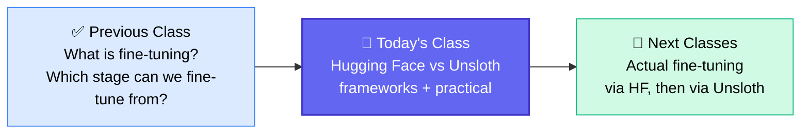
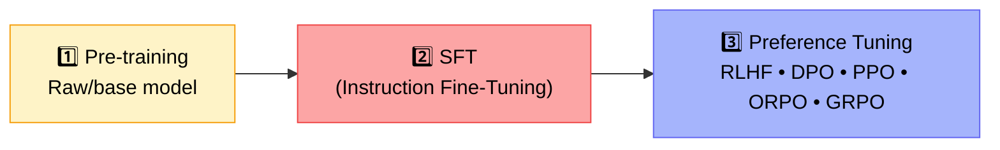
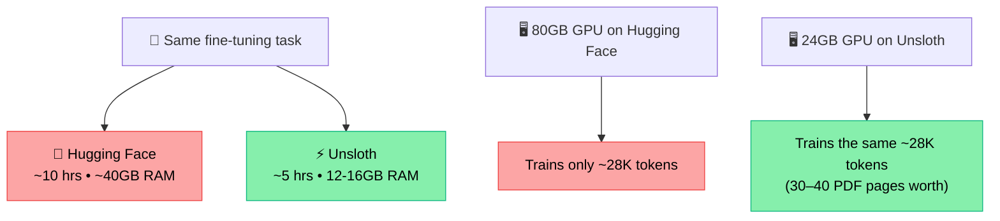
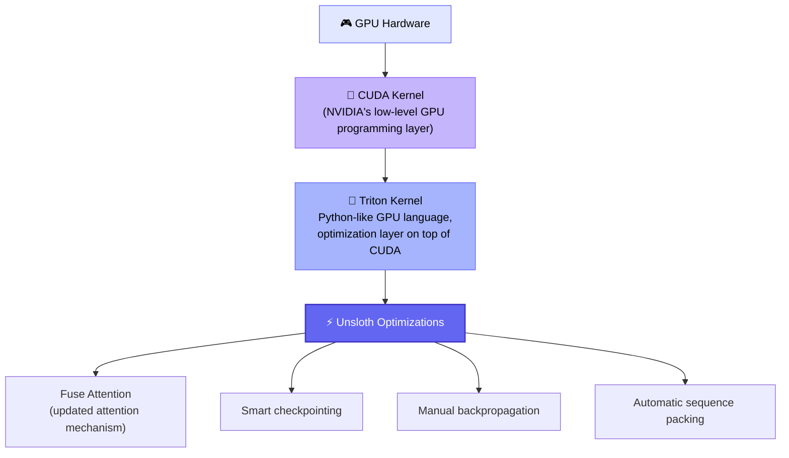
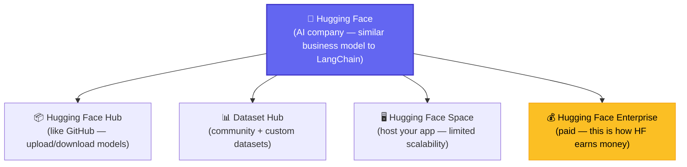
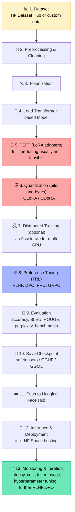
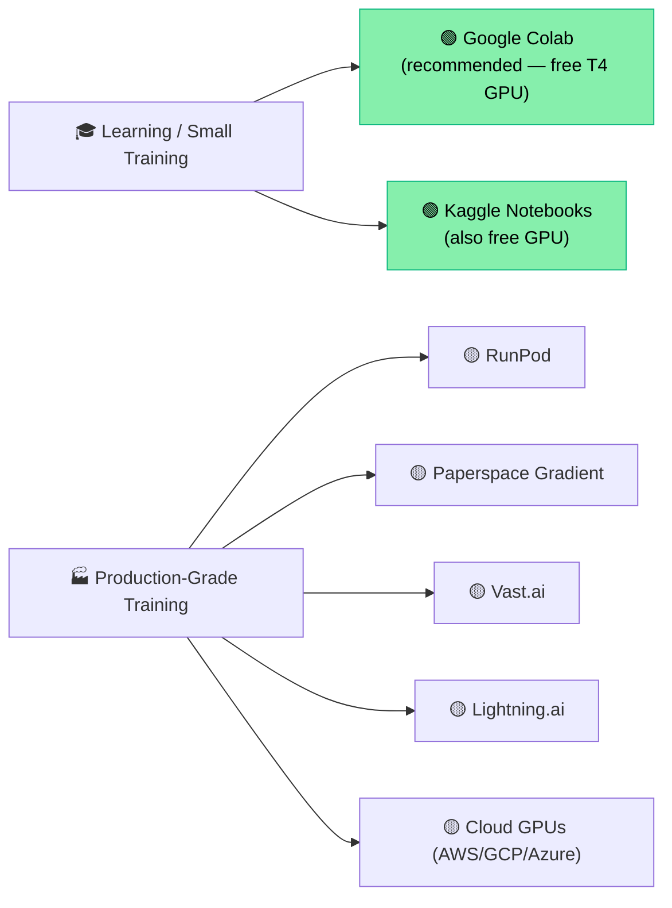
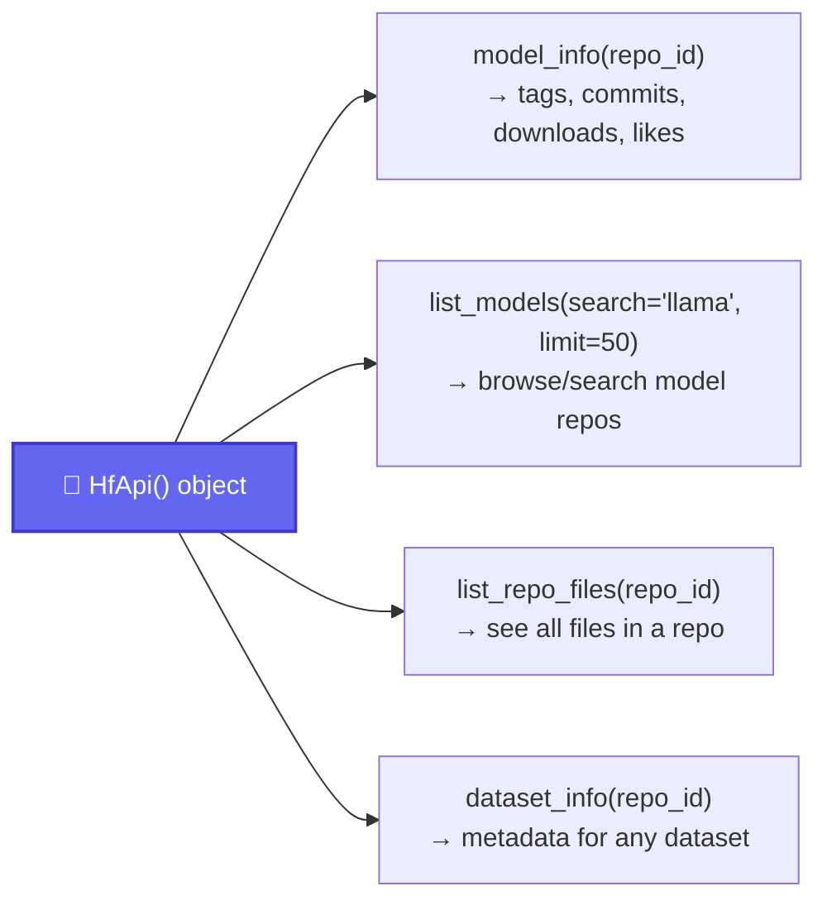
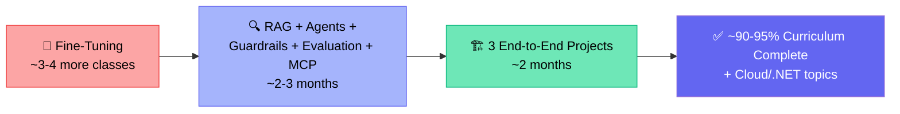

# 🧠 LLM Fine-Tuning Deep Dive: Hugging Face vs Unsloth
### 📋 Session Notes — Generative AI / Agentic AI Course

**🎙️ Speaker:** Sunny Savita (Generative AI Engineer, PwC)
**⏱️ Duration:** ~4 hours (incl. dedicated doubt session) | **🎯 Session Type:** Live Class + Q&A

---

## 🧭 Where This Class Fits

This is a continuation of the **fine-tuning module**. The previous class covered fine-tuning fundamentals; this session pivots to the **frameworks** used to actually implement it.



> 💡 **Recap check:** Fine-tuning = retraining a model's weights (in the decoder's self-attention & feed-forward layers) on custom data. It can be performed starting from *any* of the 3 LLM training stages — Pre-training, SFT, or Preference Tuning.

---

## 🏗️ The 3 Stages of LLM Training (Quick Recap)



✅ Fine-tuning can start from **any** stage — pre-trained/raw or already instruct-tuned.
✅ SFT methods split into **Old-school (full fine-tuning)** and **PEFT** (LoRA, DoRA, QLoRA — parameter-efficient).
✅ Preference alignment methods: RLHF, DPO (main focus), plus PPO/GRPO/ORPO (glimpsed).

---

## 🧰 Two Core Frameworks for Fine-Tuning

| | 🤗 Hugging Face | ⚡ Unsloth |
|---|---|---|
| Nature | The **foundation** of the fine-tuning ecosystem | An **ultra-optimized performance layer** built on top of Hugging Face |
| Speed | Slower, standard baseline | **2–3x faster training** |
| VRAM usage | High (e.g., 24GB to load a Llama-class model) | Very low (same task in ~7–8GB) |
| Long-context training | Runs into out-of-memory errors sooner | Can train 20K–30K+ tokens even on modest GPUs |
| Cost | More expensive (time = compute cost) | Cheaper, works even on **free GPUs** (e.g., T4) |
| Accuracy | Baseline | **No meaningful accuracy loss** — no approximation tricks used |
| Maturity | Older, foundational | Newer, but already an industry favorite for real-time fine-tuning |

> 🗣️ *"Whenever we are talking about the Hugging Face, so there is some use issue — the training is going to be slow, it's going to consume huge VRAM, and it is expensive."* — Sunny, explaining why Unsloth exists

### 📊 Concrete Comparison (as claimed by Unsloth)



---

## 🔍 Why Is Unsloth So Much Faster? (Under the Hood)



**Key talking points (interview-ready):**
- Unsloth builds **custom Triton kernels** on top of the standard CUDA kernel for faster tensor processing.
- It introduces an updated attention mechanism called **Fuse Attention**.
- It uses **flash attention**, manual backpropagation, smart checkpointing, and auto-sequence packing.
- Crucially, it does **not** rely on approximation/precision-cutting tricks — so accuracy loss is negligible.
- Backend stack: PyTorch → CUDA → Triton kernel → GPU. Internally still uses `transformers`, `peft`, and `trl`, just heavily optimized.

---

## 🧱 The Hugging Face Ecosystem



### 🆚 Native vs. Outsider Libraries

Not everything under the Hugging Face umbrella was *built* by Hugging Face — but it's all part of the ecosystem.

| ✅ Native (built by HF) | 🔗 Outsider (integrated, built elsewhere) |
|---|---|
| `transformers`, `datasets`, `tokenizers` | `bits-and-bytes` (quantization) |
| `peft`, `accelerate`, `trl` | `sentence-transformers` |
| `diffusers`, `evaluate`, `optimum`, `safetensors` | `timm`, `gradio`, `distil-label` |

> 💡 Similarly, in the RAG/Agentic space, **LangChain** is a separate open-source company (LangGraph, LangSmith, LangFuse) — it monetizes via enterprise support on LangSmith/LangFuse, just like HF monetizes via HF Enterprise. **Unsloth, Llama Factory, and Axolotl** are all libraries built *on top of* the Hugging Face fine-tuning foundation, with their own optimizations layered in.

---

## 🗺️ The Full Fine-Tuning Pipeline (Hugging Face Workflow)



> ⚠️ Note: guardrails and RAG are **not** part of this training-level pipeline — those apply during inference, if the model hallucinates or drifts off-flow.

---

## 💻 Where to Actually Run Training (GPU Options)

Local GPUs (gaming/commercial cards) are **not built for LLM training** — even a good local card (e.g., RTX 5070 Ti) can only do basic training. For this module, all practicals move to **cloud notebooks**.



### Google Colab Free Tier Resources (as demoed in class)
| Resource | Amount |
|---|---|
| GPU | T4 (free tier) |
| GPU RAM (VRAM) | ~15 GB |
| System RAM | ~12.7 GB |
| Disk | ~112 GB (≈53 GB free) |

**Paid tiers:** Colab Pro (~$11/mo, 100 compute units, faster GPU) → Colab Pro+ (~$58/mo) → Colab Enterprise (org-level).

---

## 🛠️ Practical Walkthrough — Hugging Face Hub API

Demoed live in a fresh Colab notebook (`Hugging Face Explore Live Class.ipynb`).

### 🔑 Step 1: Secrets Setup
- Generate a **Read Token** and a **Write Token** from Hugging Face → Profile → Access Tokens.
- Store them in Colab's **Secrets** (key 🔑 icon).
- ⚠️ **Important gotcha raised repeatedly in doubts:** the environment variable Hugging Face auto-detects is named exactly **`HF_TOKEN`** — not "HF Read"/"HF Write" (those custom names were just for the class's own understanding and won't be picked up automatically unless passed manually into the token parameter).

| Token Type | Use Case |
|---|---|
| 📖 Read Token | Downloading/reading models, datasets from HF Hub |
| ✍️ Write Token | Uploading your own model/dataset to HF Hub |

### 🧪 Step 2: `HfApi` Object — What You Can Do



### 💬 Step 3: Calling a Model for Inference

```python
from huggingface_hub import InferenceClient

client = InferenceClient(...)
response = client.chat.completions.create(...)  # prompt goes here
```

- This is a direct **API call** to Hugging Face — the model is not downloaded/hosted locally.
- The **same** call can be made via **LangChain's Hugging Face wrapper** (`ChatHuggingFace` + `HuggingFaceEndpoint`), which also supports prompt templates, structured output, and `RunnablePassthrough` — this becomes essential later in the RAG chapter.

> 🎯 Takeaway demoed: any free Hugging Face model can be pulled into a RAG or agentic pipeline via LangChain's wrapper.

---

## 📚 What's Deferred to Next Class

Sunny walked through (but didn't fully execute) a second, more detailed notebook covering:

- Different Hugging Face login methods
- Loading datasets for unsupervised pre-training, SFT, and RLHF; streaming large datasets
- Building & uploading a **custom dataset** in HF format
- Tokenization deep-dive: BPE, SentencePiece, custom tokenizer training
- Loading pre-trained tokenizers per model family (Llama, Mistral, Qwen, etc.)
- Loading models via `AutoModel` / `AutoModelForCausalLM`
- Downloading model files locally via `snapshot_download`
- Evaluation metrics (deferred to a dedicated evaluation chapter)

---

## ❓ Live Doubt Session Highlights

| Question | Answer |
|---|---|
| Where is "data" stored inside a 30GB model file? | Nothing — the model file size = the compiled weights/biases (learnable parameters), not raw training data. The model was *trained on* data, but doesn't store it. |
| How does the model "know" facts like who the PM is? | It was taught during training to predict the next token; it generates responses based on patterns learned, not stored memory. For facts beyond training data or that have changed, an app-level layer (RAG/agent) fetches fresh context from the web and feeds it into the prompt — the model itself has no built-in memory update. |
| Can we fine-tune closed models like Gemini/GPT/Claude? | Yes, but only via their provided fine-tuning APIs/classes — you can't download the underlying weights or control infrastructure. |
| Real-time industry choice: Hugging Face or Unsloth? | **Unsloth** — faster, industry-grade, strong community support, works across most model families. Hugging Face is taught first mainly to build foundational understanding. |
| RAG/Agents vs. Fine-tuning — which dominates in industry? | RAG and agentic pipelines are used far more often. Fine-tuning/retraining is not required for most use cases. |
| Are all Hugging Face models live/hosted 24×7 via API? | Yes — Hugging Face hosts community-uploaded models on their servers (like OpenAI hosts GPT), mostly free, though some advanced/paid API tiers may exist. |
| Do I need PyTorch/TensorFlow to do this course? | Not required for RAG, agentic apps, or fine-tuning (ready-made frameworks handle that) — only relevant if coding a neural network/LLM from scratch. |
| How to check if a fine-tuned/community model is trustworthy? | Check Hugging Face's Open Source Leaderboard / Arena Leaderboard for benchmark rankings. |
| Career advice: how to build a portfolio-worthy project? | Don't just build notebook demos — design a full pipeline: business requirement → high-level architecture → development → deployment. Combine AI logic with real software engineering (APIs, frontend, deployment). Also build a learning habit: daily exploration + regular content creation (blog/newsletter/video) deepens retention. |
| At which step does Colab actually consume GPU? | Only during model **training** (fine-tuning) — API calls, listing models, or fetching metadata don't touch the GPU. |

---

## 🗓️ Course Roadmap Shared in Class



> 📌 Prompt engineering is **not** a standalone chapter — it's folded into the RAG chapter.

---

## ✅ Action Items for Learners

- [ ] 🔑 Create Hugging Face Read Token and Write Token; store both under **`HF_TOKEN`** in Colab Secrets (not custom names) to avoid auth errors
- [ ] 💻 Set up a Google Colab account and connect to the free T4 GPU (Runtime → Change runtime type)
- [ ] 📓 Recreate the practical: install `huggingface_hub`, explore `model_info`, `list_models`, `list_repo_files`, `dataset_info`
- [ ] 🔗 Try calling a free Hugging Face model both via `InferenceClient` and via the LangChain `ChatHuggingFace` wrapper
- [ ] 📖 Review GitHub-hosted class notes for the full theoretical breakdown (Hugging Face vs. Unsloth)
- [ ] 🏆 Bookmark the Hugging Face Open Source Leaderboard for model trustworthiness checks
- [ ] ✍️ Start a personal habit of content creation (blog/notes/video) alongside the course to reinforce learning

---

*📝 Notes compiled from the full class transcript — LLM Fine-Tuning: Hugging Face vs. Unsloth, including the live doubt session.*
