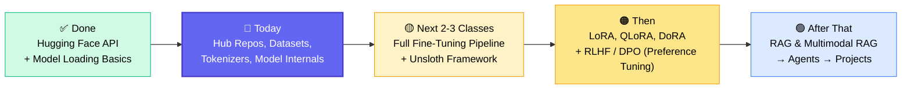
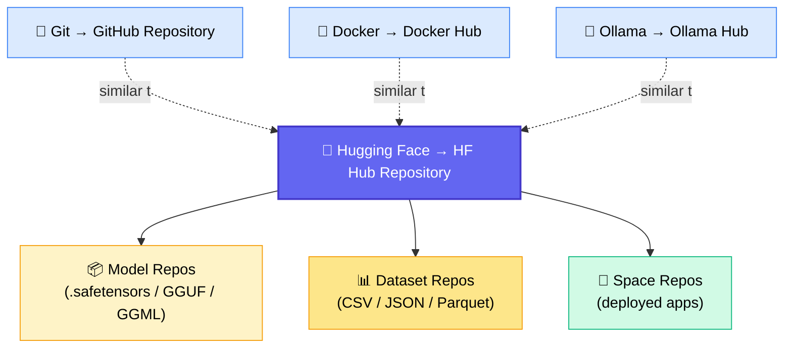
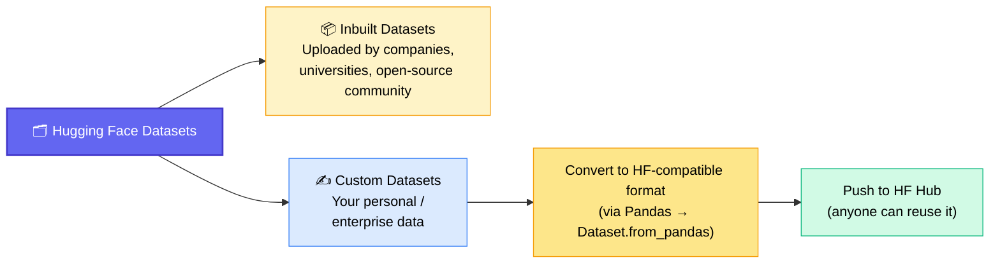
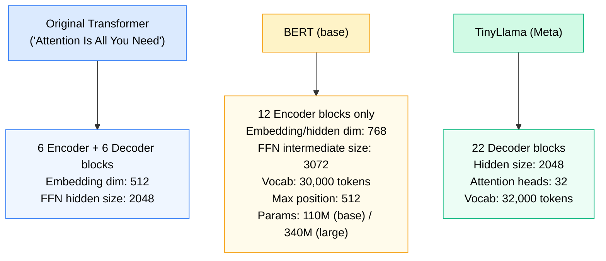

# 🤗 Hugging Face Deep Dive: Repositories, Datasets, Tokenizers & Models
### 📋 Live Class Notes — Generative AI Bootcamp (Fine-Tuning Chapter, Class 20)

**🎙️ Speaker:** Sunny Savita (Instructor) — with Yash Shukla assisting in backend chat
**⏱️ Duration:** ~4 hrs live class (with 2 breaks) + ~1.5 hr Doubt Session
**🎯 Session Type:** Live Class (30th May 2026) + Live Q&A / Doubt Session

---

## 🧭 Where This Class Fits

The batch is mid-way through the **Fine-Tuning chapter**. This session wraps up the remaining Hugging Face fundamentals before the group moves into a full, hands-on fine-tuning pipeline.



> 💡 **Note:** Pre-training itself is *not* performed in this course — it requires massive compute/resources. The course focuses on **Instruction Fine-Tuning (SFT)** and **Preference Tuning (RLHF/DPO)**, which are realistic for learners.

---

## 🗓️ Today's Agenda

| # | Topic |
|---|---|
| 1 | Remaining concepts of Hugging Face (Hub, repositories, tokens) |
| 2 | Dataset library — inbuilt vs. custom datasets |
| 3 | Tokenization — BPE, WordPiece, SentencePiece, custom tokenizers |
| 4 | Model loading — AutoModel classes & architecture internals (BERT walkthrough) |
| 5 | Downloading models locally (`snapshot_download`) |

---

## 🗂️ Hugging Face Hub = "GitHub for Models & Data"



- Trained models are **binary files** (`.safetensors`, GGUF, GGML) — never kept as `.pkl`/`.h5`.
- A repo can be created **manually** on the website ("New model / New dataset / New space") or **programmatically** from a notebook.
- Repos also hold metadata (`README.md`, `config.json`, `generation_config.json`).

### 🔑 Read Token vs. Write Token

| Token Type | Purpose | Default env variable |
|---|---|---|
| **Read Token** | Download / read anything from HF (models, datasets) | `HF_TOKEN` (if no explicit token is set) |
| **Write Token** | Upload / create repos / push files to HF | Must be explicitly used when writing |

✅ If no token is passed explicitly, Hugging Face falls back to the `HF_TOKEN` environment variable by default.
✅ Alternative login method: `notebook_login()` from `huggingface_hub` — prompts for the token directly inside the notebook if env-variable auth isn't working.

### 🛠️ Creating & Uploading to a Repository (code walkthrough)

```python
from huggingface_hub import HfApi

api = HfApi(token=hf_write_token)

# Create a model repository
api.create_repo(repo_id="username/testing-model-genai-bootcamp", private=False)

# Upload a file to it
api.upload_file(
    path_or_fileobj="local/path/dataset_info.json",
    path_in_repo="dataset_info.json",
    repo_id="username/testing-model-genai-bootcamp"
)
```

Getting my point? So repository creation + file upload is the same core workflow whether it's a model, dataset, or tokenizer.

---

## 📊 Dataset Library



### 🏗️ The Three Stages of LLM Training & Their Data Formats

| Stage | Also Called | Example Dataset (shown live) | Column Structure |
|---|---|---|---|
| **1. Pre-training** | Unsupervised | `wikitext`, `openwebtext` (8.1M+ docs, 40B+ tokens, ~38GB, streamed with `streaming=True`) | Single `text` column |
| **2. Instruction Tuning** | Supervised Fine-Tuning (SFT) | `tatsu-lab/alpaca` | `instruction`, `input`, `output` → combined into one `text` column for training |
| **3. Preference Tuning** | RLHF / DPO | Anthropic `hh-rlhf` | `chosen`, `rejected` |

> 💡 Different companies use different SFT formats — Alpaca-style (`instruction`/`input`/`output`) is one of the most common; OpenAI uses system/human/AI message roles instead.

### 🧹 Common Dataset Operations (via the `datasets` library)

| Operation | What it does | Example shown |
|---|---|---|
| `.shuffle()` | Randomizes row order | Reshuffling IMDB reviews |
| `.select(range(n))` | Takes a subset of rows | First 5,000 of 25,000 rows |
| `.filter(lambda x: ...)` | Filters rows by condition | Reviews under 100 characters |
| `.map(function)` | Adds a derived column | Added a `word_count` column |

✅ Inbuilt HF datasets are usually **already clean**; custom datasets almost always need some preprocessing.

### 📤 Converting a Custom Dataset (e.g., a Pandas DataFrame) to HF Format

```python
from datasets import Dataset
import pandas as pd

df = pd.DataFrame(my_dict_data)
hf_dataset = Dataset.from_pandas(df)

# Push to Hub (requires write token)
hf_dataset.push_to_hub("username/custom-data-live-bootcamp")
```

By default, Hugging Face stores pushed datasets in **Parquet format** (used for large/"big data" style storage, alongside ORC, RC, CSV, TSV, JSON, XLSX).

---

## 🔤 Tokenization

```mermaid
flowchart LR
    A["📝 Raw Text<br/>'I Love AI'"] --> B["🔡 Tokens<br/>[I] [Love] [AI]"]
    B --> C["🔢 Token IDs<br/>[101, 146, 1567...]"]
    C --> D["📐 Word Embedding"]
    D --> E["📍 Positional Encoding"]
    E --> F["🎯 Self-Attention"]
    F --> G["🧠 Feed-Forward Network"]

    style A fill:#dbeafe,stroke:#3b82f6,color:#000
    style B fill:#fef3c7,stroke:#f59e0b,color:#000
    style C fill:#fde68a,stroke:#f59e0b,color:#000
    style D fill:#e0e7ff,stroke:#6366f1,color:#000
    style E fill:#ede9fe,stroke:#8b5cf6,color:#000
    style F fill:#fca5a5,stroke:#ef4444,color:#000
    style G fill:#a5b4fc,stroke:#6366f1,color:#000
```



> ⚠️ Models never process characters directly — the system can only process **numbers** (token IDs).

### 🧬 Tokenizer Algorithms

| Algorithm | Full Name | Developed By | Strategy | Used By |
|---|---|---|---|---|
| **BPE** | Byte Pair Encoding | Open research (Sennrich et al., adopted by OpenAI) | Repeatedly merges most frequent character pairs | GPT models |
| **WordPiece** | — | Google | Maximizes language-model likelihood | BERT |
| **SentencePiece** | — | Google | Learns subwords directly (updated version of WordPiece) | T5, Mistral, Qwen (own variants) |

✅ Every LLM has its **own trained tokenizer**. Passing a model's repo name to `AutoTokenizer.from_pretrained()` automatically fetches the matching tokenizer.
✅ Tokenizers also handle non-English text — a Hindi example (`IndicBERT`) was demoed converting *"mujhe AI pasand hai"* into tokens.

### 🏋️ Training a Custom Tokenizer (BPE, from scratch)

```python
from tokenizers import Tokenizer, models, trainers, pre_tokenizers

tokenizer = Tokenizer(models.BPE())
tokenizer.pre_tokenizer = pre_tokenizers.Whitespace()

trainer = trainers.BpeTrainer(vocab_size=500)
tokenizer.train_from_iterator(corpus, trainer=trainer)

tokenizer.save("custom_tokenizer.json")

# Convert to HF-compatible format
from transformers import PreTrainedTokenizerFast
hf_tokenizer = PreTrainedTokenizerFast(
    tokenizer_file="custom_tokenizer.json",
    unk_token="[UNK]", pad_token="[PAD]",
    cls_token="[CLS]", sep_token="[SEP]", mask_token="[MASK]"
)
hf_tokenizer.save_pretrained("tokenizer_hf")
```

Once saved, it can be reloaded like any other HF tokenizer via `AutoTokenizer.from_pretrained("tokenizer_hf")`.

---

## 🧠 Loading Models & Reading Architecture Internals

### 🔧 AutoModel Classes — Choosing the Right "Head"

| Class | Loads | Output |
|---|---|---|
| `AutoModel` | Raw/base model (no head) | Processed vector (last hidden states) |
| `AutoModelForMaskedLM` | Encoder model + MLM head | Next-token / masked-word prediction (BERT-style) |
| `AutoModelForSequenceClassification` | Encoder + classification head | Class label |
| `AutoModelForTokenClassification` | Encoder + token-tagging head | Per-token labels |
| `AutoModelForCausalLM` | Decoder-only GPT-style models | Generated text (Llama, Mistral, GPT, Qwen, Gemma, Phi) |

> 💡 `AutoModel` alone gives you a **raw output** — a processed vector matrix, not a usable prediction. You need a task-specific head class to get actual predictions.

### 📐 BERT Architecture — Numbers Verified Live (via research paper + Claude + code)



**Method used to verify architecture facts:** downloaded the BERT research paper PDF → uploaded to Claude → asked *"explain this research paper, provide a complete summary of the architecture"* → cross-checked the numbers against `model.config` and layer inspection in code (`model.encoder.layer`).

> 🗣️ *"Nowadays, AI is very important. If you're not going to integrate AI into your work, into your learning, it's going to be very difficult for you to move ahead — you'll lose your productivity."* — Sunny Savita

### 💾 Downloading a Model to Local Disk (not just RAM)

```python
from huggingface_hub import snapshot_download

snapshot_download(
    repo_id="TinyLlama/TinyLlama-1.1B-Chat-v1.0",
    local_dir="download_model_on_disk",
    local_dir_use_symlinks=False   # False = copies actual files, not shortcuts
)
```

- Loading via `AutoModel.from_pretrained(model_name)` downloads the model into **volatile memory (RAM)** only.
- `snapshot_download()` persists the model files to **local disk** — useful for offline/Ollama-style local usage.

---

## 📅 Logistics: The IPL Final Poll 🏏

A live poll was run to decide whether to hold the next day's class (IPL final night) or move it to a weekday.

| Poll | Result |
|---|---|
| Hold class as scheduled vs. move to weekday | **57% → hold class**, 43% → weekday |
| End-of-session poll: cancel next class? | **62% → No (keep class)**, 38% → Yes (cancel) |

✅ Decision deferred to management; students informed via email/community chat if cancelled.

---

## ❓ Live Q&A / Doubt Session Highlights

| Question | Answer |
|---|---|
| I'm a fresher with weak placements — what role should I target? | Don't chase AI-only roles. Build strong fundamentals first (programming, DSA, web dev basics, APIs, cloud), then layer AI skills on top. Apply for technical roles (Python dev, associate) even if not AI-specific. |
| My resume only has "learning" projects — will that work? | No — reframe them as **Personal Project**, **Freelance**, or **Hackathon** categories, and always tie each to a specific business problem solved, not just "I learned X." |
| How do I actually land interviews? | Three-pronged: (1) rebuild resume around real problem-solving, (2) upload to job portals (Naukri, LinkedIn), (3) leverage referrals — most effective channel. |
| I'm a 12-yr experienced tech lead — is a role transition into AI realistic? | Yes — pair your architecture/leadership skills with AI so you can design AI-enabled enterprise applications; very in-demand combination. |
| How do I build a RAG chatbot over an internal enterprise app (e.g., AWS console config)? | Gather data from wherever it lives (DB, SharePoint, vault), consolidate it into one place, then build the RAG pipeline on top. |
| I only have 10 rows of custom data — Llama-3B fine-tune isn't learning my facts. | 10 rows is enough to *test the pipeline*, not to get real output. Scale incrementally — 100 → 500 → 1000+ rows for meaningful results. |
| How do I train a small model for a niche use case (e.g., child behavioral science)? | Define the problem → collect/format domain data → decide RAG-only vs. fine-tuning. Start with small base models (Phi-3 Mini, Qwen 2.5-3B, Gemma, Llama-3.2-3B) + LoRA. Evaluate for hallucination, and hybridize with RAG if needed. |
| My Streamlit app works locally but "deploy" fails on Streamlit Cloud. | The code must live in a connected **GitHub repo** (not just local) — push `app.py` + `requirements.txt`; the `.ipynb` notebook itself isn't needed for deployment. |
| Local Ollama (Qwen) model isn't reachable from my Streamlit app. | Route the connection through **LangChain's Ollama wrapper** rather than calling the local port directly — LangChain handles the backend connection more reliably. |
| Read token vs. write token — can a write token also read? | Not tested definitively in class; write tokens are intended for uploading, read tokens for downloading. Behavior should be verified per use case. |

---

## ✅ Action Items for Learners

- [ ] 📥 Download the updated notebook & handwritten notes from GitHub (Class 20, 30th May folder)
- [ ] 🔑 Practice creating both **model** and **dataset** repositories on Hugging Face Hub (read vs. write token)
- [ ] 📊 Load and explore at least one dataset from each stage: pre-training (`wikitext`), instruction tuning (`alpaca`), preference tuning (`hh-rlhf`)
- [ ] 🧹 Practice `.filter()`, `.select()`, `.shuffle()`, and `.map()` on the IMDB dataset
- [ ] 🔤 Train your own custom BPE tokenizer and push it to the Hugging Face Hub
- [ ] 🧠 Load BERT and a Causal LM (e.g., TinyLlama) with `AutoModel` vs. `AutoModelForCausalLM` and compare outputs
- [ ] 💾 Try `snapshot_download()` to save a model locally
- [ ] 📝 If prepping for interviews: request Sunny's 200+ scenario-based question bank via email
- [ ] 🔁 Revise the Transformer architecture session before the next class to connect the dots on encoder/decoder internals

---

*📝 Notes compiled from the full live class transcript — Hugging Face Deep Dive, Class 20 (30th May 2026), Generative AI Bootcamp with Sunny Savita.*
