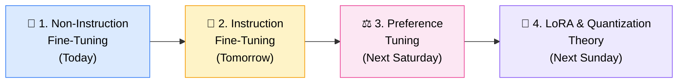
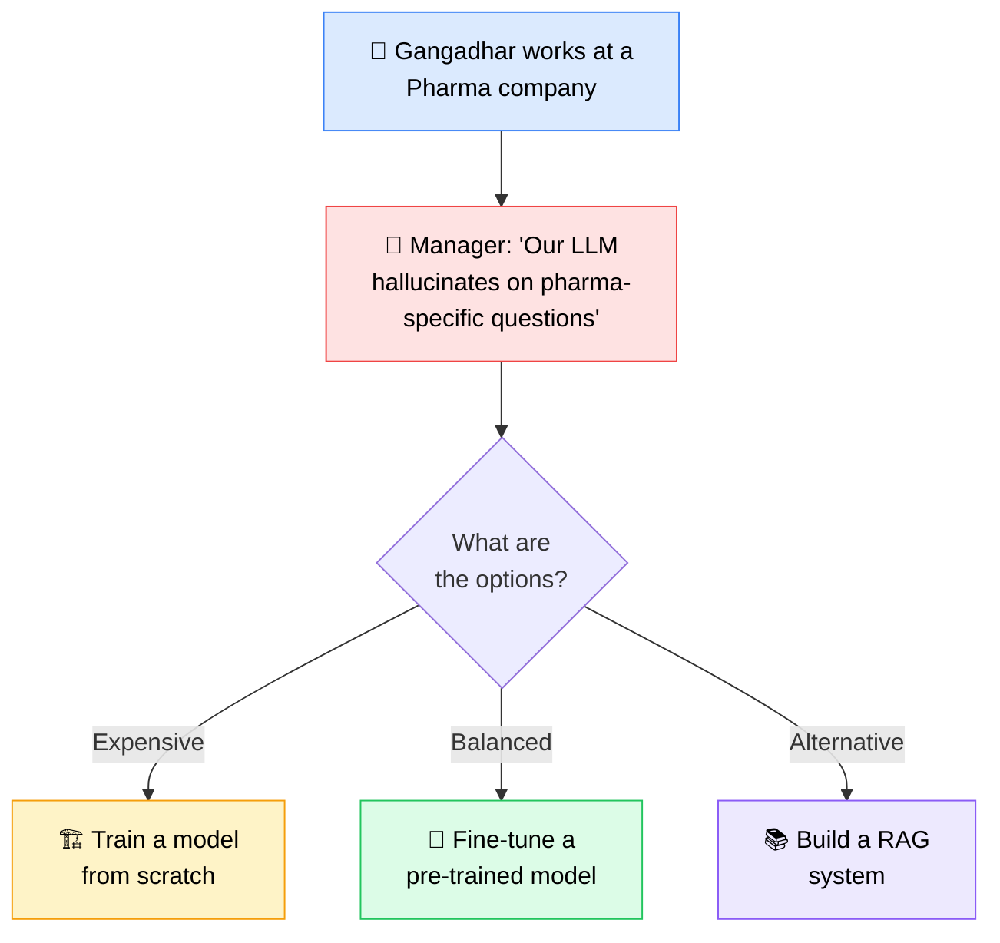
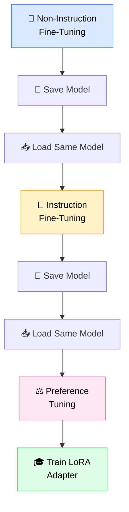
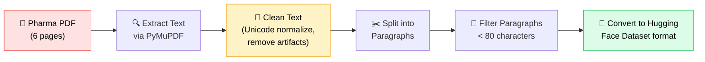
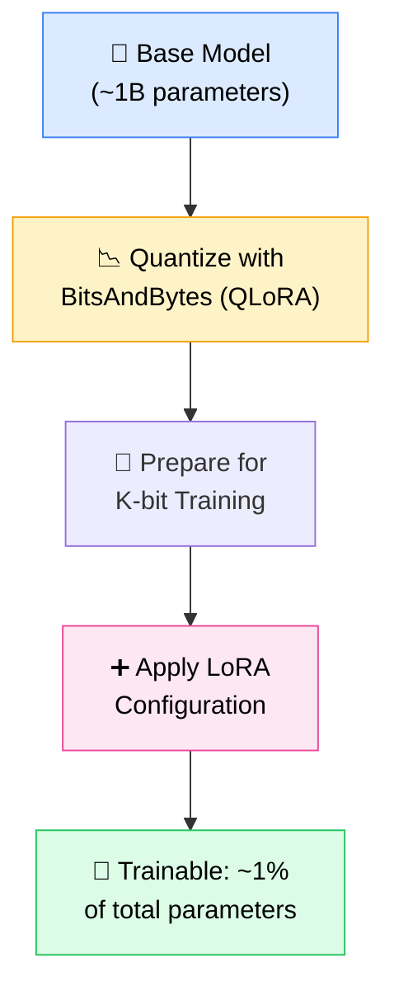

# 🧬 Fine-Tuning LLMs — Non-Instruction Fine-Tuning with Hugging Face
### 📋 Live Class Notes — Krish Naik Academy (Sunny Savita)

**🎙️ Speaker:** Sunny Savita
**⏱️ Duration:** ~4 hours (Class + Doubt Session)
**🎯 Session Type:** Live Practical Class + Live Doubt-Clearing Session

---

## 🧭 Where This Class Fits

This session picks up right after the **Hugging Face deep-dive** class and kicks off the **practical fine-tuning module**. The class is structured as a three-part journey — and today is Part 1.

> 💡 **Note:** Every class builds on a single running notebook — the same model gets non-instruction fine-tuned, then instruction fine-tuned, then preference-tuned, in sequence, exactly the way an enterprise like OpenAI would approach it.

---

## 📚 Logistics Recap

| Do ✅ | Why |
|---|---|
| Check the **GitHub repo** for notes, notebooks, datasets, and interview questions | Recording + notes are updated there after every class |
| Use the **community chat** to answer basic doubts yourselves | Encourages peer learning; don't wait only for the instructor |
| Watch out for date-change announcements in the community chat / email | Classes are occasionally rescheduled |
| Use **Gemini inside Google Colab** to explain any code block you don't follow | Built into Colab, free, and works instantly on pasted code |

> ⚠️ Sunny reminded the batch that WhatsApp/Telegram groups aren't used — all communication happens via the community forum and official channels.

---

## 🎯 The Business Problem (Framed as a Story)

Sunny sets up the entire module with a simple scenario:

✅ Training from scratch = too expensive for most companies.
✅ Fine-tuning = **retrain a pre-trained model on your own domain data.**
✅ RAG = pair a strong reasoning model with a retrieval layer (covered later in the course).

> 🏭 **Reality check from Sunny:** *"In enterprises, we are not fine-tuning models very frequently... instead, we put effort into RAG or multi-model RAG agents."* Fine-tuning is taught for conceptual depth and interview-readiness, not because it's an everyday production task.

---

## 🧩 The Three Flavors of Fine-Tuning

| Type | When You Use It | Data Format |
|---|---|---|
| 📄 **Non-Instruction Fine-Tuning** | You only have raw/unstructured domain data (PDF, DOCX, PPT, TXT) | Just a `text` column |
| 🎯 **Instruction Fine-Tuning** | You want the model to follow instructions / answer Q&A | `input` + `output` (or `messages`) columns |
| ⚖️ **Preference Tuning** | You want to align outputs to human preference (RLHF, DPO) | `chosen` + `rejected` columns |

> 🧠 Non-instruction fine-tuning is also called **domain-adaptive continuous pre-training** — the model just learns to predict the next token on raw domain text, the same way base LLMs are originally pre-trained.

---

## 🔁 The Full 3-Stage Pipeline (Same Model, Reused)

This is, in Sunny's words, the exact same layered approach used to build the GPT models behind ChatGPT — base pre-training → instruction tuning → preference alignment.

---

## 🛠️ Today's Practical: Domain-Adaptive Fine-Tuning on Pharma PDF Data

### 📥 Step 1 — Setup
- Open **Google Colab**, connect to a **GPU runtime** (free GPU access is the reason Colab is used)
- Install libraries: `PyMuPDF`, `datasets`, `transformers`, `accelerate`, `peft`, `bitsandbytes`, `sentencepiece`
- All parameters (paths, model name, LoRA config, training args) are centralized in a single Python **`@dataclass` Config class** — a standard practice for keeping fine-tuning runs organized

### 📄 Step 2 — Data Ingestion Pipeline

- Raw data (6 pages) → cleaned into **9 paragraph records**, each tagged with page number, character count, and a `text` column — the exact structure Hugging Face pre-training datasets (like Wikipedia or FinWeb) use
- Intermediate outputs are saved as `.jsonl` files (raw + processed) — standard practice for reproducibility, debugging, and compliance review
- Dataset converted to Hugging Face format using `Dataset.from_list()`

### 🔤 Step 3 — Tokenization & Grouping

| Concept | Explanation |
|---|---|
| **Tokenizer** | Converts text into token IDs; every model ships with its own matching tokenizer |
| **Padding** | Adding filler tokens (0s, or a special token like `EOS`) so every sequence in a batch matches the length of the longest one |
| **Pad token fallback** | If a tokenizer has no dedicated pad token, the `EOS` token is reused as the pad token |
| **Block size (512)** | All tokenized paragraphs are concatenated and re-chunked into fixed 512-token blocks — this is *not* padding, it's grouping for uniform training batches |
| **Labels = Input IDs** | For causal language modeling, Hugging Face internally shifts labels by one position for next-token prediction, so `labels` is simply a copy of `input_ids` |

### ⚙️ Step 4 — Model Loading, Quantization & LoRA

- **QLoRA** is used for GPU efficiency, lower memory footprint, and faster experimentation — practical for a Colab-style environment
- **LoRA (LoRA config → `get_peft_model`)** decomposes a large weight matrix into two much smaller matrices that approximate the same transformation, drastically cutting trainable parameters (~1 crore trainable out of ~1 billion total, in this example)
- A **Data Collator** handles batching, dynamic padding, and tensor conversion automatically

### 🏋️ Step 5 — Training & Saving

- `TrainingArguments` configured from the central config (epochs, batch size, gradient accumulation, learning rate, warm-up ratio, logging/eval/save steps)
- `Trainer` class (Hugging Face) ties together model + args + train/validation datasets + data collator
- `trainer.train()` kicks off training — completed quickly here due to the tiny 7-row dataset
- Output saved as a **LoRA adapter** (a small, separate set of weights in safetensors format) — *not* a full merged model yet
- Adapter can optionally be pushed to the **Hugging Face Hub**

### 🔮 Step 6 — Inference & Merging

- Reload the **base model** + **LoRA adapter** together via `PeftModel.from_pretrained()` for inference
- To make the fine-tuning permanent, the adapter can be **merged** into the base model's weights — required before this same model moves on to instruction fine-tuning
- Test prompts were run and the model generated responses successfully, confirming the pipeline worked end-to-end

---

## 📊 Key Concepts Explained on the Blackboard

### 🧵 Padding — In Plain English

| Sentence | Word Count | Padded To Match Longest |
|---|---|---|
| "I am Sunny" | 3 | + 3 pad tokens |
| "I am Sunny Savita" | 4 | + 2 pad tokens |
| "I am Sunny Savita AI" | 5 | + 1 pad token |
| "I am Sunny Savita AI mentor" | 6 | (longest — no padding needed) |

Padding tokens are added (0, a special token, or the EOS token) purely so every sequence in a training batch has identical length — mismatched lengths would break the training step.

### 🔢 LoRA — Matrix Decomposition, Simplified

> A large weight matrix (imagine ~1 billion parameters) is decomposed into two much smaller matrices whose multiplication approximates the original matrix's meaning. Training only touches these smaller matrices — reducing trainable parameters by roughly 99% while preserving most of the model's learned behavior.

### 🧱 Grouping Text into Blocks

If a tokenizer converts your corpus into (say) 1,300 tokens and `block_size = 512`, the data is split into:
- Block 1 → tokens 1–512
- Block 2 → tokens 513–1024
- Remaining tokens → dropped or reformed into further blocks

This keeps every training example an identical, model-friendly length.

---

## ❓ Live Doubt Session Highlights

| Question | Answer |
|---|---|
| How do we evaluate the fine-tuned model? | Evaluation happens on the held-out validation split; metrics like BLEU score, perplexity, or custom manual criteria can be used — full evaluation is a later topic |
| Is the LoRA adapter merged with the model automatically? | No — until you explicitly run the merge step, the adapter exists as a separate, small set of weights layered on top of the base model |
| Can this notebook be reused as boilerplate for any fine-tuning task? | Yes — the pipeline (load → clean → tokenize → quantize → LoRA → train → save → infer) stays constant; only the model name, data source, and preprocessing details change per project |
| How should tables inside PDFs be handled during data cleaning? | Convert the table into Markdown format (or summarize it) and store it inside the same `text` column — no special table-parsing pipeline is required for pre-training data |
| Do OpenAI/Anthropic release their fine-tuned models or techniques? | No — proprietary training techniques and model weights are kept as trade secrets; only select models/tools are open-sourced |
| Can I swap the tokenizer for a different one to improve accuracy? | No — every pre-trained model ships with a matching tokenizer that must be used; tokenizers aren't interchangeable across models |
| How do enterprises route between multiple LLMs (public + fine-tuned)? | Via an **LLM Gateway** — a router that directs each query to the right model (e.g., domain-specific queries to the fine-tuned model, general tasks to a public model) |
| What if I don't have prior AI/ML background? | Expect this module to feel harder than others — like a tough chapter in a syllabus. Revisit the recording, take notes by hand, and use AI tools (ChatGPT/Gemini/Claude) to explain code blocks line by line |

---

## 🧑‍🏫 Instructor's Learning Philosophy

> *"First, iterate onto the solution — at least if you're getting 50% to 70%, that is fine. Then, again, revise the thing."* — Sunny Savita

- 🐢 It's okay not to understand every line on the first pass — full theoretical explanations of LoRA, QLoRA, and padding are scheduled for upcoming sessions
- 🔁 Concepts repeat across the non-instruction → instruction → preference-tuning sequence, so familiarity builds naturally over 2–3 classes
- 🤖 Use AI assistants (Gemini in Colab, ChatGPT, Claude) to get code explained in simple language when reading isn't enough
- ✍️ Self-study (reading, writing, working through code independently) builds longer-lasting understanding than passively watching recordings

---

## ✅ Action Items for Learners

- [ ] 📓 Go through the shared **non-instruction fine-tuning notebook** end-to-end before the next class
- [ ] 📂 Pull the latest notebook, dataset, and interview questions from the **GitHub repo**
- [ ] 🔑 Set up a Hugging Face **read/write token** and test pushing a small repo to the Hub
- [ ] 🧠 Review the **padding**, **block size**, and **LoRA decomposition** explanations before tomorrow's class
- [ ] 🗓️ Block tomorrow's session for **Instruction Fine-Tuning** on the same model
- [ ] 🗓️ Block next Saturday for **Preference Tuning**, and next Sunday for **LoRA/QLoRA/Quantization theory**
- [ ] 💬 Post any unresolved doubts in the community chat or bring them to the next live doubt session

---

*📝 Notes compiled from the full class transcript — Non-Instruction Fine-Tuning with Hugging Face, Krish Naik Academy (Sunny Savita).*
