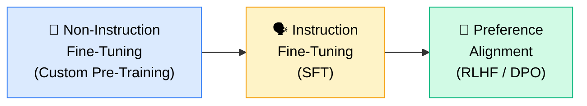
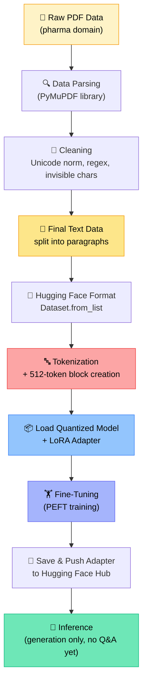
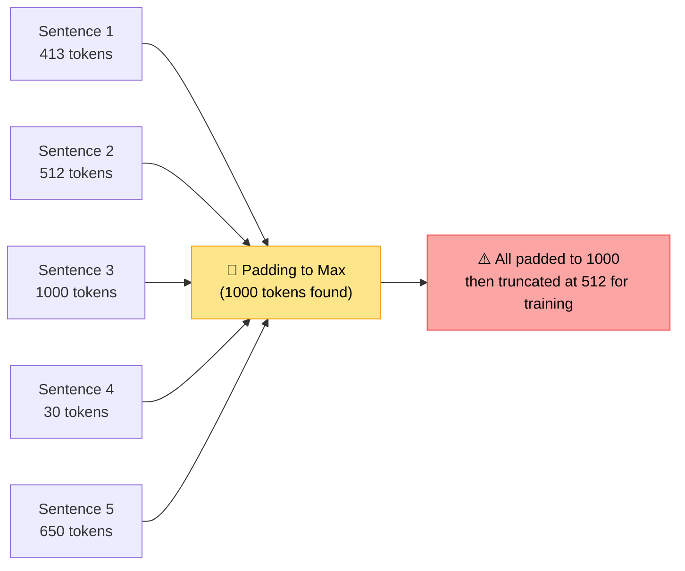
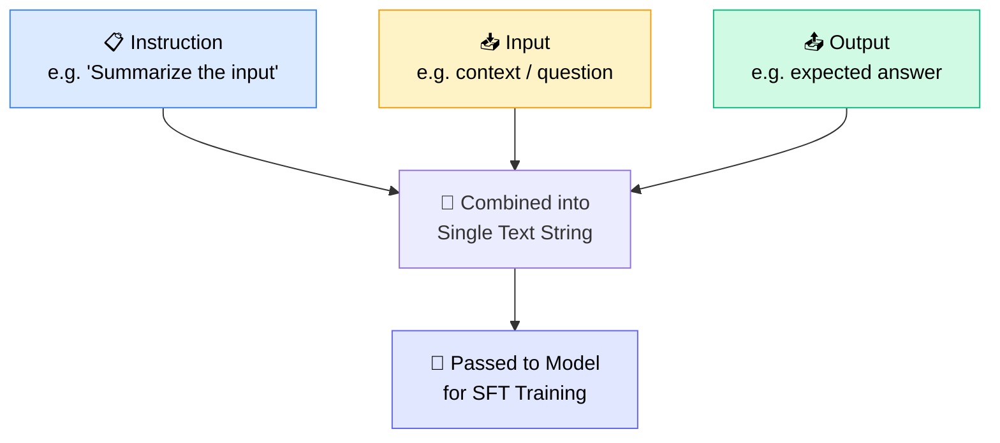
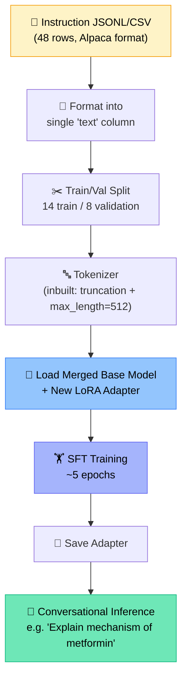
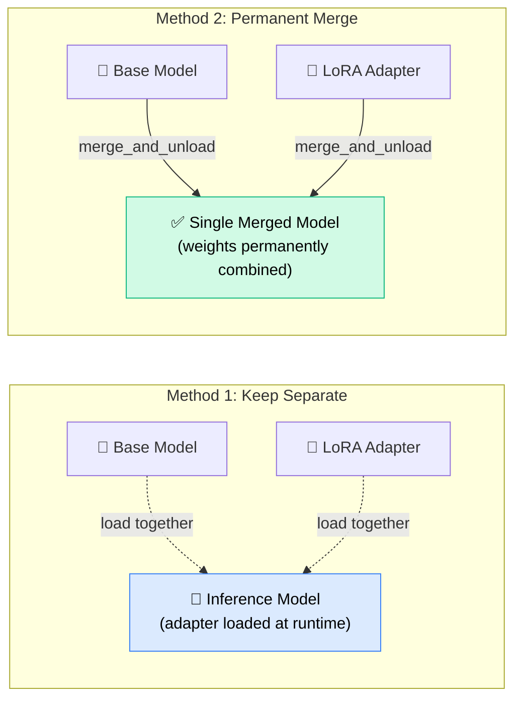
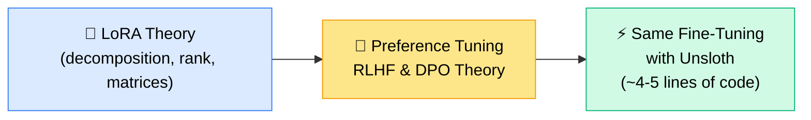

# 🧬 End-to-End LLM Fine-Tuning: Non-Instruction, Instruction & Preference Data
### 📋 Session Notes — Sunny Savita

**🎙️ Speaker:** Sunny Savita (with Yash Shukla supporting doubts)
**⏱️ Duration:** ~4 hours (incl. 20-min break + extended doubt session)
**🎯 Session Type:** Live Coding Walkthrough + Q&A
**📓 Notebook:** *End-to-End LLM Fine-Tuning — Non-Instruction, Instruction & Preference Data with Hugging Face* (shared via GitHub)

---

## 🧭 Where This Class Fits

This is a **revision + continuation** class. The previous session covered **non-instruction fine-tuning** (custom pre-training) on raw pharma PDF data. This session cleans up that code, revises it quickly, then moves into **instruction fine-tuning** on the same domain — building toward preference alignment (RLHF/DPO) in a future class.

> 💡 **Today's coverage:** Stage 1 (recap) → Stage 2 (full walkthrough). Stage 3 (preference tuning) + LoRA theory are promised for the **next class**.

---

## 🏗️ The Three Stages of LLM Training

| Stage | What Happens | Model Capability After |
|---|---|---|
| 1️⃣ **Pre-training** | Model learns from raw/domain text (here: pharma PDFs) | Understands domain vocabulary & patterns, but **can't hold a conversation** |
| 2️⃣ **Instruction Fine-Tuning (SFT)** | Model learns from instruction–input–output triples | Becomes **conversation-ready**, can answer questions |
| 3️⃣ **Preference Alignment** | Model learns *how* humans want answers (RLHF/DPO) | Learns **human-preferred style/behavior** of response |

> 🗣️ *"So, guys, if we're talking about the LLM training… the first stage is called the pre-training, the second stage is instruction fine-tuning, and the third stage is preference alignment."* — Sunny Savita

---

## 🔁 Recap: Non-Instruction Fine-Tuning Pipeline

### 🧹 Cleaning Notes
- Regular expressions (`re` module) power most text cleaning — **no need to master regex manually**, just ask Claude/ChatGPT for the right pattern-detection code for your use case.
- Paragraphs shorter than **80 characters** are dropped (likely headings/noise, not useful for training).
- Cleaned + raw data both saved as **JSONL** (`pharma_pages_RAW.jsonl`, `pharma_paragraph_process.jsonl`).

---

## 🔤 Tokenization & The 512-Token Block (Key Clarification)

This was the part that confused many students last session — Sunny dedicated significant blackboard time to it.

### Two approaches compared:

| | 🛠️ Custom Block-Building (Approach 1 — used for non-instruction) | ⚙️ Inbuilt Tokenizer Padding (Approach 2 — used for instruction) |
|---|---|---|
| How it works | Concatenate **all** tokens across paragraphs, then chop into fixed 512-token blocks; drop leftover remainder | Tokenize each example individually, pad/truncate to `max_length=512` |
| GPU utilization | ✅ High — minimal wasted tokens | ⚠️ Lower — lots of padding on short examples |
| Best for | Continuous pre-training, industry-style causal LM training | Beginner-friendly, small demos, simple notebooks |
| Trade-off | More code complexity | Loses information via truncation on long, wastes compute on padding |

> 🧠 **Core idea:** Padding = adding filler tokens (EOS token reused as pad token) so every sequence matches the batch's max length. Padded positions get label `-100` so **PyTorch ignores them** in the loss calculation — the model shouldn't "learn" from filler.

---

## 🧮 Causal Language Modeling — How Input/Output Pairs Are Built

Sunny demonstrated this with a blackboard example: **"You need to change your setting to get notification."**

| Step | Input (shifted) | Predicted Output |
|---|---|---|
| 1 | You, Need, to | change |
| 2 | Need, to, change | your |
| 3 | to, change, your | setting |
| 4 | change, your, setting | to |

> 🔁 This "shift by 1" logic is exactly what `input_ids.copy() → labels` achieves inside Hugging Face — **you don't need to build it manually**, the library handles it once labels = input_ids.

---

## 🗣️ Instruction Fine-Tuning: The Alpaca Format

Once the base model understands domain patterns, it still can't hold a conversation. Instruction fine-tuning (SFT) fixes this using structured **instruction / input / output** triples.

### 📌 Alpaca Format Rules
- **All three fields present:** `instruction` = task description, `input` = context/data, `output` = expected answer.
- **No separate instruction?** Put the direct question straight into the `instruction` field and leave `input` blank.
- This format was created by a university (Stanford's Alpaca project) and is **industry-standard** for SFT — also seen on Hugging Face under datasets like `tatsu-lab/alpaca`.
- ChatGPT-style format is an alternative (`system` / `user` messages) — also valid, but Alpaca is simpler and widely used.

### 🏭 How Enterprises Source Instruction Data (Real-World Methods)

| Method | Description |
|---|---|
| 👤 **Manual creation** | Domain experts/data teams write Q&A pairs by hand |
| 📄 **Document → Q&A conversion** | Convert existing docs into Q&A pairs (manually or via AI-assisted synthesis) |
| 💬 **Existing support conversations** | Mine support tickets, chat transcripts, email threads |
| 🤖 **Synthetic data generation** | Feed raw documents to an LLM with instructions to generate Q&A pairs — **most common approach today** |

> 🗣️ *"OpenAI hired a very big team just to curate this Q&A data — hundreds and thousands of people were working just for creating this conversational data."* — Sunny Savita, recalling his own 2021 NLP data-annotation work (BERT project, ~1–5K annotations/day)

---

## ⚙️ Instruction Fine-Tuning Walkthrough (Same Pipeline, New Data Shape)

✅ **Key takeaway:** The entire fine-tuning pipeline (config → tokenize → load quantized model → LoRA → train → save) is **identical** to non-instruction fine-tuning. The **only real difference is data formatting** — raw paragraphs vs. instruction/input/output strings.

---

## 🧩 LoRA Adapters: Merge vs. Load-Separately

Sunny explained two ways to combine a trained LoRA adapter with a base model:

| | Method 1 (Load Separately) | Method 2 (Merge & Unload) |
|---|---|---|
| Function used | Load base model + adapter together | `model.merge_and_unload()` |
| Storage | Two separate artifacts | One combined model |
| Flexibility | Swap adapters anytime | Permanent — good for final deployment |

> 🏢 **Industry insight:** *"Whoever is training their own large language model — they are not training the LLM from scratch. They are training a LoRA (or DoRA) adapter and merging it with a base model. That's it."*

### 🔢 Quantization vs. LoRA — Quick Distinction
- **LoRA** = decomposing a big weight matrix into smaller matrices using a *rank* concept → fewer trainable parameters.
- **Quantization** = converting high-precision numbers (float32, 4 bytes) into lower precision (int8, 1 byte) → saves memory, faster loading.
- Both are combined as **QLoRA** for efficient fine-tuning on limited GPU (e.g., free-tier Colab T4).

---

## ❓ Live Doubt Session Highlights

| Question | Answer |
|---|---|
| Will domain-specific pharma terms get poorly tokenized by a general Llama tokenizer? | Possible — you can **fine-tune or build your own custom tokenizer** on your dataset, but Llama-compatibility must be verified |
| What's "packaging" vs "padding"? | Same idea — "packaging" is just Sunny's informal term for building fixed-length (512-token) blocks |
| Do general models like ChatGPT/Claude know every domain deeply? | No — they're general-purpose, trained on huge internet data. They can hallucinate on niche domain terms; **fine-tuning or RAG** fixes this |
| How is LoRA different from old CNN techniques (freezing ResNet/VGG layers)? | Old methods froze specific *sequential layers*. LoRA instead **decomposes weight matrices via rank**, freezing the full base model and training only small adapter matrices — not tied to "layer position" |
| How many epochs should I use? | It's a **hyperparameter** — decided empirically through experimentation (500, 1000, 1500...), not a fixed rule |
| What's a "good" loss number? | No universal answer — depends on business-accepted accuracy (e.g., a company may accept 75% accuracy / 25% loss) |
| Why keep `input` empty in some instruction rows? | If there's no separate instruction, the direct question can go in the `instruction` field with `input` left blank (or vice versa) — both are valid Alpaca patterns |
| Can a LoRA adapter trained on Llama be attached to Claude/Anthropic models? | No — Anthropic models are **proprietary**, not fine-tunable this way. Only open Hugging Face ecosystem models support this |
| RAG vs. Fine-tuning — which to choose? | **~90% of real-world problems are solved with RAG** (cheaper, simpler, no retraining when data updates). Fine-tuning is reserved for the ~10% of cases where budget + specific need for a hosted, trained model exists |
| Can guardrails prevent PII leakage from a fine-tuned model? | Yes — via **explicit guardrail libraries** (OpenAI Guardrails, NeMo Guardrails, Guardrails AI) applied at the output-verification layer, not by "telling" the model itself |
| Can this pipeline work with SQL/SQLite hospital data instead of PDFs? | Yes — same pipeline. Query the DB via Python SDK, dump into an intermediate JSONL/CSV file (better for **traceability**), then follow the same fine-tuning steps |
| Is LoRA mandatory, or can full fine-tuning be done directly? | LoRA (or QLoRA) is essentially required in practice — full fine-tuning of billions of parameters causes **out-of-memory errors** even on notebook-scale demos |
| Do PyTorch/TensorFlow need deep mastery for this course? | They're low-level libraries powering Hugging Face's classes underneath. For fine-tuning with Hugging Face, deep PyTorch isn't mandatory — but check the "Transformer From Scratch" material for deeper understanding |
| Can trained models/adapters be kept off Hugging Face (local only)? | Yes — Hugging Face Hub upload is **optional**. Models can be zipped, stored in Drive/local system, and reloaded anytime via `AutoModel`/`AutoTokenizer` |

---

## 🛠️ Practical/Tooling Notes from the Session

- ⚠️ **Google Colab free tier** hit GPU/user limits mid-session — Sunny switched Gmail accounts and considered purchasing **Colab Pro**.
- 🔄 Colab runtime disconnects **wipe all local files** — best practice is to persist outputs to **Google Drive** rather than the ephemeral Colab filesystem.
- 📁 GitHub repo is the canonical source for the **notebook, resources, and handwritten notes** (uploaded post-class).
- 🐍 No need to memorize regex or tokenizer internals from scratch — **use AI (Claude/ChatGPT) to generate cleaning code** on demand.

---

## 🧠 Early Stopping (Quick Definition)

> If training loss stops decreasing and plateaus (e.g., flat from epoch 100–130), training is **stopped early** to save compute/resources rather than running wastefully to a fixed epoch count.

---

## ✅ Action Items for Learners

- [ ] 📥 Download the updated, cleaned notebook from GitHub (`End-to-End LLM Fine-Tuning...` — includes non-instruction, instruction, and preference sections)
- [ ] 🔁 Revise the entire non-instruction + instruction fine-tuning pipeline before the next class
- [ ] 🧪 Practice: run the notebook with different epoch counts (3 → 10) and observe the loss trend
- [ ] 📝 Review the shared handwritten notes on GitHub for the LoRA/quantization blackboard explanations
- [ ] ❓ Bring any unresolved doubts to the next doubt session — LoRA theory & RLHF/DPO will be covered in detail
- [ ] 📄 Try the pipeline on your own PDF/domain data (one student demoed this with a research paper — worked well)
- [ ] 🎯 No formal assignment this week — focus purely on revising the full solution

---

## 🔮 What's Coming Next

> 🗣️ *"Two more classes — preference tuning theory in one, LoRA + RLHF theory in the other. Then the same practical, but with Unsloth, where everything is abstracted to hardly 4-5 lines."*

---

*📝 Notes compiled from the full session transcript — End-to-End LLM Fine-Tuning (Non-Instruction, Instruction & Preference Data), Sunny Savita.*
