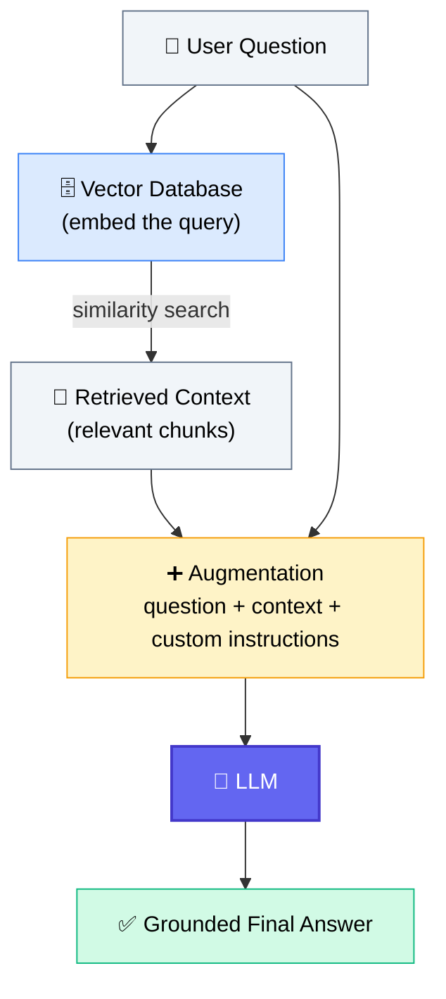
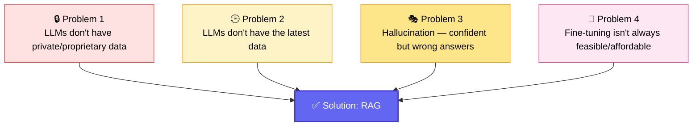
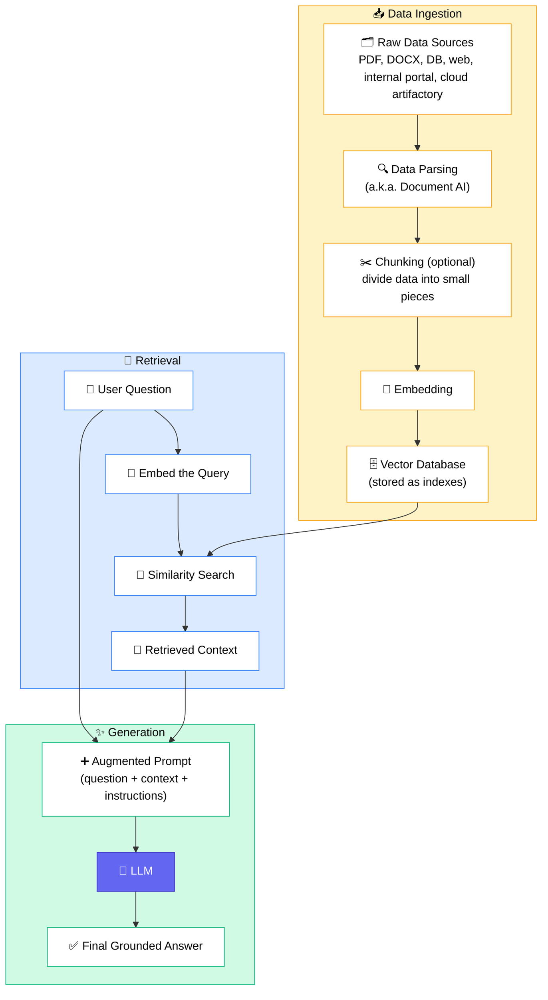
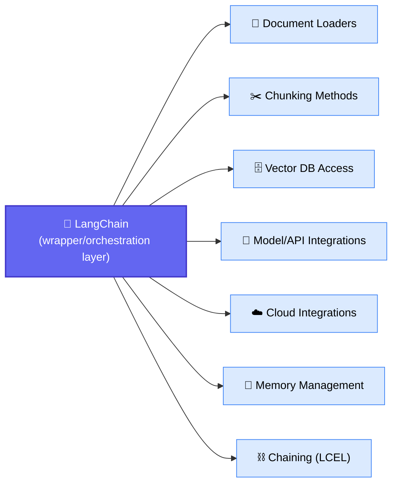
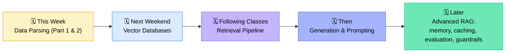

# 🧩 RAG (Retrieval-Augmented Generation) — Introduction
### 📋 Class Notes — Krish Naik Academy

**🎙️ Instructor:** Sunny
**⏱️ Duration:** ~3.5 hours (session + doubt clearing) | **🎯 Session Type:** New Chapter Kickoff + Live Doubt Session
**📅 Class Date:** 4th July (referenced in-session) | **📚 Module:** GenAI Fundamentals → RAG (started after Fine-Tuning)

---

## 🧭 Where This Class Fits

This session marks the transition out of the **Fine-Tuning module** (~3 months, 10 classes) into the **RAG module** — the next big fundamental block before the course moves into **Agentic AI**.

```mermaid
flowchart LR
    A["🔤 Encoding & Embedding"] --> B["🧬 Transformer Architecture"]
    B --> C["🔑 LLM Access APIs"]
    C --> D["🛠️ Fine-Tuning<br/>(~3 months, 10 classes)"]
    D --> E["📥 RAG<br/>(6-8 classes) 👈 YOU ARE HERE"]
    E --> F["🤖 Agentic AI<br/>(next big chapter)"]
    F --> G["🧯 Prompting, Evaluation,<br/>Guardrails, MCP"]

    style A fill:#f1f5f9,stroke:#64748b,color:#000
    style B fill:#f1f5f9,stroke:#64748b,color:#000
    style C fill:#f1f5f9,stroke:#64748b,color:#000
    style D fill:#dbeafe,stroke:#3b82f6,color:#000
    style E fill:#6366f1,color:#fff,stroke:#4338ca,stroke-width:2px
    style F fill:#ede9fe,stroke:#8b5cf6,color:#000
    style G fill:#f1f5f9,stroke:#64748b,color:#000
```

> 💡 **Key framing from Sunny:** RAG and Agentic AI are the **two most important chapters** in the entire course — everything else (prompting, guardrails, evaluation, MCP) builds on top of these.

---

## 📌 Housekeeping Before the New Topic

| Item | Detail |
|---|---|
| 📂 Fine-tuning module | All sessions renamed & available on dashboard — confirm you've watched them all |
| 📝 Fine-tuning assignment | Uploaded on GitHub as a `.docx`; **submission deadline: end of this week** |
| 🎤 Demonstration day | **12th July** — top 3 winners get free access to the **Advanced Route course** |
| ⏱️ Demo time limit | 5–10 minutes per person |
| 💻 Where to build | Any environment is fine — Colab, local, AWS, own server |
| ⚠️ Deadline extension | Explicitly declined — "Deadline is clear, no extension" |
| 📣 Communication rule | Write your **real name** when joining sessions, or Sunny cannot identify you |

---

## 🆚 RAG vs. What Came Before

Fine-tuning **trains/retrains the model**. RAG does **not** — it enriches the model's *input* instead.

| | 🏋️ Fine-Tuning | 📥 RAG |
|---|---|---|
| Main purpose | Teach the model new behavior, style, or format | Give the model external knowledge/context |
| Model weights | **Changed** (training happens) | **Unchanged** |
| Cost | Usually higher | Usually lower |
| Data updates | Requires retraining | Just re-run the data ingestion pipeline |
| Best for | When you *must* host/own a custom model | Any Q&A system, chatbot, or generative assistant |
| Hardware | May need GPU | **CPU is enough** — "RAG does not mean training" |

> 🗣️ *"For basic Q&A, for any sort of a generational system, for any sort of conversational AI, the RAG system is enough."* — Sunny

---

## 🤔 What Is RAG?

**R**etrieval + **A**ugmentation + **G**eneration — *"RAG gives the relevant context to the LLM before answering."*

**Three core terms:**
- **Retrieval** — finding relevant information from a document/source
- **Augmentation** — adding that retrieved info as extra context to the user's question (i.e., *improving the LLM's input*)
- **Generation** — the LLM produces the final answer using that context (this is also called **inferencing**)

> ⚠️ **Common misconception corrected in class:** *"RAG is not a model. RAG is not an LLM. RAG is a pipeline/system."* The LLM is just one component inside it, and that LLM happens to be transformer-based.

---

## ❓ Why Is RAG Required? (4 Core Problems It Solves)

### 📖 Worked Example: Refund Policy
| Without RAG | With RAG |
|---|---|
| LLM confidently says: *"ABC company offers a 30-day refund policy"* ❌ | System retrieves the actual policy doc: *"Refunds allowed only within 7 days"* ✅ |
| This confident-but-wrong output = **hallucination** | Answer is grounded in retrieved context → hallucination reduced |

> 🗣️ *"Hallucination means sometimes the LLM generates a confident but wrong answer. RAG reduces hallucination because the answer is based on retrieved context."*

**Real-world analogy discussed:** ChatGPT doesn't "know" today's weather in Bangalore — it performs a **web search**, retrieves context from the internet, and then generates the answer. That web search *is* a form of retrieval.

---

## 🏗️ The Complete RAG Pipeline

**Six core pipeline components (as drawn on the whiteboard):**
1. 🗂️ Source document / source data
2. ✂️ Chunking *(optional)*
3. 🧬 Embedding
4. 🗄️ Vector store
5. 🔎 Retrieval
6. ✨ Generation → final output to user

> 💡 **Vector-less RAG mentioned:** It's possible to skip the vector database and retrieve directly from documents (e.g., keyword/BM25-based retrieval). Sunny's take: *"Vector-less RAG is not a magic. It is just a traditional technique... it is not a replacement for vector-based RAG."*

---

## 📦 Data Modality, Format & Structure

| Layer | Examples |
|---|---|
| 🎨 **Data Modality** (nature of data) | Text, images, audio, video |
| 💾 **File / Storage Format** | PDF, DOCX, CSV, JSONL, YAML, HTML, MP3, MP4 |
| 🧱 **Data Structure (arrangement)** | Structured (tables, CSV, SQL) · Semi-structured (JSON, YAML, HTML) · Unstructured (PDF, images, audio, video) |

> 📌 RAG pipelines in this course are built primarily for the **text and image** modality — audio/video parsing is out of scope.

---

## 🧰 Data Parsing Libraries — What to Actually Use

| Library / Tool | Type | Use in this Course? |
|---|---|---|
| **Docling** | Free/open-source | ✅ Primary tool taught |
| **LlamaParse** | Free/open-source | ✅ Primary tool taught |
| PyMuPDF | Free | ✅ Used under the hood for PDFs |
| PDFPlumber | Free | ✅ Used under the hood for PDFs |
| python-docx | Free | ✅ Used under the hood for DOCX |
| unstructured.io | Free/open-source | ⚠️ Mentioned, largely skipped (overlaps with Docling) |
| ParseIO | Free/open-source | ⚠️ Mentioned, skipped (overlaps with Docling) |
| Azure Document Intelligence (ADI) | 💰 Paid | ❌ Not used — "very expensive," enterprise-only |
| Google Document AI | 💰 Paid | ❌ Not used |
| Amazon Tesseract | 💰 Paid | ❌ Not used |

> 🗣️ *"The same kind of work we can do via Docling and LlamaParse. We are not going to use paid tools because everyone is not having that account."*

### 🔗 Where LangChain Fits In
LangChain is **not** its own parsing engine — it's a **wrapper/integration layer** over existing libraries.

Internally, LangChain document loaders call PyMuPDF, PyPDF, PDFPlumber, python-docx, unstructured, Docling, etc. — LangChain just standardizes the interface so parsed documents plug easily into the RAG pipeline.

**Framework philosophy shared in class:**
- 🔻 LangChain + LangGraph cover **~95% of the market** — no need to chase every framework (CrewAI, AutoGen, etc.)
- 🧱 Master **one** framework deeply before exploring others
- 🗣️ *"I haven't used any other framework than LangChain and LangGraph... but if you give me a task, I can build it in CrewAI within a week, because my fundamentals are strong."*

---

## 🛠️ Practical Session Highlights

- Opened VS Code, created `data_parsing_part1_langchain.ipynb`
- Set up a `requirement.txt` with: `langchain`, `langchain-community`, `pypdf`, `python-docx`, `pandas`, `openpyxl`, `beautifulsoup4`
- Confirmed **Python 3.10+** works fine (3.11/3.12 also acceptable)
- Confirmed **no GPU/Colab required** — "RAG does not mean training," so local CPU is enough
- Full hands-on data parsing practical was **postponed to the next class** (folder/files weren't fully ready); today's practical setup was preparatory only

---

## 📅 Roadmap for the Coming Classes

Total time allotted to the RAG chapter: **~6–8 classes / 2–3 weeks**, followed by **Agentic RAG**.

---

## ❓ Live Doubt Session Highlights

| Student | Question | Sunny's Answer |
|---|---|---|
| Amit Gupta | Does RAG follow the transformer architecture? | RAG is a *pipeline*, not a model — the LLM component inside it happens to be transformer-based |
| Amol | Does every query always hit the vector DB, even if irrelevant? | No — you can add routing logic (similarity threshold, deterministic rules, or an agent "tool description") to bypass RAG for unrelated queries |
| Amol | Will enterprise-scale deployment be covered? | Core concepts stay the same; enterprise work mainly differs in **scale** and requires complementary **DevOps/system design** knowledge |
| Bala | Is similarity search handled by the vector DB or configured externally? | Retrieval logic (top-k, index type, re-ranking, scaling) is *your* configuration — LangChain or custom code, your choice |
| Bala | Can RAG generate new images from a training set? | No — retrieval can *surface* existing images, but generating new ones needs a **diffusion model**, a different technique entirely |
| Sunil | Does ingestion re-run on every query? | No — ingestion is a **separate, decoupled pipeline** that runs only when source data changes |
| Sunil | What is "agent harness"? | Sunny calls it a repackaged/trendy term for the standard agent control loop (input → planning → tool selection → execution → memory → response) — *"nothing new, just fancy terminology"* |
| Anil | RAG vs. fine-tuning for a 50,000-asset VOD scheduling system? | Use **RAG** for metadata retrieval + a **recommendation/ranking model** for scheduling, orchestrated via **LangGraph** (not fine-tuning) |
| Tej | Where does "custom instruction" in the prompt come from? | You (the developer) write it — e.g., "summarize this," "answer only X" |
| Tej | Is context-augmentation basically what RAG does even without calling it RAG? | Yes — adding context to a prompt *is* the RAG concept, regardless of branding |
| Krish | How to isolate multiple clients' documents in one vector DB? | Use **separate indexes per client** or **metadata/namespace filters**; for concurrent ingestion, use a task queue like **Celery** |
| Krish | Should I use GraphRAG for linking multiple docs per client? | Avoid over-engineering — metadata-based linking (client ID, doc ID) is usually sufficient |
| Akshay | What does an AI engineer do day-to-day? | Varies by project phase: POC (data pipeline, prompt design, retrieval tuning) → production (system design, API/DB architecture, team collaboration) |
| Smit | Does the end user need direct access to the vector database? | No — users should **never** have direct DB access |
| Rajib | How to position a transition into GenAI on a resume with no "real" experience? | Build 2–3 production-grade GenAI projects (not toy notebooks); reframe existing dev experience *with* GenAI implementation, not as "just learning" |

---

## 💬 Notable Quotes

> *"RAG is not a model. RAG is not an LLM. It's a complete system."*

> *"We are not doing any sort of training inside RAG — no GPU required."*

> *"Don't fall into the trap of exploring 5–6 frameworks and building nothing. Master one, build real applications, then explore others."*

---

## ✅ Action Items for Learners

- [ ] 📥 Submit the **fine-tuning assignment** on GitHub by end of this week
- [ ] 🎤 Prepare for the **demonstration on 12th July** (5–10 min, top 3 win Advanced Route access)
- [ ] 🐍 Confirm your local environment (Python 3.10+, `requirement.txt` installed)
- [ ] 📝 Download the shared **handwritten notes** and code files from GitHub
- [ ] 🔁 Revisit the first 4 classes if you missed the earlier environment setup
- [ ] 🎧 Watch the linked **career-transition podcast** if moving from a non-AI background
- [ ] 📓 Come prepared tomorrow for the **full data parsing practical** (Docling, LlamaParse, table parsing)

---

*📝 Notes compiled from the full class transcript — RAG Introduction Session, Krish Naik Academy.*
