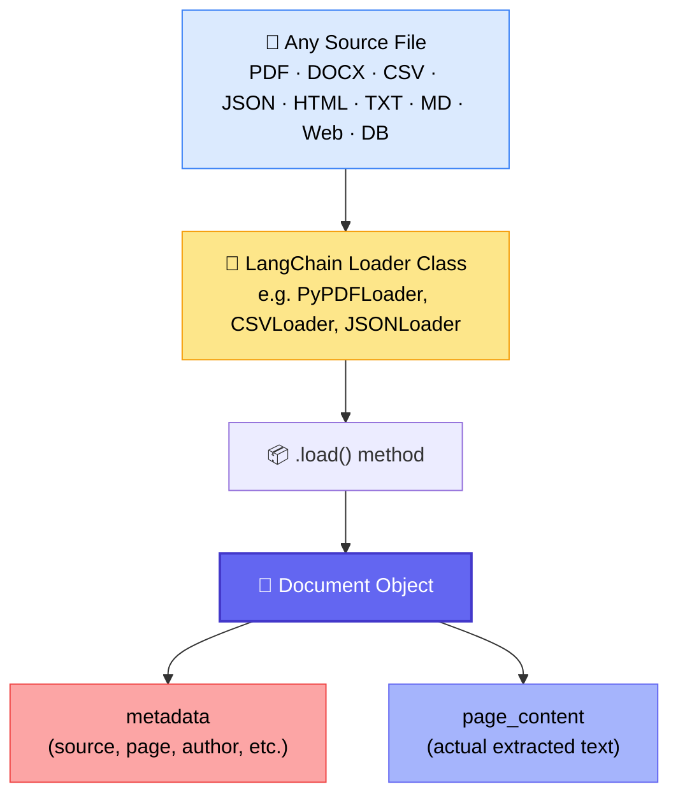
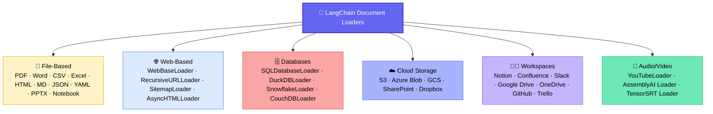
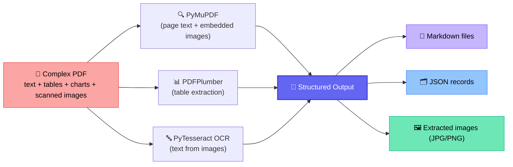
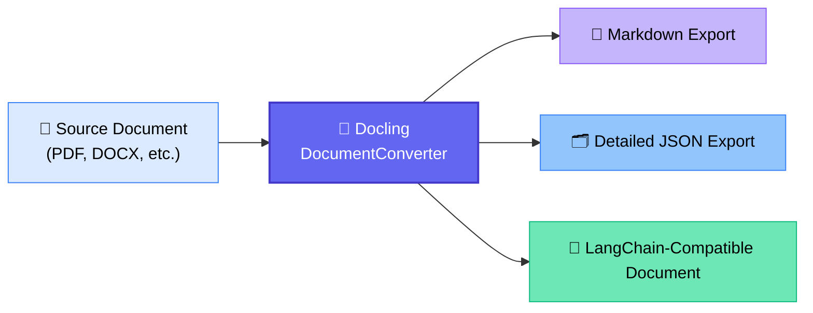

# 📄 RAG Data Parsing — Loaders, Custom Parsing & Docling
### 📋 Class 30 Session Notes — GenAI/Agentic AI Cohort

**🎙️ Instructor:** Sunny (with TA support from Yash)
**⏱️ Duration:** ~4 hours (incl. break + live doubt session)
**🎯 Session Type:** Live Class + Hands-on Practical + Doubt Clearing

---

## 🧭 Where This Class Fits

This is the second class in the **RAG module**. Class 29 covered the *theory* of RAG; Class 30 shifts fully into **practical data parsing** — the foundational step before chunking, embedding, and building the vector database.

> 💡 **Housekeeping:** Session title/recording corrected at the start ("RAG Introduction" → confirmed as **Data Parsing**). All code pushed to GitHub after class; resource links shared in the notebook and via chat.

---

## 🗂️ What Is Data Parsing? (Core Definition)

> *"The actual definition of data parsing is to fetch the important component and arrange the data according to our requirement."* — Sunny

| Level | What It Means | Example in Class |
|---|---|---|
| 🟡 **Data Loading / Extraction** | Pulling raw content out "as-is" using a standard loader | LangChain `PyPDFLoader.load()` — text comes out unformatted, tables shown as raw text |
| 🟢 **True Data Parsing** | Extracting *and* re-arranging data into structured, usable form (tables → Markdown/JSON, images → separate files, OCR applied) | Custom PDFPlumber + PyMuPDF pipeline; Docling |

✅ Both are useful — loading is the fast/simple path; parsing is required for **complex real-world documents** (invoices, scanned pages, multi-cell tables, embedded charts).

---

## 🧩 Part 1: LangChain Data Loaders (Standardized Loading)

### Why LangChain Loaders?
LangChain wraps dozens of underlying parsing libraries (PyMuPDF, python-docx, BeautifulSoup, jq, etc.) behind **one consistent interface** — every loader returns data as a `Document` object, so the rest of the RAG pipeline (chunking → embedding → vector DB) can stay standardized regardless of source format.

### 🔑 The `Document` Object — Two Keys Only
| Key | Contains |
|---|---|
| `metadata` | Source path, producer, author, creation date, total pages, page label/index (0-indexed), and (for PDFs) a `trapped` field related to print color handling |
| `page_content` | The actual extracted text/content |

> This standardization matters for RAG: metadata later powers **source citation** alongside the generated answer.

### 📚 Loaders Demonstrated Live

| File Type | Loader Class | Key Notes |
|---|---|---|
| PDF | `PyPDFLoader` | Uses PyMuPDF internally; tables come out as raw (unstructured) text |
| TXT | `TextLoader` | Simplest case — direct text load |
| CSV | `CSVLoader` | **One Document object per row**; `page_content` is key–value formatted by column |
| JSON | `JSONLoader` | Needs a **`jq_schema`** (e.g. `.list`) to tell it which part of the JSON to extract; needs `text_content=False` when content isn't a plain string |
| HTML | `UnstructuredHTMLLoader` | Extracts headings, paragraphs, links as plain text |
| DOCX | `Docx2txtLoader` | Straightforward extraction |
| Markdown | `UnstructuredMarkdownLoader` | Required installing the `markdown` pip package |
| Web Page | `WebBaseLoader` | Works on any URL (GitHub profile page used as live demo); uses BeautifulSoup internally |

> 🗨️ **Multiple files at once:** Most loaders also accept a list of file paths / a loop, so batch ingestion is possible without extra code.

### 🌍 Beyond Local Files — LangChain's Full Loader Ecosystem
 

> ⚠️ **Caution flagged by Sunny:** Loaders under **LangChain Community** are contributor-submitted and *not all verified* — read each class's docs before relying on it in production (e.g., Gmail/Google Drive loaders require OAuth credentials/API tokens; they can't read your inbox directly without auth).
>
> 📌 Full reference: LangChain's official **Document Loader Integrations** documentation.

---

## 🧩 Part 2: Advanced / Custom Parsing (Beyond Simple Loading)

### Why Go Custom?
Real-world documents (SOPs, invoices, financial reports) routinely contain **mixed content**: body text, multi-cell/merged tables, flowcharts, heatmaps, scanned images, and OCR-only pages. A basic loader captures raw text only — it won't structure tables or pull out images separately.

### 🛠️ What the Custom Pipeline Did (Live Demo)
1. Opened PDF with **PyMuPDF** → captured page text + page number → appended to `page_record`
2. Rendered each full page as an **image** (backup, in case text extraction is incomplete)
3. Extracted **embedded images** individually and ran **PyTesseract OCR** on them
4. Used **PDFPlumber** to extract and clean **tables**, saving them as both **Markdown** and **CSV/JSON**
5. Converted everything into **LangChain-compatible `Document` objects** for downstream use

### ✅ Result Highlights (shown live, side-by-side with the source PDF)
- Every diagram/flowchart/heatmap/table image in the PDF was correctly extracted as a standalone image file
- Every table was captured in clean **Markdown format**, matching the source structure
- One table failed to parse — because it had been **embedded as an image**, not real text/table data (a known real-world edge case)
- Each PDF page was also saved as a full-page image (fallback safety net)
- JSON records generated for images (with OCR text field) and for tables (raw + structured)

> 🧪 **OCR hiccup (live troubleshooting):** PyTesseract failed initially because the underlying **Tesseract OCR engine** wasn't installed on Windows (pip only installs the Python wrapper). Sunny spent time installing it live and flagged that **OCR libraries are notoriously painful on Windows** — strongly recommended using **Google Colab (Linux-based)** for this kind of heavy OCR/parsing work instead of a local Windows machine.

---

## 🧩 Part 3: Docling — A Unified Parsing Framework

**Docling** is an open-source library (with official docs at `docling.ai` and on GitHub) that:
- Parses **many document types**, not just PDF (multi-format capability)
- Has **multi-modal** capability
- Outputs to **Markdown, JSON, or other formats**
- Can be used **standalone** or **via LangChain** as a document converter

**Observed in the live demo:**
- ✅ Tables captured cleanly in Markdown
- ✅ Full structured JSON output (formatting, layout, tables all preserved)
- ⚠️ Images not fully resolved out-of-the-box — needs extra OCR configuration
- 🐢 Noticeably slower than the custom PyMuPDF/PDFPlumber pipeline (heavy backend processing) — same for `unstructured.io`

> 💡 Installed via `uv pip install docling` inside the active virtual environment.

---

## ⚖️ Open-Source vs. Paid Parsing Tools

| | 🆓 Open Source (PyMuPDF, PDFPlumber, Docling, Tesseract) | 💰 Cloud/Paid (Azure Document Intelligence, AWS Textract, Google Document AI) |
|---|---|---|
| Cost | Free | Pay-per-use, cost scales with volume |
| Control | Full low-level customization possible | Less customizable, but "just works" |
| Setup | Can be painful on Windows | Managed, no local install headaches |
| When to use | POCs, cost-sensitive projects, when you need custom logic | Production apps where budget allows / accuracy at scale matters |

> 🧑‍💼 **Sunny's real-world story:** On a previous project, PDF parsing was giving messy, inconsistent OCR results. After escalating to the business, the source format was switched from **PDF → DOCX**. Since DOCX internally stores content as **XML**, native Python-DOCX + XML parsing extracted the data cleanly — no heavy OCR library needed at all. Lesson: *if parsing quality is poor, consider requesting a different source format instead of over-engineering the parser.*

---

## 📊 Real-World Data Sources Shared for Practice

| Source | What You'll Get |
|---|---|
| Coca-Cola Investor Relations site | Real invoicing / financial PDFs |
| A government economic-data website | Annual & quarterly reports |
| DocVQA dataset | OCR-focused document Q&A data |
| FUNSD dataset | Invoice / OCR / table-heavy real-world forms |

> 📎 All links shared in chat and committed to the class GitHub repo for self-practice.

---

## 🖥️ Instructor's Local Setup (shared during Q&A)

| Component | Spec |
|---|---|
| GPU | GeForce RTX 5070 Ti |
| CPU | AMD Ryzen 9 7950X (16-core) |
| RAM | 32 GB |
| VRAM | ~16 GB |
| Type | Custom desktop (not a laptop) |
| Approx. Cost | ₹2.75 lakh |

> Shared as context for why heavy local parsing/OCR is feasible on this machine but may not be on a standard laptop — hence the Colab recommendation for most learners.

---

## ❓ Live Doubt Session — Highlights

| Question | Answer |
|---|---|
| Can I use my own non-financial data (e.g., a personal 9-page doc) for the fine-tuning assignment? | Yes — domain categories are suggestions, not mandatory |
| Can I get an assignment extension due to a work hackathon? | Yes — prioritize work commitments, submit when ready |
| How do you preserve context integrity when a PDF is split into text/table/image chunks before storing in a vector DB? | Use semantic chunking, store page-wise metadata, and apply custom aggregation logic during retrieval |
| Do you still need to "parse" if converting PDF→DOCX first? | That's *conversion*, not parsing — but conversion tools can alter layout/structure, so verify results; enterprises often have internal conversion tooling |
| What's the most efficient format to load into a Vector DB — JSON or text? | Not yet relevant — covered when Vector DB module starts; today's output (MD/JSON) is just an *intermediate* representation |
| Is Docling a replacement for PyPDF/PDFPlumber, or used alongside? | It's a **unified superset framework** — multi-format, multi-modal, not just PDF-specific |
| Can an image's embedded text be matched by a text query in RAG? | Yes — OCR the image to text, embed that text, and/or keep the image as metadata; image-to-image embedding is also possible |
| Does DOCX's internal XML structure make it easier to parse than PDF? | Yes, DOCX stores structured XML; PDF has no equivalent structured backing, hence more OCR/parsing challenges |
| Where should parsed Markdown files live in production? | Anywhere — S3, SharePoint, Databricks catalogs — architecture choice is subjective/team-driven |
| Single MD file per document, or multiple? | Either is valid; can merge multiple into one MD file with clear separators if preferred |
| How to handle huge (e.g. 1GB) PDFs without memory issues? | Ensure adequate compute; consider splitting the PDF, batch processing, or using Spark-like tools |
| Should production use open-source or paid parsers (Azure/Google Document AI)? | Paid tools are good if budget allows; otherwise open-source works well — decision depends on requirements and testing |
| Any constraint on how much data a Vector DB can hold? | Not really — scaling is a cost/infrastructure question, not a hard technical ceiling |
| Top 3 industry-standard PDF loaders for accuracy? | No universal answer — PyMuPDF & PDFPlumber are heavily used for PDFs; loader choice depends on the source file type |
| Can we connect GitHub/Confluence as knowledge sources for an internal chatbot? | Yes — via LangChain community connectors or, better, via an **MCP server** integration (to be covered later) |
| How to choose the right time-series model for a financial prediction ML project? | No fixed rule — try Prophet, ARIMA/SARIMA, XGBoost/CatBoost, LSTM, or TFT; compare using MAE/RMSE/MAPE and pick based on forecast horizon |
| Is it safe to pass credentials (e.g., Gmail API keys) as loader parameters? | Yes, if the code runs locally/on your own server — it's standard authentication, not inherently risky |

---

## ✅ Action Items for Learners

- [ ] 📥 Pull the latest `data_parsing_part1_langchain_loader.ipynb` from GitHub
- [ ] 🧪 Practice loading at least one file of each type: PDF, TXT, CSV, JSON, HTML, DOCX, MD, Web
- [ ] 📚 Browse the LangChain **Document Loader Integrations** documentation to see the full catalog
- [ ] 🖥️ If on Windows and OCR/Docling installs fail, switch to **Google Colab** for that practical
- [ ] 🔤 Fix/verify local **Tesseract OCR** installation if attempting the custom parsing pipeline locally
- [ ] 📦 Try the shared real-world datasets (Coca-Cola IR, government reports, DocVQA, FUNSD) for extra parsing practice
- [ ] 🧷 Review the custom PyMuPDF + PDFPlumber + PyTesseract script line-by-line before next class
- [ ] 🐳 Try Docling on at least one multi-format document and compare its Markdown/JSON output to the custom pipeline
- [ ] ❓ Bring unresolved parsing doubts to the next class's dedicated Q&A on this topic

---

## 🔜 Coming Up Next

> 🎯 **Instructor's target:** Complete Vector Databases within 2–3 classes, then assemble the full end-to-end RAG pipeline including prompting.

---

*📝 Notes compiled from the full Class 30 session transcript — Data Parsing (LangChain Loaders, Custom Parsing, Docling) — including the live doubt-clearing segment.*
