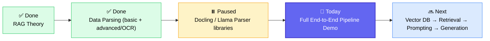
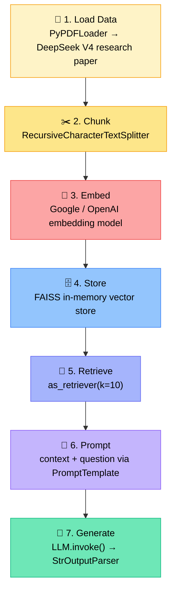
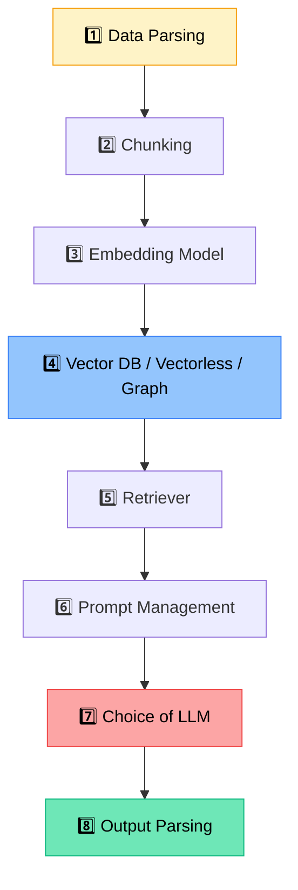
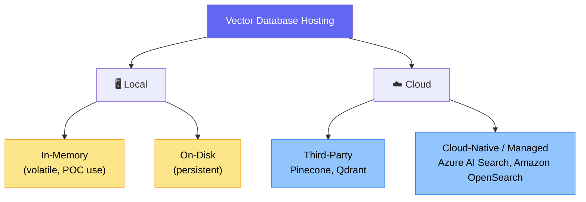

# 🔍 RAG (Retrieval-Augmented Generation) — Deep Dive
### 📋 Class 31 Session Notes
**🎙️ Instructor:** Sunny
**⏱️ Duration:** ~4 hours (Live Build + Break + Live Doubt Session)
**🎯 Session Type:** Live Coding Class + Q&A
**📅 Session Date:** 11th July 2026

---

## 🧭 Where This Session Fits

The batch is deep inside the **RAG chapter**. Theory and the "advanced parsing from scratch" (PyMuPDF, PDF Plumber, Tesseract OCR) were already covered in earlier classes. Today's session paused the parsing deep-dive to give students a **complete practical glimpse of the full RAG pipeline**, end-to-end, before returning to the remaining sub-topics.

> 💡 **Housekeeping:** 44 assignment submissions received (fine-tuning/SFT assignment). Submission window closes tomorrow 5 PM IST; tomorrow's class is a **live demonstration session** (2–3 hrs) for whoever submitted. Winners get access to an upcoming **Advanced badge**.

---

## 📼 Quick Recap: OCR Fix From Last Class

Last session, Tesseract OCR wasn't extracting image text correctly. Sunny fixed the local install and demoed it working this time — image text was successfully pulled into `imageRecord.json` alongside page records.

| Library | Notes |
|---|---|
| PyMuPDF / PDF Plumber | Native, lightweight, used for raw text/table extraction |
| Tesseract OCR | Basic OCR, works but imperfect — some data loss possible |
| Docling / LlamaParse / Unstructured.io | Heavy libraries, use YOLO-based or LLM-based OCR internally, take significant disk space & time |

✅ Parsing depth is **subjective** — depends entirely on the use case and how accurate the downstream task needs to be.
✅ In enterprise settings, tools like **Azure Document Intelligence** are often mandated by the client/org.
✅ Coding assistants (Claude, Copilot, Codex) can generate parser code (e.g., LlamaParse scripts) on demand — Sunny demoed asking Claude directly for a parsing script.

---

## 🗺️ The RAG Pipeline — What Was Built Live

### 🧪 The Setup

- Loaded `.env` keys via `python-dotenv` → Google API key, Groq API key
- Two required models per the RAG architecture: an **embedding model** and an **LLM (chat) model**
- Used `langchain_google_genai` → `GoogleGenerativeAIEmbeddings` + Gemini chat model (flashlight/flash variant)
- Verified both models worked using a simple free-tier query before building the RAG chain

### 💬 First: A Plain Chat Loop (No RAG)

Built a simple `while True` chat loop with the LLM — no external data connected. Asked it for NVIDIA's stock price and the DeepSeek V3 release year:

> "It's confidently telling the wrong answer — that is the meaning of hallucination." — Sunny

This set up the motivating example for *why* RAG is needed — the model's knowledge is stale/wrong without grounding.

### 📥 Data Sources for Loading

LangChain loaders demoed/discussed: `TextLoader`, `DirectoryLoader`, `WebBaseLoader`, `PyPDFLoader`. Real-world sources mentioned: SharePoint, Notion, Databricks, Gmail, Outlook, Slack — most enterprise data lives in SharePoint or internal databases managed by third-party vendors.

### 📦 The Chunking Analogy (Phone Numbers)

> "Whenever someone asks my number, I always say it 2-2 characters at a time... that's just a way of processing information."

- LLMs have a limited **context length** — you can't feed 50+ pages in one go
- Options: one page at a time, or **custom chunks** based on special characters, semantic meaning, or specific requirements
- Used `RecursiveCharacterTextSplitter(chunk_size=500, chunk_overlap=200)` → produced 588 chunks from 58 PDF pages
- ⚠️ Chunking is **optional**, not always required — a dedicated class on chunking strategies is planned

### 🗄️ Vector Store: FAISS (Live Debugging)

Sunny hit and fixed several real errors live:

| Error Encountered | Fix Applied |
|---|---|
| `embedding content 404` — model not found | Switched to `gemini-embedding-001` per Google's model docs |
| `resource exhausted` (quota) on 584 chunks | Switched to OpenAI embeddings |
| `incorrect API key provided` | Replaced with a valid key from Colab Pro notebook |
| `add_document not implemented` | Dimension mismatch — FAISS index was set to 384, but the OpenAI model produces 1536-dim vectors; corrected index size |

> "This is a very subjective thing... whatever error you're getting, change the model, test with a different one." — Sunny

Final setup: `IndexFlatL2` with correct dimension → wrapped in LangChain's `FAISS` vector store → `vector_store.add_documents(chunked_data)` → each chunk stored with a unique UUID.

### 🔗 Building the RAG Chain (LCEL)

- **Prompt**: simple template — "answer the question based on the following context"
- **Chain**: `{"context": retriever | format_docs, "question": RunnablePassthrough()} | prompt | LLM | StrOutputParser()`
- This uses **LCEL (LangChain Expression Language)** — the pipe (`|`) operator replaces older sequential/parallel chaining methods

### 🧾 Live Test Results — RAG vs. Plain LLM

| Question | Plain LLM Answer | RAG Pipeline Answer |
|---|---|---|
| DeepSeek V4 release date | Confidently wrong / hallucinated | Model correctly said "not mentioned in context" once irrelevant info was excluded |
| DeepSeek V4 Pro parameter count | "No such model exists" (outdated knowledge) | ✅ Correctly retrieved: 1.6T total, 419B active parameters |
| DeepSeek V4 Flash parameters | N/A | ✅ Correctly retrieved: 284B total, matching the PDF |
| RL method used in post-training | Failed until exact term "GRPO" used | ✅ Correctly identified GRPO once phrased using the paper's own terminology |

> 🔑 **Key lesson:** if a term isn't phrased the way the source document phrases it, retrieval can fail — this is why **prompt wording and retrieval strategy matter**, and why RAG is not "plug and forget."

---

## 🧩 The "Moving Components" of Any RAG System

> "RAG seems very simple, but there are so many moving components." — Sunny

**Definition given:** a "moving component" = any part of the pipeline whose choice **directly affects the end result's accuracy**.

---

## 🧬 Three Ways to Architect RAG

| Type | How it Retrieves | Notes |
|---|---|---|
| **Vector DB-based RAG** | Embeddings + vector similarity | Most common; works well in most real cases |
| **Vectorless RAG** | Keyword / metadata / rule-based search | Old technique, not "magic" — occasionally better on small documents |
| **Graph-based RAG** | Entities + relationships (nodes & edges) | More complex; only worth it if your data naturally has identifiable entities/relations |

### 🗄️ Where Vector Databases Live

Today's demo used **FAISS**, an **in-memory** local vector store — good for prototyping, but data vanishes when the session stops.

---

## ❓ Live Q&A Highlights

| Question | Answer |
|---|---|
| Do I need vector DB knowledge to follow this class? | No — concepts will be taught progressively; a dedicated vector DB class is coming |
| Updating a vector DB when source docs change (e.g., 10 new pages added) | Only re-embed the new/changed pages; archive the old index rather than rebuilding everything |
| Is document metadata stored in the vector DB along with embeddings? | Yes — chunk content, embedding, and metadata typically live in the same schema/index |
| RAG vs MCP — what's the difference? | RAG connects an LLM to external **knowledge** for generation; MCP standardizes connecting an LLM to external **tools/software** (GitHub, Slack, DB, etc.) for **actions**. A RAG retriever can itself be exposed as an MCP tool |
| What is "context condensing"? | Summarizing/compressing long conversation history via an extra LLM call before it's passed downstream, instead of just deleting old messages via a sliding window |
| What is prompt injection? | Malicious/unintended content inserted into a prompt that hijacks the LLM's intended behavior, overriding original instructions |
| What is "eval" in RAG/LLM systems? | Evaluation of output quality — analogous to exams/interviews/performance reviews; essential before trusting any pipeline output |
| Can RAG work on SQL/structured data? | Don't build embeddings for raw structured columns directly. Either (a) query SQL directly and pass results to the LLM as context, or (b) combine row values into a single text blob, embed that, and retrieve with metadata |
| Does higher embedding dimension = better accuracy? | Generally yes — more dimensions capture more features/information, but at higher compute cost |
| When should I use RAG vs not? | Use RAG for QA, conversational systems, or generation tasks over external/private data. Not needed for tasks like using an LLM purely as a reviewer with no external knowledge dependency |
| Should different data domains go in separate vector DBs? | Not necessarily — separate **indexes within the same vector store** is usually sufficient |
| Multi-modal data (text + images + video) in one vector store? | Use different embedding models per modality (text embedding model, image embedding model, etc.), but they can be stored in the same index, differentiated by metadata |
| SQL-heavy, multi-table enterprise systems — is a knowledge graph needed? | Recommended when there are many tables, complex joins, overlapping terminology, or cross-domain regulatory questions — otherwise plain SQL + LLM translation may suffice |
| Can training data be deleted from a vector DB once "learned"? | Clarified: vector DB retrieval ≠ model training. Vector stores hold retrievable context, not model weights. Frequently repeated Q&A pairs can instead be cached separately |

---

## ✅ Action Items for Learners

- [ ] 🧪 Submit the fine-tuning/SFT assignment by **5 PM IST tomorrow** if not done already
- [ ] 🎥 Be ready for tomorrow's **live demonstration session** if assignment is submitted
- [ ] 📓 Review today's full notebook (RAG boilerplate pipeline) from GitHub
- [ ] 🔁 Revisit the chunking, vector DB, and retrieval strategy topics once dedicated classes are released
- [ ] 💼 Post your learning progress on LinkedIn — treated as a non-negotiable habit by the mentor
- [ ] 🎧 Check out Sunny's podcast episodes and the SQL-based RAG / LangGraph SQL Agent videos on the channel for structured-data retrieval patterns

---

*📝 Notes compiled from the full Class 31 session transcript — RAG (Retrieval-Augmented Generation) live build & Q&A.*
