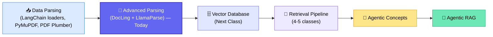
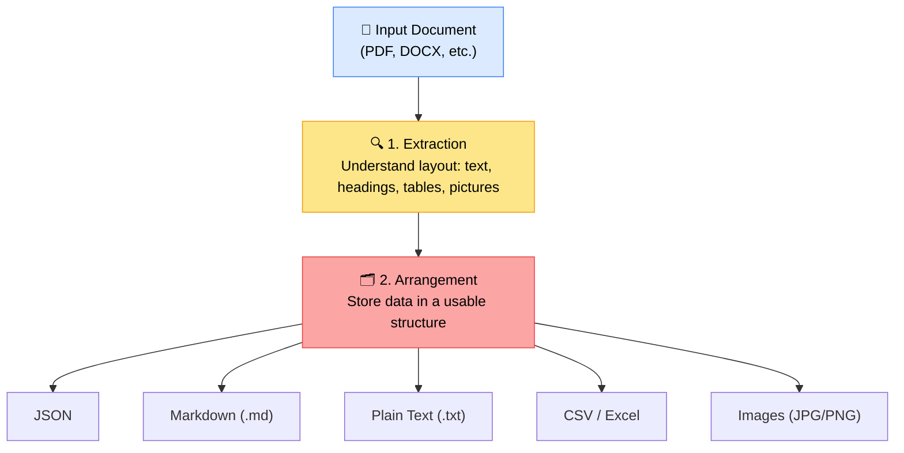
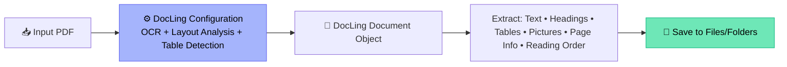
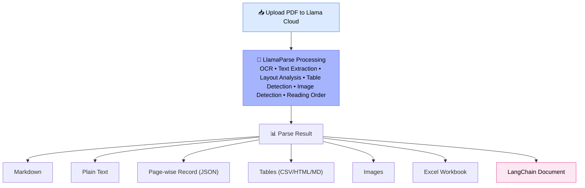
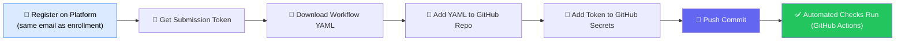

# 📄 Advanced Data Parsing for RAG — DocLing & LlamaParse

### 📋 Live Session Notes — Krish Naik Academy

**🎙️ Speaker:** Sunny (Mentor)
**⏱️ Duration:** ~3.5 hours (incl. break + doubt session) | **🎯 Session Type:** Live Class + Q&A
**📚 Track:** RAG Module — Class 35 (approx.), continuing the Data Parsing series

---

## 🧭 Where This Class Fits

This session picks up right after the LangChain document-loader based parsing (PyMuPDF, PDF Plumber) covered previously, and pushes into more powerful, production-grade parsing libraries before the course moves into **Vector Databases** and then **Retrieval**.

> 💡 **Mentor's note:** "For understanding Agentic RAG, at least we'll have to understand the concept of agents first — then only you can do that orchestration."

---

## 🆚 DocLing vs. LlamaParse vs. Azure Document Intelligence

|              | 🖥️ DocLing                              | ☁️ LlamaParse                                                   | 🏢 Azure Document Intelligence        |
| ------------ | --------------------------------------- | --------------------------------------------------------------- | ------------------------------------- |
| Hosting      | Runs **locally / on-premises**          | Runs on **Llama Cloud** (SaaS)                                  | Microsoft-managed cloud service       |
| Cost         | Free, open source                       | Free tier: **10,000 lifetime credits**                          | Paid (enterprise licensing)           |
| Setup        | Install library + Tesseract locally     | Just needs an **API key**                                       | Needs Azure subscription              |
| Best for     | On-prem / data-sensitive environments   | Quick prototyping, complex layouts                              | Enterprises already on Azure          |
| GPU need     | Only if using OCR (deep-learning based) | No local compute — runs on their servers                        | N/A (managed)                         |
| Data privacy | ✅ Stays on your server                 | ⚠️ Uploaded to a third-party cloud — **needs company approval** | ⚠️ Uploaded to Azure — needs approval |

✅ **Mentor's ranking of open-source parsing tools:** DocLing → LlamaParse → Unstructured.io (in that preference order for most use cases).
✅ **Golden rule repeated throughout:** _Never upload sensitive/company data to Llama Cloud (or any third-party parser) without explicit approval from your organization._

---

## 🧠 The Core Idea: Data Parsing = Extraction + Arrangement

> 🗣️ _"Arrangement of the data is completely subjective — it depends on you, and on your downstream RAG requirement."_ — Sunny

---

## 🛠️ Part 1: Parsing with DocLing (Local / On-Premises)

### 📦 Required Packages

- `docling`
- `langchain-docling`
- `tabulate`

### 🔄 DocLing Pipeline

### 🔑 Key Classes & What They Do

| Class / Import           | Purpose                                                               |
| ------------------------ | --------------------------------------------------------------------- |
| `InputFormat`            | Tells DocLing what kind of file is being passed (e.g. `.PDF`)         |
| `PdfPipelineOption`      | Configures the **complete PDF parsing pipeline**                      |
| `TableStructureOption`   | Configures **table extraction behavior** (rows/columns detection)     |
| `TesseractCliOcrOptions` | Configures **Tesseract OCR** — fetches data from images/scans         |
| `DocumentConverter`      | The **main parser/converter** — takes PDF in, gives structured output |
| `PdfFormatOption`        | Wraps the pipeline so it can be attached to the converter             |
| `ImageReferenceMode`     | Controls how images are represented inside the exported Markdown      |
| `PictureItem`            | Identifies actual elements found inside pictures                      |
| `TableItem`              | Identifies actual elements found inside tables                        |

### ⚙️ Configuration Walkthrough

1. Create a `PdfPipelineOption()` object
2. `do_ocr = True` → perform OCR on images/scanned pages (useful when text isn't selectable)
3. Point to local **Tesseract** path (or use DocLing's inbuilt OCR)
4. `do_table_structure = True` → don't just extract table text — understand rows & columns
5. `do_cell_matching = True` → matches detected text to the correct row/column cell
6. Set image resolution/output flags (`generate_page_images`, `generate_picture_images`, etc.)
7. Pass everything into `DocumentConverter(format_options=...)`
8. Call `converter.convert(pdf_path)` → triggers the actual parsing

### 💾 Output Formats Generated

- **JSON** — full structured document (can be ~30,000+ lines for a complex PDF!)
- **Markdown (.md)** — cleaner, human-readable, tables shown inline
- **TXT** — plain text version (exported via the markdown output)
- **Page images** — every page saved as an image (useful since LLMs can read images directly)
- **Extracted tables** — saved individually as **CSV, MD, and PNG**
- **Extracted pictures** — saved individually to an images folder

> ⚠️ **Practical note:** DocLing + Tesseract can be heavy on RAM/CPU. If your local system struggles, run the notebook on **Google Colab** instead.

---

## ☁️ Part 2: Parsing with LlamaParse (Cloud-Based)

### 🔑 Getting Started

1. Go to the **LlamaParse / LlamaCloud dashboard**
2. Click **"Generate New Key"**
3. Get **10,000 free credits** (lifetime, not a monthly reset — on the free plan)
4. Store the key in `.env` as `LLAMA_CLOUD_API_KEY`
5. Install `llama-cloud` package (there's no local install — everything runs on Llama Cloud's servers)

### 🔄 LlamaParse Pipeline

### 🧩 Code Structure Overview

| Function / Step                          | What It Does                                                                                            |
| ---------------------------------------- | ------------------------------------------------------------------------------------------------------- |
| `save_file_name()`                       | Cleans unnecessary characters from file names                                                           |
| `object_to_dict()`                       | Converts the LlamaParse SDK response object into native Python structures                               |
| `download_files()`                       | Downloads a file from a URL with retry/timing logic                                                     |
| `get_image_output_directory()`           | Chooses the correct output folder based on image category                                               |
| `client.file.create()`                   | Uploads the PDF to Llama Cloud                                                                          |
| `parse()` (Agentic mode, latest version) | Kicks off actual parsing — best suited for **complex documents** with mixed layouts, tables, and images |
| Save-as-JSON step                        | Stores the **entire parsed document** in JSON                                                           |
| Save-as-Markdown/TXT step                | Stores a page-wise, readable version of the content                                                     |
| Table-extraction step                    | Iterates pages → extracts each table → saves as **CSV, MD, HTML**                                       |
| Image-record step                        | Iterates images → saves metadata + files (URL, index, filename, category)                               |
| Excel/metadata download step             | Downloads table metadata as an **Excel workbook** directly from Llama Cloud                             |

> 🐢 **Observed behavior:** Free-tier LlamaParse can feel noticeably slower than the paid tier — likely due to lower allocated compute on free servers.

---

## 📊 Side-by-Side: What Each Tool Produced

| Output Type                   | DocLing | LlamaParse             |
| ----------------------------- | ------- | ---------------------- |
| JSON (full structured data)   | ✅      | ✅                     |
| Markdown                      | ✅      | ✅                     |
| Plain Text                    | ✅      | ✅                     |
| Tables → CSV / HTML / MD      | ✅      | ✅                     |
| Images extracted individually | ✅      | ✅                     |
| Page-as-image                 | ✅      | ✅                     |
| Table metadata as Excel       | ❌      | ✅                     |
| Page-wise JSON record         | Partial | ✅ (dedicated feature) |

---

## 🏆 Featured Announcement: Krish Naik Academy Hackathon Platform (Beta)

- Launched via **krishnaik.in** — accessible directly or via the Resume Builder/Hackathon nav option
- Currently **student-only beta** before public rollout
- **Prizes:** ₹50,000 – ₹1,00,000 for top solutions, plus planned trips (e.g. North India, Goa) once fully live
- First problem statement is a **real, Agentic-AI project** co-designed using the mentor's own pharma/healthcare industry experience — usable as a genuine resume/portfolio project

### ✅ Submission Steps

1. **Sign up** using the **same email ID** used for course enrollment
2. **Register** with your phone number to receive a unique **submission token**
3. **Download the workflow YAML file** from the hackathon page
4. Add it to your **GitHub repository** (the one holding your solution)
5. Add the **submission token** as a **GitHub Secret**
6. **Push your commit** → automated checks (GitHub Actions) run and report back to the platform automatically

> 💬 "Vibe coding" (AI-assisted rapid coding) is explicitly allowed for the hackathon submission.

---

## ❓ Live Q&A Highlights

| Question                                                                         | Answer                                                                                                                                                                                                    |
| -------------------------------------------------------------------------------- | --------------------------------------------------------------------------------------------------------------------------------------------------------------------------------------------------------- |
| Should I use DocLing, LlamaParse, or Azure Document Intelligence?                | DocLing first (free, on-prem); LlamaParse if you need cloud convenience and have approval; ADI only if your company already pays for it                                                                   |
| Is DocLing just like a LangChain document loader?                                | No — it goes deeper. It's not only a loader; it performs in-depth structural parsing (tables, layout, images)                                                                                             |
| Do I need a GPU for DocLing?                                                     | Not generally — only if you run OCR models locally, since OCR is deep-learning based                                                                                                                      |
| How does LangChain's document loader relate to DocLing/LlamaParse?               | LangChain loaders handle simpler cases; DocLing/LlamaParse are used when you need complex parsing (tables, images) that loaders can't handle well                                                         |
| How do I keep production data in sync with the vector DB as source files change? | Build a separate **incremental data pipeline** (e.g. via Databricks/AWS) that detects new/changed/deleted files and only reprocesses those; parsing + vector DB is just one stage of that larger pipeline |
| Can I connect DocLing/LlamaParse pipelines to cloud storage like S3?             | Yes — configure cloud credentials (e.g. via AWS CLI/Boto3) and keep the same parsing pipeline; ask an LLM (ChatGPT/Claude) to adapt the code for S3 connectivity                                          |
| Do I always need chunking before storing in a vector DB?                         | No — chunking is not always required. For page-based documents, the mentor often stores **page-wise embeddings with page info in metadata** instead                                                       |
| Is LlamaParse safe for enterprise/sensitive data?                                | No — data gets uploaded to a third-party cloud. Only use it if your company explicitly grants access/approval                                                                                             |
| Are the free 10,000 LlamaParse credits monthly or lifetime?                      | **Lifetime**, on the free plan — no monthly reset (unlike some GCP/cloud "free tier" resets)                                                                                                              |
| What's the difference between "tokenization" in training vs. RAG cost context?   | Tokenization for embeddings is separate from **generation tokens** — the token limits/costs you see in LLM API usage relate to output generation, not the embedding step                                  |
| Can RAG reduce token cost for a multi-agent intent classifier?                   | Yes — instead of feeding _all_ agent definitions into every LLM call, retrieve only the **most relevant agent definitions** first (a lightweight RAG step) before the intent-classification call          |
| Is Graph RAG the same as regular RAG?                                            | Conceptually similar — it's just a **different way of arranging your data** (as a graph instead of flat vector chunks); will be covered with a use case later in the course                               |

---

## 📊 Mentor's Practical Advice (Recurring Themes)

1. 🔐 **Data privacy first** — never send sensitive/company data to third-party parsing clouds without approval
2. 🧱 **Chunking isn't mandatory** — many real pipelines use page-wise metadata instead of chunking
3. 🤖 **Use AI to accelerate your own learning** — "Give your thoughts to ChatGPT/Claude, generate the code, and work around it."
4. 📖 **Documentation is your friend** — most DocLing/LlamaParse classes are self-explanatory once you read the docs and official GitHub
5. 🔄 **Data pipelines vs. parsing pipelines** — parsing + vector DB storage is only one stage; incremental sync (detecting new/changed/deleted files) is a separate, broader engineering pipeline

---

## ✅ Action Items for Learners

- [ ] 📂 Pull the latest code from the shared GitHub repo (DocLing + LlamaParse notebooks)
- [ ] 🧪 Run both `data_parsing_part3_docling.ipynb` and `data_parsing_part3_llamaparser.ipynb` locally or on Colab
- [ ] 🔑 Generate a personal LlamaCloud API key and test the 10,000 free-credit tier
- [ ] 🖥️ Install Tesseract locally (or configure it on Colab) if testing OCR-based parsing
- [ ] 🏆 Register on the new Hackathon platform using the **same email ID** as course enrollment
- [ ] 📤 Follow the 4-step GitHub submission flow (YAML → repo → secret → push) for the hackathon problem statement
- [ ] 📚 Review the "Extraction vs. Arrangement" concept before the next class on Vector Databases

---

_📝 Notes compiled from the full session transcript — Advanced Data Parsing (DocLing & LlamaParse) for RAG, Krish Naik Academy._
