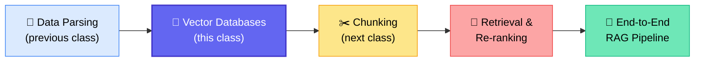
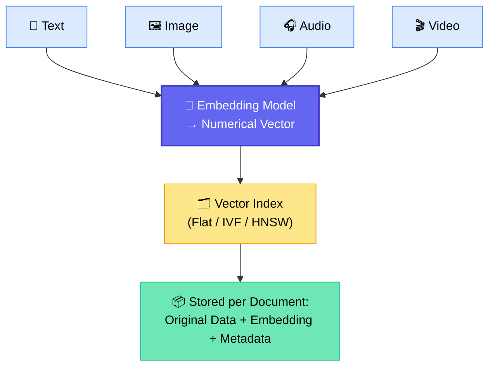
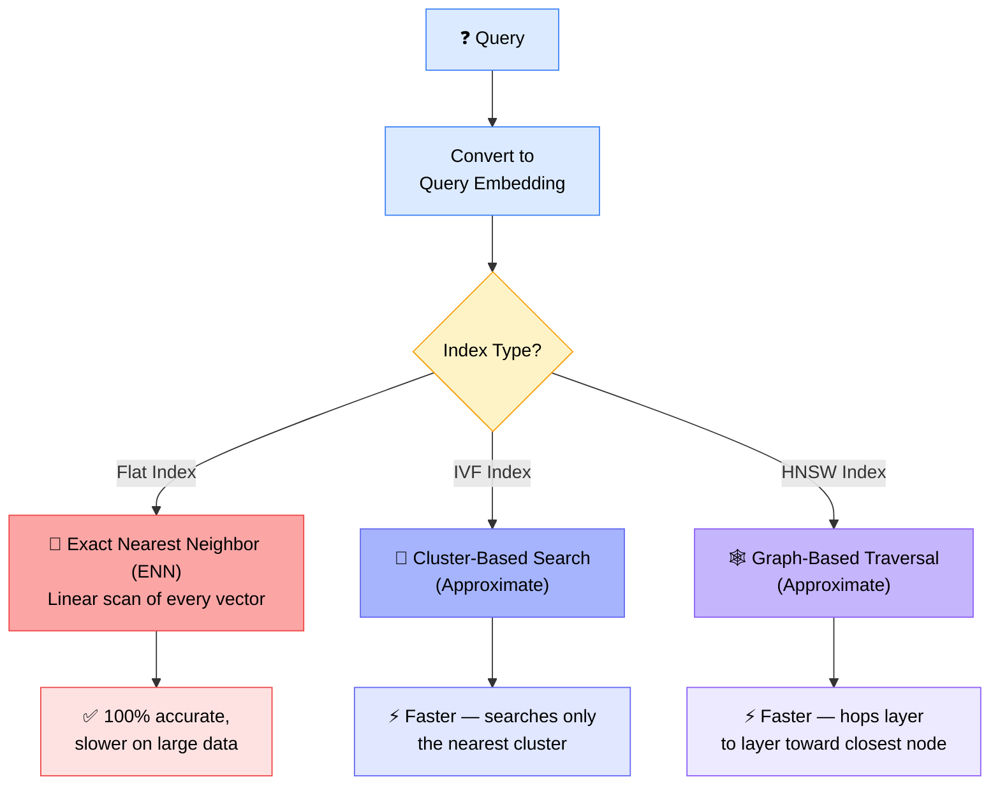
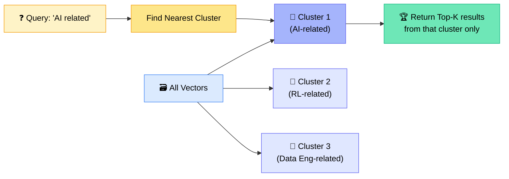
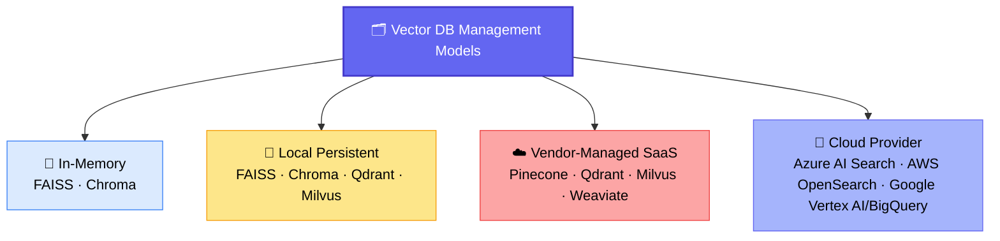

# 🧠 Vector Databases — Class 34

### 📋 Session Notes — Krish Naik Academy (Agentic AI / RAG Track)

**🎙️ Instructor:** Sunny
**📅 Date:** 19th July | **⏱️ Duration:** ~3.5 hours (theory + practical + live doubt session)
**🎯 Session Type:** Live Class + Q&A

---

## 🧭 Where This Session Fits

> 💡 This is the first of ~2 classes on Vector Databases before the course moves into Retrieval and then a full RAG build.

---

## 📢 Housekeeping (Start of Session)

| Topic                     | Update                                                                           |
| ------------------------- | -------------------------------------------------------------------------------- |
| 🏆 Hackathon portal login | Google login only — must use the **same email you enrolled with**                |
| 📱 Mobile number          | Required at hackathon registration                                               |
| 🎁 Reward course access   | Being granted within the week; announced in community chat                       |
| 📂 Resources              | Data-parsing code, GitHub links, and solutions already uploaded to the dashboard |
| 🚫 Doubts                 | Route all issues through the **community chat**, not DMs                         |

---

## 📖 What Is a Vector Database?

> **"A Vector Database stores data as a numerical vector (an embedding) and retrieves the most similar vectors using similarity search."**

Vector databases power **semantic search** — results are found by _meaning_, not exact keyword matching. This makes them the backbone of:

- 🤖 RAG-based systems
- 🎯 Recommendation engines
- 🖼️ Image search

### 🔑 Core Terminology

| Term                      | Definition                                                                                                                                |
| ------------------------- | ----------------------------------------------------------------------------------------------------------------------------------------- |
| 🧮 **Embedding / Vector** | A numerical representation of any data type (text, image, audio, video)                                                                   |
| 🗂️ **Vector Index**       | A data structure that organizes embeddings so the database can find vectors quickly without scanning every one                            |
| 🔍 **Similarity Search**  | The process of finding stored vectors closest to a query vector, using metrics like cosine similarity, Euclidean distance, or dot product |

---

## 🗺️ How Data Flows Into a Vector Database

Each stored record carries **three pieces**:

1. 📄 **Actual/original data** — e.g. `"AI is future"`
2. 🧮 **Embedded data** — the numerical vector, e.g. `[1, 2, ... 9]`
3. 🏷️ **Metadata** — data _about_ the data (source file, path, size, etc.)

---

## ⚖️ Exact vs Approximate Search

| Method            | Full Form                          | Technique                                                                                  | Accuracy           | Speed                | Best For               |
| ----------------- | ---------------------------------- | ------------------------------------------------------------------------------------------ | ------------------ | -------------------- | ---------------------- |
| 🎯 **Flat Index** | Exact Nearest Neighbor             | Linear scan of every row                                                                   | 100%               | Slower on large data | Small datasets         |
| 🧩 **IVF**        | Inverted File Index                | Clustering (like k-means) — query matched to nearest cluster, then searched only within it | High (approximate) | Faster               | Large-scale production |
| 🕸️ **HNSW**       | Hierarchical Navigable Small World | Graph traversal — hops layer to layer toward the closest node                              | High (approximate) | Faster               | Large-scale production |

> 🗣️ **Sunny's tip:** _"You don't need the deep math of IVF/HNSW — interviewers mostly want to know what index types exist and how they conceptually work, not the internals."_

---

## 🏗️ How IVF Actually Groups Data

✅ **Advantage:** the search space shrinks dramatically → faster results, since irrelevant clusters are skipped entirely.

---

## 🌍 Vector Databases Across the Industry

| Category                        | Examples                                                                                         | Notes                                                               |
| ------------------------------- | ------------------------------------------------------------------------------------------------ | ------------------------------------------------------------------- |
| 🧪 To master the _fundamentals_ | **FAISS**, **OpenSearch**                                                                        | Native indexing/algorithms exposed — best for learning from scratch |
| 💾 In-memory / local            | FAISS, ChromaDB, Qdrant, Milvus                                                                  | Great for POCs                                                      |
| ☁️ Vendor-managed (SaaS)        | Pinecone, Qdrant, Milvus, Weaviate                                                               | Mostly abstracted — little low-level config                         |
| 🏢 Cloud-native                 | Azure AI Search, AWS OpenSearch, Google Vertex AI Vector Search, BigQuery Vector Search, AlloyDB | Preferred for enterprise-scale production                           |
| 🐘 SQL-integrated               | PGVector (PostgreSQL)                                                                            | Vector search bolted onto a relational DB                           |

> ✅ Master **one** vector database deeply and the rest transfer easily — the underlying concepts (index, embedding, metadata, similarity search) stay the same across all of them.

---

## 🆚 SQL vs NoSQL vs Vector Database

|                 | 🗄️ SQL                                           | 📦 NoSQL                      | 🧠 Vector DB                                         |
| --------------- | ------------------------------------------------ | ----------------------------- | ---------------------------------------------------- |
| **Purpose**     | Structured relational data                       | Flexible/semi-structured data | Embedding storage & semantic retrieval               |
| **Examples**    | PostgreSQL, MySQL, Oracle                        | MongoDB, DynamoDB, Cassandra  | Pinecone, Qdrant, Milvus, Weaviate                   |
| **Schema**      | Fixed, predefined                                | Flexible, runtime-changeable  | Fixed vector dimension + flexible metadata           |
| **Query Type**  | Joins, ranges, aggregations, exact `WHERE` match | Condition-based filters       | Similarity search (cosine / dot product / Euclidean) |
| **Typical Use** | Structured business data                         | Structured + unstructured mix | RAG, recommendations, semantic/image search          |

> 🔗 Most SQL/NoSQL platforms now ship their **own vector extension** too (e.g. PGVector for PostgreSQL, native vector support in MongoDB/Oracle/S3-based stores).

---

## 🆚 Vector Store vs Vector Database

Both terms often get used interchangeably — but there's a subtle difference:

|                           | 🗃️ Vector Store                   | 🏢 Vector Database                             |
| ------------------------- | --------------------------------- | ---------------------------------------------- |
| Scope                     | Simple in-memory/persistent store | Full, complete distributed system              |
| Sharding / Replication    | ❌ Not available                  | ✅ Supported                                   |
| Distribution across nodes | ❌ No                             | ✅ Yes                                         |
| Example                   | FAISS, local Chroma               | Pinecone, Qdrant (managed), Milvus (clustered) |
| Best for                  | Prototypes, POCs, MVPs            | Full-scale production systems                  |

> 🗣️ _"Both are technically vector databases — the difference is whether the system has full DB-grade properties like sharding and distributed scaling."_

---

## 🏷️ Naming Differs Across Platforms

| Concept             | Qdrant     | Pinecone          | Generic Term |
| ------------------- | ---------- | ----------------- | ------------ |
| Grouping of vectors | Collection | Index + Namespace | **Index**    |

> ⚠️ The _term_ changes across databases, but the _concept_ stays the same.

---

## 📐 A Critical Gotcha: Vector Dimensions

Every embedding model outputs a **fixed-size vector** (e.g. `768`, `3072`). The index/collection dimension in your vector database **must exactly match** your embedding model's output dimension — mixing models with different dimensions will throw an error. This is a very common real-world bug when swapping embedding models mid-project.

---

## 💻 Practical Walkthrough (FAISS + LangChain + Gemini)

```mermaid
flowchart LR
    A["1️⃣ Load .env &<br/>Google API Key"] --> B["2️⃣ Init Embedding Model<br/>models/embedding-001"]
    B --> C["3️⃣ Test with<br/>Cosine Similarity /<br/>Euclidean Distance"]
    C --> D["4️⃣ Create FAISS<br/>Flat Index (dim=3072)"]
    D --> E["5️⃣ Build FAISS<br/>Vector Store<br/>(in-memory docstore)"]
    E --> F["6️⃣ add_texts() /<br/>Store LangChain<br/>Document objects"]
    F --> G["7️⃣ similarity_search()<br/>with top-k & metadata filter"]
    G --> H["8️⃣ save_local() /<br/>load_local()<br/>→ Disk Persistence"]

    style A fill:#dbeafe,stroke:#3b82f6,color:#000
    style B fill:#dbeafe,stroke:#3b82f6,color:#000
    style C fill:#fde68a,stroke:#f59e0b,color:#000
    style D fill:#fca5a5,stroke:#ef4444,color:#000
    style E fill:#a5b4fc,stroke:#6366f1,color:#000
    style F fill:#c4b5fd,stroke:#8b5cf6,color:#000
    style G fill:#fbcfe8,stroke:#ec4899,color:#000
    style H fill:#6ee7b7,stroke:#10b981,color:#000
```

### Key steps demonstrated live:

- `pip install faiss-cpu`
- Loaded `GoogleGenerativeAIEmbeddings` (`models/embedding-001`) via LangChain
- Verified similarity scoring with `sklearn.metrics.pairwise` — **cosine_similarity** and **euclidean_distances**
- Created a flat FAISS index sized to the embedding dimension (**3072** for this model)
- Built the vector store using `FAISS`, `InMemoryDocstore`, and `index_to_docstore_id`
- Stored both raw strings (`add_texts`) and full LangChain `Document` objects (with metadata)
- Ran `similarity_search(query, k=...)` — changing `k` changes how many top matches return
- Applied **metadata filtering** (e.g. `filter={"source": "tweet"}`) — ⚠️ demonstrated that careless filters can silently return the _wrong_ answer if the filter doesn't match the true source
- Persisted the index to disk with `vector_store.save_local("faiss_index")` and reloaded with `FAISS.load_local(..., allow_dangerous_deserialization=True)`
- Inspected raw embeddings via `vector_store.index.reconstruct(id)`

> 🗣️ _"On disk, your data survives a server restart. In memory only, it's gone the moment you stop the notebook."_

---

## ❓ Live Q&A Highlights

| Question                                                                                | Answer                                                                                                                                                                                                           |
| --------------------------------------------------------------------------------------- | ---------------------------------------------------------------------------------------------------------------------------------------------------------------------------------------------------------------- |
| Does the embedding model run automatically during storage & querying?                   | Yes — LangChain/FAISS handles embedding both stored docs and incoming queries automatically                                                                                                                      |
| Can one index hold multiple documents, and can I target a specific index at query time? | Yes to both — indexes aren't 1:1 with documents, and you can query a specific index by name                                                                                                                      |
| Can I choose which index type (flat/IVF/HNSW) to use?                                   | Depends on the platform — FAISS/Chroma/OpenSearch allow manual index config; **Pinecone abstracts this away**; Qdrant/Azure AI Search allow partial control                                                      |
| What's the primary key for CRUD (update/delete) in a vector DB?                         | The **document ID**                                                                                                                                                                                              |
| How to pick a vector DB for production (healthcare, finance, etc.)?                     | No fixed "this domain → this DB" rule — choose based on **cloud provider, metadata filtering needs, latency, scalability, security compliance, and budget**                                                      |
| Do vector databases follow the CAP theorem?                                             | Yes, but only when **distributed** (e.g. Qdrant, Milvus). Local/single-node setups (FAISS, local Chroma) don't face network-partition tradeoffs                                                                  |
| How does a distributed vector DB coordinate across nodes?                               | Via **sharding, replication, and routing** — a coordinator node routes the query to the right shard/node and aggregates top-K results                                                                            |
| What happens if the LLM's own knowledge contradicts the RAG-retrieved context?          | The **retrieved context takes priority** — RAG is designed to override the model's parametric training knowledge with the provided context                                                                       |
| Best OCR for multilingual (e.g. Telugu) documents?                                      | Open-source: **PaddleOCR, Tesseract, EasyOCR**; also consider using an **LLM as OCR**. Multilingual embedding models (e.g. OpenAI large embeddings) already cover many Indian languages                          |
| Hugging Face free-tier LLM inference keeps failing — why?                               | Free tier is fine for demos/testing only — not reliable for MVPs. Recommended alternatives: **LLM gateways (e.g. OpenRouter)** for reliability, or **self-hosted models via Ollama/Hugging Face** for production |
| Will the course cover CRAG / Agentic RAG?                                               | Yes — planned for upcoming sessions once orchestration frameworks (e.g. LangGraph) are introduced                                                                                                                |
| Will healthcare-style RAG on EHR data with privacy constraints be covered?              | Recommended to wait until **Agentic orchestration (LangGraph, MCP)** is covered — combining RAG + agent orchestration is needed for that level of solution                                                       |

---

## ✅ Action Items for Learners

- [ ] 📥 Download Class 33 notes and code from GitHub
- [ ] 🔑 Ensure hackathon portal login uses the **same email as course enrollment**
- [ ] 🧪 Practice building a FAISS vector store end-to-end (embed → store → search → persist)
- [ ] 🧠 Revisit the flat vs IVF vs HNSW diagram until the exact-vs-approximate distinction is second nature
- [ ] 🗂️ Try metadata filtering carefully — test that filters actually match your data before relying on them
- [ ] 🔀 Explore **LLM gateways (e.g. OpenRouter)** if working with free-tier inference limitations
- [ ] 📚 Prepare for the next class: **Chunking strategies**, then **Retrieval & Re-ranking**

---

_📝 Notes compiled from the full Class 33 session transcript — Vector Databases, Krish Naik Academy._
