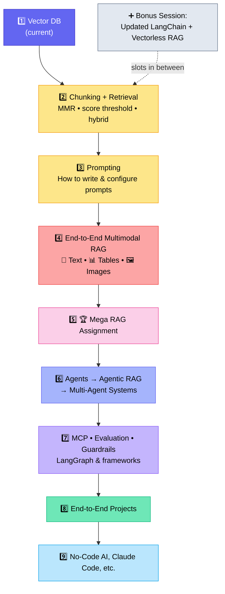
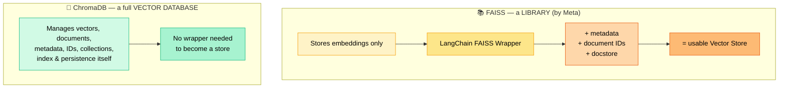
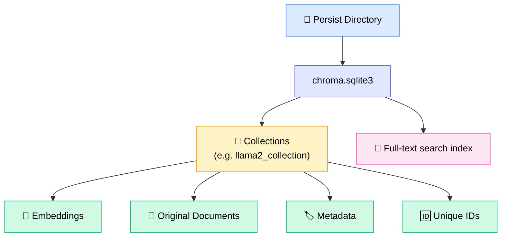
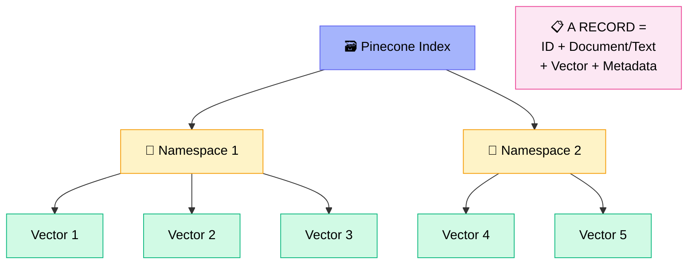
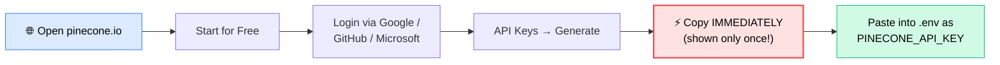
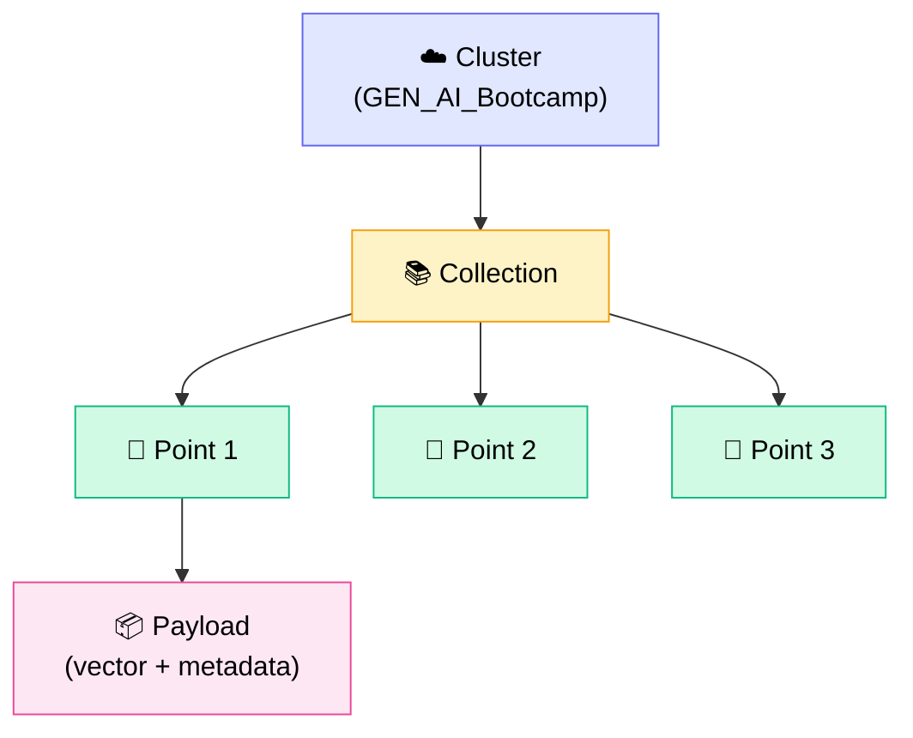
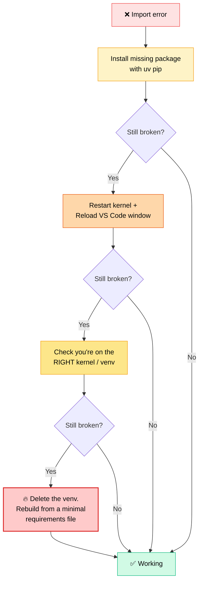
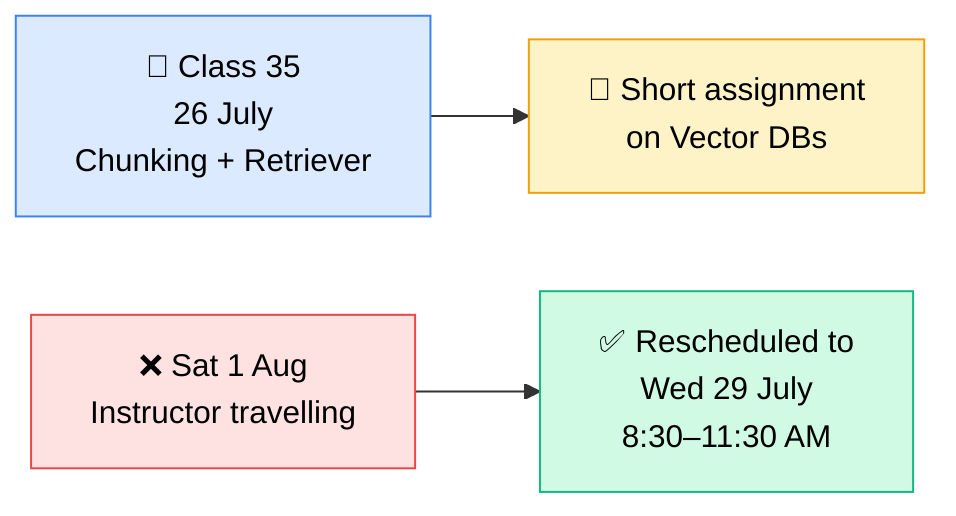
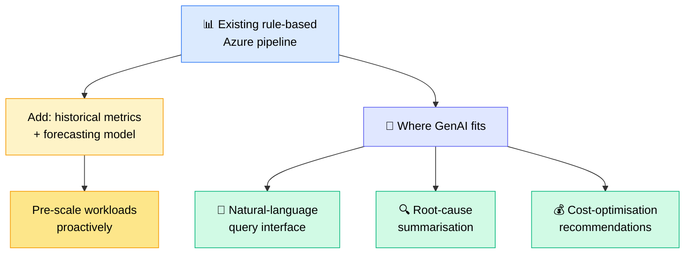

# 🗄️ Vector Databases — Part 2
### 📋 Class Notes — Generative AI Bootcamp (RAG Module)

**🎙️ Instructor:** Sunny Savita
**⏱️ Duration:** ~3 hrs 15 min (session + break + live doubt clearing)
**🎯 Session Type:** Live hands-on coding + Q&A
**📦 Covered:** FAISS (completion) · ChromaDB · Pinecone · Qdrant

---

## 🧭 Where We Are in the RAG Journey

The RAG module is being built brick by brick. **Vector Databases is the current brick** — retrieval and chunking come next.


### 🗺️ Full Roadmap Announced in Class



> 💡 **Note on hybrid RAG:** It isn't a separate mega-topic. Once vectorless RAG + retrieval approaches + end-to-end RAG are clear, hybrid RAG becomes "just terminology."

---

## 🧱 The Big Mental Model: Library vs Database

This was the conceptual spine of the whole session.



**One-liners for interviews:**
- 🔹 **FAISS** = *Facebook AI Similarity Search* — an open-source **vector search / indexing library**. Purpose: fast **ANN (approximate nearest neighbour)** search in POCs.
- 🔹 **ChromaDB** = open-source **vector database** for storing, managing and retrieving embeddings — used in RAG, semantic search, recommendation systems.

---

## 🧪 Part 1 — Finishing FAISS

### ⚙️ Setup Change Made Live
Gemini embeddings threw a **`ResourceExhausted`** error, so the class switched to **OpenAI embeddings**.

| Item | Value |
|---|---|
| Embedding model | `text-embedding-3-large` (OpenAI) |
| Dimension | **3072** |
| Document | `Llama2_research_paper.pdf` |
| Loader | `PyPDFLoader` |
| Pages | **77** |
| Splitter | `RecursiveCharacterTextSplitter` |
| chunk_size = 1000, overlap = 200 | → **343 chunks** |
| chunk_size = 2000, overlap = 200 | → **175 chunks** |

**Separators used (in priority order):**

| Separator | Meaning |
|---|---|
| `\n\n` | Paragraph break |
| `\n` | Single line break |
| `.` | Sentence / full stop |
| `" "` | Space |
| `""` | Empty string (last resort — split anywhere) |

### 🕸️ The HNSW Index — Parameter Decode

HNSW performs **approximate search**, not exact search.

| Parameter | Meaning |
|---|---|
| **d** | Dimension of the vector (here `3072`) |
| **M** | Hierarchy of the graph — how many neighbour vectors each vector connects to |
| **metric L2** | Distance metric = **Euclidean distance** (alternatives: cosine similarity, dot product) |
| **ef_construction = 200** | Graph build-time search breadth (backend graph quality) |
| **ef_search = 64** | Query-time search breadth |

### 📦 The Four FAISS Index Families

| Index | What it does |
|---|---|
| **Flat** | Brute-force, exact search |
| **IVF** | Inverted file — cluster then search |
| **HNSW** | Graph-based approximate search ⭐ used in class |
| **PQ** (Product Quantization) | **Compresses** high-dimensional vectors to save memory + speed up similarity search |

> 🎯 **When to use PQ:** only when you have **huge** vector datasets — 1M, 5M, 10M+ vectors. PQ works *alongside* Flat / IVF / HNSW, not instead of them.

### 🔁 The FAISS RAG Flow Built in Class


✅ **Persistence:** the index was saved to disk as `faiss_index_llama2`. You can create **as many indexes as you have documents**, persist each, and reload any of them later.

✅ **`normalize_L2 = False`** was set — vectors are *not* normalised before similarity calculation.

---

## 🎨 Part 2 — ChromaDB

### 🆚 FAISS vs ChromaDB — Feature Matrix

| Capability | 📚 FAISS | 🎨 ChromaDB |
|---|---|---|
| Flat index | ✅ | ❌ |
| IVF index | ✅ | ❌ |
| HNSW index | ✅ | ✅ |
| PQ (product quantization) | ✅ | ❌ |
| Manual index selection | ✅ | ❌ |
| Metadata filtering | ⚠️ Limited (needs wrapper) | ✅ Rich |
| Stores original document | ⚠️ Only via LangChain wrapper | ✅ Native |
| CRUD operations | ⚠️ Limited | ✅ Full |
| Persistence | ✅ | ✅ |
| LangChain integration | ✅ | ✅ |
| Low-level control | ✅ High | ❌ Low |

> 🧠 **Trade-off in one line:** FAISS gives you **low-level control**; Chroma gives you **zero-maintenance convenience**. Chroma manages vectors, documents, metadata, IDs, collections, index and persistence *for* you.

### 🗂️ How Chroma Stores Data Locally



⚠️ **Important nuance:** SQLite3 is a SQL DB, but what Chroma builds *inside* it is a **full-text search index** — you still run similarity search on top of it.

### 🛠️ Practical Steps Shown

```
uv pip install langchain-chroma
```

1. Create the vector store with `collection_name`, `embedding_function`, `persist_directory`, index type and similarity metric
2. `add_documents(chunks)` → index folder appears on disk
3. `vector_store.as_retriever(search_type="similarity", search_kwargs={"k": 5})`
4. `retriever.invoke(query)` → top-5 matching chunks

☁️ **Chroma Cloud** exists (login via Google → create collection → store data) but it is a **paid service**. Class used the **local** variant.

> 💼 **Where Chroma actually gets used:** POCs and MVPs — heavily. You can always migrate later to OpenSearch, Azure AI Search, Qdrant or Pinecone.

---

## 🌲 Part 3 — Pinecone

### 🏗️ What It Is

**Pinecone = fully managed, vendor-managed cloud vector database** for storing, managing and searching embeddings **at any scale**. Used in production for RAG, semantic search and recommendation systems.

⚙️ **Serverless** means: no configuration, no specification, no sharding decisions from your side. If your scale increases, Pinecone handles distribution automatically. You only tell it *which cloud* to host on — and Pinecone itself runs on AWS/Azure underneath.

### 🧬 Pinecone's Data Hierarchy



> 🔍 **Namespaces = data segregation.** A query searches only inside the namespace(s) you specify — one namespace, or both. Same analogy as schemas in SQL databases.

### 🔑 Setup Walkthrough



**Code path followed in class:**

| Step | What happens |
|---|---|
| `uv pip install pinecone langchain-pinecone` | Install SDK + LangChain integration |
| `Pinecone(api_key=...)` | Initialise client (can also configure host, proxy URL, SSL, CA certs) |
| `pc.create_index(name, dimension, metric="cosine", spec=ServerlessSpec(...))` | Create index if it doesn't exist |
| Ready-check loop | Poll index status until `ready == True`, then `break` |
| `PineconeVectorStore(index, embedding, namespace)` | Build the vector store |
| `.add_documents(docs)` | Insert records |
| `.similarity_search(query, filter={...})` | Search with metadata filtering |
| `.as_retriever(...)` | Plug into RAG chain |
| `delete(...)` | Delete documents, namespaces or the whole index |

✅ **Verified in the Pinecone console:** open index → namespace (`demo_documents`) → open a record → see the embedding values, metadata, text and ID.

### 🚨 Install Pain Encountered Live

`pinecone.async_client` not found → the fix that worked:

```
uv pip uninstall pinecone pinecone-client langchain-pinecone
uv pip install --upgrade pinecone langchain-pinecone
# then: restart kernel + reload VS Code window + reselect kernel
```

---

## 🦀 Part 4 — Qdrant

### ⚡ Why Qdrant

- Open-source **managed vector database**
- Built on top of **Rust** → extremely fast, handles very large datasets
- Widely used in real production solutions
- Great for semantic similarity at scale

### 📚 Qdrant's Data Hierarchy



> ⚠️ **Local setup warning:** Qdrant runs locally, but **on Windows it's painful**. If you want it locally, run it **via Docker**. The class demoed the **cloud** variant instead, because that's what the end-to-end project will use.

### 🔑 Cloud Setup

| Step | Detail |
|---|---|
| 1 | Search "Qdrant login" → official site → login with Google/GitHub |
| 2 | Create a **free cluster** (name it, pick provider + region, keep defaults) |
| 3 | Copy the **API key** and the **cluster endpoint URL** |
| 4 | Store both in `.env` as `QDRANT_API_KEY` and `QDRANT_CLUSTER_ENDPOINT` |

**Code path:**

```
uv pip install langchain-qdrant langchain-openai
```

1. `QdrantClient(url=..., api_key=...)`
2. Check if collection exists → if not, `create_collection(...)` with `VectorParams(size, distance=COSINE)`
3. `QdrantVectorStore(client, collection_name, embedding)`
4. Assign a unique **chunk ID** to every chunk
5. `add_documents(chunks, ids=chunk_ids)` → ✅ **174 chunks inserted**
6. Query / build retriever
7. Verify in console: **Cluster → Manage Collections → Collection → your data**, embedding size, and even a **similarity graph view**

**Metadata attached to each chunk:**

| Field | Example |
|---|---|
| `chunk_index` | `0, 1, 2 …` |
| `file_name` | `Llama2_research_paper.pdf` |

---

## 🧯 Live Debugging Log (Real-World Lessons)

> 💬 *"I hope you are enjoying this real-life session with me — all that debugging and all."* — Sunny

| 🐛 Error seen | 🔧 Root cause / fix |
|---|---|
| `ResourceExhausted` on Gemini embeddings | Switched to OpenAI embedding model |
| `data is not a valid URL` on PyPDFLoader | Wrong relative path → used `../data/...` (`..` = parent dir, `.` = current dir) |
| `langchain_chroma` / `pinecone` not found | Install with `uv pip install` into the **active** venv |
| `pinecone.async_client` missing | Uninstall + `--upgrade` reinstall, then restart kernel |
| `NumPy / SciPy binary incompatibility` | Version mismatch after installing new libraries |
| `langchain_qdrant` "not found" (though installed) | Package installed in **Python 3.12** env while notebook ran on **3.11** — select the right kernel |
| Notebook won't execute | `ipykernel` not installed in that environment |

### 🩺 The Escalation Ladder Sunny Actually Used



**The rebuild command sequence:**
```
uv python list
uv venv <env_name> --python 3.11
<activate env>
uv pip install -r requirements_vectordb.txt
```

> 🧠 **Golden rule stated in class:** *"If you are getting such issues — delete the environment, create it from scratch. Otherwise it will take too much time to debug the entire thing."*
>
> 🐢 Also noted: **pip is very, very slow** compared to `uv`. Prefer `uv`.
>
> 🧹 Keep a **slim, purpose-specific requirements file** (e.g. `requirements_vectordb.txt`) instead of one bloated file — fewer version conflicts.

---

## 📊 Master Comparison — All Four

| | 📚 FAISS | 🎨 ChromaDB | 🌲 Pinecone | 🦀 Qdrant |
|---|---|---|---|---|
| **Type** | Library / index | Vector database | Fully managed cloud VDB | Open-source managed VDB |
| **Built by / on** | Meta | Open source | Vendor-managed (runs on AWS/Azure) | Rust |
| **Deployment** | Local, in-memory / disk | Local + Cloud (paid) | Cloud only | Local (Docker) + Cloud |
| **Data unit** | Index | Collection | Index → Namespace → Record | Collection → Point → Payload |
| **Index control** | ✅ Full manual | ❌ Managed | ❌ Managed | ⚠️ Partial |
| **Metadata filtering** | Via wrapper | ✅ Rich | ✅ Yes | ✅ Yes |
| **Scale** | Small / POC | POC → MVP | 🚀 Any scale | 🚀 Very large |
| **Cost** | Free | Free local, paid cloud | Paid (free trial) | Free tier cluster |
| **Best for** | Experiments, ANN search | POCs & MVPs | Production at scale | High-speed production |

**Also mentioned as valid alternatives:** PostgreSQL + `pgvector`, Oracle DB, MongoDB Atlas Vector Search, Weaviate, OpenSearch, Azure AI Search.

> 🏛️ **Who decides which one?** The **solution architect** — the choice varies company to company.

---

## 🔜 Coming Next (Teased, Not Covered)

| Topic | When |
|---|---|
| Chunking strategies — which chunker, when | Next class |
| Retrieval chapter: **MMR**, **similarity score threshold**, re-ranking, hybrid & keyword search | Next / next-to-next class |
| Multimodal RAG on the parsed PDF | After fundamentals complete |
| Advanced RAG (advanced retrieval + multimodality) | Later |

---

## 📅 Schedule & Announcements



- 📼 **Transcripts are now live** in the Resource section of every class
- 💻 All notebooks, notes, comparison tables and data are pushed to **GitHub** — pull the latest
- 🏆 **Fine-tuning competition winners** (Jyoti, Gaurav, Anil, Asmit) get free access to the latest course — mail IDs collected
- 🎁 A **bigger prize** is being planned for the upcoming **RAG competition**
- 🚫 **Hackathon registration is closed** — the next one will be announced
- 🙋 **Yash** is available in the backend chat for live doubts during class
- ⚠️ Only **one** class is being shifted — no week-off, too many topics remain

---

## ❓ Live Q&A Highlights

### 🛠️ Tooling & Workflow

| Question | Answer |
|---|---|
| Should I share my Groq API key with hackathon judges? | ❌ **No.** Build your solution around it, but never ship keys in code |
| VS Code loses my folders every time I open it | Use **File → Open Folder** and open the working folder — not a desktop shortcut |
| Notebooks vs `.py` files for projects? | Notebooks = **experimentation only**. Real projects use **modular coding** (classes, objects, OOP) |
| Can Cursor convert my notebook to Python files? | Yes, but modular programming is structurally different — learn OOP + functions properly |
| Tesseract OCR failing on Windows | OCR installs are heavy; **don't install locally** — run experiments in **Google Colab** |
| Keyword search alongside similarity search? | ✅ Yes — both are possible (hybrid) |

### 💼 Career, Interviews & Enterprise

| Question | Answer |
|---|---|
| How do I think about **enterprise-scale** RAG? | Stop using a single PDF. Pull data from **SharePoint, Confluence, Jira, SQL DBs, Azure Blob, AWS S3**. Build connectivity + handle large data |
| Interview in 2 days for GenAI dev — what to focus on? | Watch the **Advanced RAG** YouTube video, study the **Document AI** end-to-end project on GitHub, and the shared **interview questions** — go deep on system-design ones |
| Am I ready to interview now? | Concepts + interview questions are enough — but **finish one end-to-end project** first if unsure |
| Good material for **GenAI system design**? | Use the shared interview-question set as a base, then **brainstorm with Claude / ChatGPT + web search enabled** on specific design decisions (which model, why, what's used in industry) |
| Which paid APIs for real practice? | **AWS Bedrock, Azure OpenAI, Google Vertex AI**. For cheap practice: **OpenRouter** or **Groq**. If picking one to go deep on → **Azure AI Foundry** |
| I have decades-old programming experience — how do I catch up? | Revise Python fundamentals, keep notes ready, use Copilot/ChatGPT to generate code and then **understand what's happening** |

### 🔧 MLOps Guidance (For a 10-yr Data Scientist)

| Tool | Verdict |
|---|---|
| Flask | ⚠️ Not very important → focus on **FastAPI** and **Django** instead |
| MLflow | ✅ **Learn it** — used in some companies; MLflow + AWS Cloud is valuable |
| DVC | ⚠️ Tool not directly used — but **understand the data-versioning concept** |
| DagsHub | ⚠️ Optional if you know MLflow — just look at what it does |
| Docker | ✅ **Required** |
| Airflow | ✅ **Important** — job/cron scheduling, mainly on the data-pipeline side |

> 💡 **Reality check on MLOps roles:** In real projects the **DevOps engineer plays the MLOps role**. A separate "MLOps engineer" isn't usually needed. Knowing ML lets you *assist* them. JDs say "MLOps knowledge desirable" → so keep **concept-level knowledge of the tools + 1–2 end-to-end projects**. That's enough.

### 📄 Resume Feedback Given Live

- 🔗 **Club "Work Experience" and "Projects" into one section** — show projects *within* the work experience (especially at 10+ yrs)
- 📉 **Compress two pages into one**
- 🧭 Order: **Intro → Technical Skills → Work Experience (with AI projects) → Education (move to the end)**
- 📋 Follow the resume template shared on GitHub

### ☸️ Bonus: Adding GenAI to a Kubernetes Cost-Optimisation Pipeline

A DevOps learner has 1000+ pods in pre-prod, already scaled down/up via an Azure DevOps rule-based pipeline. Manager asked: *"Can we do this with GenAI?"*



> 🎯 **Framing:** the core problem is **Kubernetes auto-scaling + cost optimisation** (KEDA, pod/node-level autoscaling). GenAI is best used as an **assistant layer** on top — not as the scaling engine itself.

---

## ✅ Action Items for Learners

- [ ] ⬇️ **Pull the latest code** from GitHub (FAISS, ChromaDB, Pinecone, Qdrant notebooks + comparison tables)
- [ ] 📼 Check the **Resource section** — transcripts are now available
- [ ] 🔑 Create free accounts + API keys for **Pinecone** and **Qdrant**, store in `.env`
- [ ] 🧪 Re-run all four notebooks yourself on the Llama 2 paper
- [ ] 📖 Read the **theoretical comparison notes** embedded inside each notebook (FAISS vs Chroma vs Pinecone)
- [ ] 🗓️ Note the reschedule: **Wed 29 July, 8:30–11:30 AM** replaces Sat 1 Aug
- [ ] 📝 Be ready for the **short vector DB assignment** dropping next class
- [ ] 🎥 (Interview-bound?) Watch the **Advanced RAG** video + review the **Document AI** project and interview questions on GitHub

---

*📝 Notes compiled from the full class transcript — Vector Databases Part 2: FAISS, ChromaDB, Pinecone & Qdrant.*
