# 🧩 Chunking for RAG — From Theory to Custom Code
### 📋 Class 35 Notes — RAG Module (Generative AI Course)

**🎙️ Speaker:** Sunny (Instructor)
**⏱️ Duration:** ~3 hrs 15 min | **🎯 Session Type:** Concept walkthrough + Live coding + Doubt session
**📓 Notebook:** `chunking_methods.ipynb` | **📄 Reference:** Chunking guide `.docx` | **🗂️ Repo:** Course GitHub (single repo for all resources)

---

## 🧭 Where We Are in the Module

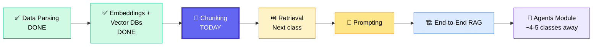

> 💡 **Memory, parent-child retrieval, and multi-modal RAG** are *not* skipped — they land in the Agents and Retrieval modules respectively.

---

## 📍 Where Chunking Sits in the RAG Pipeline

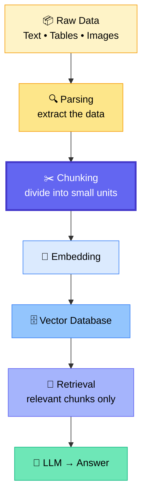

⚠️ **Chunking comes AFTER parsing, BEFORE the vector database.**

| Term | Meaning |
|---|---|
| **Parsing** | Extracting / retrieving data *out of* a document |
| **Chunking** | Dividing that extracted data *into* smaller pieces |

✅ Chunking is not exclusive to vector RAG — **vector-less RAG** can chunk and store without embeddings; **graph RAG** builds a graph on top instead.

---

## 📖 What Is Chunking?

> **Chunking is the process of dividing large data into smaller, meaningful units called chunks.**

In a RAG pipeline each chunk can be:
- 🔢 embedded separately
- 🗄️ stored separately
- 🎯 retrieved separately
- 🤖 sent to the LLM only when relevant

---

## 🤔 Why Do We Need Chunking?

| # | Reason | What it solves |
|---|---|---|
| 1️⃣ | **LLM context window limits** | Models can't take millions of tokens; overloading also causes hallucination |
| 2️⃣ | **Better retrieval accuracy** | Huge blobs in the vector DB = poor matches |
| 3️⃣ | **Lower token usage & cost** | Only relevant slices reach the LLM |
| 4️⃣ | **Faster processing** | Smaller payload = quicker response |
| 5️⃣ | **Sending only relevant info** | Precision on the specific question asked |

> 🎯 If you can explain **2–3 of these points confidently, you're good to go.**

---

## ❓ Is Chunking *Always* Required?

**No. Chunking is a design choice, not a compulsory step.**

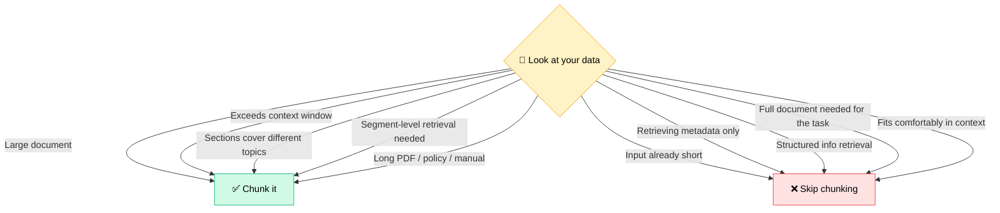

---

## ⚙️ Chunk Size & Chunk Overlap

| Parameter | Definition |
|---|---|
| **Chunk size** | Maximum target amount of content in one chunk — measured in **characters** or **tokens** |
| **Chunk overlap** | Amount of repeated content between neighbouring chunks |

### 🔁 Overlap by Example

**Original text:** `Artificial intelligence helps machines learn patterns and make useful decisions`
**Config:** chunk size = 10 words · overlap = 3 words

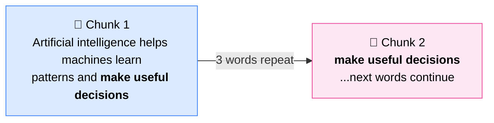

> 🎯 **Why overlap?** To **preserve meaning** when an important sentence gets split across a chunk boundary. Chunk 2 carries context from Chunk 1.

### 🚨 Both are HYPERPARAMETERS

**You cannot pre-decide these values.** They are **experimental / subjective**, driven entirely by the data.

---

## ⚖️ The Trade-Off Table

| Choice | Effect ✅ | Cost ❌ |
|---|---|---|
| **Smaller chunk size** | Higher precision, more chunks | Loses surrounding explanation, may lose context |
| **Larger chunk size** | Preserves more context | Retrieval accuracy drops, may carry irrelevant info |
| **Larger overlap** | Protects boundary information | Duplicated content, more storage, more tokens |
| **No overlap** | Clean, compact storage | Meaning can break at boundaries |

---

## 🧰 Chunking Strategies

```mermaid
flowchart TD
    Root["✂️ Chunking Methods"] --> LC["📚 LangChain Built-In Classes"]
    Root --> CU["🛠️ Custom / Advanced"]

    LC --> L1["RecursiveCharacterTextSplitter ⭐"]
    LC --> L2["CharacterTextSplitter"]
    LC --> L3["TokenTextSplitter"]
    LC --> L4["Markdown / HTML header splitters"]
    LC --> L5["RecursiveJsonSplitter"]
    LC --> L6["Code splitters e.g. Python"]
    LC --> L7["NLTK / spaCy text splitters"]

    CU --> C1["Fixed-size chunking"]
    CU --> C2["Content-aware chunking"]
    CU --> C3["Document-structure-based chunking"]
    CU --> C4["Semantic chunking"]

    style Root fill:#6366f1,stroke:#4338ca,color:#fff
    style LC fill:#dbeafe,stroke:#3b82f6,color:#000
    style CU fill:#fef3c7,stroke:#f59e0b,color:#000
    style L1 fill:#d1fae5,stroke:#10b981,color:#000
    style L2 fill:#eff6ff,stroke:#93c5fd,color:#000
    style L3 fill:#eff6ff,stroke:#93c5fd,color:#000
    style L4 fill:#eff6ff,stroke:#93c5fd,color:#000
    style L5 fill:#eff6ff,stroke:#93c5fd,color:#000
    style L6 fill:#eff6ff,stroke:#93c5fd,color:#000
    style L7 fill:#eff6ff,stroke:#93c5fd,color:#000
    style C1 fill:#fffbeb,stroke:#fbbf24,color:#000
    style C2 fill:#fffbeb,stroke:#fbbf24,color:#000
    style C3 fill:#fffbeb,stroke:#fbbf24,color:#000
    style C4 fill:#fffbeb,stroke:#fbbf24,color:#000
```

> ⚠️ **`SemanticChunker` is no longer in core LangChain** — it lives in `langchain_experimental` (deprecated in newer versions, and one variant points to an external AI21 Labs API). Writing your own logic is perfectly valid.

---

# 💻 Practical Walkthrough

**Dataset used:** `Llama2_research_paper.pdf` — all pages read, then joined into a single string.

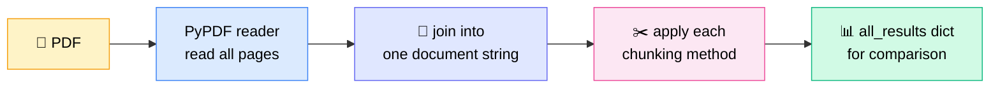

**Helper functions built in the notebook:**
- `print_chunks(title, chunks, preview_limit)` → prints title, text preview, metadata
- `chunk_statistics(method, chunks)` → method name, #chunks, min/max/avg length, total stored characters
- `all_results: Dict[str, Any]` → collects every method's output for a final comparison

---

## 1️⃣ Fixed-Size Chunking (Custom Python Logic)

**Pure Python — no LangChain, no LlamaIndex.**

```python
step = chunk_size - chunk_overlap   # the core of the whole thing
```

**Guard rails in the function:** raise error if `chunk_size <= 0`, or if `chunk_overlap < 0` or `chunk_overlap >= chunk_size`.

### 🔬 Micro-example
```
text        = 26 characters
chunk_size  = 10
overlap     = 2
step        = 10 - 2 = 8
→ chunks begin at positions: 0, 8, 16, 24  →  4 chunks
```
Last 2 characters of each chunk reappear as the first 2 of the next.

| Pros ✅ | Cons ❌ |
|---|---|
| Simple and predictable | Breaks words, sentences, paragraphs |
| Every chunk hits the same max size | Boundary may land mid-heading |
| Overlap protects boundary info | Overlap creates duplication |

> 💡 LangChain's splitters are, in the backend, doing broadly this same kind of work.

---

## 2️⃣ CharacterTextSplitter — **Separator Driven**

Splits on **one given separator**. Default separator is `\n\n` (paragraph).

### 🚨 The Warning Everyone Hits
```
"Created a chunk of size 1982, which is longer than the specified 300"
```

**Why?** The separator gets **priority over chunk size**. If a paragraph has no separator inside it and is already bigger than 300 characters, LangChain gets one indivisible block it cannot break further — so it returns the oversized chunk plus a warning.

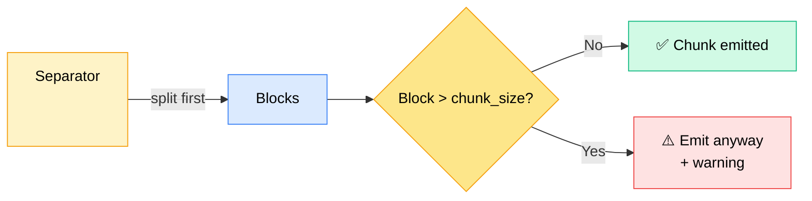

**Experiment run in class:** switching the separator from `\n\n` (paragraph) to `\n` (new line) changed chunk sizes to 371, 310, 371… — proving the separator, not the number, is in charge.

> 📌 **Key takeaway:** chunk size here is **not a strict maximum**. Use it when your source has a predictable separator and you want a simple baseline.

---

## 3️⃣ RecursiveCharacterTextSplitter ⭐ — **The Industry Baseline**

Splits **recursively using multiple separators in priority order.**

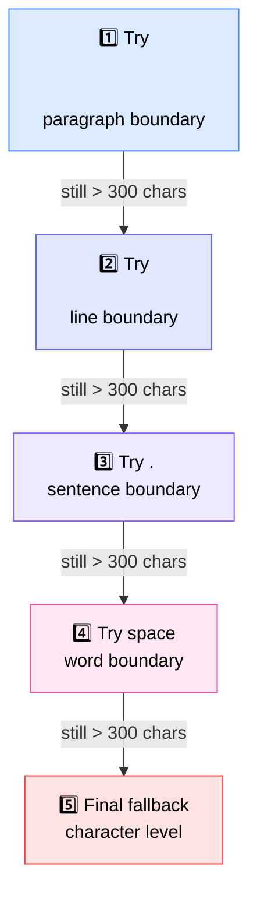

**Parameters explained:**

| Parameter | Meaning |
|---|---|
| `chunk_size=300` | Final chunk should be approximately no more than 300 characters |
| `chunk_overlap=50` | ~50 characters from the previous chunk repeat in the next, so context isn't lost |
| `length_function=len` | Chunk size measured by **number of characters** |
| `add_start_index=True` | Stores where each chunk started in the original document, as **metadata** |

**Result on the Llama-2 paper:** ~**1107 chunks**, individual lengths like 257, 242, 229, 274 characters — all under the 300 ceiling.

✅ Works well for general text · preserves natural boundaries · still controls chunk size · strong baseline for **PDFs, reports, policies, articles**.

---

## 4️⃣ TokenTextSplitter — Split by Tokens, Not Characters

Divides the data by **token count**, using a tokenizer model — in class, `encoding_name="cl100k_base"`.

### 🔬 Micro-example
```
Text  : AI helps machines learn from data and make better decisions for users
Tokens: [AI][helps][machines][learn][from][data][and][make][better][decisions][for][users]
chunk_size = 5 tokens   |   chunk_overlap = 2 tokens
→ each chunk carries 5 tokens; 2 tokens repeat into the next chunk
```

> ⚠️ **Tokens ≠ words.** Different tokenization algorithms split differently — revisit the Hugging Face / tokenization chapter for the algorithms.

**Result on the Llama-2 paper:** ~**1112 chunks**.

---

## 5️⃣ Content-Aware Chunking (Custom Logic)

> **Splits text by understanding its natural structure, instead of cutting blindly after a fixed number of characters or tokens.**

Preserves boundaries such as **paragraphs, sentences, headings, lists, sections, tables, code blocks**.

### 🆚 Side-by-Side

| Fixed-size splitter ❌ | Content-aware chunking ✅ |
|---|---|
| Chunk 1 and Chunk 2 both contain fragments of unrelated topics | Chunk 1 = complete "Artificial Intelligence" block |
| Neither chunk holds complete information | Chunk 2 = complete "Machine Learning" block |
| Meaning is messed up | Semantic meaning preserved |

### 🔄 How the Code Works

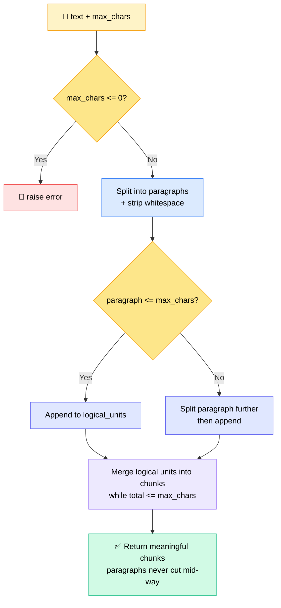

**Output characteristic:** chunk lengths vary naturally — 176, 260, 276, 918, ~1000 characters — because meaning, not a number, decides the cut.

> 🔑 **Relationship to RecursiveCharacterTextSplitter:** the recursive splitter only commands on top of *its separator list*. Custom content-aware logic can chunk on **anything you define** — so the recursive splitter is effectively a **subset** of this approach.

---

## 6️⃣ Document-Structure-Based Chunking

Use built-in classes and chunk on the document's own skeleton:

| Format | Structural anchor |
|---|---|
| Markdown | `#`, `##`, `###` headings |
| HTML | heading tags |
| JSON | hierarchy |
| Code | functions / classes |
| PDF | layout regions |

---

## 7️⃣ Semantic Chunking

> Group sentences by **meaning**, breaking only where the topic genuinely changes.

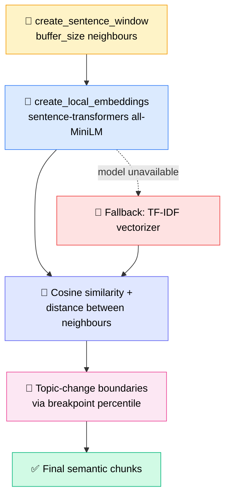

### 🎛️ The Two Knobs

**`buffer_size`** — how many neighbouring sentences are added before and after the current sentence to build context.
`buffer_size = 1` → one sentence on the left, one on the right.

**`breakpoint_percentile`** — how large a semantic distance must be before starting a new chunk.

| Value | Behaviour | Result |
|---|---|---|
| **50** | Lower threshold | More breakpoints → **smaller chunks** |
| **75** ⭐ | Balanced (used in class) | New chunk only at relatively large topic changes |
| **90 / 95** | Higher threshold | Fewer breakpoints → **larger chunks** |

**Logic:** low semantic distance = sentences discuss a similar topic → keep in same chunk. High semantic distance = topic has probably changed → start a new chunk.

**Result on the Llama-2 paper:** distance threshold **0.265**, **709 chunks**, plus a DataFrame showing left-hand sentence, right-hand sentence, similarity, and whether that point is a breakpoint (True/False).

> 💰 Semantic chunking **may cost money** if you use a paid embedding model. The local sentence-transformer keeps it free.

---

## 📊 Method Comparison on the Same Document

| Method | Driven by | Chunks produced |
|---|---|---|
| Manual fixed-size (custom) | Character count + step | **1043** |
| CharacterTextSplitter | Single separator `\n\n` | **77** |
| RecursiveCharacterTextSplitter | Separator priority list | **1107** |
| TokenTextSplitter | Token count (`cl100k_base`) | **1112** |
| Content-aware (custom) | Paragraph / structure | Variable sizes |
| Semantic chunking | Embedding distance @ p75 | **709** |

> ⚠️ **More chunks ≠ better.** These numbers exist to be *evaluated*, not ranked on sight.

---

## 🚫 Common Mistakes

- ❌ Picking a chunk size **without evaluating the retrieval pipeline**
- ❌ Chunks that are too small (context lost) or too large (irrelevant noise)
- ❌ Excessive overlap → duplication, storage bloat, token waste
- ❌ Splitting a **heading away from its content**
- ❌ Splitting **tables without preserving the header row**
- ❌ Splitting **code in the middle of a function or class**
- ❌ Removing useful **metadata** — keep it attached to the chunk
- ❌ Jumping to semantic / agentic chunking **without comparing a simple baseline** first
- ❌ Assuming **one strategy works for every data type**

> 🧱 **Simple baselines** = fixed-size chunking, character-based chunking, recursive character splitter. Start here.

---

## 🖼️ Chunking Beyond Text

**Yes — images, tables, code, audio, video, and maps can all be chunked.** But only when it's actually needed.

### 🎨 Image Chunking
Divide a large image into smaller **visual regions**: fixed tiles · overlapping tiles · detected objects · document layout regions · semantic regions.

**Useful when:**
- 🔍 The image is very large
- 🔡 Small text disappears after resizing
- 🐜 Tiny objects need to be detected
- 🧩 The image contains many independent regions
- 🎯 Region-level retrieval is required
- 🗺️ It's a map, medical scan, scanned document, diagram, or satellite image

*Example:* a scanned invoice can be split into header · checkbox area · line-item block · table · footer.

> ⚠️ **Default position:** keep images as **standalone whole images**. Only chunk them once the whole-image approach demonstrably fails.

### 📊 Table Chunking
Divide a large table into smaller **logical table sections**: by rows · overlapping rows · columns · category · entities.

*Real project:* a table spanning **5 PDF pages with 100+ rows** → grouped by product category (electronics / furniture / stationery) into separate sub-tables.

> 🔑 **The universal rule: find the pattern, then split on it.**

---

## 🏭 Real-World Project Example

**Pharma reports as `.docx`, 30+ pages each.**


> 🎯 **No blind chunking was applied.** Analysis first, strategy second.

---

## 🎤 Interview Corner

| ❌ Don't say | ✅ Do say |
|---|---|
| "I did chunking using RecursiveCharacterTextSplitter." | "First I analysed the data and identified meaningful patterns, then wrote rules in code and performed chunking based on those." |
| "I used a 500/50 config." | "I understood the document structure — sections, headings, layout — and chunked on that basis." |
| — | "I evaluated multiple strategies against retrieval quality before finalising one." |

> 💬 A one-line "I used library X" answer is a **rejection risk**. The interviewer is testing whether you *think* about the data.

---

## ❓ Live Q&A Highlights

| Question | Answer |
|---|---|
| **Is `SemanticChunker` from `langchain_experimental` usable?** | Yes. It's a deprecated/experimental class, but the **core algorithm is identical** to the custom code — sentence window → embedding → distance → breakpoint. Its default `buffer_size` is 1 and default percentile is 95 (class used 75). Embedding model is a customisable parameter, so cost is the same either way. |
| **Millions of documents arriving at runtime — how do I pick a method?** | Build a **dynamic ingestion pipeline**: detect file type and structure → select the appropriate splitter → apply its config. Plain PDF/text → recursive splitter; Markdown/JSON/HTML → their dedicated splitters; or semantic chunking. |
| **Which chunking method is "best"?** | **There is no best method.** It's experimental and subjective to the data. Test on a portion of the data in a separate notebook, evaluate the retrieval result, then promote the winner into the solution. |
| **If only Chunk 3 is retrieved, how can the LLM answer fully?** | Chunk 3 came back *because it matched the query*. The other chunks weren't relevant, so the LLM doesn't need them. If broader background is genuinely required, work on the **retrieval side**: pull more chunks, use summarised/synthetic context, re-ranking, or prompt tweaks like "focus on the relevant information". |
| **Chunking vs. sharding — same thing?** | **No.** Chunking acts on **document content**, goal = better retrieval quality. Sharding partitions **indexes across multiple machines**, goal = scalability, storage capacity, performance. |
| **How do I know which document an answer came from?** | Attach and read the **metadata** on each chunk. That gives you source document, PDF name, last-updated info, etc. |
| **How do I give users confidence the answer uses the latest document?** | Query the source system's attributes/SDK (e.g. a Databricks catalog exposed last-updated timestamps, new PDFs, and diffs). Surface that metadata. When a term is ambiguous across departments (e.g. "gross profit"), **ask a clarifying question back to the user** and maintain hierarchy/state/memory. |
| **What have you personally used in production?** | **Section-wise chunking** on one project. A parallel project used **semantic chunking**. Both are industry-standard practice. |
| **PDF + DOCX + images + audio — separate ingestion pipelines?** | Depends on **where the data comes from**. Same source, different formats → segregate into folders, possibly separate **indexes**. Different sources → different pipelines. The ingestion pipeline is **decoupled from the AI layer**. |
| **On-prem 70B model, 128GB VRAM — where do I start with fine-tuning?** | Don't assume a larger model fixes things. **First evaluate the failures of the 8B model** — is it missing domain knowledge, or is it bad prompting? Build the evaluation muscle before scaling parameters. Model-hosting content is planned in 1–2 weeks. |
| **Do agents use RAG / vector DBs?** | Yes — the vector database becomes a **tool** the agent calls for context retrieval. Full treatment in the Agents module. |
| **Does registering an agent on a marketplace make it context-aware?** | **No.** Marketplaces (e.g. AWS) provide **discovery, subscription, deployment, pricing, integration**. Context-awareness must be built into your **agent runtime** — session, memory, identity, tools, data connections. A2A is just a protocol, like MCP. |
| **Does chunk size need to fit the embedding model's context window?** | No — the embedding model handles the input and returns a fixed-size vector. |
| **Is HyDE a chunking technique?** | No — it's a **retrieval** technique. |
| **Parent-child chunking?** | Covered on the **retrieval** side, not here. |

---

## 🧠 The One Rule That Runs Through Everything

> ### 🚫 **Never chunk blindly.**
> **Analyse the data → find the pattern → define the strategy → evaluate the retrieval → iterate.**

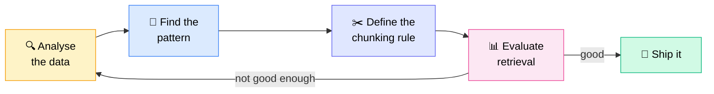

> 🗣️ *"Chunking of the data is all about the experiments. It's a subjective thing to the data."*
> 🗣️ *"That's why you are the AI engineer — you drive it from research, from POCs, and then you build it for production."*

---

## 🗓️ Schedule & What's Next


- 🚫 **No weekend class** this week — the next class moves to **Wednesday**
- 📼 Recordings available within **24 hours** on the dashboard
- 📄 Transcripts are uploaded too — paste them into an LLM for a fast revision instead of rewatching
- 🔜 Next class also brings a **simpler semantic chunking implementation** and **different data types**

---

## ✅ Action Items

- [ ] 📥 Pull the three shared files: chunking guide `.docx`, previous-session `.ipynb`, and `chunking_methods.ipynb`
- [ ] 📦 Install the new `vector_db.txt` requirements into your virtual environment
- [ ] 🧪 Run every chunking method in the notebook end-to-end yourself
- [ ] 🔧 Change `chunk_size`, `chunk_overlap`, and the **separator** and observe how output shifts
- [ ] 🎛️ Try `breakpoint_percentile` at 50, 75, and 90 and compare chunk counts
- [ ] 📖 Read the full chunking `.docx` guide — it's written for interview prep
- [ ] 🧠 Revisit the tokenization chapter (Hugging Face session) before token-based splitting
- [ ] 🔁 Revisit the RAG pipeline architecture if retrieval flow still feels unclear
- [ ] 📅 Join **Wednesday 29 July, 8:30 PM IST** on time — revision starts immediately

---

*📝 Notes compiled from the Class 35 session transcript — Chunking Techniques for RAG.*
