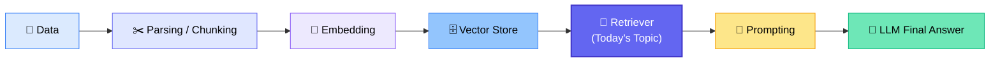
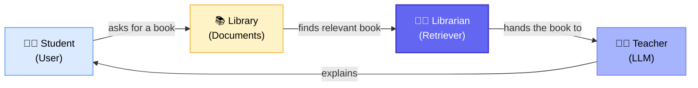
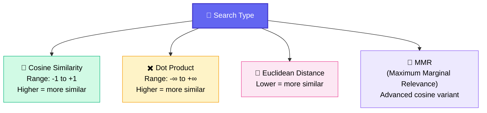
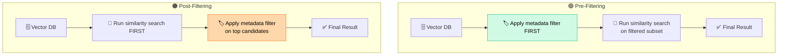
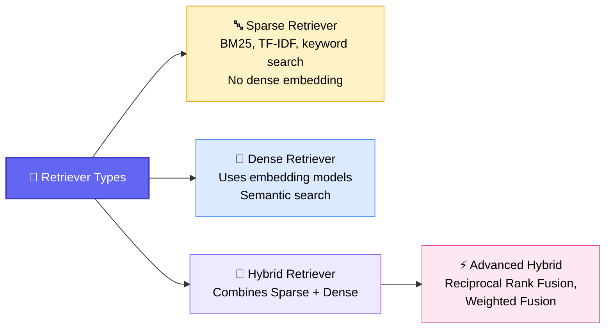
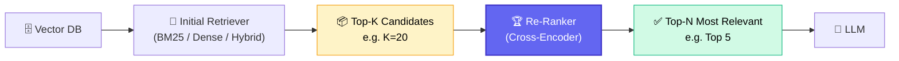
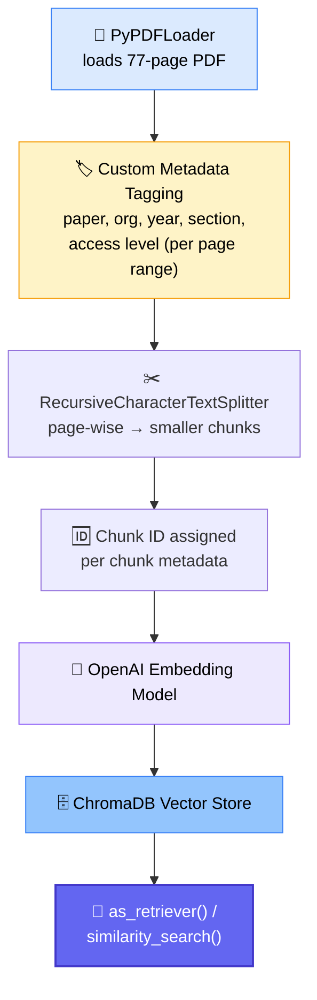

# 🔍 Retriever Deep-Dive — RAG Pipeline Session
### 📋 Session Notes — Krish Naik Academy

**🎙️ Speaker:** Sunny Savita
**⏱️ Duration:** ~2.5 hours (incl. breaks + doubt session) | **🎯 Session Type:** Live Class + Q&A

---

## 🧭 Where This Fits in the RAG Pipeline

The class picks up right after chunking and vector stores, moving into the **Retriever** — the component that decides *what* gets handed to the LLM.

> 💡 **Session material:** Sunny shared a self-authored Retriever PDF guide on GitHub (not copy-pasted from anywhere) covering the full table of contents below — intended as interview-ready reference material.

---

## 📖 What Is a Retriever?

> *"A Retriever takes a user query and returns the most relevant document/chunk from the knowledge source. It does not generate the final answer itself — it collects the relevant context required to generate the answer."*

The **knowledge source** = Vector DB / Vector Store. The retrieved chunks are known by several interchangeable names:

| Term | Meaning |
|---|---|
| 🧩 Context | The relevant chunk(s) passed to the LLM |
| 📥 Retrieved data | Same as above |
| 📄 RAG document | Same as above |
| 🏆 Ranked data | Same as above |

### 🎓 The Library Analogy

- 🎯 The **librarian (Retriever)** doesn't answer your question — it finds the *relevant book*
- 🎓 The **teacher (LLM)** uses that book to actually explain the answer

---

## ⚙️ Key Retriever Parameters (LangChain)

| Parameter | Meaning |
|---|---|
| **K** | Number of documents/chunks to retrieve (e.g. `k=10`) |
| **filter** | Metadata-based filtering condition |
| **score_threshold** | Minimum acceptable relevance/similarity score to keep a result |
| **fetch_k** | Candidate pool size before diversity re-ranking (used with MMR) |
| **lambda_mult** | Balances relevance vs. diversity in MMR |

---

## 📐 Similarity Search Methods

- ✅ **Cosine similarity** is the normalized version of dot product — most commonly used in the industry because it avoids unbounded (−∞ to +∞) values.
- 🎯 **MMR (Maximum Marginal Relevance)** is *not* a separate distance formula — it's cosine similarity applied with an added **diversification** step, controlled by `fetch_k` (candidate pool) and `lambda_mult` (relevance vs. diversity balance). Its core goal: **reduce redundancy** among retrieved chunks.

> 🗣️ *"There is no 'best' similarity method — it depends on the use case. In most cases, cosine similarity works very well; MMR is the advanced upgrade when redundancy is a problem."* — Sunny Savita

---

## 🗂️ Metadata Filtering: Pre- vs. Post-Filtering

Metadata filtering restricts retrieval using structured fields like department, year, document type, source, or user role — not just semantic similarity.

| | 🟢 Pre-Filtering | 🟠 Post-Filtering |
|---|---|---|
| **Order** | Filter → then search | Search → then filter |
| **Advantages** | Smaller search space, reduces irrelevant results, improves security, supports tenant isolation, prevents unauthorized docs from entering candidate list, faster retrieval | — |
| **Limitations** | — | May return too few final results, relevant permitted docs may never enter the initial top-K, unauthorized docs may enter the intermediate candidate set, not suitable for strict access control, needs a larger initial K |
| **Industry preference** | ✅ **Preferred choice most of the time** | Used occasionally / in early POCs |

> 🏢 **Tenant Isolation example:** Department A can only retrieve Department A's documents (via pre-filtering) — this strict isolation is **not reliably achievable** with post-filtering.

---

## 🧬 Types of Retrievers

| Type | Description |
|---|---|
| 🔤 **Sparse Retriever** | Older, pre-LLM-embedding technique (BM25, TF-IDF, keyword matching). Still relevant, especially for exact term matching. A "vector-less" solution — no dense embedding involved. |
| 🧬 **Dense Retriever** | Uses embedding models to generate dense vectors and perform semantic search — what the class has been building so far. |
| 🔀 **Hybrid Retriever** | Combines keyword (sparse) + vector (dense) search, then merges results — e.g. via **Reciprocal Rank Fusion**. |

> 📅 **Fun fact shared in class:** ChatGPT launched in **December 2022**; the original RAG research paper was introduced in **2020**, which is where sparse retrieval techniques (TF-IDF, BM25) originate from.

---

## 🔄 Query Transformation

When a user query is too vague or incomplete for good retrieval, it can be transformed before hitting the vector store:

| Technique | What It Does | Example |
|---|---|---|
| ✍️ **Query Rewriting** | Converts unclear/conversational query into a clear standalone query | "What did he say about it?" → "What did the CEO say about the 2026 acquisition?" |
| ➕ **Query Expansion** | Adds synonyms, related terms, acronyms, alternate phrasing | "employee policy" → "employee policy, vacation policy, annual leave guidelines" |
| ✂️ **Query Decomposition** | Breaks one complex query into multiple sub-queries, retrieves evidence for each, then combines results | — |
| 🧪 **HyDE** (Hypothetical Document Embedding) | A form of query decomposition/expansion technique — full explainer available on Sunny's YouTube channel | — |

> 💡 In **Agentic RAG pipelines**, query rewriting is commonly triggered when the initial Retriever underperforms — the orchestration loop rewrites the query and retries.

---

## 🏆 Re-Ranking

**Definition:** *A second-stage process that takes documents returned by an initial Retriever, scores them more accurately against the user query, and reorders them so the most relevant documents reach the LLM.*

### 🎓 Classroom Analogy
- 🧑‍🎓 50 students → filtered by IQ → 10 students (**Retrieval**)
- 🧑‍🎓 10 students → filtered by reasoning/logical thinking → top 3 students (**Re-Ranking**)

### ✅ Benefits of Re-Ranking
- Improves ordering of retrieved documents
- Removes weak candidates
- Reduces irrelevant context & unnecessary input tokens
- Improves evidence quality
- Works on results from sparse, dense, or hybrid retrieval

### ⚠️ Limitations
- Adds latency
- Computational / inferencing cost

### 🧠 Cross-Encoder = the Re-Ranking Model
- It's an **LLM model**, not just an architecture
- Uses the **cross-attention** mechanism (recall: self-attention, cross-attention, mask-attention from Transformer architecture)
- Checks query-to-document relevance for *every* candidate pair, then re-scores

> ⚠️ **Important distinction:** Metadata (post-)filtering is *not* the same as true re-ranking. Metadata filtering is a "shallow" partial technique; true re-ranking re-applies retrieval-level scoring (e.g. cross-encoder) on top of the candidate set.

**Advanced technique flagged for later:** 🔁 **Reciprocal Rank Fusion (RRF)** — an advanced hybrid re-ranking technique using weighted values to decide which retrieval method's results matter more.

---

## 🖼️ Multi-Modal Retriever (Preview)

Vector databases aren't limited to text — images and tables can be stored and retrieved too.

| Modality Pair | Use Case |
|---|---|
| 📝 Text → 🖼️ Image | Retrieve relevant images from a text query |
| 🖼️ Image → 🖼️ Image | Retrieve visually similar images |
| 📝 Text → 📊 Table | Retrieve relevant tables from a text query |
| 📊 Table → 📊 Table | Retrieve similar tabular data |

> 🗓️ **Full build planned for the next Saturday session** — a complete multi-modal RAG demo (text-to-image, image-to-image, text-to-table).

---

## 💻 Hands-On Practical Walkthrough

The live coding demo used the **Llama 2 research paper PDF** (77 pages) as the working dataset.

### 🔬 What Was Demonstrated Live
- ✅ Custom metadata added per page range (e.g. pages 1–2 = front matter, 3–4 = introduction, 5–7 = pre-training, 8–19 = fine-tuning, 20–31 = safety)
- ✅ `vector_store.as_retriever(search_type="similarity", search_kwargs={"k": 4})`
- ✅ `vector_store.as_retriever(search_type="mmr", ...)` — compared side-by-side against plain similarity search; **results differed meaningfully** between the two methods
- ✅ `score_threshold` retriever — tested at 95%, 75%, 65%, 55%, 59% thresholds; only 59% and below returned matches for that particular query (max relevance ≈ 64%)
- ✅ `similarity_search_with_relevance_score()` — returns documents *with* their numeric relevance scores directly
- ✅ Manual computation & comparison of **cosine similarity, dot product, and Euclidean distance** across the same candidate chunks
- ✅ **Pre-filtering** demo: `search_kwargs={"filter": {"section": "fine-tuning"}}` — all 4 results returned belonged strictly to the fine-tuning section; adding more filter conditions (year, metadata) further narrowed the search space
- ✅ **Post-filtering** demo: retrieved an unfiltered candidate set (K=15) first, then manually filtered with an `if` condition on `metadata["section"]` and `metadata["year"]`

---

## ❓ Live Q&A Highlights

| Question (Asked By) | Answer |
|---|---|
| Explain `fetch_k` and `lambda_mult`? (Raghu) | Deferred to next class — tied directly to MMR's diversity mechanism |
| When to use pre- vs. post-filtering in a real business case? (Shweta) | Weigh pre-filtering's advantages against post-filtering's limitations (both listed in the PDF) — in practice, pre-filtering wins most of the time |
| Is a cross-encoder an LLM model or just an architecture? (Shweta) | It's an LLM model that uses cross-attention to score query-document relevance |
| Does pre-filtering happen *inside* the vector database before search? (Asutosh) | Yes — filtering happens internally in the vector DB, and only the filtered subset proceeds to vector search. Post-filtering applies the condition manually *after* search |
| How to handle policy versioning (e.g. old vs. new HR leave policy) in a vector DB? (Priyabrata) | Don't delete old records — add metadata fields like `status` (active/superseded), `policy_id`, `version`, and `superseded_by`. Update metadata rather than re-embedding when a new version is published |
| Should we build one enterprise-wide vector DB across departments, or project-wise? (Priyabrata) | No fixed template — start with a working RAG, validate with real business requirements, then iteratively enhance ("organically" improve over time) |
| Should there be a governance layer above the vector DB? (Priyabrata) | Yes, in production — an **access control layer** sits between application and vector DB: authenticate → authorize (GAV/policy layer) → retrieve only permitted records. Applications should never let users/LLMs query the vector service directly |
| How to handle RAG with sensitive data (medical records, PII)? (Krish S) | Protection must be system-wide, not just RAG-level: de-identify/redact/tokenize PII → classify & attach access metadata → encrypt before chunking → authenticate/authorize queries (patient-level filtering) → retrieve only permitted records. Sensitive identifiers (name, phone, email, medical record #, insurance #) should generally **not** be embedded directly |

---

## 📝 Homework — Retriever Techniques to Self-Research

Sunny assigned these as exploration topics ahead of the next class and the upcoming mega-assignment:

- [ ] ⚖️ **Weighted Fusion**
- [ ] 🔁 **Reciprocal Rank Fusion (RRF)**
- [ ] 🔀 **Multi-Query Retriever**
- [ ] 🧪 **HyDE Retriever**
- [ ] 👪 **Parent Document Retriever**
- [ ] 🗜️ **Contextual Compression Retriever**
- [ ] 🪟 **Sentence Window Retriever**
- [ ] 🔗 **Multi-Hop Retriever**
- [ ] 🛠️ **Custom Retriever** — built by extending LangChain's `BaseRetriever` class with your own logic (used inside LangChain/LangGraph applications)

---

## 🗺️ What's Coming Next

```mermaid
flowchart LR
    A["🔎 Remaining Retriever<br/>concepts (fetch_k, MMR deep-dive)"] --> B["📝 Prompting"]
    B --> C["🖼️ Multi-Modal RAG Builder<br/>(full project, with memory + chat UI)"]
    C --> D["🎁 Mega Assignment"]
    D --> E["🤖 Agents<br/>(target: complete by August)"]
    E --> F["⚙️ LLM Ops<br/>(target: September, ~90% course done)"]
    F --> G["🔧 Smaller topics<br/>Claude, n8n, etc."]

    style A fill:#dbeafe,color:#000,stroke:#3b82f6
    style B fill:#fde68a,color:#000,stroke:#f59e0b
    style C fill:#ede9fe,color:#000,stroke:#8b5cf6
    style D fill:#fca5a5,color:#000,stroke:#ef4444
    style E fill:#a5b4fc,color:#000,stroke:#6366f1
    style F fill:#6ee7b7,color:#000,stroke:#10b981
    style G fill:#fce7f3,color:#000,stroke:#ec4899
```

> 🧭 **Agent-related topics** (evaluation, MCP, guardrails, orchestration) will be covered together as the foundation of the Agents module — not as standalone topics.

---

## 📅 Schedule Note

- ⚠️ This was an **extra/makeup session** — no regular class on the upcoming Saturday
- 🗓️ From **next weekend onward, classes resume the regular Saturday & Sunday slot**
- 📢 Learners were asked to share this schedule update in the community group chat

---

## ✅ Action Items for Learners

- [ ] 📥 Download the updated Retriever PDF guide and code from GitHub
- [ ] 🧪 Re-run the practical notebook: pre-filtering, post-filtering, similarity vs. MMR comparison
- [ ] 🔍 Research the 9 homework Retriever techniques listed above
- [ ] 🗓️ Watch for the upcoming **mega-assignment** covering Retriever + Prompting
- [ ] 📺 Optionally review Sunny's YouTube RAG playlist for supplementary depth
- [ ] 💬 Bring open doubts (e.g. `fetch_k`/`lambda_mult` formula) to the next live class

---

*📝 Notes compiled from the full session transcript — Retriever Deep-Dive, RAG Pipeline Series, Krish Naik Academy.*
