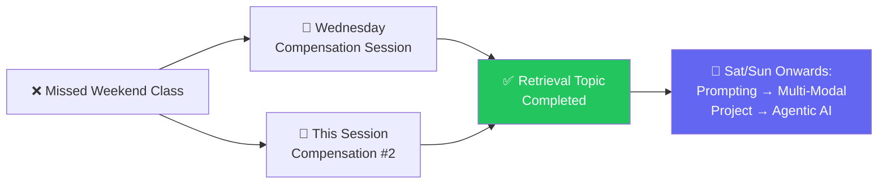
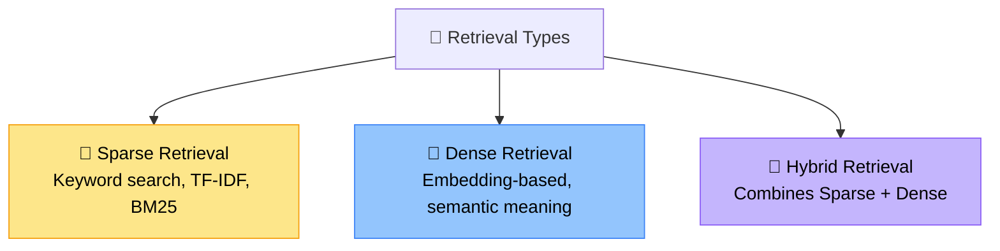
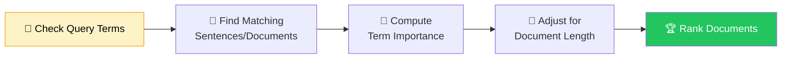
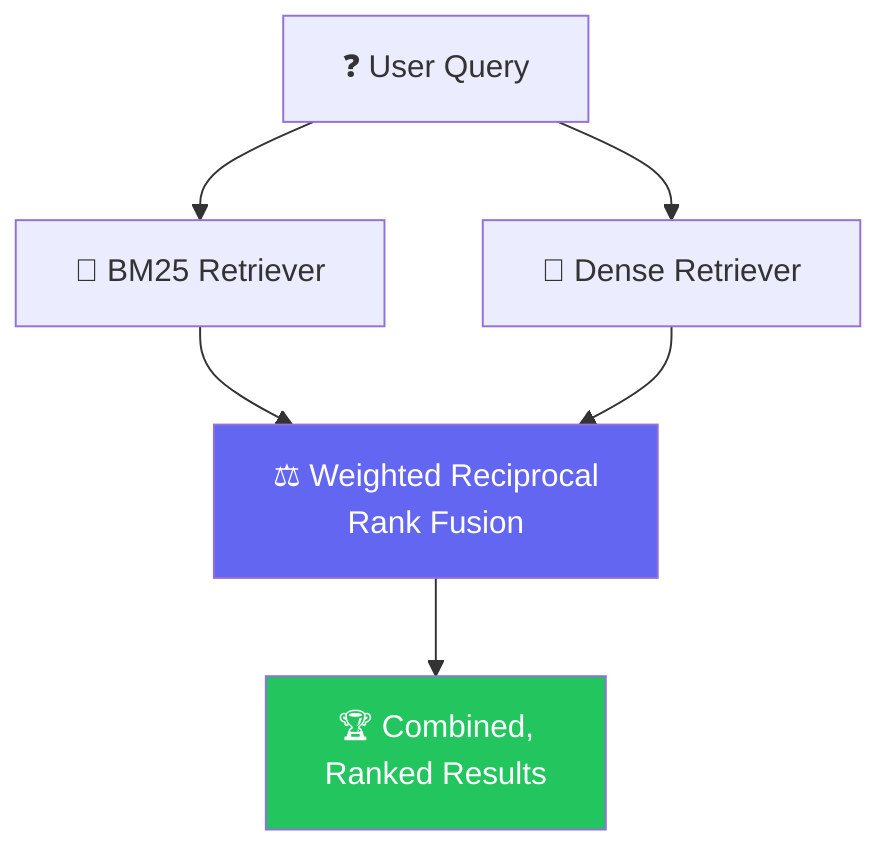
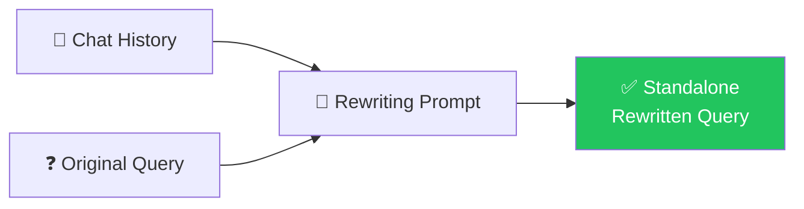
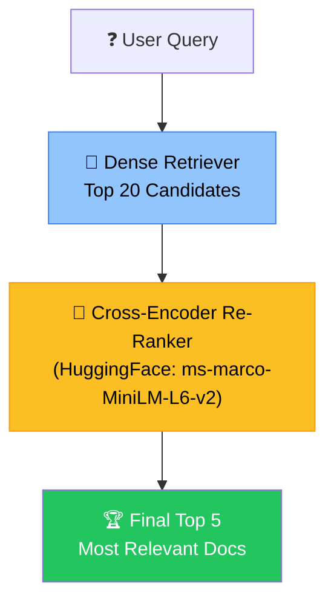
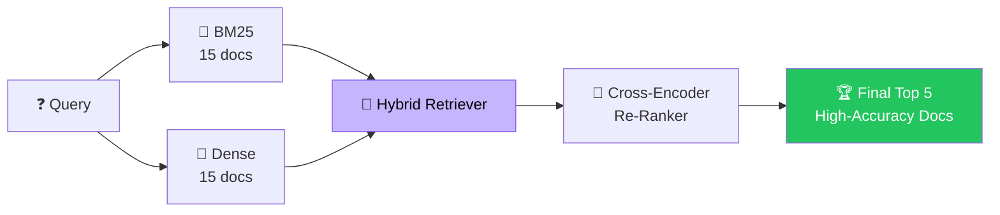
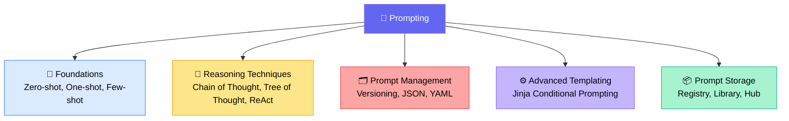

# 🔍 RAG Retrieval Deep-Dive + Prompting Kickoff
### 📋 Compensation Session Notes — Krish Naik Academy

**🎙️ Speaker:** Sunny (Mentor)
**⏱️ Duration:** ~1.5–2 hours | **🎯 Session Type:** Weekday Compensation Class (for a missed weekend session)

---

## 🧭 Why This Session Happened

Sunny had missed the previous weekend's class, so this weekday session **compensates for that gap** — one extra class was already taken on Wednesday, and this is the second.



> 💡 **Ground rule for the future:** If a weekend class is ever missed (maybe 2–3 times a month), a weekday session will be scheduled to make it up — normal weekday classes are **not** a regular occurrence.

---

## 🏆 Announcement: Smart Raghu Build Challenge 2026

A new hackathon has launched in partnership with **Mesh API**, centered on Gen AI, RAG, Agents, and full-stack AI development.

| Detail | Info |
|---|---|
| 🏷️ Name | Smart Raghu Build Challenge 2026 |
| 💰 Total Prize Pool | ~$75,000 |
| 🥇 1st Place | $20,000 |
| 🥈 2nd Place | $10,000 |
| 🥉 3rd Place | $5,000 |
| 🎁 4th–10th Place | Free access to the quarterly project subscription |
| 🗓️ Registration Deadline | 11th August |
| 🤝 Sponsor | Mesh API |

⚠️ **Important:** Register using the **same email ID** already linked to your Krish Naik Academy account — a different email ID will not work.

---

## 🗂️ Retrieval Recap — Where We Left Off

Previous sessions had already covered **pre-filtering** and **post-filtering**, with practicals shown live. Today picks up from **Retrieval Types**, of which there are three:



---

## 🧮 Sparse Retrieval: BM25

**BM25 (Okapi BM25)** is an updated, more advanced variant of TF-IDF — it's a ranking algorithm that scores how relevant a document is to a query, based on **word/keyword-level matching**, not semantic meaning.

> *"BM means Best Matching — BM25 ranks the matching document, not just word adjustment."* — Sunny

### ⚙️ How BM25 Works


### 🎯 Key Factors BM25 Balances
1. **Term Frequency (TF)** — how often a term appears
2. **Inverse Document Frequency (IDF)** — rare terms matter more than common ones (e.g. "engagement" > "policy")
3. **Document Length Normalization** — prevents long documents from getting an unfair advantage

✅ **No vector database required** — BM25 works directly on the chunks, since it's a **sparse embedding technique**, not dense. This means a **vector-less RAG** is entirely possible using BM25 alone.

```python
# Conceptual flow shown in practical
bm25_retriever = BM25Retriever.from_documents(chunks)
bm25_retriever.k = 4
results = bm25_retriever.invoke(query)  # → 4 relevant documents, no vector DB
```

---

## 🧠 Dense Retrieval

Dense retrieval uses an **embedding model** to convert text into vectors, stores them in a vector database (ChromaDB in the demo), and retrieves based on **semantic meaning** rather than exact keywords.

| | 🧮 Sparse (BM25) | 🧠 Dense (Embedding) |
|---|---|---|
| Needs vector DB? | ❌ No | ✅ Yes |
| Needs query embedding? | ❌ No (automatic) | ✅ Yes |
| Matches on | Keywords / word-level | Semantic meaning |
| Works well when | Exact terms matter | Paraphrased / conceptual queries |

> 💬 *"From here only, the RAG concept becomes more powerful — because we're focusing on the meaning of the vector, not just the keyword."*

---

## 🔀 Hybrid Retrieval — Combining Both

Built using LangChain's **`EnsembleRetriever`**, which merges BM25 + Dense retrieval results using **Weighted Reciprocal Rank Fusion (RRF)**.



- Weights are configurable per retriever (e.g. **50/50**, or try **40/60** or **60/40** depending on performance)
- To compare which weighting/technique works best: check **end results manually**, and/or use metrics like **Precision, Recall, and MRR (Mean Reciprocal Rank)** — covered in more depth in a future RAGAS/evaluation session
- ⚠️ Manual evaluation with actual SMEs/BAs still matters more than relying purely on metrics

---

## 🔧 Query Transformation Techniques

> 💡 Homework from a previous session included exploring **HyDE Retriever**, **Multi-Query Retrieval**, and **Multi-Hop Retrieval** — all working on a similar underlying concept of transforming the original query.

### 1️⃣ Query Expansion
Rewrites/generates multiple alternative phrasings of a query (synonyms, related terms, abbreviations) to maximize retrieval coverage — implemented using a Pydantic-structured LLM output (`list[str]`).

```python
# Conceptual structure
class QueryExpansion(BaseModel):
    query: list[str]  # 4 alternative search queries generated by LLM
```

### 2️⃣ Query Decomposition
Breaks a **complex query** into **independent, atomic sub-queries**, retrieves for each separately, then merges and deduplicates the evidence.

**Example:**
> *"Compare Llama 2 pretraining with Llama 2 fine-tuning, explain how Meta improved safety"*
→ Decomposed into:
- What is the pretraining process for Llama 2?
- What is the fine-tuning process?
- How did Meta improve model safety?

### 3️⃣ Query Rewriting (Conversational)
Uses **chat history** to resolve pronouns and rewrite a conversational follow-up into a standalone search query — critical for **Agentic RAG systems**, where a query may need to be rewritten and re-retrieved if the first attempt doesn't return useful results.



### 4️⃣ Multi-Query Retrieval (LangChain Built-in)
LangChain's `MultiQueryRetriever` automates the same logic as manual query expansion — pass in an LLM + a dense retriever, and it generates and retrieves across multiple query variants automatically.

📌 *Not covered in depth but mentioned for a future session:* **Parent Document Retrieval** and **Sentence Window Retrieval** — retrieving a larger "parent" chunk based on a matched "child" chunk, or retrieving a window of surrounding sentences.

---

## 🏅 Re-Ranking with Cross-Encoders

After initial retrieval (a larger candidate set), a **cross-encoder model** re-scores each document against the query using **cross-attention**, then keeps only the top N most relevant results.



- Implemented via LangChain's `ContextualCompressionRetriever` + `CrossEncoderReranker`
- Demonstrated flow: **21 candidates → re-ranked → 5 top documents**

### 🔥 Most Powerful Combo: Hybrid + Re-Ranking


This combines the strengths of keyword matching (BM25), semantic search (Dense), and precision re-ranking (Cross-Encoder) — considered the most powerful retrieval setup covered in this session.

---

## 📚 Prompting — Kickoff Overview

With Retrieval now conceptually complete, Sunny introduced the upcoming **Prompting** chapter, to be covered in full practical detail in the Saturday/Sunday session.



### 🗒️ Topics Flagged for the Next Practical Session
- **Prompting fundamentals** — Zero-shot, Few-shot, One-shot
- **Reasoning prompting** — Chain of Thought, Tree of Thought, ReAct
- **Prompt versioning & management** — treating prompts like code
- **JSON / YAML** for structured prompt management
- **Jinja (conditional) prompting** — writing if-else logic inside prompt templates (used in a real production project by Sunny)
- **Prompt Registry / Prompt Library / Prompt Hub** — including LangChain's own Prompt Hub and LangSmith's prompt registry (to be verified/demoed)
- **Chat Prompt Templates** — flagged as playing an important structural role

> 🎯 **Focus signal:** Sunny emphasized that the *practical, real-world prompt management approach* (versioning, registries, Jinja templating) will get the most session time — more than basic prompting theory, which most learners already know.

---

## ❓ Live Q&A Highlights

| Question | Answer |
|---|---|
| Is query embedding needed for BM25? | No — BM25 handles it automatically; only Dense Retrieval requires an explicit embedding model |
| How many candidate docs before re-ranking? | 21 candidates → re-ranked down to 5 final documents |
| How do I know which retrieval weighting (50/50, 40/60) is best? | Compare end results manually, and use metrics like Precision, Recall, MRR — covered in an upcoming RAGAS/evaluation session |
| Will weekday classes become regular? | No — only used occasionally to compensate for a missed weekend class |
| Where can I find the full notebook and PDF notes? | Shared on GitHub, inside the same folder as previous sessions |

---

## ✅ Action Items for Learners

- [ ] 🏆 Register for the **Smart Raghu Build Challenge 2026** before **11th August**, using your registered account email ID
- [ ] 📓 Review and re-run the shared **IPYNB notebook** covering BM25, Dense, Hybrid, Query Expansion/Decomposition, and Re-Ranking
- [ ] 📄 Cross-check the theoretical **PDF** on GitHub for concepts not yet fully detailed (e.g. HyDE, Parent Document Retrieval, Sentence Window Retrieval)
- [ ] 🔁 Explore **Reciprocal Rank Fusion** and try different weighting splits (50/50, 40/60, 60/40) on your own data
- [ ] 📚 Come prepared for Saturday/Sunday with basic prompting concepts (zero/few/one-shot) already reviewed, since deeper practical prompt management will be the focus
- [ ] 🗂️ Bookmark the GitHub repo link for the notebook + PDF for ongoing reference

---

*📝 Notes compiled from the compensation session transcript — RAG Retrieval Deep-Dive & Prompting Kickoff, Krish Naik Academy.*
