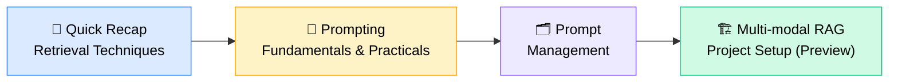
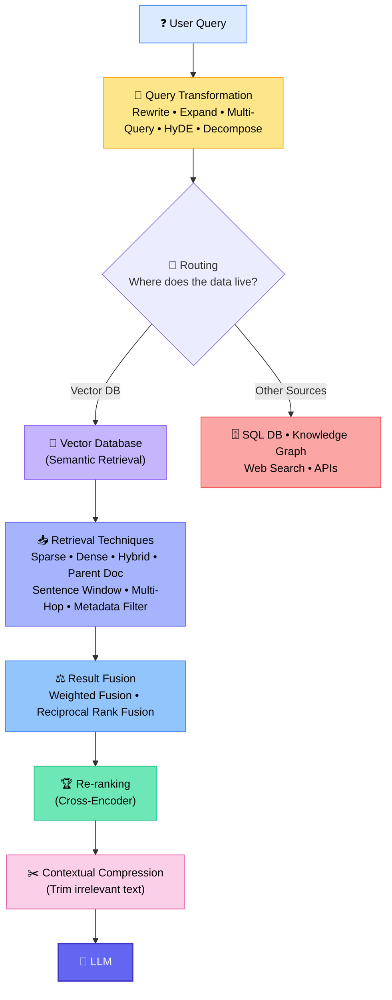
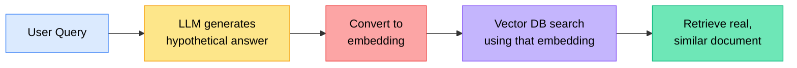
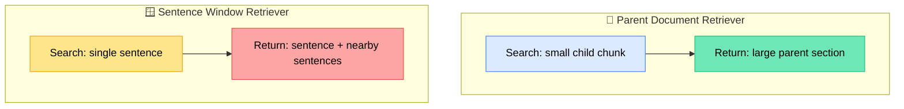
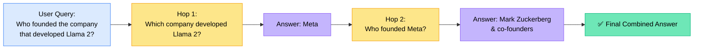
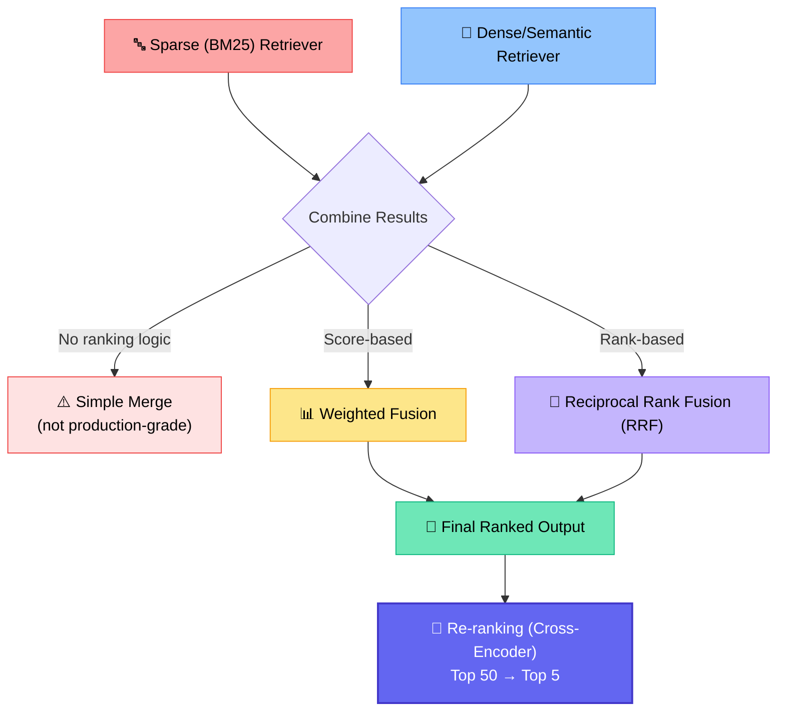
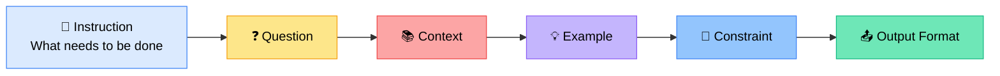
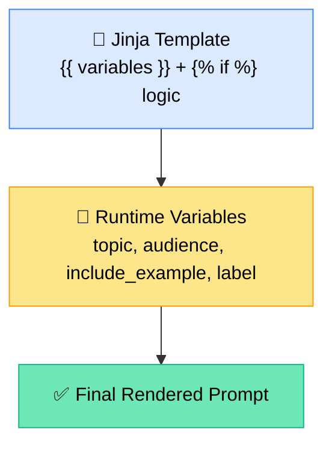
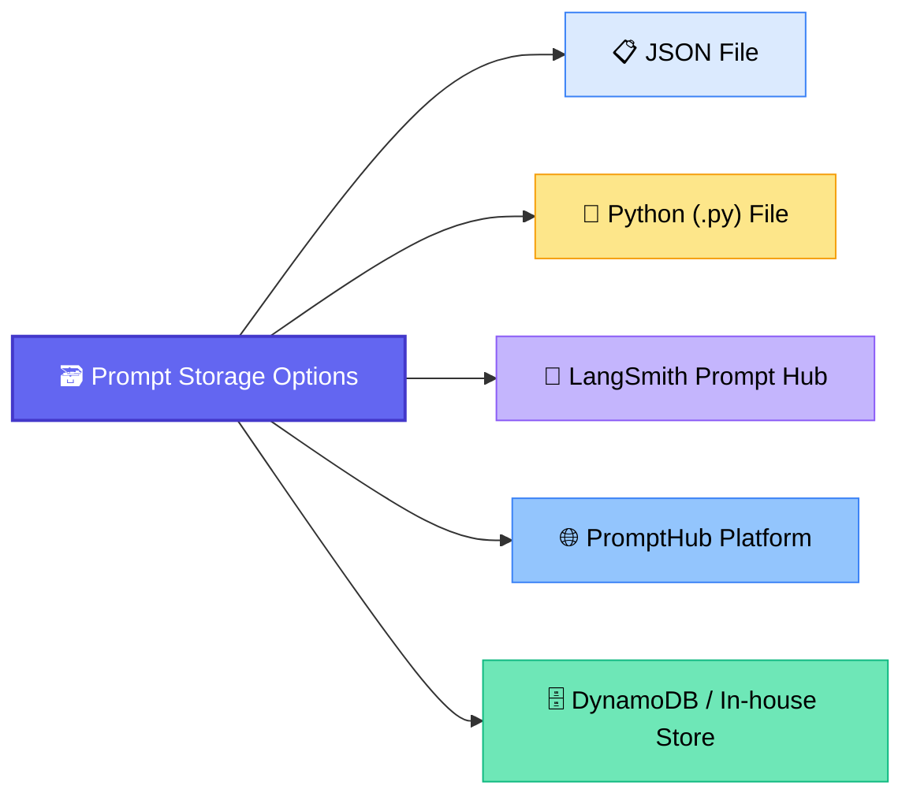
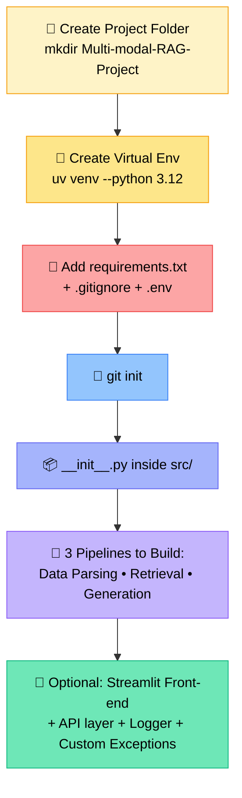

# 📚 RAG Retrieval Techniques — Recap, Prompting & Multi-modal RAG Kickoff
### 📋 Weekend Live Session Notes

**🎙️ Speaker:** Sunny (Mentor)
**⏱️ Duration:** ~3 hours 15 mins (incl. 20-min dinner break + doubt session)
**🎯 Session Type:** Retrieval Recap + Prompting Deep-Dive + Live Q&A
**📅 Session Date:** 8th August (covering catch-up from 29th July & 5th August Wednesday classes)

---

## 🧭 Session Roadmap

> 💡 **Context:** No weekend class was held the previous Sat/Sun — two Wednesday classes (29th July & 5th Aug) covered retrieval instead. This session gives the quick recap before moving to prompting and the Multi-modal RAG project (using the previously parsed PDF).

---

## 🗺️ The Complete Retrieval Pipeline (Line Diagram)

Everything starts with the **user query** — this is the mental model to hold onto for the entire retrieval chapter.

> ⚠️ **Important caveat (repeated throughout the session):** All of these techniques are **experimental**. Sunny was explicit — *"I cannot give you the guarantee that this technique will work very well... you will have to try it out."* When to apply which retriever is decided through **evaluation**, not a fixed rulebook.

> 🌐 **Real-world note:** Retrieval techniques discussed here assume the **vector database** as the source. In real production systems, data can also live in SQL DBs, knowledge graphs, or behind APIs — routing logic to decide *where* to fetch from is covered later under **Agentic RAG**.

---

## 🧩 Query Transformation Techniques

### 1️⃣ HyDE (Hypothetical Document Embedding)

- **Idea:** Instead of embedding the raw query, generate a hypothetical answer first — its embedding tends to be **semantically closer** to real documents than the bare question.
- **Example:** *"How does LLM2 improve safety?"* → LLM drafts a plausible answer → that answer is embedded → vector DB retrieves the real matching document.
- 🎯 **Goal:** Improve semantic matching.
- ⚠️ Doesn't work well if the LLM has zero domain knowledge (e.g., private company docs) — in that case, guide it with explicit context/examples inside the prompt itself.

### 2️⃣ Multi-Query Retriever

- Generates **multiple rephrasings** of the same user query → runs retrieval for each → merges/deduplicates results → passes final set to the LLM.
- 🎯 **Goal:** Improve recall (also called **query expansion**).

### 🆚 HyDE vs Multi-Query

| | 🧪 HyDE | 🔀 Multi-Query |
|---|---|---|
| Generates | One hypothetical **answer** | Multiple **query versions** |
| Search basis | Answer embedding | Several query embeddings |
| Main goal | Improve semantic matching | Improve recall |
| Category | Query Transformation | Query Transformation |

---

## 📥 Core Retrieval Mechanisms (Actual retrieval inside the Vector DB)

### 🌳 Parent Document Retriever vs 🪟 Sentence Window Retriever

| | 🌳 Parent Document | 🪟 Sentence Window |
|---|---|---|
| Searches on | Small chunk | Single sentence |
| Returns | Larger parent section/chunk | Sentence + surrounding sentences |
| Why | Small chunks = accurate retrieval; large sections = better context | One sentence may lack context for the LLM alone |
| Example | 2,000-token policy doc → best child chunk found → full parent section returned | Doc split into sentences → best sentence found → returns window (e.g. sentence 8–10) |
| ⚠️ Known limitation | Can hit **LLM context window limits** if parent sections are large | Window size is a tunable hyperparameter |

### 🔁 Multi-Hop Retriever

- Used when **one retrieval isn't enough** — the system retrieves a piece of info, generates the next query from that answer, retrieves again, and repeats until it has enough evidence.
- 🆚 **Multi-Query vs Multi-Hop:** Multi-Query fires several queries **in parallel** and merges results; Multi-Hop is a **sequential chain** where each answer feeds the next query.

---

## ⚖️ Hybrid Retrieval, Fusion & Re-ranking

### 📊 Weighted Fusion
- Combines **scores** from multiple retrievers using assigned weights (hyperparameter — often 50/50, or tuned by evaluation).
- **Formula:** `Final Score = (weight₁ × score₁) + (weight₂ × score₂)`
- Example: BM25 score `0.08` (weight 0.4) + Vector score `0.9` (weight 0.6) → Final ≈ `0.86`
- Scores must be **normalized** if retrievers use different scales.

### 🏅 Reciprocal Rank Fusion (RRF)
- Combines **rank positions**, not raw scores.
- **Formula:** `RRF Score = 1 / (k + rank of document)`
- A document ranked near the top across **multiple lists** gets a higher combined score. `k` is a small constant to avoid divide-by-zero/infinite scores.

### 🔀 MMR (Maximum Marginal Relevance)
- An **advanced search technique** (variant of cosine similarity/dot product) that balances **relevance vs diversity**, avoiding duplicate/repetitive documents.

**Formula:**
`MMR = λ × Sim(query, candidate) − (1−λ) × Max[Sim(candidate, already_selected)]`

- `λ` (0 to 1) controls the trade-off: higher λ → more relevance-focused; lower λ → more diversity-focused.
- **Analogy given in class:** Recommending YouTube videos — without MMR you get "Python Tutorial 1, 2, 3, 4"; with MMR you get "Python Tutorial, Python Project, Python Interview Qs, Python Best Practices" — still relevant, but diversified.

### ✂️ Contextual Compression
- **Two-stage wrapper** around any retriever:
  1. Retrieve relevant documents (broadly).
  2. Compress/trim them against the query — keep only the useful text, discard the rest — **before** sending to the LLM.
- 🆚 Different from re-ranking: **Re-ranking reorders documents; Contextual Compression trims their content.**
- Implementations: `LLMChainExtractor` (uses an LLM to extract relevant text), `EmbeddingFilter` (no LLM needed — filters via embedding similarity), or a cross-encoder re-ranker acting as compressor.
- 💡 Why not just reduce `k`? Because a single document might be 1,000 tokens with only 20 useful ones — reducing `k` still sends the full noisy chunk. Compression solves this directly.

---

## 📌 Retrieval Techniques — Quick Reference

| Technique | Category | One-liner |
|---|---|---|
| Query Rewriting / Expansion | Query Transformation | Reshape the query before hitting the DB |
| HyDE | Query Transformation | Embed a hypothetical answer instead of the raw query |
| Multi-Query Retriever | Query Transformation | Generate & merge results from multiple query versions |
| Sparse Retrieval (BM25) | Retrieval Mechanism | Keyword-based, no dense embeddings |
| Dense Retrieval | Retrieval Mechanism | Embedding-based semantic search |
| Hybrid Retrieval | Retrieval Mechanism | Combination of sparse + dense |
| Parent Document Retriever | Retrieval Mechanism | Search small, return large parent chunk |
| Sentence Window Retriever | Retrieval Mechanism | Search one sentence, return surrounding window |
| Multi-Hop Retriever | Retrieval Mechanism | Sequential, evidence-chained retrieval |
| Metadata Filtering | Retrieval Mechanism | Filter results using metadata |
| Weighted Fusion | Result Fusion | Score-based combination with weights |
| Reciprocal Rank Fusion (RRF) | Result Fusion | Rank-based combination |
| MMR | Search Technique | Relevance + diversity balancing |
| Re-ranking (Cross-Encoder) | Post-processing | Reorders top candidates |
| Contextual Compression | Post-processing | Trims irrelevant text from retrieved chunks |

✅ All of the above (HyDE, Multi-Query, Parent Doc, Hybrid, RRF, Contextual Compression, etc.) are **directly available inside LangChain** — import statements were shared in the reference PDF, with full code in the shared notebook.

---

## 💬 Prompting Fundamentals

### 🧱 Anatomy of a Full-Fledged Prompt

> This full structure applies to **industry-standard, production-grade prompts** — not quick one-line test prompts.

### 🎯 Zero-shot vs One-shot vs Few-shot

| Type | Description | Typical Use |
|---|---|---|
| 🚫 Zero-shot | No examples given, just a direct question | Simple, generic tasks |
| 1️⃣ One-shot | One example provided | Light guidance needed |
| 🔢 Few-shot | Multiple examples + context provided | **RAG systems** — context + examples drive the response |

---

## 🛠️ Practical: PromptTemplate vs ChatPromptTemplate

| | `PromptTemplate` (older/deprecated-ish) | `ChatPromptTemplate` (latest) |
|---|---|---|
| Output | Single flat text prompt | Structured chat message (system/human/assistant roles) |
| Best for | Simple prompts | Advanced prompts with role separation |
| Recommendation | Still valid for basic use | ✅ Preferred for production systems |

**Runtime variables demoed:** `topic`, `audience`, `word_limit` — passed at runtime and filled into the template before hitting the model (GPT 5.6 used in the demo).

---

## 🧩 Conditional Prompting with Jinja2 Templating

- Jinja2 templating lets you write **if/else conditions** and even **for-loops** directly inside a prompt string.
- **Demoed example:** A prompt that changes wording based on `label` (`beginner` → *"use very simple English, avoid complex terminology"*; `advanced` → different phrasing).
- Works with both `PromptTemplate` (→ dynamic single-text prompt) and `ChatPromptTemplate` (→ dynamic **role-based** chat prompt, the more advanced/preferred option for real projects).
- 🎯 **Real-world use case shared:** Sunny confirmed he's used this exact Jinja conditional-prompting pattern in one of his own production projects.

> 💡 **Analogy for the doubt session:** Just like a chatbot conditionally responding *"Sure! Which flight are you looking for?"* — this behavior is defined via **prompt instructions/constraints**, not separate hardcoding, unless you're fine-tuning the model itself.

---

## 🗂️ Prompt Management (Prompt Registry)

- **Why:** Real-time systems can have **tens to hundreds of prompts** — keeping them inline in code doesn't scale. This is **modular coding**: prompts, config, exceptions, and logic all live in separate folders/files (demoed via Sunny's "Document Portal" GitHub project structure).
- **JSON approach demoed:**
  - Simple flat JSON: `{ "rag_prompt": "..." }` → load with a Python dict lookup → `.format()` with runtime values.
  - Nested JSON: includes `version`, `template`, `format`, `message`, `metadata` — a custom `load_prompt()` function walks the hierarchy (`config.message.role.template`) and builds a `PromptTemplate` object, then `.invoke()`s it with runtime keys.
  - ⚠️ Gotcha demoed live: passing the wrong key (e.g., `summarization_prompt` needing `number_of_points` + `text` keys) throws a `KeyError` — keys must match exactly.
- **Enterprise-grade options:** LangSmith Prompt Hub and PromptHub platform — both allow pushing/versioning prompts outside the codebase (to be demoed in an upcoming session).

---

## 🏗️ Multi-modal RAG Project — Setup Preview

> 📌 The Multi-modal RAG project will be built entirely inside **VS Code**, using the PDF from earlier classes as source data. Remaining practical retrieval demos (not covered live today) will be added to the notebook before the project kickoff.

---

## ❓ Live Q&A Highlights

| Question | Answer |
|---|---|
| **(Shiv)** How is the `-0.14` / final MMR score value calculated from `0.5 × 0.40`? | It's the **similarity score** fed into the MMR formula — final value is the computed MMR score, not the raw similarity itself. |
| **(Shiv)** How does a chatbot know to ask "which flight?" when a user says "book a flight"? | Defined via **explicit prompt instructions/constraints** (e.g., "if no destination is given, ask the user for it") — not separate hardcoding unless fine-tuning. |
| **(Shiv)** How do chatbots generate rich/dynamic UI (HTML) responses? | The LLM can generate output in HTML (or any format); your backend logic converts/render that output for the browser — it's custom engineering on top of the LLM response. |
| **(Bala)** How do production systems keep RAG pipelines (query transform + re-ranking etc.) low-latency? | Depends on the full system: **server/RAM specs, smaller embedding dimensions, smaller models, caching (e.g., Redis)**, and minimizing `k`/context size. Ingestion and retrieval should be **decoupled pipelines**. |
| **(Bala)** How does HyDE work if the LLM doesn't know private/company documents? | The hypothetical answer is generated based on **explicit context given in the prompt itself** — the LLM doesn't need prior knowledge if you feed it enough grounding context (prompts can run 500–1000 lines if needed). |
| **(Bala)** Isn't Parent Document Retrieval limited by the LLM's context window? | **Yes, confirmed as a real limitation** — mitigated by keeping parent chunk sizes reasonably small. |
| **(Sunil)** How does the system reliably extract prompt parameters (like `topic`) from unstructured user input? | This is a form of **query decomposition** — done using LLM capability (or regex/custom logic for simple, well-defined cases) to parse structured variables out of free-text input before filling the prompt template. |

---

## ✅ Action Items for Learners

- [ ] 📖 Revise the shared **retriever PDF** (`retrieverupdated.pdf`) — updated notes pushed to GitHub
- [ ] 💻 Go through the previous class's IPYNB notebook if HyDE/Multi-Query/Hybrid retrieval practicals were missed
- [ ] 🧪 Complete the **homework** on Fusion / MMR / Contextual Compression techniques (if not already done)
- [ ] 📁 Set up the **Multi-modal RAG project skeleton** locally (venv, requirements.txt, .gitignore, .env, git init) ahead of the next session
- [ ] 🐍 Get comfortable with Python imports/modular structure (`__init__.py`, prompt registry pattern) before the project walkthrough
- [ ] 🎯 Await Sunny's **mega assignment** (to be released after Multi-modal RAG is completed)
- [ ] 📅 Watch for confirmation on the **15th August class status** (via committee chat/email)

---

*📝 Notes compiled from the full session transcript — Retrieval Recap, Prompting & Multi-modal RAG Setup.*
