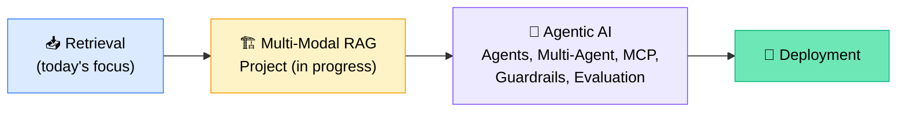
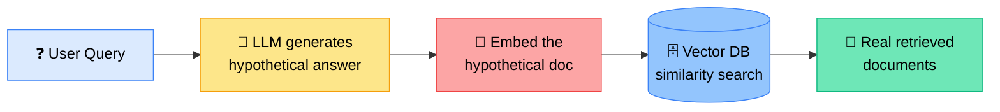
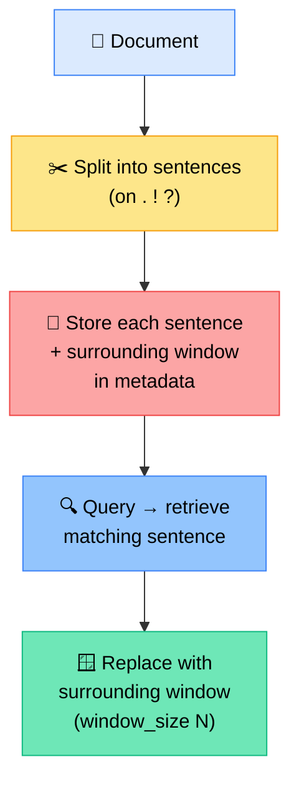
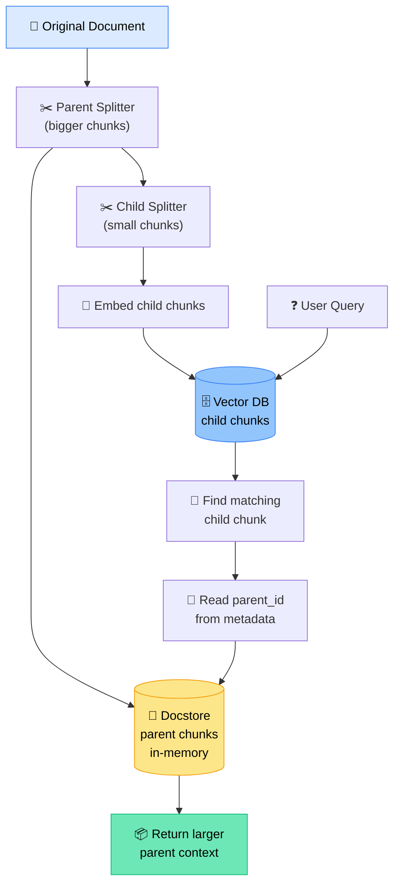
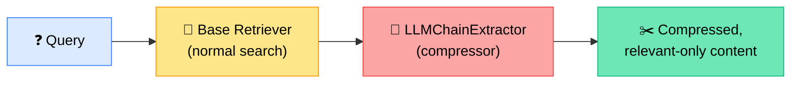
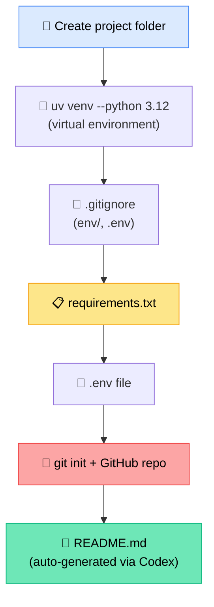

# 🔍 Advanced RAG Retrieval Techniques + Multi-Modal RAG Project Kickoff
### 📋 Session Notes — Krish Naik Academy (Agentic AI / Gen AI Bootcamp)

**🎙️ Speaker:** Sunny (Mentor)
**⏱️ Duration:** ~3.5 hours (incl. breaks + live doubt session)
**🎯 Session Type:** Live Coding Class + Q&A

---

## 📢 Key Announcements

> 🎉 **Saturday, 15th August class is CANCELLED** (Independence Day holiday for all Krish Naik Academy batches — official mail to follow). Sunday class continues as usual.

- 📼 All updated notebooks pushed to GitHub — students should `git pull` for the latest code.
- 🗂️ Notebook renamed from `retrieverUpdated.ipynb` → `retriever_advance.ipynb` to hold all advanced retrieval techniques covered today.

---

## 🧭 Where This Fits in the Bigger Picture



- 🎯 Once the RAG project + deployment is done → **~95% syllabus complete**.
- 🗓️ Agentic chapter (Agents, Multi-Agent, MCP, Guardrails, Evaluation) targeted for the next **10–15 classes (~1 month, through September)**.

---

## 🧩 Advanced Retrieval Techniques Covered

### 1️⃣ HyDE (Hypothetical Document Embedding)



- **What it does:** Instead of embedding the raw query, the LLM first writes a *hypothetical* answer/document; that hypothetical text is embedded and used to search the vector store.
- **LangChain class:** `HypotheticalDocumentEmbedder.from_llm()` — takes an LLM, an embedding model, and a prompt key (e.g., `"web_search"`).
- 🌐 **Prompt key = "web_search":** if the model doesn't know the answer, it internally performs a web search before generating the hypothetical document.
- ⚖️ **Comparison observed:** Normal dense retrieval vs. HyDE returned data from the same pages but in a **different order/ranking**.
- ⚠️ **Risk:** Higher chance of hallucinated hypothetical answers — evaluate before trusting output; can be orchestrated with LangGraph for custom checks.
- ✅ **Best use case:** Very short/abstract queries that don't lexically match the document.

---

### 2️⃣ Sentence Window Retrieval

> 🛠️ Not available as a built-in class in LangChain or LlamaIndex — Sunny built this from scratch.



**How the window works (classroom example):**
> "My name is Sunny. Sunny is an AI mentor. Sunny knows about DL also. Sunny knows about data engineering."

- Divided into 4 standalone sentences.
- With `window_size = 1`, selecting sentence 2 ("Sunny is an AI mentor") pulls in **1 sentence before + 1 after**, giving a richer context block instead of just the standalone sentence.
- 🔁 Increasing `window_size` → more surrounding context retrieved.
- **Implementation flow:** retrieve top-K matching sentences → look up `sentence_window` from each match's metadata → build expanded document list → return.
- ✅ **Best use case:** Exact sentence match is found, but nearby context is needed to make sense of it.

---

### 3️⃣ Parent Document Retriever

> ✅ This one **is** available natively in LangChain (`ParentDocumentRetriever`).



- Demo dataset: **856 child chunks** created from the Llama 2 research paper PDF.
- Query returns child chunks first (small, precise matches) → traced back via `parent_id` in metadata → full **parent chunk** returned for richer context.
- Number of results retrievable is configurable (K).
- ✅ **Best use case:** Small chunks retrieve well for precision, but lack enough context on their own.

---

### 4️⃣ Contextual Compression Retriever



- **LangChain classes:** `ContextualCompressionRetriever` + `LLMChainExtractor.from_llm()` as the compressor.
- **Demo result:** Original retrieval → **4 documents, 3,093 characters**. After compression → **4 documents, 1,684 characters** (only the relevant portions kept).
- ✅ Very easy to implement; drastically reduces noise passed to the final LLM call.

---

### 📚 Techniques Referenced but Not Re-Explained (already covered in prior classes)
- Multi-Query Retriever
- Weighted (Reciprocal) Fusion & Reciprocal Rank Fusion (RRF)
- MMR (Maximal Marginal Relevance)
- Multi-Hop Retriever *(to be revisited once LangGraph is taught — it needs orchestration, not a single LangChain class)*

---

## 🗂️ Retrieval Technique Decision Table

| Situation | Recommended Technique |
|---|---|
| Exact names, IDs, codes, dates | **BM25 / Sparse** (lexical match) |
| Different wording, same meaning | **Dense Retrieval** (semantic) |
| Need both exact + semantic match | **Hybrid Retrieval** |
| Merging BM25 + dense ranks with weighting | **Weighted (RRF) Fusion** |
| Retrieved chunks are repetitive | **MMR** |
| Conversational query is incomplete | **Query Rewriting** |
| Different wording causing poor recall | **Multi-Query** |
| Very short/abstract query mismatched with docs | **HyDE** |
| One question containing multiple sub-questions | **Query Decomposition** |
| Next search depends on result of first search | **Multi-Hop Retrieval** |
| Small chunks retrieve well but lack context | **Parent Document Retriever** |
| Exact sentence match needs nearby context | **Sentence Window Retrieval** |
| Retrieved content too noisy/long | **Contextual Compression / Re-ranking** |

> ⚠️ **Caveat repeated throughout the session:** *"It's all hit-and-trial. This table is a starting reference, not an end solution."*

---

## 🏗️ Multi-Modal RAG Project — Kickoff

### 📁 Project Setup Steps



### 🗃️ Final Folder Architecture

```
multi_model_RAG_full_stack_genAI_bootcamp_1.0/
├── src/
│   ├── __init__.py
│   ├── logger/
│   │   └── custom_logger.py
│   ├── exception/
│   │   └── custom_exception.py
│   ├── prompt_library/
│   ├── config/
│   │   └── config.yaml
│   ├── parsing.py          (data parsing)
│   ├── retriever.py         (data retrieval)
│   └── generation.py        (final RAG generation agent)
├── data/                    (source PDFs + parsed output)
├── ui/                      (HTML/React prototype UI)
├── .env                     (gitignored)
├── .gitignore
├── requirements.txt
└── README.md
```

### 🔑 Key Engineering Practices Demonstrated

| Practice | Why It Matters |
|---|---|
| `.ipynb` for experiments only, `.py` modules for real projects | Notebooks are for POCs; production code lives in structured Python modules |
| **Structured logger** (JSON format, console + file output) | Works with any backend — ELK, Azure Monitor, AWS CloudWatch — no vendor lock-in |
| **Custom exception classes** | Decide per-case: *raise* (stop program) vs *log* (continue program) |
| **`get_library_version.py` script** | Auto-pins installed package versions into `requirements.txt` right after confirming code works — protects against future breaking upgrades |
| **`__init__.py` inside every package folder** | Required for Python to treat folders as importable packages (module import errors otherwise) |
| AI coding assistants (Codex / Claude Code / GitHub Copilot) used throughout | Sunny used Codex live to scaffold README, wire up logger/exception imports, and fix path issues — modeling real industry workflow |

> 🧠 **On reviewing AI-generated code:** *"Line-by-line review is not always required — but you must understand the overall functionality, follow your company's code structure/protocol, and remove anything unnecessary."*

### 📄 `ComplexPDFParser` Class (data parsing module)
Key methods walked through:
- `__init__`, `validate_pdf`, `create_output_directories`
- `configure_tesseract`, `run_ocr_on_image`
- `extract_text_and_images`, `extract_tables`
- `create_langchain_document`, `save_json`, `save_output`
- Final orchestration method to run the full parse

Successfully parsed the same complex PDF used in earlier classes — output confirmed in `data/parsed/`.

---

## 💻 Tooling Notes

| Tool | Sunny's Take |
|---|---|
| **Codex** (OpenAI, $20/mo) | What Sunny personally uses — mature ecosystem, good for general + coding tasks |
| **Claude Code** | Also solid, widely adopted in enterprises; good alternative if starting fresh |
| **GitHub Copilot (~$10/mo)** | Cheaper option, coding-focused only (not general chat) — good if hitting usage limits fast with Claude/Codex |
| **Free LLM options** | OpenRouter, Grok — free credentials available for students without paid API keys |
| **Free embeddings** | Hugging Face embeddings recommended over Gemini free-tier (Gemini free quota throttles on bulk embedding of 100–200+ documents) |
| **LlamaIndex / LM Studio** | Valid alternatives to LangChain; LangChain preferred here because ecosystem is more mature and majority-used |
| **LM Studio** | Local model serving, similar to Ollama / llama.cpp |

---

## ❓ Live Q&A Highlights

| Question | Answer |
|---|---|
| Can HyDE be used with company-sensitive data? | Yes — give the LLM your own context instead of relying on public web search; not dependent on model "training" |
| Should I create a new virtual environment per project? | Yes — one venv per project, always |
| Do library versions need manual upgrade tracking? | Pin versions once stable (`requirements.txt`); only touch when there's a real business reason (security patch, new feature need) |
| Can Llama Index / LM Studio replace LangChain? | Yes, fully viable — LangChain taught here because it's the majority-adopted, more mature ecosystem |
| How to organize multi-project team knowledge (voice notes, meeting transcripts, docs)? | Structure data hierarchically by project → sub-sections (voice, transcript, docs, updates) → build either a custom RAG or use Claude Skills on top |
| Prompting vs. deterministic orchestration (LangGraph) — how to decide? | Simple/single-step tasks (summarize, classify, extract, rewrite) → prompting. Multi-step, conditional, multi-tool tasks → orchestration (LangGraph/DAG). Always validate via small POCs first — no fixed formula |
| How to keep a vector index in sync with constantly changing source data (SharePoint, S3, etc.)? | Selective update/delete at the metadata/record level is supported by modern vector DBs (Pinecone, Qdrant, etc.) — full reindex is not required; granularity (document vs. paragraph) depends on how you index |
| Best vector DB for multi-cloud portability (Azure ↔ GCP)? | Self-hosted options like Qdrant/Milvus give more cloud-agnostic flexibility than fully managed native services (Azure AI Search, Vertex AI Vector Search) |
| Is Mixture of Experts (MoE) important for interviews? | Understand the routing concept inside the transformer decoder layer — useful to be able to explain, not a deep must-know for this course track |
| How much prompt-engineering depth is really needed for an AI Engineer role? | Prompting is one small piece of the pipeline — long-term growth requires the full stack: RAG, orchestration, LLMOps, system design (same as a developer can't rely on just "knowing Python") |

---

## ✅ Action Items for Learners

- [ ] 🔄 `git pull` the latest `retriever_advance.ipynb` and Multi-Modal RAG project repo from GitHub
- [ ] 📓 Revise HyDE, Sentence Window, Parent Document, and Contextual Compression retrieval techniques
- [ ] 🗓️ Note: **No class Saturday, 15th August** (Independence Day) — next session is Sunday
- [ ] 🐍 Practice setting up a project from scratch: venv → `.gitignore` → `requirements.txt` → logger/exception scaffolding
- [ ] 🧪 Run `get_library_version.py` after installing packages to lock versions
- [ ] 💬 Send specific enterprise RAG questions (evaluation/evidence, cloud vector DB choice) directly to Sunny via email for detailed 1:1 guidance
- [ ] 🧠 Review the retrieval technique decision table — be ready to explain the trade-offs in interviews

---

*📝 Notes compiled from the full session transcript — Advanced RAG Retrieval Techniques & Multi-Modal RAG Project Kickoff, Krish Naik Academy.*
