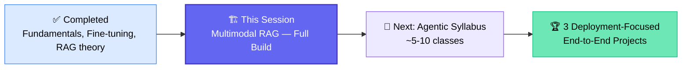
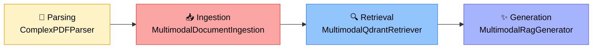
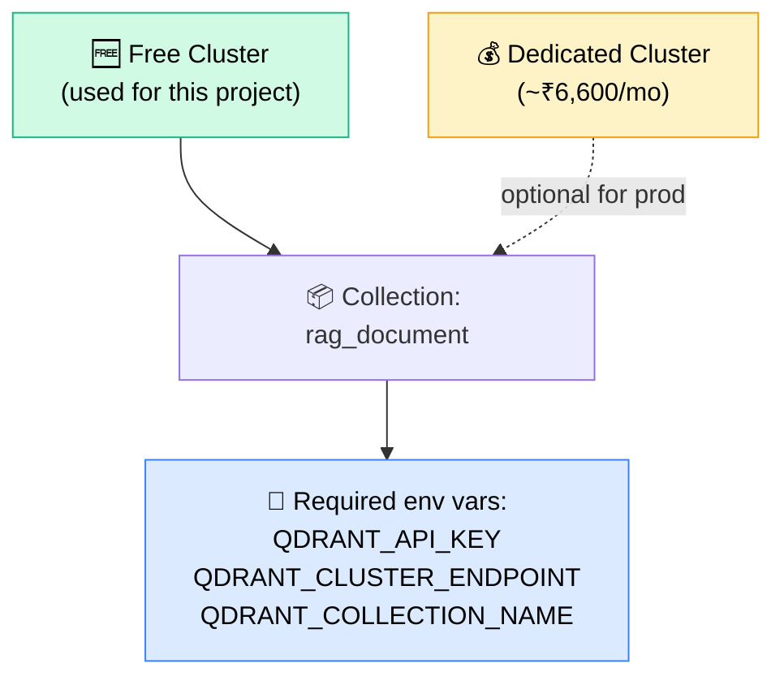
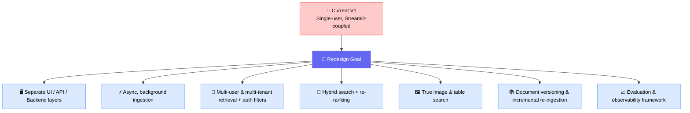

# 📄 Multimodal RAG — End-to-End Project Build
### 📋 Live Coding Session Notes — GenAI Bootcamp

**🎙️ Instructor:** Sunny
**⏱️ Duration:** ~4 hours (class) + ~1 hour (doubt session)
**🎯 Session Type:** Live Coding + Q&A — Class 43 (approx.)

---

## 🧭 Where This Session Fits

The batch has completed **~42 classes** covering fundamentals, fine-tuning, and RAG. This session builds the **first full end-to-end RAG project from scratch**, before the course moves on to the Agentic syllabus.

> 💡 Deployment is intentionally **not** taught in every project — it's concentrated into **3 dedicated end-to-end projects** later in the course (~10-12 classes total).

---

## 🗺️ RAG Pipeline Architecture

The entire system is broken into four decoupled stages, each implemented as its own Python module/class.

> 🎯 **Key design principle repeated throughout:** keep parsing + ingestion **decoupled** from retrieval + generation. Index your documents once; chat with them separately, as many times as needed.

---

## 🧩 Class-by-Class Skeleton Breakdown

### 📄 1. `parsing.py` — `ComplexPDFParser`
| Method | Purpose |
|---|---|
| `__init__` | Initialize PDF path, output/image directories, render scale |
| `_validate_pdf` (private) | Validate the uploaded PDF |
| `_create_output_directory` | Create folders for parsed pages/images |
| `_configure_tesseract` | Configure PyTesseract for OCR |
| `_run_ocr_on_images` | Run OCR on rendered page images |
| `_extract_text_and_images` | Pull raw text + images from the PDF |
| `_extract_table` | Extract tabular data |
| `_create_langchain_document` | Convert parsed output into LangChain `Document` objects |
| `_save_json` | Persist parsed output as JSON |
| `parse()` | **Master/orchestrator method** — calls everything above in sequence |

### 📥 2. `ingestion.py` — `MultimodalDocumentIngestion`
| Method | Purpose |
|---|---|
| `__init__` | Load config (OpenAI key, Qdrant URL, embedding dim, batch size) |
| `_validate_config` | Validate all required environment variables |
| `_ensure_collection` | Check/create the Qdrant collection |
| `_document_id` | Generate a UUID per document |
| `_split` | Chunking logic |
| `_prepare_document` | Prepare a document as a Qdrant "point" |
| `_delete_existing_document` | Remove a stale document before re-ingesting |
| `ingest_document` | Ingest a single document |
| `ingest_pdf()` | **Master method** — orchestrates the full ingestion flow |

### 🔍 3. `retrieval.py` — `MultimodalQdrantRetriever`
| Method | Purpose |
|---|---|
| `__init__` | Load collection name, embedding model/dim, Qdrant client |
| `_validate_config` | Validate retrieval config |
| `_normalize_content_type` | Normalize text/image/table content types |
| `_build_filter` | Build a Qdrant metadata filter from the query |
| `retrieve` | Core retrieval call |
| `retrieve_with_score` | Retrieval + similarity score |
| `as_langchain_retriever` | Convert Qdrant vector store into a LangChain retriever |

### ✨ 4. `generation.py` — `MultimodalRagGenerator`
| Method | Purpose |
|---|---|
| `__init__` | Model, temperature, max images, max context chars |
| `_validate_config` | Validate generation config |
| `_image_to_data_url` | Convert stored images to PNG data URLs for the LLM |
| `_prepare_context` | Assemble text + image + table evidence into context |
| `_build_message` | Build the final LLM message payload |
| `_extract_response_text` | Parse the LLM's response |
| `_use_metadata` | Attach source metadata to the answer |
| `generate` / `answer_question()` | **Master method** — retrieve → build context → call LLM → return grounded answer |

> ✅ **Pattern used throughout:** an `_underscore_prefixed` method = private (Python convention); one master method per class orchestrates all the private ones. This modular class/function design is a deliberate **low-level design (LLD)** teaching pattern, ahead of deeper architecture sessions later in the course.

---

## 🗄️ Vector Database — Qdrant Setup

- Cluster created via [Qdrant Cloud](https://cloud.qdrant.io) UI — free tier used for the class demo.
- Each parsed PDF becomes a set of **points** (chunks) inside a **collection**.
- Multiple indexes (e.g. `rag_document`, `llama_research_paper_index`) can coexist — useful for versioning or swapping datasets without deleting old data.
- ⚠️ Data is **not stored locally in memory** — Qdrant Cloud provisions a dedicated server per cluster; inactive free clusters may hibernate and can be resumed.

---

## 🔑 Environment Variables (`.env.example`)

| Variable | Required for this project? |
|---|---|
| `OPENAI_API_KEY` | ✅ Yes (chat + embedding model) |
| `QDRANT_API_KEY` / `QDRANT_CLUSTER_ENDPOINT` / `QDRANT_COLLECTION_NAME` | ✅ Yes |
| `OPENAI_CHAT_MODEL` / `OPENAI_EMBEDDING_MODEL` / `OPENAI_EMBEDDING_DIMENSION` | ✅ Yes |
| `TESSERACT_PATH` | ✅ Yes |
| `GOOGLE_API_KEY`, `GROQ_API_KEY`, `OPENROUTER_API_KEY`, `ANTHROPIC_API_KEY`, `LLAMA_KEY`, `PINECONE_KEY` | ❌ Not used in this build (kept for flexibility) |

> 💡 **Best practice shared:** keep only *confidential* values (keys) in `.env`; move non-secret config (model names, dimensions) into a `config.yaml` instead.

---

## 🖥️ Streamlit UI Walkthrough

- Left panel: parsing & indexing controls (chunk size, chunk overlap, index name).
- Right panel: chat interface with source citations, similarity scores, and retrieved image evidence.
- Live demo questions asked and correctly answered from the sample PDF (a client contract + incident-response policy doc):
  - *"What is a contract processing ownership map?"* → correctly located and explained the relevant **flowchart image**.
  - *"Contract ID of Blue Leaf Retail Private Limited?"* → correctly extracted the ID from an OCR'd table.
  - *"Which time slot performed best per the retention heat map?"* → correctly read a chart image.
  - *"What is the capital of India?"* (out-of-domain) → correctly refused to answer until the prompt was explicitly relaxed to allow general knowledge fallback.

> ⚠️ **Sunny's disclaimer:** "Streamlit is not for production — it's for quick POCs and demos only." For real UI work, use React/other frameworks or hand it off to a front-end/UX engineer.

---

## 🏗️ Supporting Infrastructure Files

| File | Purpose |
|---|---|
| `logger.py` | Custom `structlog`-based logger — writes to both file (`logs/YYYY-MM-DD_HH-MM-SS.log`) and console simultaneously |
| `exceptions.py` | Custom exception class (`DocumentPortalException`) wrapping `sys.exc_info()` for detailed error messages, type, value, and traceback |
| `prompt/__init__.py` | Centralized prompt library: system prompt, user prompt, image-evidence prompt, chat-suggestion prompt, smoke-test prompt |

> 🐛 **Live debugging moment:** a real import error (`complex_PDF_parser` vs `Complex_PDF_parser` capitalization typo) was fixed live — used as a teaching moment about the reality of writing large codebases from scratch.

---

## 📝 Assignment: Prototype → Production

- 📁 Provided as `Assignment_05_RAG` in the GitHub repo.
- 🗓️ **Deadline: August 29** (~2 weeks).
- 🏆 **Prize teaser:** a bigger 1-month assignment after the Agentic classes (spanning 4 total end-to-end projects) may come with an iPhone-tier prize — pending confirmation with the team.
- ⚠️ No demo session planned for this assignment (would cost a full class); solution will be shared directly instead.

---

## ❓ Doubt Session Highlights

| Student | Question | Sunny's Answer |
|---|---|---|
| Vikas | Which model to use if OpenAI is too costly? | Use Groq or OpenRouter for free/cheap alternatives — accuracy will be lower than OpenAI/Claude but functionality holds |
| Nabi | How to choose a "good" LLM for production? | No universal answer — benchmark candidate models on your own data and pick the best empirical performer |
| Nabi | How to index frequently-updated sources (e.g. Confluence)? | Use Spark SQL / scheduled jobs (Airflow) for structured warehouses (e.g. Hive); selectively re-ingest changed pages only |
| Bala | Does adding one new PDF re-chunk the entire index? | No — only the new document should be chunked; existing chunks stay untouched |
| Bala | Do RAG chunks lose semantic relationships? | Use **MMR (Maximum Marginal Relevance)** for diversity/relevance balance; consider **GraphRAG** only for genuinely relational/structured data |
| Jyoti | Can an index be updated instead of recreated? | Yes — don't delete the old index; just append new documents |
| Jyoti | Is Qdrant free? | Free tier for testing; **paid** for real production workloads |
| Shivaay | Streamlit vs FastAPI for production? | FastAPI is the production choice — Streamlit is POC-only (covered in an upcoming project) |
| Shivaay | Will Text-to-SQL be covered? | Yes, as part of Agentic orchestration or as an assignment |
| Mehul | How to avoid re-indexing duplicate uploads? | Generate a document fingerprint/hash; check a metadata registry — skip if unchanged, re-index only if modified |
| Mehul | Local 7B model giving poor RAG accuracy — fix? | Move to Azure AI Foundry or a hosted GPU instance with a larger model (70B+); small local models undermine RAG quality |
| Mehul | Can Python RAG components integrate into a C#/.NET stack? | Yes — hybrid architecture is fine: .NET Semantic Kernel can call out to Python microservices (e.g. via Docker) for ingestion/retrieval |
| RK | How to support many concurrent users? | Standard horizontal scaling: API gateway + load balancer distributing to multiple RAG service instances — this is an infra concern, not an LLM concern |
| RK | RAG over terabytes/petabytes of data? | Don't vectorize raw data at that scale — use an **agentic query router** to convert intent → SQL against a warehouse/lakehouse first, then retrieve |
| RK | Agentic AI vs RAG — how to decide? | Depends on the use case; RAG is often just one component inside a larger agentic system |
| Rachana | Is Qdrant data in-memory or persisted? | Persisted on a dedicated cluster server, not just in-memory |
| Rachana | How to keep a Confluence-backed RAG fresh? | Run scheduled create/update/delete detection using page version IDs; re-embed and replace only changed pages |
| Suresh | Best AWS tools for observability? | CloudWatch (metrics/logs/alarms/dashboards) + CloudTrail (API auditing) + X-Ray; LangSmith is more LLM-pipeline-specific |
| Suresh | Fargate vs ECS for scaling? | Fargate recommended — serverless, avoids manual infra overhead |

---

## ✅ Action Items for Learners

- [ ] 📥 Pull the latest project code from the GitHub repository (`Rag-Full-Stack-GenAI-1.0`)
- [ ] 🔑 Set up your own Qdrant free cluster + `.env` file
- [ ] 🧪 Run the app end-to-end: parse → ingest → chat, using the provided sample PDF
- [ ] 📝 Complete **Assignment 05** — redesign the prototype into a production-grade architecture (deadline **Aug 29**)
- [ ] 🔍 Review the prompt library (`prompt/__init__.py`) and logger/exception utility files
- [ ] 💬 Bring implementation questions to the next doubt session
- [ ] 🚀 From the next class: **Agentic syllabus** begins (evaluation, guardrails, MCP, orchestration)

---

*📝 Notes compiled from the full session transcript — Multimodal RAG End-to-End Project Build, GenAI Bootcamp.*
