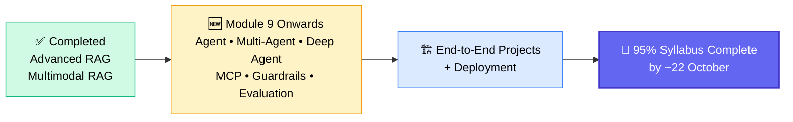
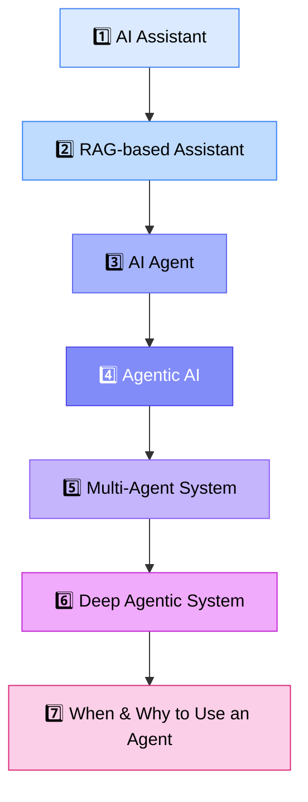
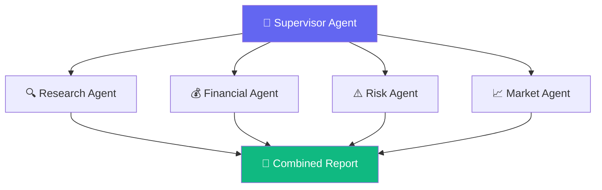
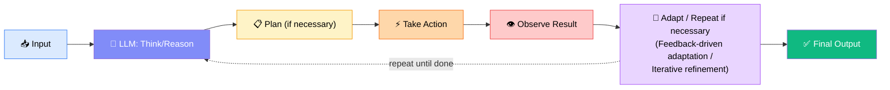
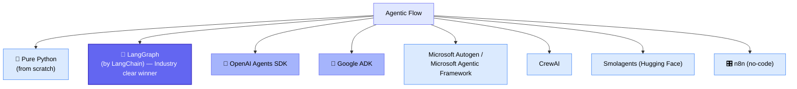

# 🤖 Agent AI, Multi-Agent & Deep Agent Systems
### 📋 Class Notes — GenAI Course (Class 40)

**🎙️ Instructor:** Sunny
**⏱️ Duration:** ~4 hours (theory + Langraph setup + doubt session) | **🎯 Session Type:** New Module Kickoff — Agentic AI

---

## 🧭 Where This Module Fits in the Syllabus

The course has completed **Advanced RAG** and **Multimodal RAG** (with an end-to-end project explained previously, deployment still pending). Starting **Module 9**, the focus shifts entirely to the Agentic ecosystem.

> 💡 **Timeline:** ~1 month to cover Agent/MCP/Guardrails/Evaluation theory, then ~1 more month for end-to-end projects. A couple of extra topics (Claude, etc.) get added based on learner requests — the core plan was always "get to the end-to-end project."

---

## 🗂️ The 7 Foundational Terms (Today's Core Agenda)

Sunny stressed that these 7 definitions must be crystal clear before anything else in Agentic AI makes sense.

### 1️⃣ AI Assistant
A simple system: input → LLM → output, generated **purely from the model's trained knowledge**, no external lookup.
> Example: "What is Tesla?" → answered directly from pretraining, no search needed.

### 2️⃣ RAG-based Assistant
User query → **vector database retrieval** → context → LLM (query + context + instructions) → grounded output.
> *"A RAG is an AI assistant that retrieves relevant external knowledge and uses that information to generate more grounded responses."*

### 3️⃣ AI Agent
An **autonomous, intelligent system**: input/goal → reasoning → (optional) planning → choose action (tool call) → observe result → repeat until final answer.
> *"An AI Agent is an AI system that can autonomously decide and execute actions using tools and environment feedback to achieve a goal."*
- 🧠 **LLM = the brain** of the agent
- 🔧 **Tools = custom functions** the agent can call
- 📋 **Planning = prompting/routing** logic

**Live demo (ChatGPT):** "What is Tesla?" → simple assistant, no search. "What is the current stock price of Tesla?" → dynamic web search triggered = Agentic behavior. "Deep Research" mode enabled → deep agent, multi-step planning, much longer runtime.

### 4️⃣ Agentic AI
The umbrella term. Whether it's a single agent, a multi-agent system, or a deep agent — **all of it is Agentic AI**.

### 5️⃣ Multi-Agent System
Instead of one agent, **multiple specialized agents** collaborate, each handling its own think → act → observe loop.

**Example — Tesla Investment Report:**

### 6️⃣ Deep Agentic System
Not a separate paradigm — it's an **advanced variant** applicable to single *or* multi-agent systems. Defined as:
> *"A large and long-running system for complex problems, with extensive planning, task decomposition, multiple tool calls, and possibly sub-agents — repeating until a final deliverable is produced."*

```mermaid
flowchart LR
    G["🎯 Complex Goal"] --> P["📋 Planning"] --> D["✂️ Task Decomposition"] --> T["🔧 Multiple Tools"] --> SA["🤖 Sub-Agents"] --> R["🔁 Repeat"] --> F["✅ Final Deliverable"]

    style G fill:#fef3c7,stroke:#f59e0b,color:#000
    style P fill:#fef3c7,stroke:#f59e0b,color:#000
    style D fill:#fef3c7,stroke:#f59e0b,color:#000
    style T fill:#fef3c7,stroke:#f59e0b,color:#000
    style SA fill:#fef3c7,stroke:#f59e0b,color:#000
    style R fill:#fef3c7,stroke:#f59e0b,color:#000
    style F fill:#10b981,color:#fff
```

> 🔑 **Key clarification:** A **single agent** can be a deep agent. A **multi-agent system** can also be a deep agentic system. "Deep" just means depth of planning/execution — it's orthogonal to single vs. multi.

### 7️⃣ When & Why to Use an Agentic System
❌ **Don't use an agent for:** simple/fixed questions answerable from pretrained knowledge, deterministic logic, single-LLM-call tasks — it wastes tokens.
✅ **Do use an agent for:** open-ended tasks, dynamic decision-making, multiple tool calls, tasks needing planning/recovery/decomposition.

| | 🐢 Shallow Agent | 🐳 Deep Agent |
|---|---|---|
| Use case | Simple/moderate tasks | Complex → very complex problems |
| As an AI engineer | Identify problem complexity first, build a POC to validate |

---

## 🔀 High-Level Agentic Flow

This flow splits into two categories:

| 🎯 Deterministic Flow | 🔀 Dynamic Flow |
|---|---|
| LLM embedded in a **predefined code path** | LLM **dynamically decides** its own actions based on environment feedback |
| Used **~70–80%** of the time in industry (predictable, safer) | Used in **~20%** of cases — more powerful but less predictable |
| Also called a "workflow" | Also called the "proper Agentic flow" / "probabilistic workflow" |

> ⚛️ **React Architecture** = Reasoning + Action loop; described as a *subset* of the bigger Agentic flow above (input → reasoning → action → observe → loop until answer).

---

## 🛠️ Ways to Implement the Agentic Flow

> 📌 **Sunny's advice:** Don't chase frameworks — master the *fundamentals* of Agentic AI (framework-independent). Learn one framework deeply (LangGraph, taught here), then transferring to any other framework becomes easy.

---

## 📚 Conceptual Terms You Must Master

| Category | Terms |
|---|---|
| 🧠 **Flow concepts** | Planning • Execution • Dynamic planning • Task decomposition • Reflection system • Self-correction / self-improvement / self-healing / self-critic • Reasoning • Parallelization • Orchestration • Human-in-the-loop • Feedback-aware / iterative optimization |
| ⏱️ **Operational limits** | Maximum iteration limit • Timeout • Stop condition • Token & cost budget |
| 🛠️ **Practical/technical** | Pydantic schema & type hints • JSON schema • Async Python (concurrency) • Structured output • Tool calling (tool engineering) • Memory management (short-term, long-term, persistent, transient) • State management • Prompt engineering • Context engineering • MCP • A2A protocol • Evaluation/testing of agents • Observability • Guardrails & security • Caching • LLM Gateway |

---

## 🧩 LangGraph Curriculum Roadmap

```mermaid
flowchart TD
    L1["📖 1. Intro to LangGraph<br/>why it exists, orchestration, stateful apps,<br/>vs. plain Python, vs. LangChain, LangSmith"] --> L2
    L2["🏗️ 2. LangGraph Architecture<br/>Graph, State, Nodes, Edges, StateGraph,<br/>Compiled Graph, Invocation"] --> L3
    L3["💾 3. State Management + State Graph API<br/>TypedDict, Dataclass, Pydantic, Enum"] --> L4
    L4["🔗 4. Nodes, Edges & Routing<br/>Normal/Multiple/Parallel/Conditional Edges"] --> L5
    L5["🌿 5. Branching Patterns<br/>Sequential, Branch, Parallel, Looping"] --> L6
    L6["📡 6. Send API & Command API<br/>Dynamic fan-out, MapReduce pattern,<br/>critical for Multi-Agent systems"] --> L7
    L7["💽 7. Persistence & Checkpointing"] --> L8
    L8["🧠 8. Memory Concepts"] --> L9
    L9["🙋 9. Human-in-the-Loop<br/>invoke & interrupt"] --> L10
    L10["📺 10. Streaming<br/>value, updated, message, custom modes"] --> L11
    L11["🧬 11. Subgraphs & Multi-Agent Systems<br/>Supervisor / hierarchical flow"] --> L12
    L12["⚙️ 12. Functional API vs. Graph API"] --> L13
    L13["♻️ 13. Node Caching + Fault Tolerance<br/>retry, timeout, error handling"] --> L14
    L14["⚡ 14. Async LangGraph<br/>for concurrency"] --> L15
    L15["📊 15. Graph Visualization + LangGraph Studio"]

    style L1 fill:#fef3c7,stroke:#f59e0b,color:#000
    style L2 fill:#fde68a,stroke:#f59e0b,color:#000
    style L3 fill:#fcd34d,stroke:#f59e0b,color:#000
    style L4 fill:#fca5a5,stroke:#ef4444,color:#000
    style L5 fill:#fca5a5,stroke:#ef4444,color:#000
    style L6 fill:#fca5a5,stroke:#ef4444,color:#000
    style L7 fill:#93c5fd,stroke:#3b82f6,color:#000
    style L8 fill:#93c5fd,stroke:#3b82f6,color:#000
    style L9 fill:#93c5fd,stroke:#3b82f6,color:#000
    style L10 fill:#93c5fd,stroke:#3b82f6,color:#000
    style L11 fill:#a5b4fc,stroke:#6366f1,color:#000
    style L12 fill:#c4b5fd,stroke:#8b5cf6,color:#000
    style L13 fill:#c4b5fd,stroke:#8b5cf6,color:#000
    style L14 fill:#c4b5fd,stroke:#8b5cf6,color:#000
    style L15 fill:#6ee7b7,stroke:#10b981,color:#000
```

> 🎓 Later: **LangGraph SDK + FastAPI (REST API)** for full end-to-end deployment. **LangSmith** for observability (tracing, monitoring, debugging — similar to CloudWatch/MLflow). **LangFuse** = alternative observability platform. **LangFlow** = visual workflow builder.

---

## 💻 Practical Setup (Started This Session)

- Created project folder `Class 13-9` inside the course repo
- Installed LangGraph: `uv pip install langgraph`
- ⚠️ **Note:** `from langgraph.graph import graph` failed — the plain `Graph` import appears **removed in the latest LangGraph version**; everything now goes through **`StateGraph`**. Full practical (StateGraph coding) deferred to the next class.

---

## 🎓 Framework Philosophy — "It's All Just Code"

> Responding to a doubt about companies building **internal/custom Agentic frameworks** instead of using LangGraph:

- LangGraph itself is just **Python code written by someone else** (open source, ~299+ contributors on GitHub) — a *framework* is simply reusable classes/functions someone else wrote.
- Companies with strict data/security policies (e.g., finance, healthcare) sometimes build proprietary frameworks from scratch instead of using open-source tools.
- **The fundamentals of Agentic AI don't change** regardless of framework — LangGraph, Google ADK, a custom in-house framework, or raw Python all implement the same underlying concepts (think → act → observe loop, planning, tool calling).
- Framework choice is typically an **architect/tech-lead decision** based on company ecosystem (e.g., Google-hosted infra → Google ADK), team comfort, and business trade-offs — not a fixed "best" answer.

---

## ❓ Live Q&A Highlights

| Question | Answer |
|---|---|
| Are Corrective RAG, Adaptive RAG, Speculative RAG still relevant? | Yes — these are all forms of **Agentic RAG**; understanding core RAG lets you implement any variant |
| What's the difference between LangSmith, LangFuse, and LangFlow? | LangSmith/LangFuse = **observability** (tracing, monitoring, debugging, token usage); LangFlow = **visual workflow builder** |
| How to sync a vector DB with frequently updated sources (Jira, Confluence)? | Periodically re-run ingestion (e.g., via **Airflow**), update only the **delta/new data** into the same index; test thoroughly before full re-indexing |
| Which cloud platform should I learn (AWS/Azure/GCP)? | Any is fine to start — recommended **AWS**: EC2, S3, DynamoDB, Bedrock, SageMaker, Lambda, API Gateway, Aurora/PGVector |
| How do I decide when to design a single-agent vs. multi-agent system? | Start from the **business problem**, break it into capabilities/workflows, gradually increase complexity (e.g., add subgraphs, parallel categories) as requirements grow |
| Should I write my own API Gateway for a RAG assignment? | Yes — build your own; it deepens understanding of authentication/authorization patterns across microservices |
| Will other frameworks (CrewAI, Google ADK, OpenAI SDK) be covered? | LangGraph is primary; a comparison overview of other frameworks will be shown |
| What coding questions come up in Agentic AI interviews? | Rarely direct "write code" tasks — more likely **conceptual/syntax questions** (e.g., "how do you define a StateGraph," "how do you connect nodes") plus standard Python/DS-algo rounds |
| How to run agents on sensitive/client data without cloud APIs? | Use **Ollama** locally with larger open models (Llama 400B, Mistral) for better accuracy, or request an **Azure Cloud/Bedrock** subscription from the client for compliant model access |

---

## ✅ Action Items for Learners

- [ ] 📄 Review the 7 foundational terms (AI Assistant → When/Why to use Agent) until fully clear
- [ ] 🎥 Watch Sunny's "Agentic AI Roadmap" video on YouTube (~1 hr) — search *"Sunny Savita Agentic AI Roadmap"*
- [ ] 🔧 Set up LangGraph locally: `uv pip install langgraph`
- [ ] 📖 Bookmark the official LangGraph documentation (Quick Start, Architecture, Workflows & Agents sections)
- [ ] 🗂️ Wait for the PDF notes to be shared (consolidating today's blackboard content)
- [ ] 🚫 Don't attend interviews yet — wait until the end-to-end Agentic project is complete (~1–2 more months)
- [ ] 🧠 Practice critical/analytical thinking: before reaching for AI tools, spend 15–20 minutes reasoning through a problem statement on paper first

---

*📝 Notes compiled from the full class transcript — Agent AI, Multi-Agent & Deep Agent Systems, GenAI Course, Class 40.*
