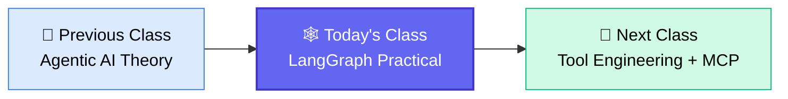
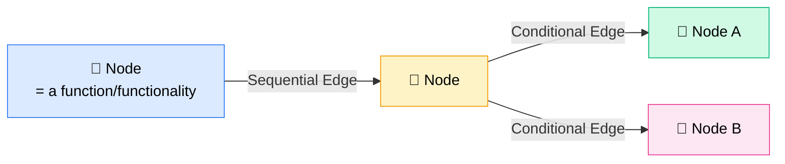
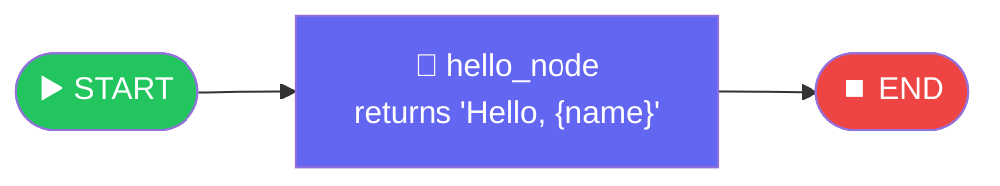
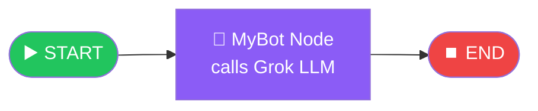
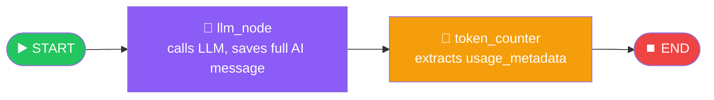
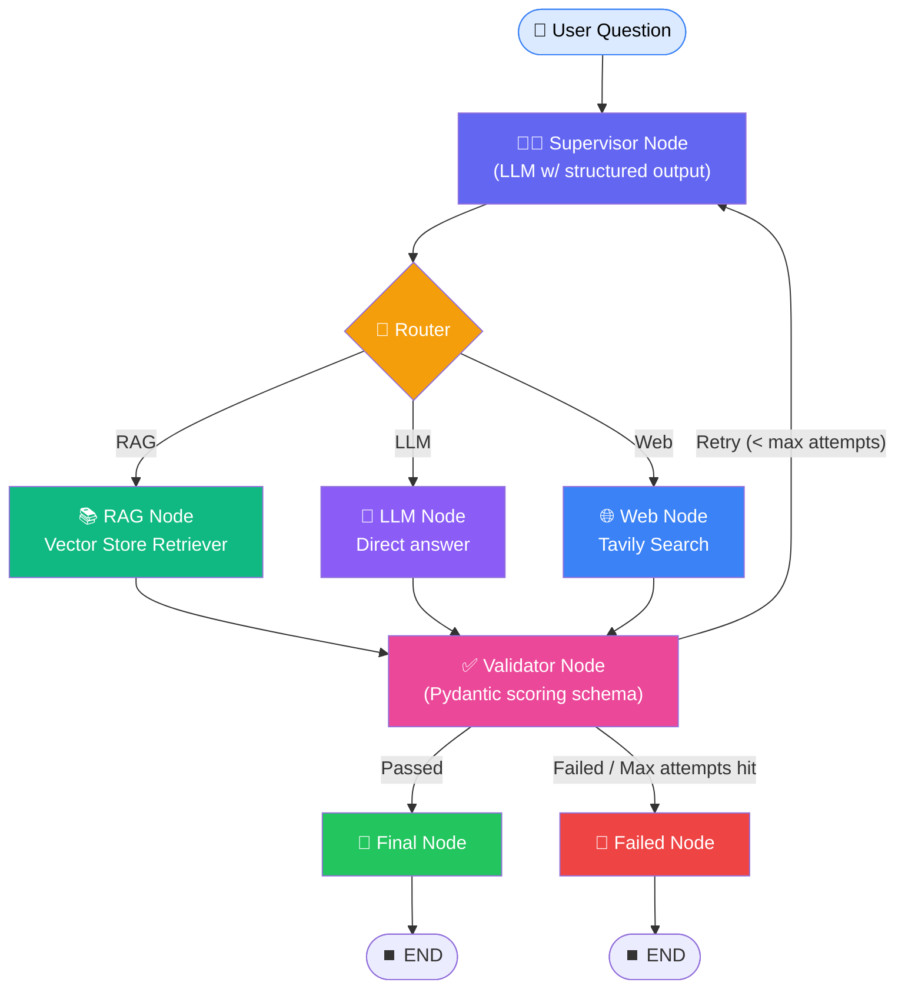
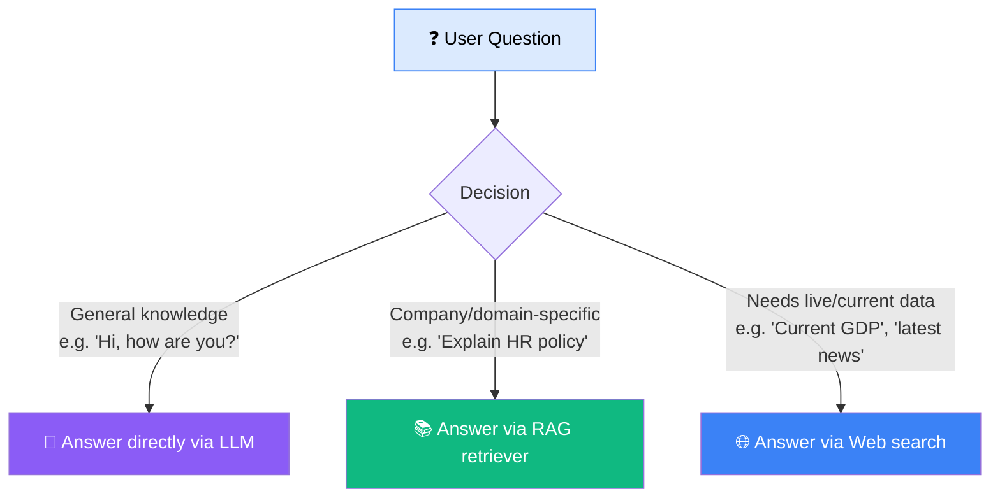
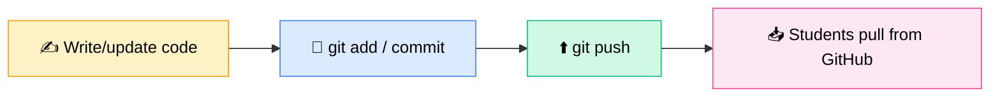

# 🕸️ LangGraph Practical Implementation
### 📋 Session Notes — Agentic AI Live Class

**🎙️ Speaker:** Sunny
**⏱️ Duration:** ~3.5 hours (incl. dinner break + doubt session)
**🎯 Session Type:** Live Coding + Q&A

---

## 🧭 Where This Session Fits

The previous class covered **Agentic AI theory**. This session is the **first hands-on implementation**, built entirely on **LangGraph** (the current version, which uses `StateGraph` — the older `Graph API` is no longer supported). Other frameworks like **Google ADK** and **AutoGen** will get a brief glimpse later, once LangGraph is fully covered.

---

## 🏢 The LangChain Ecosystem — 5 Services

| Service | Purpose |
|---|---|
| 🔗 **LangChain** | Wrapper/toolkit for GenAI apps — LLM integration, embeddings, vector DBs, prompt templates. Provides abstract classes for agents, but with **low authority** over the flow |
| 🕸️ **LangGraph** | Build Agentic AI flows **from scratch** with full **low-level authority** — nodes & edges |
| 🔍 **LangSmith** | Observability & logging |
| 🌊 **LangFlow** | Visualization platform for agentic flows |
| 🔥 **LangFuse** | Observability & logging (alternative) |

> 💡 **Key distinction:** LangChain gives ready-made abstract classes for agents (fast but limited control). LangGraph gives raw node-and-edge control (slower to build but fully customizable) — this is why LangGraph is the framework of choice for this course.

---

## 🧩 Core LangGraph Concepts

| Concept | Meaning |
|---|---|
| 🔵 **Node** | Just a function / a piece of functionality |
| ➡️ **Edge** | A connection between two nodes |
| ➡️➡️ **Sequential Edge** | One node runs right after another, in order |
| 🔀 **Conditional Edge** | The next node is chosen based on a condition/logic |
| 🗂️ **State** | Working data that flows *across* nodes — every node is aware of what previous nodes produced. Conceptually similar to session state in web apps, or Airflow's XCom |

> 🗣️ *"State means passing information or data from one node to another node, while maintaining the state."* — Sunny

**Ways to define a State schema:**
1. `TypedDict` (used throughout today's session)
2. `dataclass` (rarely used in practice)
3. `Pydantic` (used heavily in real-time projects — to be covered next class)
4. Built-in `MessagesState` from LangGraph itself (`from langgraph.graph import MessagesState`)

---

## 🛠️ Workflow 1 — Hello World (Deterministic, No LLM)

The simplest possible graph: **Start → hello_node → End**

- `StateGraph(State)` → creates a **builder**
- `builder.add_node("hello_node", hello_node)`
- `builder.add_edge(START, "hello_node")` → `builder.add_edge("hello_node", END)`
- `builder.compile()` → gives an invocable graph object
- `graph.invoke({"message": "Hello from India"})`

✅ **Key rule reinforced repeatedly:** whatever key you write/return from a node **must match the key name defined in the State schema**, or LangGraph throws an error.

---

## 🛠️ Workflow 2 — Two Sequential Functions

- Output of Function 1 automatically becomes the input to Function 2 — this is called **orchestration**.
- This is a **deterministic** (non-LLM) workflow — "workflow," not yet an "agent," since there's no reasoning/back-and-forth involved.

---

## 🛠️ Workflow 3 — LLM-Integrated Simple Bot

- Uses **ChatGroq** (free-tier LLM) instead of a paid OpenAI model.
- Uses the **built-in `MessagesState`** class — no need to define a custom state.
- `MessagesState` schema: `messages: Annotated[list[AnyMessage], add_messages]` — the `add_messages` annotation means new messages get **appended** to the list rather than overwritten.
- Called a **simple / deterministic AI assistant** — not yet a full agent, since there's no branching/reasoning logic.

---

## 🛠️ Workflow 4 — Token Counter Node

- `llm_node` doesn't count tokens itself — it **delegates** that responsibility to the next node by passing along the full response object.
- `token_counter` extracts `response.usage_metadata` → `input_tokens`, `output_tokens`, `total_tokens`.
- Custom **State** fields shown: `user_input`, `generated_answer`, `response`, `input_tokens`, `output_tokens`, `total_tokens`.

---

## 🏗️ Workflow 5 — Advanced Agentic RAG + Web + LLM Router

This is the flagship build of the session — a **Supervisor-based routing agent** with 3 information sources and a validation loop.

### 🧠 How the Supervisor Decides the Route

- The Supervisor is **not custom code logic** — it's an **LLM call** using `.with_structured_output()` bound to a **Pydantic schema** (`RouteDecisionModel`) with a `route` field restricted to `rag / llm / web`.
- A **large, carefully written prompt** tells the LLM: *"You are the supervisor... decide which node should answer... you have 3 possibilities: RAG, LLM, Web..."* plus guidelines, the current question, previous route, and validation feedback.
- Example live tests:
  - *"Hi, can you help me?"* → routed to **LLM**
  - *"Explain company HR policy"* → routed to **RAG**
  - *"Current GDP of USA/China"*, *"USA–Iran update"* → routed to **Web**
  - *"What are the major economic challenges of the USA?"* (from uploaded doc) → correctly routed to **RAG**
  - *"Salary of Sunny"* (personal/sensitive) → LLM refused the answer, and the **Validator correctly passed** that refusal as the appropriate final response → routed to **Failed** node

### 🧱 Components Built

| Component | Role |
|---|---|
| 📚 **Vector Store (Chroma, in-memory)** | Built from a local `.txt` file, embedded via a HuggingFace embedding model (dim = 384), chunked into 13 pieces via `RecursiveCharacterTextSplitter` |
| 🌐 **Tavily Search Tool** | External web search; requires a free Tavily API key (thousand-credit free tier) |
| 🧑‍⚖️ **Supervisor Model** | Pydantic-schema-bound LLM call that returns `route` + `reasoning` |
| ✅ **Validator Model** | Second Pydantic-schema-bound LLM call that scores/validates the generated answer and decides: finalize, retry (loop back to supervisor), or fail |
| 🔁 **Max Attempts** | Set to 3 — caps how many times the Validator can send the flow back to the Supervisor before falling to the Failed node |

### 🌍 The "3 Sources of Information" Rule of Thumb

> ⚠️ **Live debugging moment:** When asked *"When is Rakhi festival in 2026?"* the system incorrectly hallucinated via the LLM route instead of going to Web — Sunny flagged this as a **reminder to always use a strong reasoning-capable LLM** for production Agentic flows, since routing/reasoning quality degrades with weaker models and longer contexts.

---

## 📊 GitHub Workflow (Shown Throughout)

All code for every workflow (1 through 5) was pushed to GitHub after being demonstrated live, so students can pull and re-run it independently.

---

## ❓ Live Q&A Highlights

| Question | Answer |
|---|---|
| Can Airflow replace LangGraph? | No — Airflow orchestrates data/ETL pipelines & scheduled jobs; LangGraph orchestrates **stateful AI agent workflows**. Both can coexist in a system |
| Does the app "remember" previous questions from the same user? | Not by default — **State** only persists *within one execution/thread*. Cross-session memory requires **checkpointers** (short-term memory) and **cross-thread memory** (long-term memory) — to be covered in an upcoming class |
| Is "state" the same as Airflow's XCom? | Conceptually yes — a mechanism for passing data between steps |
| Can a node overwrite state fields set by a previous node? | Yes — you can overwrite or append; LangGraph doesn't force either. Appending increases token/context usage, so it should be a deliberate choice |
| Why does state persist correctly across nodes in Python? | Because of Python's **pass-by-reference** — the same state object is passed along the graph |
| TypedDict vs Pydantic vs MessagesState — when to use which? | TypedDict and Pydantic can be used **anywhere**; the built-in `MessagesState` is convenient but not typically used in custom real-world flows |
| Is there a message/state size limit? | Deferred to a future session — but "known issue," manageable via trimming/summarization |
| How to prevent latency/hallucination from very large prompts or long chat history? | Don't send the entire history to the LLM — use a **sliding window** (last 5–20 messages), **conversation summarization**, or **relevant memory retrieval** instead of raw full history (same approach ChatGPT uses internally) |
| Does LangGraph support looping back to the Supervisor after a worker node runs? | Yes — a **supervisor-loop architecture** is fully supported; state gets updated, then re-evaluated by the supervisor for the next step, any level of orchestration is possible |
| Does LangGraph handle load balancing across servers? | No — that's a system/infrastructure-level concern. LangGraph's "thread" concept is about **isolating separate conversations**, not distributing server load |
| How big can real-world prompts get? | Up to 1000–1500 lines in production systems; prompt engineering/maintenance is critical since output quality depends heavily on it |
| Best practices for state management as complexity grows? | Keep state **minimal**, use a clear schema (TypedDict/Pydantic), use **checkpointer + threading** for persistence, and summarize/trim state for long-running tasks |
| For financial data extraction (60+ data points from 200–300 page annual reports) — how to improve retriever recall? | Use techniques like **MMR (Maximal Marginal Relevance)**, **hybrid retrieval**, and **metadata filtering** to narrow the search space before retrieval; consider a **dedicated vector store per document type** (e.g., tables extracted separately) |

---

## ✅ Action Items for Learners

- [ ] 💻 Pull the latest code for all 5 workflows from GitHub
- [ ] 🧪 Run and test Workflow 5 (Supervisor + RAG + Web + Validator) end-to-end on your own machine
- [ ] 🔑 Get your own free Tavily API key if you want to test web search independently
- [ ] 📖 Review the difference between `TypedDict`, `dataclass`, `Pydantic`, and built-in `MessagesState`
- [ ] ✍️ Come prepared with questions on: conditional edges, Pydantic-based state, and short-term vs long-term memory (checkpointer/threading) — all to be covered in depth next class
- [ ] 🧰 Get ready for the next topic: **Tool Engineering** (runtime, max tries, timeout handling) → leading into **MCP**

---

*📝 Notes compiled from the full session transcript — LangGraph Practical Implementation, Agentic AI Live Class.*
