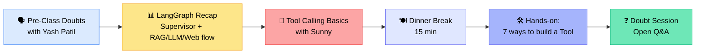
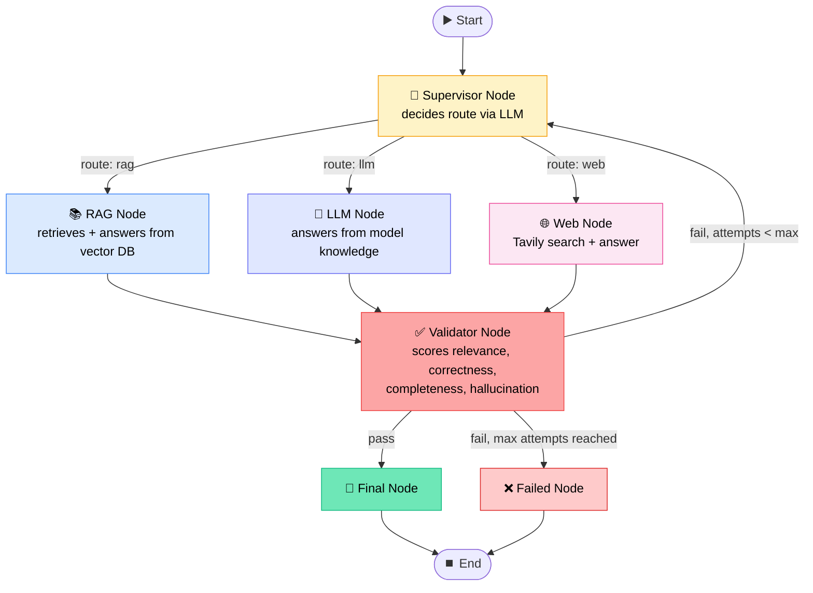
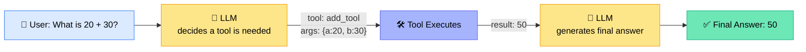
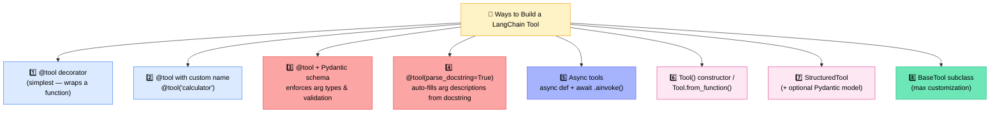
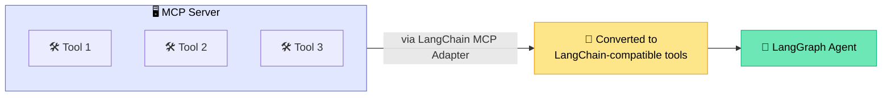
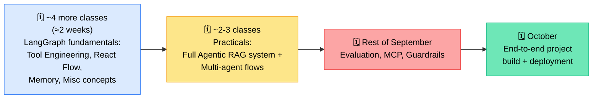

# 🧠 Agentic AI Batch — LangGraph Recap + Tool Calling & MCP Intro
### 📋 Session Notes — Krish Naik Academy

**🎙️ Speakers:** Yash Patil (Mentor, pre-session doubts) & Sunny (Lead Instructor, main session)
**⏱️ Duration:** ~3.5 hours (incl. dinner break) | **🎯 Session Type:** Doubt Clearing + Live Coding Class

---

## 🧭 Session Flow at a Glance

> 💡 Sunny joined ~35 minutes late (Bangalore traffic). Yash Patil hosted the opening doubt-clearing segment in the meantime.

---

## 🗣️ Part 1 — Pre-Class Doubt Clearing (with Yash Patil)

### 🔐 Cloud Code / VS Code Security
- **abhay's question:** Is it safe to give Claude Code write access to a repo containing client data?
- **Yash's answer:**
  - Don't run in *complete bypass mode* — use **allow-only mode** instead.
  - Claude Code will **ping for permission** before touching restricted files/repos.
  - You can explicitly configure what Claude Code is/isn't allowed to access (via VS Code's Claude Code extension settings).
  - Using **dummy/synthetic data** with the same structure as real data for a POC is an acceptable practice.

### 📄 Multimodal RAG: ColPali vs. Traditional Approach
- **Kamalakanta's question:** Difference between ColPali-based multimodal RAG and traditional multimodal RAG?

| | 🖼️ Multimodal Embedding Method (e.g. Gemini) | 📝 Text-Conversion Method | 🔎 ColPali (OCR-style) |
|---|---|---|---|
| How it works | Embeds images/video/text natively | Converts images/graphs/tables into text summaries, then text-embeds | Extracts text via OCR, treats visual layout as data |
| Cost | Higher | Lower | High compute + high storage |
| Best for | Rich multimodal data, budget allows it | Most production cases | Small, rich datasets needing lossless context |
| Storage footprint | Moderate | Moderate | **Very high** (hundreds of vectors/page) |

✅ **Rule of thumb:** For most production use cases, converting multimodal content (images, graphs, tables) into well-structured text with metadata is more practical than pure multimodal embeddings or ColPali.
✅ Yash pointed to the **Hugging Face embedding benchmark (MTEB)** for comparing open-source embedding models.

### 🎯 Feedback: Need for "Design Pattern" Sessions
- **Krish S.'s feedback:** Wants a dedicated session connecting concepts into real-world **Agentic system design patterns** — e.g., a banking use case covering prompt-injection defense, guardrail placement, evals, and model routing (reasoning-heavy vs. lightweight tasks).
- **Yash's response:**
  - Acknowledged the gap; this understanding is being built progressively (LLM fundamentals → fine-tuning → RAG → LangGraph → projects).
  - Pointed to Krish Naik's **16-hour YouTube marathon** on building an enterprise-grade multimodal RAG application as an interim resource.
  - Committed to relaying the feedback to Sunny.

### 🔢 RAG Retrieval: Choosing `k`
- **raghu.pr's question:** How is `k` (number of retrieved chunks) decided?
- **Answer:**
  - `k` is a **hyperparameter** — depends on context window size and retrieval pipeline confidence.
  - Small LLM + trusted retrieval → lower `k` (e.g., 3).
  - Large LLM + less-trusted retrieval → can afford higher `k`, but **better to add a re-ranker**: retrieve broad (k=25–50), then re-rank down to the most relevant chunks.
  - Topics like context precision/recall and evaluation metrics are **upcoming**, not yet covered.

### 🔀 Mixing Embedding & LLM Providers
- **Aslam Husain's question:** Can embeddings come from one provider (e.g., OpenAI) and generation from another (e.g., Google)?
- **Answer:** ✅ Yes — the only hard constraint is that **embedding dimensions must match** whatever's stored in the vector DB. The retrieved text is pulled from the embedding's **metadata**, not reconstructed from the vector itself, so the downstream LLM choice is independent of the embedding model.
- Also clarified: **GROQ** (the inference provider) is not the same as **Grok** (xAI's model) — GROQ hosts models like `openai/gpt-oss-20b`.

---

## 📊 Part 2 — LangGraph Recap: Supervisor-Routed RAG/LLM/Web Agent

Sunny reviewed a previously built workflow before introducing tool calling.

### 🧩 Core Terminology Recap

| Term | Definition |
|---|---|
| **Node** | A function; the graph decides *when* to execute it |
| **Edge** | Connection between nodes — **sequential** or **conditional** |
| **State** | The shared object data flows through; created via `TypedDict` or **Pydantic** base class |
| **Start / End node** | Marks where the process begins/ends |
| **Fan-in** | Multiple nodes (RAG/LLM/Web) converging into one node (Validator) |
| **Router (conditional edge)** | Function that reads the state's `route` key and maps it to the matching node name |

### 🔑 Key Mechanics Walked Through
- **Supervisor node:** Reads `question`, prior `validation_feedback`, and `used_routes` from state → prompts LLM (with a **Pydantic-enforced structured output**, `RouteDecision` class) → returns `route` + `reasoning`.
- **RAG node:** Retrieves docs → `format_docs()` (custom function) extracts page content → builds context → RAG prompt → LLM generates `draft_answer`.
- **LLM node:** Directly answers from model knowledge, no retrieval — simplest node.
- **Web node:** Uses **Tavily** search tool → combines title/URL/content into one context string → LLM generates answer.
- **Validator node:** Scores the draft answer (0–10) on relevance, correctness, completeness, hallucination. **Pass threshold: score > 7** (configurable). Returns `pass`, `score`, `feedback`.
- **Validator router:** If `pass` → `final`. If `attempts == 3` (max) → `failed`. Otherwise → back to `supervisor` for another attempt.

> ⚠️ **Important clarification:** This flow is **not purely deterministic** — it's a *probabilistic Agentic flow*, but since no function is wrapped as a callable "tool" yet, it doesn't use formal **tool calling**. That's the next topic.

> 📌 **State rule:** You only need to return the keys you're updating from a node — but every key must already exist in the state's schema definition. You cannot add new keys ad hoc (except with extra logic in Pydantic).

---

## 🔧 Part 3 — Tool Calling: Concepts & 7 Ways to Build a Tool

### 🤔 What Is Tool Calling?

> *"Tool calling is the ability of an LLM to select and invoke an external tool or function to get information or perform an action beyond its built-in knowledge."* — Sunny

✅ **LLM = decision maker** (decides *which* tool + *what* arguments)
✅ **Tool = actual executor** (the application runs it, not the LLM itself)
✅ **Node vs. Tool:** A *node* is executed because the **graph** decides to run it (fixed orchestration). A *tool* is executed because the **LLM** decides to call it (dynamic, reasoning-driven).

### 🧰 Common Tool Use Cases
Web search · Calculator · Database query · API calling · Vector DB retrieval · Email sending · Weather API · Stock price API · File operations

### 🛠️ Seven Ways to Create a Tool (LangChain)

| Method | Key Notes |
|---|---|
| `@tool` decorator | Uses the function's **docstring** as the tool description — omitting it throws an error. Access `.name`, `.description`, `.args`. Call with `.invoke({...})`. |
| `@tool("custom_name")` | Just renames the tool's metadata; execution still goes through the underlying function name in code. |
| `@tool` + Pydantic `args_schema` | Enforces strict input types — passing a wrong type (e.g., a string where an int is expected) raises a **validation error**. Essential for production reliability. |
| `parse_docstring=True` | Automatically breaks the docstring into per-argument descriptions inside the schema — useful metadata for the LLM. |
| Async tools (`async def` + `@tool`) | Enables **concurrent execution** — the function can pause without blocking the whole program; important for calling multiple APIs/tools faster. |
| `Tool(...)` constructor / `Tool.from_function(...)` | An alternative, code-first way to wrap an existing function without decorators — common in production. |
| `StructuredTool.from_function()` / with Pydantic model | More structured control; supports schema enforcement directly. |
| `BaseTool` subclass | Maximum customization — used when you need full control over tool behavior. |
| `return_direct` param | If `True` (default), tool output is passed back to the LLM for final response generation. If `False`, output bypasses the LLM entirely. |
| **ToolRuntime** (mentioned, not covered in depth) | Lets LangGraph inject runtime values into a tool without the model supplying them as arguments — to be explained in a future class. |

> 🧪 **Live validation demo:** Sunny intentionally passed a string where an integer was expected in a Pydantic-typed tool — it correctly threw a `ValidationError`, proving the enforced schema works.

---

## 🔗 MCP (Model Context Protocol) — First Look

- **Tool ≠ MCP.** A tool is the actual capability/functionality. **MCP is a standardized *protocol* for exposing tools** so any client (ChatGPT, a custom agent, etc.) can access them consistently.
- MCP is **optional** — not every tool needs to be behind an MCP server. Without MCP, a tool can be defined as a plain LangChain tool that directly calls a database, GitHub, Jira, etc.
- MCP becomes valuable when you want to **expose a tool once and let multiple clients/agents consume it** in a standardized way — e.g., one MCP server for a database, another for GitHub, each with a client connecting in.

---

## 📅 Roadmap Shared by Sunny

- 🎯 **September target:** Complete concepts up to MCP.
- 🎯 **October target:** Fully dedicated to building and deploying one end-to-end capstone project.
- 📝 A previously assigned **RAG assignment** is due for review — a solution will be shared regardless of completion status; late submissions still accepted.
- 🏆 A **"mega challenge"** will follow after Agentic AI + MCP + Guardrails topics are complete.

---

## ❓ Live Doubt Session Highlights

| Question | Answer |
|---|---|
| Can a tool retain state between calls? | Technically possible, but **tools should be treated as stateless** by convention — LangGraph's *state* (with checkpointing) is the right place to persist/restore information across calls. |
| Is Tool the same as MCP? | No. **Tool = actual functionality.** **MCP = standardized protocol** for exposing that functionality to any client. |
| When to use which tool-creation method? | Depends on required **granularity/control**. Decorator = simplest; constructor/StructuredTool/BaseTool = more control. Practical examples promised in upcoming sessions. |
| Is there a hard limit on number of tools an LLM can use? | No universal limit, but **providers impose caps** (e.g., ~128 tools per call on GROQ). For 200+ APIs, design a **hierarchical router**: top-level router classifies the query by department/domain (HR, Finance, IT, etc.), then routes to a smaller tool subset. |
| How does an LLM handle `*args` / `**kwargs` in a tool function? | Define explicit type/Pydantic schemas per argument (e.g., specify `float` for a calculator). Sunny suggested testing this hands-on, as behavior with dynamic/any-type args needs empirical verification. |
| Is MCP required for every tool integration (e.g., GitHub + DB)? | No — MCP is **optional**. A tool can directly call GitHub/DB APIs as a plain LangChain tool. MCP adds value mainly when standardizing access across multiple clients/agents. |
| Orchestration confusion: is the LLM the orchestrator, or is LangGraph? | **Orchestration = coordination of the entire workflow** (all nodes, edges, control flow) — not just the LLM. Tool calling is one mechanism used *within* that orchestration; a deeper example was promised for the next class. |
| Recommended database architecture for enterprise AI apps? | A layered approach: **PostgreSQL** (transactional/user data), a **vector DB** (e.g., Azure AI Search) for embeddings, **Redis** for caching, and **object storage** (S3/Azure Blob) for files like PDFs/images/audio. |
| Is Agentic AI relevant if an interview focuses on traditional GenAI/ML? | Yes — **Agentic AI is built on GenAI fundamentals** (RAG, LLM basics). Candidates should still join such roles; foundational GenAI knowledge transfers directly. |
| Guidance on Specification-Driven Development (with GitHub Copilot / Claude)? | Don't dump all instructions into a single MD file (that's just "prompt-driven," not spec-driven). Instead: define proper **`.github/` folder structure** with separate MD files per concern (architecture, testing, backend, review/debug guidelines) — mirrors standard Agile artifacts (requirements → spec → task breakdown → implementation → testing). |
| Does AI change core software architecture styles (layered, hexagonal, microservices, event-driven)? | No — **fundamentals remain the same**; Agentic components simply get slotted into the existing architectural style. |
| Is there a "system design" reference for AI architect–level roles? | No single resource — **system design mastery comes mainly from real-world experience** (~50-60%), with learning/courses covering the rest. An upcoming FDE (Forward-Deployed Engineer) course will include some of this. |

---

## ✅ Action Items for Learners

- [ ] 📓 Review the **Tool Engineering notebook** shared by Sunny (all 7+ ways of creating tools)
- [ ] 🔁 Revisit the previous **LangGraph supervisor/RAG/LLM/Web workflow** notebook to solidify node/edge/state concepts
- [ ] ✍️ Complete (or finish) the pending **RAG assignment** — solution to be shared soon
- [ ] 🧪 Experiment hands-on with `*args`/`**kwargs` tool schemas as suggested to bala personal
- [ ] 📌 Explore GitHub Copilot's `.github/` repository-instructions feature for spec-driven development
- [ ] 🏆 Get ready for tomorrow's session — deeper dive into **Tool Engineering + React Agent flow**
- [ ] 📧 Share job/interview selection updates with the mentors (via email, LinkedIn, or in-app message) — success stories help track batch outcomes

---

*📝 Notes compiled from the full session transcript — LangGraph Recap, Tool Calling & MCP Introduction, Krish Naik Academy.*
