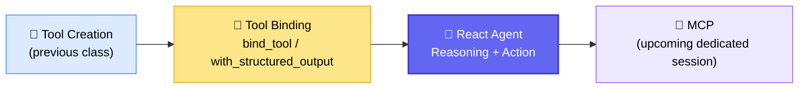
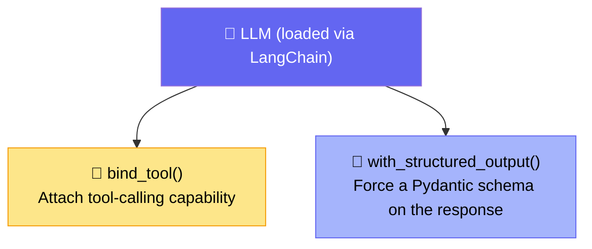
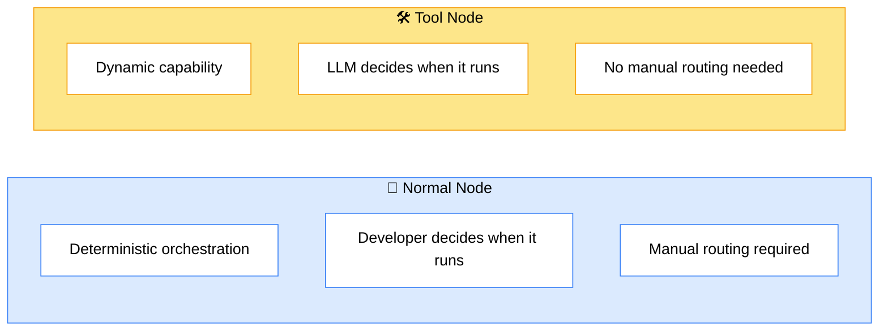
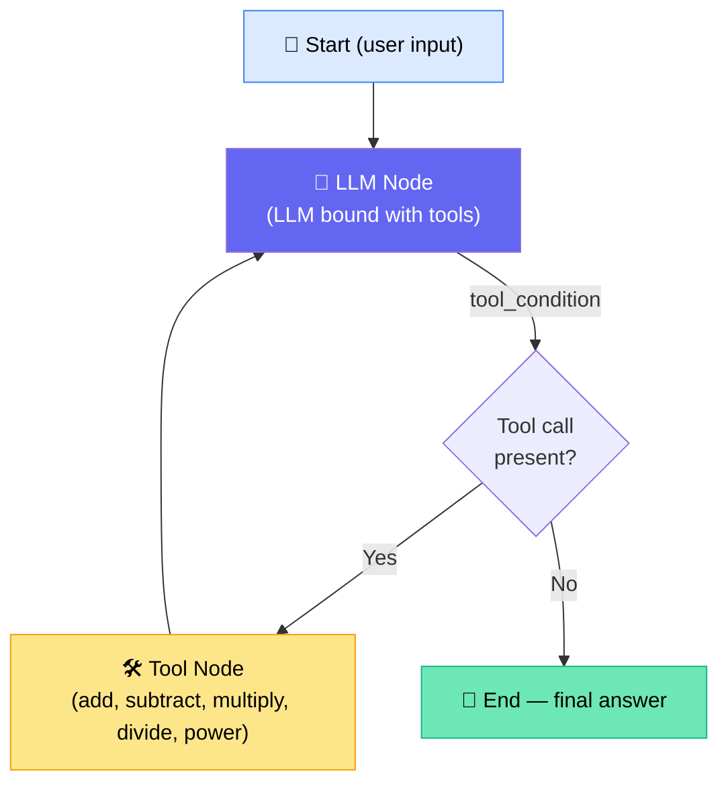
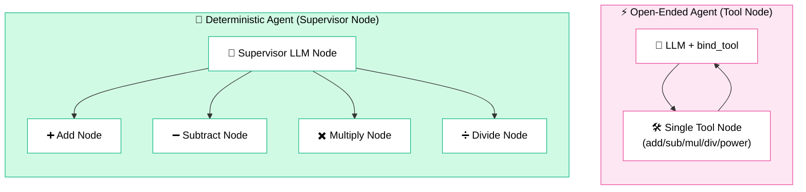
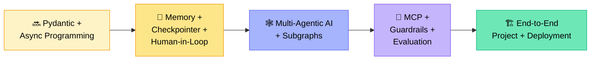

# 🛠️ Tool Calling & React Agent
### 📋 Class Notes — Agentic AI Batch (Krish Naik style curriculum)

**🎙️ Instructor:** Sunny
**⏱️ Duration:** ~2 sessions (~4.5 hrs incl. break + extended doubt session)
**🎯 Session Type:** Live Class + Live Coding + Doubt Session

---

## 🧭 Where This Class Fits

This class picks up right after **tool initialization**, and builds toward the **React Agent** — the mechanism that lets an LLM dynamically decide which tool to call.



> 💡 **Housekeeping:** All notes, code, and recordings are pushed to GitHub after every class. Assignment solutions (RAG, multimodal RAG, fine-tuning) are also uploaded there for anyone who hasn't completed them yet.

---

## 🧩 Recap: Methods of Tool Creation

Sunny revised every method LangChain provides for creating a tool, ranked by *learning priority* (not necessarily industry usage — "5 stars" just means "learn this first").

| Method | Best For | Priority |
|---|---|---|
| `@tool` decorator | Simple custom functions — default starting point | ⭐⭐⭐⭐⭐ |
| `@tool` + Pydantic | Complex, validated business inputs (schema enforcement) | ⭐⭐⭐⭐⭐ |
| Async tool | Concurrency — multiple simultaneous tasks | ⭐⭐⭐⭐ |
| `create_retriever_tool` | Converting a vector-DB retriever into a tool (Agentic RAG) | ⭐⭐⭐ |
| Pre-built integrations | Ready-made tools (Tavily, Google Search, Perplexity, etc.) | ⭐⭐⭐ |
| MCP (Model Context Protocol) | Standardizing/exposing tools for external/enterprise consumption | ⭐⭐⭐⭐ |
| Tool Runtime | Modifying tool behavior at runtime (future workflows) | ⭐⭐ |
| `StructuredTool` / `BaseTool` / Tool Constructor | Maximum authority & custom control over tool construction | ⭐⭐⭐ |
| Raw JSON schema | Old-school function calling (pre-LangChain era) — rarely needed now | ⭐ |

✅ **Golden rule:** *Tool creation* and *tool calling* are two different things — creating a tool is just a Python function; calling it well (especially with 100–200 tools) needs deliberate **tool engineering**.

✅ Every retriever (from any vector DB) can be converted into a tool and plugged in as a **tool node** — this becomes central to Agentic RAG (covered in a future class).

---

## 🔑 The Two Most Important LLM Methods

Whenever an LLM is loaded via LangChain (from OpenAI, Anthropic, DeepSeek, Meta, Gemini, etc.), it exposes two critical extra capabilities:



> 🗣️ *"LangChain provides a common interface — whether I load from OpenAI, Anthropic, Hugging Face, or Google, these two functions work the same way."* — Sunny

**Key demo insight:** Once a tool is bound to the LLM, asking a tool-relevant question does **not** return a direct answer. The `content` field is empty — instead, the LLM returns a `tool_calls` object specifying which tool to call and with what arguments. The actual answer only comes after the tool executes and its result is fed back to the LLM.

---

## ⚖️ Node vs. Tool — The Core Distinction



> If every capability (weather, calculator, retriever, web search, database, email) is built only as *nodes*, you must manually route each one. Giving the LLM **tool-calling capability** removes this overhead — the LLM decides dynamically which tool to invoke.

---

## 🤖 The React Agent — Reasoning + Action

**R.E.ACT = REasoning + ACTion**



**How it works, step by step (walked through live on the blackboard using a 5-tool math agent — add, subtract, multiply, divide, power):**

1. User input enters at `START` → flows to the **LLM node**.
2. The LLM (bound with tools + a system prompt) reasons about the question.
3. If it's a *generic* question (e.g. "Hi, how are you?") → LLM answers directly and the graph **ends**.
4. If it needs computation (e.g. `"2+2, then multiply by 10"`) → LLM emits a `tool_call` → routed via `tool_condition` to the **tool node**.
5. Tool executes, result returns to the LLM node as a `ToolMessage`.
6. LLM re-evaluates: call another tool, or end the process with the final answer.
7. This loop (LLM → tool → LLM → tool → … → End) continues until the LLM decides no more tool calls are needed.

> 🧠 **Key state mechanic:** `MessageState` (imported from LangGraph) uses `add_messages` — every human/AI/tool message gets **appended** (concatenated) to a running list, which is how the LLM keeps context across the tool-calling loop.

### 🔍 Inside `tool_condition` (pre-built LangGraph function)

```python
# Simplified logic Sunny walked through from the LangGraph GitHub source
if isinstance(state, list):
    last_message = state[-1]          # last AI message
elif isinstance(state, dict):
    last_message = state["messages"][-1]
else:
    raise ValueError("No message found in input to tool_edge")

if last_message.tool_calls and len(last_message.tool_calls) > 0:
    return "tools"     # route to tool node
else:
    return END          # end the graph
```

It simply checks: **does the last AI message contain a `tool_calls` field?** If yes → route to tools; if no → end.

---

## 🆚 Open-Ended Agent vs. Deterministic (Supervisor) Agent

Two ways to design the same math-agent workflow:



| | ⚡ Open-Ended (Tool Node) | 🎯 Deterministic (Supervisor Node) |
|---|---|---|
| Who decides routing? | LLM, fully dynamically | LLM picks from a **manually pre-wired** graph |
| Flexibility | High — LLM controls tool selection, arguments, when to stop | Lower — routing is hard-coded by the developer |
| Risk | LLM can "mess up" the open-ended decision-making | More control, workflow less likely to fail |
| When to use | Many tools, need dynamic capability | Fewer, well-known functionalities; production safety matters |
| Underlying mechanics | Both are still functions — the *only* difference is who owns the routing decision | |

> 🗣️ *"Use tool calling when the LLM should dynamically choose the capability. If you can achieve your goal with the deterministic approach, do it — it's more secure."* — Sunny

---

## 🧪 Live Demo Walkthrough

- **Question 1:** *"Add 10 and 20, multiply by 3, subtract 15, divide by 5, raise to power of 2"* → LLM correctly chained all 5 tool calls in sequence, waiting for each result before calling the next tool.
- **Question 2:** *"Hi, how are you?"* → No tool call triggered; LLM answered generically and ended.
- **Question 3:** *"What's the latest weather of Delhi?"* → LLM correctly declined/ended the process since **no weather tool was defined** — proving tools must be **explicitly defined**; the LLM cannot magically fetch real-time data it wasn't given a tool for.

✅ System prompt used for the math agent explicitly instructed:
- Use the appropriate tool for each mathematical operation
- Follow the user-requested calculation order
- Wait for a tool's result before calling the next tool
- Never calculate manually — always use tools
- Provide the final answer only after all required tool calls are complete

---

## ❓ Live Q&A Highlights

| Question | Answer |
|---|---|
| Why do companies worry about token cost even with self-hosted/local LLMs? | Compute is still the cost driver — GPU cluster capacity, throughput, latency, KV-cache/memory, and concurrency all scale with token volume, even without per-token API billing |
| Does binding tools mean the LLM can *only* answer tool-related questions? | No — if the LLM already knows the answer generically, it will answer directly. Tool binding only adds *extra* capability, it doesn't restrict general knowledge |
| Why is DeepSeek/Ollama sometimes failing to call tools correctly? | Weaker reasoning capability + vague docstrings/descriptions cause hallucination in tool selection. Use a strong model (Anthropic/OpenAI) and write precise tool descriptions/schemas for production use |
| Is model selection domain-specific (like BERT variants)? | No — general-purpose LLMs (OpenAI, Anthropic, Gemini, Meta) are fine; no need for domain-specific base models |
| Is tool engineering a separate topic from Agentic AI? | No — it's part of Agentic AI. Real-world tool counts depend entirely on use case, not always "hundreds of tools" |
| Node vs. Agent — is every node an agent? | No. A **node** is just a function. The **entire graph/flow** is the agent (deterministic or probabilistic). Sub-agents can exist as separate planners/flows if each has its own full planning+tool-calling loop |
| Difference between Claude Chat/Claude Code and the raw Claude API? | The raw API gives you an unopinionated base model with no built-in system — Claude Chat/Code wrap that with their own developer-built backend systems (memory, tools, planning, etc.) |
| How to debug multi-agent/tool failures in production? | Use an observability/debugging platform like **LangSmith** — integrate via SDK to trace tool calls, costs, and step-by-step execution |
| No-code platforms for orchestrating existing enterprise tools (e.g., Datadog, AWS)? | Explore **n8n**, **Langflow**, or **Dify** — all support tool orchestration without heavy coding |
| Does an agent always require a tool? | No — an agent can just reason/plan without external tools. Tools specifically give the agent the ability to interact with external systems and take dynamic action |

---

## 🗓️ Upcoming Roadmap (as shared by Sunny)



- 📚 ~14 more classes projected to cover the LangGraph → Multi-Agentic → MCP/Guardrails/Evaluation arc (~September completion target)
- 🏗️ One full dedicated month for the **end-to-end project**, including complete CI/CD deployment
- 🧑‍💻 Claude Code and remaining syllabus extras planned for after Diwali

---

## ✅ Action Items for Learners

- [ ] 📥 Pull the latest `React Agent with Tool Calling` notebook from GitHub
- [ ] 🧮 Re-run the 5-tool math agent locally (add/subtract/multiply/divide/power) and test with your own multi-step questions
- [ ] 🧪 Test edge cases: a generic question, a tool-relevant question, and an out-of-scope question (e.g. weather) to observe LLM behavior
- [ ] 📝 Review the `tool_condition` source in the LangGraph GitHub repo (`langgraph/prebuilt/tool_node.py`)
- [ ] 🔍 Explore LangChain's pre-built tools page for available integrations (Tavily, Google Search, Perplexity, etc.)
- [ ] 🧵 Try designing the same workflow both ways — open-ended (tool node) vs. deterministic (supervisor node) — and compare
- [ ] 🩺 If debugging agent pipelines, try LangSmith for tracing and observability
- [ ] ❓ Bring reasoning-heavy or architecture doubts to the dedicated doubt session

---

*📝 Notes compiled from two class transcripts — Tool Calling Methods & React Agent with Tool Calling, Agentic AI batch.*
