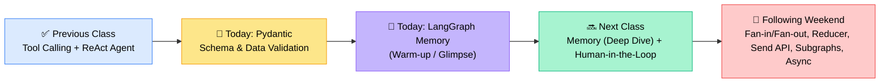
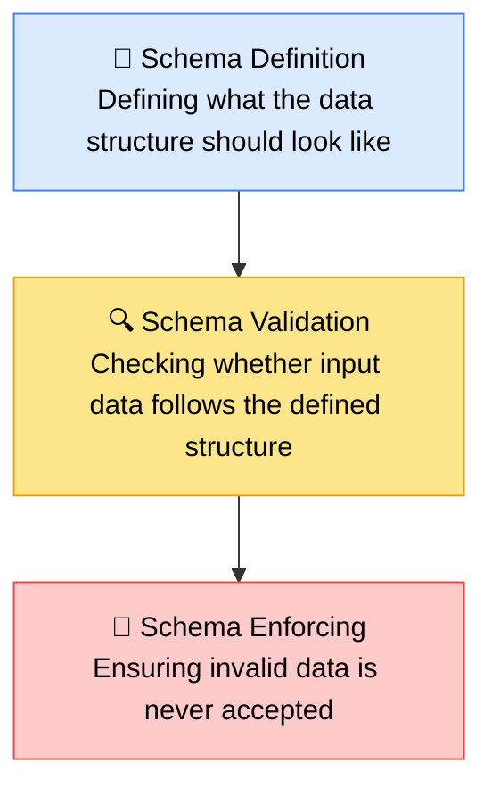
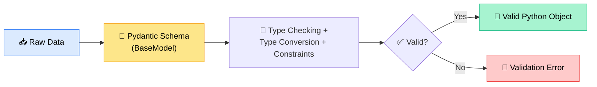
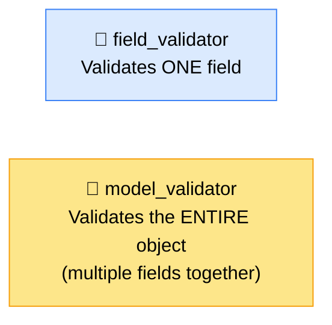
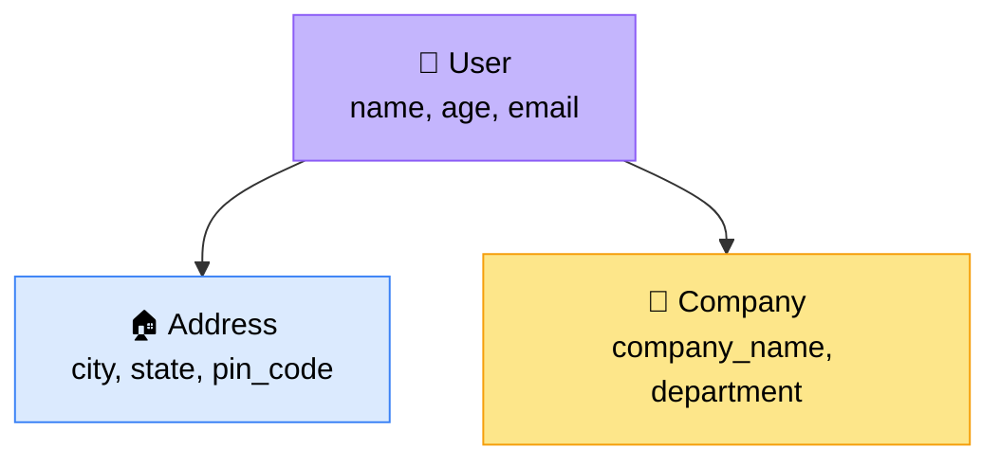
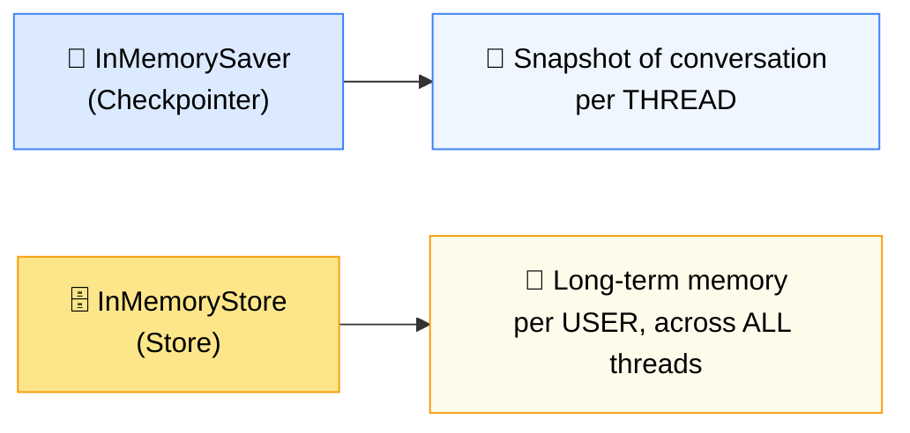
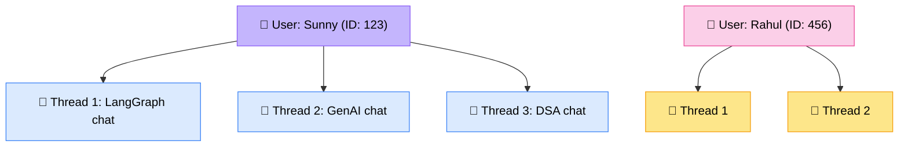

### 📋 Pydantic Deep Dive + LangGraph Memory (Intro) — Krish Naik Academy

**🎙️ Speaker:** Sunny Savita
**📅 Date:** 5th September 2025 (Teacher's Day) | **🏷️ Class:** #43
**⏱️ Format:** Live coding session + Live Doubt-Clearing Q&A

---

## 🧭 Where Today Fits

Class 43 continues straight from **Tool Calling & the ReAct Agent** (covered in the previous session). Before starting, Sunny reminded everyone that every example shown in class is a **real-world pattern**, not a toy demo — the same code structures are used when building production Agentic systems.



> 💡 **Housekeeping:** RAG assignment solutions are being uploaded progressively to the GitHub repo. Folder/session names on the dashboard were being renamed to match GitHub naming conventions.

---

## 🧩 Part 1 — Pydantic

### 🆚 Pydantic vs. Pydantic AI — Don't Confuse Them!

|               | 📐 Pydantic                                   | 🤖 Pydantic AI                                                            |
| ------------- | --------------------------------------------- | ------------------------------------------------------------------------- |
| What it is    | A Python **data validation & schema library** | An **Agentic AI framework** for building AI agents                        |
| Comparable to | —                                             | LangGraph (different implementation, same goal)                           |
| Used for      | Enforcing structure/type/format on any data   | Building full agent applications, built around Pydantic-style type safety |
| Scope         | Generic — used in web dev, APIs, ML, anywhere | AI-specific                                                               |

> 🗣️ _"Pydantic is a Python library used to define the expected structure of the data and validate incoming data against the structure."_ — Sunny

### 🔑 Three Core Terms



**Why Pydantic exists — the validation flow:**



### 🏗️ BaseModel — The Foundation

- Any Python class becomes a **Pydantic class** by inheriting `BaseModel`.
- Without inheriting `BaseModel`, it's just a normal Python class — no validation, parsing, serialization, or auto-generated JSON schema.
- Install with: `pip install pydantic` (also add to `requirements.txt`)

### ⚠️ Pydantic v1 → v2: Key API Renames

| Pydantic v1    | Pydantic v2              |
| -------------- | ------------------------ |
| `.dict()`      | `.model_dump()`          |
| `.json()`      | `.model_dump_json()`     |
| `.parse_obj()` | `.model_validate()`      |
| —              | `.model_validate_json()` |

---

### 🛠️ Without Pydantic vs. With Pydantic

Sunny first hand-rolled a `create_user()` validation function to check `name` (must be `str`) and `age` (must be `int`, `>= 18`) — manually raising exceptions for every rule. Then rebuilt the same logic in **2 lines** using Pydantic:

```python
class User(BaseModel):
    name: str
    age: int = Field(gt=0)
```

> ✅ **Key takeaway:** all that manual `if/raise` logic is abstracted away — Pydantic just needs the schema defined once.

**`Field()` lets you attach:**

- Description & metadata
- Constraints: `gt` (greater than), `lt` (less than), `ge`, `le`, `min_length`, `max_length`

### 📚 Live Examples Covered

| Domain                       | Schema Fields                                        | What Was Tested                                                                                                                                         |
| ---------------------------- | ---------------------------------------------------- | ------------------------------------------------------------------------------------------------------------------------------------------------------- |
| 🔐 **API/User Validation**   | `name`, `age`                                        | Wrong type (list instead of str) → ❌ error; age < 18 → ❌ error                                                                                        |
| 📧 **User Registration**     | `name`, `email` (`EmailStr`), `age` (`Field(ge=18)`) | Invalid email format → ❌ 2 validation errors; wrapped in `try/except ValidationError` to avoid crashing the app                                        |
| 🛒 **E-commerce Product**    | `name`, `price`, `quantity`                          | Negative price/quantity → ❌ error                                                                                                                      |
| 🏦 **Banking Transaction**   | `sender_account`, `receiver_account`, `amount`       | Negative amount → ❌; amount below minimum threshold (₹500) → ❌; wrong data type → ❌                                                                  |
| ⚙️ **LLM Config**            | `model_name` (str), `temperature`, `timeout`         | temperature = 3 → ❌ (out of range); timeout = -5 → ❌                                                                                                  |
| 🧑 **Structured LLM Output** | `name`, `age`, `city`                                | Used `llm.with_structured_output(PersonDetails)` — LLM auto-extracted entities from a free-text prompt like _"Sunny is 30-year-old and lives in Delhi"_ |

> 🎯 Sunny flagged **structured output** as one of the most important Agentic AI features — it's exactly how routing decisions (RAG vs. Web vs. LLM + reasoning) were built in earlier classes, and will be used heavily in the upcoming end-to-end project.

### 🎛️ Field Types & Defaults

```python
class User(BaseModel):
    name: str
    country: str = "India"          # default value
    middle_name: str | None = None  # optional (str OR None)
    nickname: str | None = None
```

- `str | None` means the field can be a string **or** nothing.
- `None` in Python simply means **nothing** — not a special keyword.
- Omitting an optional field at init time auto-fills the default.

### 🔧 Useful Pydantic Methods (Live-Demoed)

| Method                               | Purpose                                             |
| ------------------------------------ | --------------------------------------------------- |
| `user.model_dump()`                  | Convert Pydantic object → Python `dict`             |
| `user.model_dump_json()`             | Convert object → JSON **string**                    |
| `json.loads(...)`                    | Convert JSON string → dict/JSON object              |
| `User.model_validate(data)`          | Validate a `dict` against the schema directly       |
| `User.model_validate_json(json_str)` | Validate a JSON **string** against the schema       |
| `User.model_json_schema()`           | Return the full JSON schema definition of the class |
| `user.model_copy()`                  | Create a copy of an existing object                 |
| `user.model_copy(update={...})`      | Create a copy **with specific fields overridden**   |

### 🧪 Field Validator vs. Model Validator



|                       | `field_validator`                                       | `model_validator`                                                   |
| --------------------- | ------------------------------------------------------- | ------------------------------------------------------------------- |
| Scope                 | Single field                                            | Whole object / multiple fields                                      |
| Example use case      | Enforce a name's length/format                          | Check `password == confirm_password`                                |
| Needs `@classmethod`? | Yes                                                     | Generally no                                                        |
| Demo class            | `Employee` (validated `name` length via `validateName`) | `SignUp` (checked `password` vs `confirm_password`, `mode="after"`) |

### 🪆 Nested Schemas

Pydantic supports composing schemas inside schemas:



Validated successfully both via **direct object initialization** and via `User.model_validate(user_data)` against a raw nested dictionary.

> 📓 **Bonus resource:** Sunny shared a personal reference notebook with **~194 cells** covering nearly every Pydantic method/feature, built directly from the official documentation — not fully covered live, but available for self-study.

---

## 🧠 Part 2 — LangGraph Memory (Warm-Up Session)

> ⚠️ Sunny was explicit that this was only a **glimpse**, not the full theory — a proper ground-up explanation of memory (+ Human-in-the-Loop) was promised for the next class.

### 🧱 The Two Memory Primitives



|                                    | Checkpointer                         | Store                                                 |
| ---------------------------------- | ------------------------------------ | ----------------------------------------------------- |
| Remembers                          | The conversation (within one thread) | The user, across every conversation/thread            |
| Analogy                            | One ChatGPT chat's history           | ChatGPT's memory of you, usable in a _brand-new_ chat |
| Backing storage today              | In-memory (RAM) — **volatile**       | In-memory (RAM) — **volatile**                        |
| Persistent option (shown tomorrow) | SQLite / Postgres / any DB           | SQLite / Postgres / any DB                            |

### 🪪 User ID vs. Thread ID



- **User ID** → distinguishes _who_ is chatting.
- **Thread ID** → distinguishes _which conversation_ — like opening a new tab in ChatGPT. One user can run many parallel threads.
- **Memory = shared chat history**, and it needs somewhere to live — today it's in RAM (erased when the session ends); tomorrow's class covers persisting it to an actual database (Postgres/SQLite).

### 💻 Code Walkthrough (Simplified)

```python
from langgraph.store.memory import InMemoryStore
from langgraph.checkpoint.memory import InMemorySaver
from langgraph.graph import StateGraph, MessagesState, START, END
from langchain.chat_models import init_chat_model
from dataclasses import dataclass

model = init_chat_model("...")
checkpointer = InMemorySaver()   # short-term: per-thread conversation
store = InMemoryStore()          # long-term: per-user, cross-thread

@dataclass
class Context:
    user_id: str

def assistant_node(state, runtime):
    user_id = runtime.context.user_id
    namespace = (user_id, "memories")
    user_message = state["messages"][-1].content

    if user_message.lower().startswith("remember"):
        memory = user_message[len("remember"):]
        runtime.store.put(namespace, uuid4(), {"data": memory})

    memories = runtime.store.search(namespace)
    memory_text = memories[0].value["data"] if memories else "No saved memory"

    system_prompt = f"You are a helpful assistant. Long-term memory: {memory_text}"
    response = model.invoke([{"role": "system", "content": system_prompt}, *state["messages"]])
    return {"messages": [response]}

builder = StateGraph(MessagesState, context_schema=Context)
builder.add_node("assistant", assistant_node)
builder.add_edge(START, "assistant")
builder.add_edge("assistant", END)
graph = builder.compile(checkpointer=checkpointer, store=store)
```

### 🧪 Live Test Results

| Test                     | Setup                                                                                       | Result                                                     |
| ------------------------ | ------------------------------------------------------------------------------------------- | ---------------------------------------------------------- |
| Follow-up in same thread | _"My current project is Agentic RAG"_ → _"What is my current project?"_ (same `thread_id`)  | ✅ Correctly answered "Agentic RAG" (checkpointer)         |
| New thread, same user    | _"Remember, my favorite language is Python"_ → new `thread_id`, same `user_id`, asked again | ✅ Still answered "Python" (store persists across threads) |
| Different user           | New `user_id` (Rahul) + new thread, asked favorite language                                 | ✅ Correctly isolated — no leakage from Sunny's memory     |

> 🎓 **Where memory matters:** Conversational AI, chatbots, QA systems. **Where it doesn't:** one-shot report generation, single-pass LLM reviews — no persistent context needed there.

---

## ❓ Live Doubt Session Highlights

| Person         | Question                                                                                                                                                                                                                         | Sunny's Guidance                                                                                                                                                                                                                                                       |
| -------------- | -------------------------------------------------------------------------------------------------------------------------------------------------------------------------------------------------------------------------------- | ---------------------------------------------------------------------------------------------------------------------------------------------------------------------------------------------------------------------------------------------------------------------- |
| 🙋 Raghu       | ReAct agent (30+ tools) sometimes _fabricates_ a tool call — claims it ran a tool but the trace shows no actual invocation                                                                                                       | Add explicit validators on the AI message (was a tool call really emitted?) and on the tool's returned `ToolMessage` — cross-check both before trusting the response                                                                                                   |
| 🙋 Sandeep     | With GPT-5/Claude-level "AGI-oriented" models, will human-in-the-loop and dev roles disappear? Is AI cost-effectiveness declining?                                                                                               | Models keep improving, but **enterprises still need custom-built, production-grade systems** (UI, robust pipelines, compliance) — AI engineers/architects remain essential; roles are shifting toward higher-leverage system design, not disappearing                  |
| 🙋 Rajib       | Failing technical interviews that demand hardcore line-by-line coding despite AI-assisted (Copilot/ChatGPT) real-world delivery experience                                                                                       | Depends entirely on the interviewer/company tier (FAANG-level firms _will_ test raw coding); be upfront about relying on AI tools day-to-day, but keep core fundamentals sharp as a safety net                                                                         |
| 🙋 Rahul Kumar | Is transitioning from a 15+ year engineering management background into Agentic AI (for C# apps) the right path? Also asked about the Forward Deployed Engineer (FDE) role                                                       | Yes, confirmed as the right path if paired with real projects; technical interviewers commonly test coding regardless of seniority — be prepared                                                                                                                       |
| 🙋 Piyush      | Roadmap advice; building a reusable ingestion pipeline (loader → chunker → embedder → vector DB) as a plug-and-play package; healthcare appointment-booking agent with routing (book/cancel/reschedule/emergency) + memory layer | Confirmed the reusable pipeline package idea is valid (mirrors what was already built in the RAG project); yes to adding a memory layer after the next class; offered to forward resumes to his team for opportunities                                                 |
| 🙋 Sofia       | Data analyst wanting to move into AI consulting — unsure whether to prioritize no-code tools (n8n, Claude Skills) or full custom development, and which course to take next                                                      | Learn **both** — no-code tools for fast delivery, and full-stack development for custom enterprise builds; finish one course to 80–90% mastery (with real projects) before starting the next, rather than course-hopping                                               |
| 🙋 Sunil       | Designing a plug-and-play contract-parsing agent for real estate clients, each using a different contract schema/system (SharePoint docs, Oracle/SAP ERPs, Conga CLM) — RAG feels too costly per-deal                            | Suggested a **connector layer** to normalize inputs from each source, plus a **dynamic/canonical schema** approach (research this term) rather than full RAG re-ingestion per contract; asked Sunil to share the exact problem statement for a more detailed follow-up |

---

## ✅ Action Items for Learners

- [ ] 📓 Practice the full Pydantic notebook shared on GitHub (includes API, e-commerce, banking, LLM-config, and nested-schema examples)
- [ ] 📚 Optional: review the bonus **194-cell Pydantic reference notebook** for deeper method coverage
- [ ] 🧠 Review today's LangGraph Memory code (`InMemorySaver` + `InMemoryStore`) before the next class — Sunny will rebuild the concept from scratch
- [ ] 🔁 Come prepared for the next class: **Memory (full theory) + Human-in-the-Loop**
- [ ] 🗂️ Keep an eye on the GitHub repo for renamed folders matching the dashboard
- [ ] 💬 If facing tool-calling hallucination issues (like Raghu), implement validators on both the AI message and the returned tool message

---

_📝 Notes compiled from the full Class 43 transcript — Agentic AI Specialization, Krish Naik Academy._
