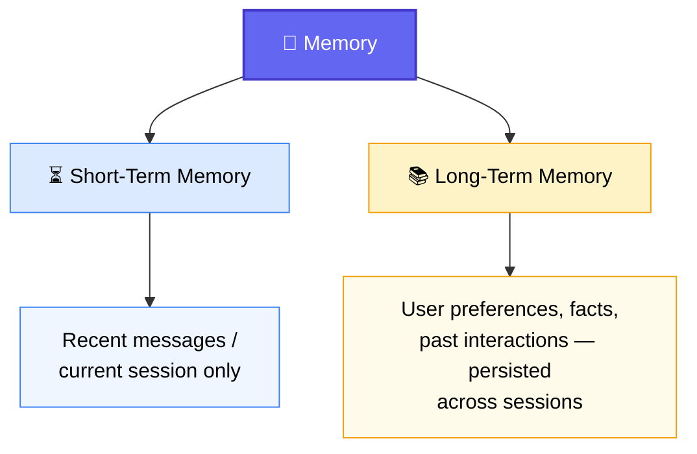
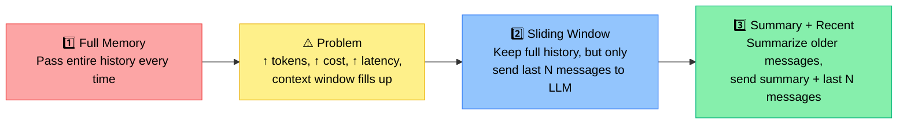
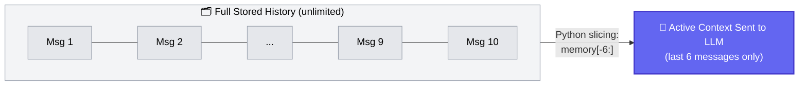
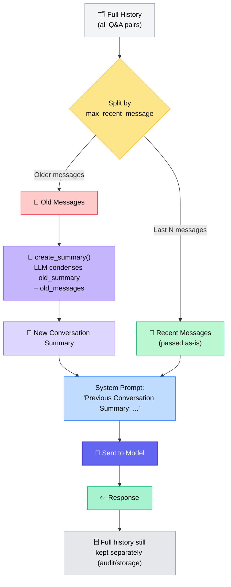

# 🧠 Memory Management in Agentic AI

### 📋 LangChain & LangGraph Batch

**🎙️ Speaker:** Sunny (Mentor)
**⏱️ Duration:** ~2h50m (incl. dinner break + live doubt session) | **🎯 Session Type:** Live Class + Q&A + Student Project Showcase

---

## 🧭 Where This Class Fits

This is **Class 44 of ~60–70 total classes** in the batch. Memory Management is taught **from scratch, no shortcuts** — Sunny deliberately skips the legacy LangChain memory classes and instead builds the logic in raw Python so the underlying mechanics are fully understood.

```mermaid
flowchart LR
    A["✅ Classes 1–43<br/>Pydantic + LangGraph basics"] --> B["🧠 Class 44–45 (You are here)<br/>Memory Management"]
    B --> C["🤝 Human-in-the-Loop<br/>(next class)"]
    C --> D["🔀 Remaining LangGraph<br/>orchestration, subgraphs, APIs"]
    D --> E["👥 Multi-Agentic Systems"]
    E --> F["📊 Evaluation Strategy<br/>+ Guardrails + MCP + A2A"]
    F --> G["🏗️ End-to-End Project"]

    style B fill:#6366f1,color:#fff,stroke:#4338ca,stroke-width:2px
    style A fill:#dbeafe,stroke:#3b82f6,color:#000
    style C fill:#e0e7ff,stroke:#6366f1,color:#000
    style D fill:#ede9fe,stroke:#8b5cf6,color:#000
    style E fill:#fde68a,stroke:#f59e0b,color:#000
    style F fill:#fca5a5,stroke:#ef4444,color:#000
    style G fill:#6ee7b7,stroke:#10b981,color:#000
```



> 💡 **Note:** The full LangGraph module wraps up in ~3–4 more classes before the batch moves into multi-agent systems.

---

## 🤔 What Is "Memory" in an AI Application?

Sunny gave two working definitions, back to back:

| #   | Definition                                                                                                                                                                                    |
| --- | --------------------------------------------------------------------------------------------------------------------------------------------------------------------------------------------- |
| 1️⃣  | A **mechanism that allows an AI application to retain and reuse information** from previous interactions.                                                                                     |
| 2️⃣  | The **ability of an application to store, retrieve, and reuse information** from previous interactions — so the system can maintain context and give more consistent, personalized responses. |

> 🗣️ **Key line from class:** _"An LLM is usually stateless by itself. If the previous context is not provided with each new call, the model does not remember the earlier conversation."_

**ChatGPT vs. GPT, Claude Chat vs. Claude** — Sunny used this distinction to drive the point home: the **application** (ChatGPT, Claude Chat) _feels_ like it remembers you, but that illusion is entirely created by the memory layer feeding conversation history back into an otherwise stateless **model** (GPT, Claude) on every single call.

---

## 🧩 Two Types of Memory



✅ Short-term memory can be thought of as a **building block inside** long-term memory — the two aren't competing concepts (clarified during the doubt session).

### Why bother with memory management at all?

- 🔁 Maintain conversation continuity
- ❓ Handle follow-up questions
- 🎯 Personalize responses / remember user preferences
- 🤖 Support long-running agent workflows
- 🚫 Avoid repeated/regenerated answers
- 📌 Track workflow state
- 💰 Control context window usage → reduce token cost & latency

> ⚠️ Without persistence, **any** memory — short or long-term — disappears the moment a session/notebook restarts, unless it's saved somewhere (Postgres, SQLite, Redis, a LangGraph store, etc.).

---

## 🗂️ Legacy LangChain Memory Classes (context only)

Shown purely for background — **these classes have been removed from the latest LangChain docs**, replaced by LangGraph-native concepts (checkpointer, trim, delete, summarize, semantic retrieval).

| Legacy Class                       | What It Did                        |
| ---------------------------------- | ---------------------------------- |
| Conversation Buffer Memory         | Stores the entire conversation     |
| Conversation Window Memory         | Sliding window of recent messages  |
| Conversation Token Buffer Memory   | Buffer capped by token count       |
| Conversation Summary Memory        | Stores a running summary only      |
| Conversation Summary Buffer Memory | Summary + recent messages combined |
| Conversation Entity Memory         | Tracks entities mentioned in chat  |

📺 Sunny pointed to a 5-video playlist on his own YouTube channel (~2 years old) covering each of these in depth. His recommendation: **write custom logic instead of relying on the deprecated classes**, since the newer LangGraph documentation has moved on to a different mental model (semantic, episodic, procedural memory).

---

## 🛠️ Three Memory Strategies Built From Scratch



### 1️⃣ Full Memory (the naive baseline)

A simple Python `list` holds every user/AI turn. Each `chat()` call:

1. Appends the user input to `memory`
2. Passes the **entire** `memory` list to `model.invoke()`
3. Appends the AI's reply back into `memory`

✅ Works fine for short chats — GPT-4.1 Mini's ~128K token context easily absorbs it.
❌ Breaks down as conversations grow: rising token cost, latency, and context-window usage. Sunny compared this to why long ChatGPT threads sometimes seem to "forget" or "hallucinate" about something asked much earlier in a very long thread.

### 2️⃣ Sliding Window Memory

> _"We still store the complete conversation, but we only pass the recent messages to the LLM."_



- Implemented with plain Python **negative-index slicing**: `memory[-max_context_messages:]`
- `max_context_messages` is a **hyperparameter** — there is no single "correct" number. It depends on analyzing real user behavior, typical conversation length, and the app's use case.
- Demoed live: once the chat passed 6 messages, older facts (e.g. the user's name) dropped out of the _active_ window — but the LLM sometimes still "guessed" correctly because it had already echoed that fact in a more recent reply.

### 3️⃣ Summary + Recent Messages (the most effective method)

> _"Keep recent messages exactly as they are. Summarize the older messages. Send summary + recent messages to the LLM. Optionally keep the complete history separately for audit and storage."_



**Worked example from class** (10 total Q&A pairs, `max_recent_message = 6`):

| Slice           | Messages       | What Happens to Them                                                                               |
| --------------- | -------------- | -------------------------------------------------------------------------------------------------- |
| Old messages    | Q1, Q2, Q3, Q4 | Sent to `create_summary()` along with any existing old summary → produces a fresh, updated summary |
| Recent messages | Q5–Q10         | Passed to the LLM **exactly as-is**, no summarization                                              |

**Key functions Sunny implemented live:**

| Function                                    | Role                                                                                                                                                                                               |
| ------------------------------------------- | -------------------------------------------------------------------------------------------------------------------------------------------------------------------------------------------------- |
| `format_message()`                          | Joins message contents into a single string; returns `"no conversation"` if empty                                                                                                                  |
| `create_summary(old_summary, old_messages)` | Prompts the LLM to merge the existing summary with new old messages into one concise, updated summary (preserving name, preferences, project, decisions, etc.)                                     |
| `compress_summary_memory()`                 | Checks if `len(memory) <= max_recent_message`; if so, does nothing. Otherwise, slices off the old messages and triggers `create_summary()`                                                         |
| `chat()`                                    | Appends user input → builds the system prompt with `"Previous Conversation Summary: {summary}"` → calls the model → appends AI response → triggers compression after each full user↔assistant turn |

> 🗣️ **On the recursive nature of summarization:** _"Old summary plus old messages → then only we'll be getting a new summary."_ Each time the window slides, the previous summary gets folded into the next old-message batch, so no information is silently dropped — it's compressed, not deleted.

Live demo confirmed the LLM could correctly answer _"What all things do I like? Make a bullet list"_ and _"Which language do I like most?"_ deep into a long conversation, pulling facts from **both** the rolling summary and the recent window.

---

## 🐍 Python Concept Reinforced: Negative Index Slicing

```
Index:     0    1    2    3    4    5    6    7    8    9
Message:  Q1   Q2   Q3   Q4   Q5   Q6   Q7   Q8   Q9   Q10
Neg idx: -10   -9   -8   -7   -6   -5   -4   -3   -2   -1
```

- `memory[-6:]` → walks forward from index `-6` to the end → **Q5 to Q10** (recent context)
- `memory[:-6]` → everything **before** that point → **Q1 to Q4** (old messages, candidates for summarization)

This single slicing trick underpins both the Sliding Window and the Summary+Recent strategies.

---

## ❓ Live Q&A Highlights

| Question                                                                                                   | Answer                                                                                                                                                                                                                                                   |
| ---------------------------------------------------------------------------------------------------------- | -------------------------------------------------------------------------------------------------------------------------------------------------------------------------------------------------------------------------------------------------------- |
| Is short-term memory separate from long-term memory?                                                       | No — short-term memory is a **building block** used _inside_ long-term memory (e.g., checkpointing + threading, covered next class)                                                                                                                      |
| Is "compact" chat (seen in Copilot/Claude Code) the same as sliding window?                                | Conceptually similar in spirit, but the exact underlying logic of third-party "compact" features isn't confirmed — likely a related but possibly different implementation                                                                                |
| Is memory just a Python list?                                                                              | In this class, yes — a list was used for simplicity. In production, any suitable data structure/database (Postgres, NoSQL, vector store) can hold it                                                                                                     |
| When summarizing 4 old messages (2 user↔assistant pairs), does the LLM output preserve the pair structure? | No — the LLM returns **plain summarized text**, not structured role/pairs. That text is injected into the **system prompt** as "Previous Conversation Summary," alongside the existing `user`/`assistant`/`system` roles                                 |
| For a chat-GPT-scale system (billions of messages/day), is this approach enough?                           | No — that requires proper large-scale system design (per-user storage strategy, database choice, etc.); for typical enterprise apps, Postgres or a NoSQL store is a solid default                                                                        |
| Does LangGraph provide built-in classes for this, or is it all custom code?                                | LangGraph-native memory management (checkpointer, store, semantic retrieval) will be covered in the **next class**                                                                                                                                       |
| Career advice for a 23-year architecture veteran moving into AI?                                           | Position as an **AI Architect**: master this syllabus, then layer on LLMOps pipeline knowledge, cloud/distributed systems, scalability, reliability, cost, AI security, and AI governance — architect-level decision-making on top of hands-on AI skills |

---

## 🏆 Student Project Showcase — Yash Shukla

A live demo of a **multi-tenant, customizable RAG chatbot** built as an extension of the multimodal RAG assignment:

- 🏢 **Per-business customization**: bot name, company name, tone (friendly/professional/playful), custom system prompt, FAQ context
- 📄 File uploads **and** website crawling (with `robots.txt` compliance discovered and implemented along the way)
- 🧩 **Embeddable widget**: businesses copy a code snippet into their own site
- 🔒 **Whitelisted-domain access control**: prevents the chatbot API/URL from being stolen or reused by scraping the embed code
- 📊 Analytics dashboard: traffic volume + most frequently asked topics
- ⚡ Backend: Supabase (Postgres + pgvector), Google OAuth login, parallelization work (by Yash's brother) to speed up RAG responses
- 🔭 **Planned next step**: an ordering agent — text → SQL query against a business's live inventory/database API, checking stock, and redirecting to checkout on confirmation

> 🗣️ Sunny's feedback: _"It looks very good — you did a good job."_ Recommended sharing the demo link in the community for peer testing/feedback and creating an intro video for LinkedIn/YouTube.

---

## ✅ Action Items for Learners

- [ ] 💻 Pull the latest `memorymanagement.ipynb` from the class GitHub repo
- [ ] 🔁 Re-run all three memory strategies (Full, Sliding Window, Summary+Recent) locally with your own conversation examples
- [ ] 📺 (Optional, for historical context) Watch the 5-video legacy LangChain memory playlist on Sunny's YouTube channel
- [ ] 🧠 Revise the negative-index slicing logic until `memory[-6:]` vs `memory[:-6]` is second nature
- [ ] 📝 Come to the next class ready for: completing memory management, memory inside RAG, memory inside LangGraph (checkpointer + threading for multi-session support), and Human-in-the-Loop
- [ ] 🙋 Bring any unresolved doubts to the doubt session — flagged as pending: async concepts, MCP + A2A protocol (covered after MCP, near the end-to-end project)

---

_📝 Notes compiled from the full Class 44 transcript — Memory Management in Agentic AI, LangChain/LangGraph Batch._
