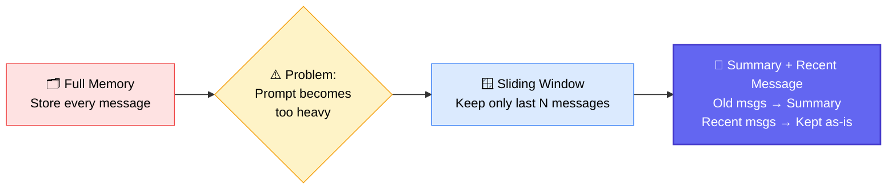
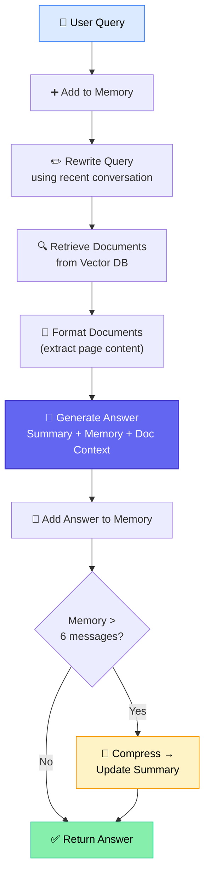
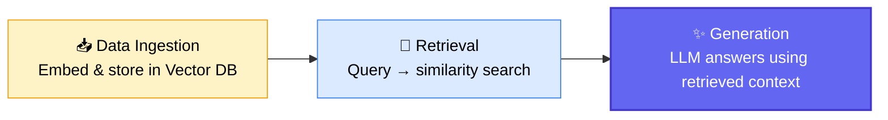
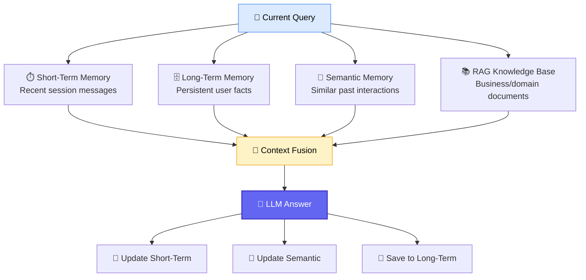
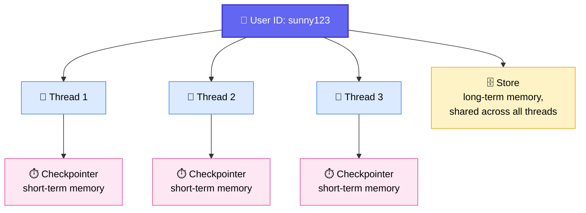

# 🧠 Memory Management Deep-Dive: RAG + LangGraph

## 🧭 Where This Class Fits

The batch has completed **~50 sessions** so far. Memory management is one of the last concepts before the module wraps up — after this, the class moves to **Human-in-the-Loop**, **Subgraphs**, **Multi-Agent flows**, and then straight into the **end-to-end capstone project**.

> 💡 **Target:** 95–99% of the syllabus completed by end of October / first week of November, after which the entire next month is dedicated to building and deploying the end-to-end project.

---

## 🔁 Quick Recap: The Evolution of Memory Management

Full memory works but bloats the prompt as conversations grow — risking hallucination and token-limit errors. The fix: keep the **last 6 messages verbatim** (configurable) and **summarize everything older**, regenerating the summary each time using _(previous summary + older messages)_.

### 📊 How the Hybrid Memory Table Works (max recent = 6)

| Turn | New Messages                 | Recent Memory Window | Covered by Summary | Full History Count |
| ---- | ---------------------------- | -------------------- | ------------------ | ------------------ |
| 1    | Name introduction            | M1–M2                | — (empty)          | 2                  |
| 2    | Lives in Bangalore           | M1–M4                | — (empty)          | 4                  |
| 3    | Learning LangGraph           | M1–M6                | — (empty)          | 6                  |
| 4    | Building agentic RAG project | M3–M8                | M1–M2              | 8                  |
| 5    | Preferred language: Python   | M5–M10               | M1–M4              | 10                 |
| 6    | Next question pair           | M7–M12               | M1–M6              | 12                 |
| 7    | Next question pair           | M9–M14               | M1–M8              | 14                 |
| 8    | Final pair                   | M11–M16              | M1–M10             | 16                 |

✅ Until the window fills up (first 6 messages), there's **no summary at all** — everything lives in the recent-memory window.
✅ Once the window is full, the **oldest overflow messages** get folded into a running summary.
✅ **Full history** is kept only for our own visibility/debugging — it is _never_ sent to the LLM.

---

## 🏗️ Building Memory Into a RAG System

### Two implementations were walked through, in increasing order of production-readiness:

### 🧩 Class Structure (OOP Version — Production-Style)

| Method                                       | Belongs To           | Purpose                                                                         |
| -------------------------------------------- | -------------------- | ------------------------------------------------------------------------------- |
| `add_user_message` / `add_assistant_message` | `ConversationMemory` | Appends each turn to memory + full history                                      |
| `compress_memory`                            | `ConversationMemory` | Once memory exceeds 6 messages, older ones get summarized                       |
| `create_summary`                             | `ConversationMemory` | Regenerates summary from _(previous summary + old messages)_                    |
| `get_recent_conversation`                    | `ConversationMemory` | Returns the last-6-message window                                               |
| `query_rewrite`                              | `RAGAssistant`       | Turns a follow-up question into a standalone search query, using recent history |
| `retrieve`                                   | `RAGAssistant`       | Fetches top-K relevant chunks from the vector store                             |
| `format_document`                            | `RAGAssistant`       | Cleans retrieved `Document` objects down to plain text                          |
| `generate_answer`                            | `RAGAssistant`       | Combines summary + memory + document context → final LLM response               |
| `chat`                                       | `RAGAssistant`       | Orchestrates the full turn end-to-end                                           |

> ⚠️ **Live-debugging note:** While walking through the code, a missing `user_query` variable was spotted in the final message payload (it was captured but never passed to the model) — fixed live on stream as a good example of real debugging.

### 🗺️ RAG Pipeline Refresher (Blackboard Recap)

Memory management simply layers on top of this: instead of passing the **full history** to the LLM at the generation stage, we pass **recent messages + a running summary**.

---

## 📝 Assignment 6: Memory-Augmented RAG

A production-inspired assignment, adapted directly from one of Sunny's real client implementations.

### 💾 Recommended Databases per Memory Type

| Memory Type                     | What It Stores                                 | Suggested Database         |
| ------------------------------- | ---------------------------------------------- | -------------------------- |
| ⏱️ Short-term                   | Recent chat messages (current session)         | Redis / DynamoDB / MongoDB |
| 🗄️ Long-term                    | User facts, preferences, profile decisions     | PostgreSQL                 |
| 🧭 Semantic                     | Relevant past interactions (similarity search) | PG Vector                  |
| 📚 RAG Knowledge Base           | Business/domain documents                      | PG Vector                  |
| 🧾 Conversation History / Audit | Full chat logs                                 | PostgreSQL                 |

✅ Boilerplate scaffolding was already provided on GitHub: `config.py`, `main.py`, `knowledge_base.py`, `llm_service.py`, `long_term_memory.py`, `rag_service.py`, `semantic_memory.py`, `short_term_memory.py` — **students just need to wire in the actual databases.**

> 💡 **Suggested approach:** Start with plain Python to _see_ exactly how history gets trimmed, summarized, and retrieved — then move to LangGraph once you need agentic, production-scale orchestration (checkpointers, thread IDs, etc.).

⏳ **Timeline:** ~1 week to complete. No cloud deployment required for this assignment.

---

## 🧵 LangGraph Memory: Short-Term vs. Long-Term

The mental model used a "ChatGPT sidebar" analogy: one **user ID** can own many **threads** (new chats), and each thread holds its own conversation.

|               | ⏱️ Short-Term (Checkpointer)                                   | 🗄️ Long-Term (Store)                                                                              |
| ------------- | -------------------------------------------------------------- | ------------------------------------------------------------------------------------------------- |
| Scope         | **One specific thread**                                        | **Across all threads** for a user                                                                 |
| Example       | Chat says "my name is Sunny" — remembered _within that thread_ | Ask in a _brand-new_ thread — still answered correctly, because it pulls from the long-term store |
| In this class | `InMemorySaver` (or `SqliteSaver`)                             | `InMemoryStore` (or custom `SQLiteLongTermMemory`)                                                |

### 🧰 LangMem Module

`LangMem` (a LangChain-created module) ships a ready-made class for long-term memory handling:

- **`create_memory_store_manager`** — takes a model, a `user_id`, and an instruction (e.g., _"extract user preferences, personal facts, goals, projects — ignore greetings/small talk"_).
- Uses a **namespace** (essentially the user ID) to organize stored memories.
- On each turn: `store.search()` pulls relevant memories for that user → fed into the system prompt → `memory_manager.invoke()` saves new memories after the response.

> 🆚 **Contrast with the earlier RAG example:** the RAG memory classes were built **from scratch**; LangGraph's long-term memory here is **imported and reused** from LangMem — a good illustration of "build to understand, then use the framework in production."

### 💾 Persisting Memory with SQLite

- **Short-term:** swap `InMemorySaver` for a `SqliteSaver` connected via `sqlite3.connect("checkpoint.db", check_same_thread=False)`.
- **Long-term:** a custom `SQLiteLongTermMemory` class creates its own table and stores extracted facts.
- A **Pydantic schema** (`Memory` model with a `memories: List[str]`) validates what gets extracted from each user message via `model.with_structured_output()`.
- The final graph is identical in shape to before: `chatbot → save_memory → END`, compiled `with_checkpointer` + `store`.

Testing across threads confirmed the behavior: same thread → recalls short-term details instantly; new thread, same user → still recalls long-term facts; different user ID → correctly does **not** leak another user's data.

---

## 📅 Schedule & What's Coming Next

| Class           | Date            | Topic                                                                                 |
| --------------- | --------------- | ------------------------------------------------------------------------------------- |
| ✅ This session | Current         | Memory Management: RAG (scratch + OOP) + LangGraph (short/long-term, LangMem, SQLite) |
| Class 46        | 13 Sept 2026    | Subgraphs + Workflow Orchestrator                                                     |
| Class 47        | 19–20 Sept 2026 | Multi-Agentic Flow                                                                    |

---

## ❓ Live Doubt Session Highlights

| Who          | Question                                                                            | Sunny's Answer                                                                                                                                                        |
| ------------ | ----------------------------------------------------------------------------------- | --------------------------------------------------------------------------------------------------------------------------------------------------------------------- |
| Vikas Verma  | For the RAG assignment, do I just swap the PDF path and reuse the same code?        | Yes — plus whatever extra modifications are specified in the assignment brief itself                                                                                  |
| Vikas Verma  | My local model takes 1–2 minutes to respond — is that normal?                       | No — switch to a cloud-hosted model via Groq API; latency should drop to seconds. First debug the retrieval step in isolation                                         |
| Bala         | How do memory limits (e.g., `limit=5`) scale to millions of messages in production? | At scale, a dedicated analytics team studies usage patterns to tune limits/summarization — you build custom logic rather than relying solely on framework defaults    |
| Bala         | Difference between conversation ID and thread ID?                                   | In this LangGraph setup they're treated as equivalent — one thread = one conversation                                                                                 |
| Bala         | Any free/open-source alternatives to paid coding agents (Claude Code, Copilot)?     | Worth exploring open-source CLI agents like OpenCode; most fully-capable options remain paid                                                                          |
| Sushmit      | How much coding depth is expected in GenAI/Agentic interviews?                      | Strong Python fundamentals (OOP, data structures, REST/async) are enough for most companies; competitive-programming depth is mainly expected at FAANG-tier companies |
| Sushmit      | Is GCP-only cloud experience enough if I've mostly worked with GCP?                 | Depends entirely on the interviewer — some accept one cloud plus willingness to learn, others want an exact match. Prepare based on the job description               |
| Amol         | Do I need both LangChain and LangGraph, or is LangGraph alone enough?               | Learn both — LangGraph handles agentic/looping workflows; LangChain still covers many integrations, and its patterns are useful for learning memory concepts          |
| Manish       | How is LLM context/memory managed for multiple clients in production?               | It's a full systems-design problem: per-client IDs, tiered storage (hot vs. cold), and a proper data pipeline — not something a single notebook solves                |
| Veerasekhar  | LangChain's `createAgent` vs. LangGraph — why use LangGraph?                        | `createAgent` is a single convenience method with little control; LangGraph gives full custom control over the agent's flow                                           |
| Veerasekhar  | Is Mem0 meant for the same memory purpose?                                          | Yes, conceptually similar — Sunny will explore it further, possibly turning it into a future assignment                                                               |
| Vikas Panwar | How do I secure sensitive local data (sign-in info) in an offline app?              | Explore **bcrypt** for password hashing, **SQLCipher** for encrypted SQLite, and disk-level encryption (**FileVault** / **BitLocker**)                                |

---

## ✅ Action Items for Learners

- [ ] 📥 Pull the latest code from the **Class 45** GitHub folder
- [ ] 🧩 Complete **Assignment 6: Memory-Augmented RAG** (short-term + long-term + semantic + RAG knowledge base)
- [ ] 🔍 Re-run and trace through the OOP-based `ConversationMemory` + `RAGAssistant` classes end-to-end
- [ ] ⚡ Try swapping in an open-source or Groq-hosted model to compare latency against a local model
- [ ] 📖 Review episodic vs. procedural memory ahead of the next session's clarification
- [ ] 🧠 Explore the Mem0 framework as a comparison point
- [ ] 🗓️ Block **Class 46 (Subgraphs & Workflow Orchestrator)** and **Class 47 (Multi-Agentic Flow)** on your calendar

---

_📝 Notes compiled from the full class transcript — Memory Management in RAG & LangGraph, Krish Naik Academy._
