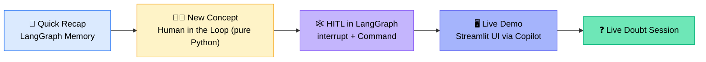
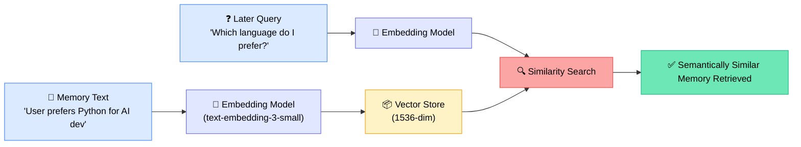
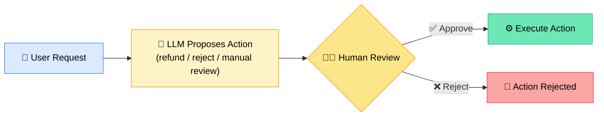
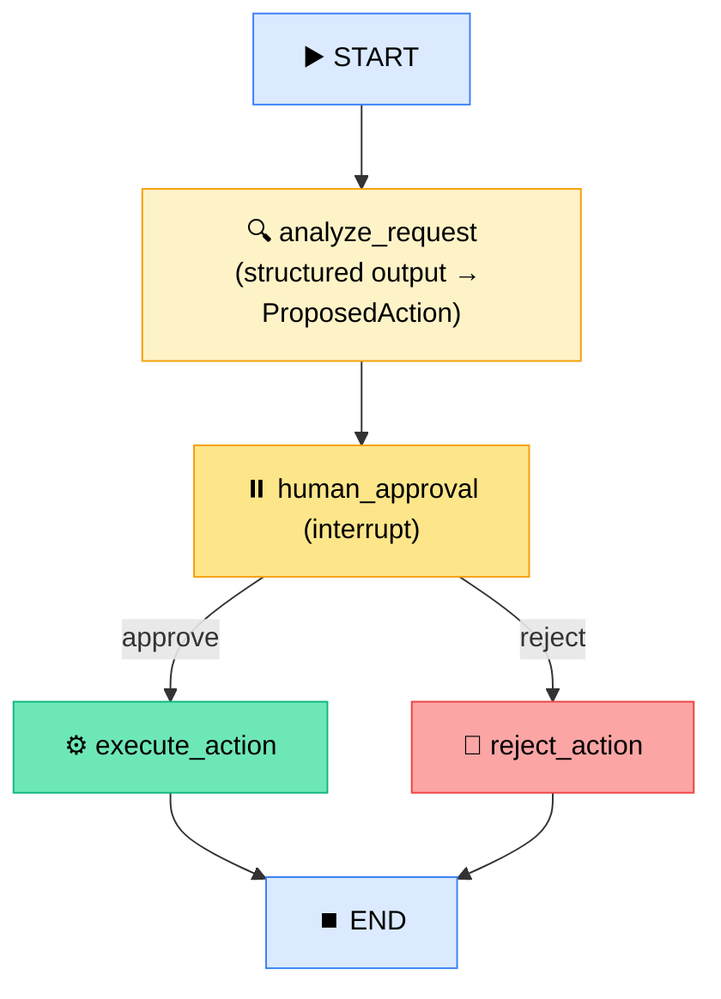
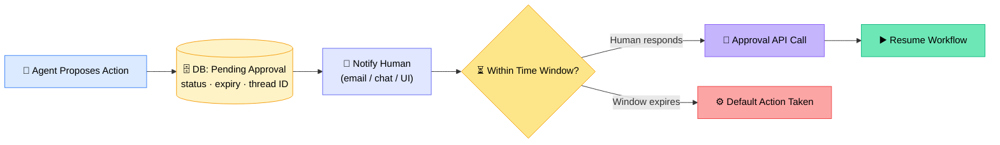

# 🧠 LangGraph Memory & Human-in-the-Loop (HITL)

## 🧭 Session Roadmap

---

## 🔁 Quick Recap — LangGraph Memory Management

Two working notebooks were pushed to GitHub as reference material:

- **`memory_management.ipynb`** — built entirely on LangGraph's `langmem` module
- **`Memory Management LangGraph Raw`** — the same concepts hand-coded from scratch (custom SQLite tables), for anyone who wants to see "under the hood"

|                | ⏱️ Short-Term Memory                                    | 🗄️ Long-Term Memory                              |
| -------------- | ------------------------------------------------------- | ------------------------------------------------ |
| Also known as  | **Checkpointing**                                       | Persistent / cross-session memory                |
| Scope          | One thread, current run                                 | Across threads, across a user's history          |
| Backed by      | `InMemorySaver` (or SQLite/Postgres checkpointer)       | `InMemoryStore` (or a custom SQLite/vector DB)   |
| Identified by  | Thread ID                                               | User ID                                          |
| Stores         | Snapshot of state as it flows through nodes _right now_ | Durable facts/preferences learned about the user |
| Production tip | Swap in PostgreSQL checkpointer                         | PostgreSQL or a vector DB for semantic recall    |

### 📦 How Semantic Memory Retrieval Works

### 🛠️ `create_memory_store_manager()` Parameters

| Parameter     | What it controls                                                                                              |
| ------------- | ------------------------------------------------------------------------------------------------------------- |
| `model`       | Which LLM decides what's worth remembering                                                                    |
| `namespace`   | A logical path (e.g. `(user_id, "memories")`) that groups and **isolates** one user's memories from another's |
| `instruction` | Explicit rules telling the LLM what to store vs. what to ignore                                               |

> 💡 A different user always gets a different namespace — memories never bleed across users.

---

## 🧑‍⚖️ New Concept: Human in the Loop (HITL)

> _"The LLM is allowed to propose a decision, but it is not allowed to directly execute the action. The workflow pauses for human approval — only after approval does the application execute it."_ — Sunny

**Everyday parallel used in class:** Copilot / Claude Code always asks _"Approve / Reject"_ before editing your files — that's HITL in action.

---

### 🏗️ Step 1 — HITL from Scratch (Pure Python, No Framework)

- A Pydantic `ProposedAction` class captures `action`, `customer`, `amount`, `reason`
- `ai_assistant()` sends the user request to a structured-output model
- `human_review()` prints the proposal and waits for `yes/no` input
- `execute_action()` runs (or skips) the refund based on the decision

**Live test cases run in class:**

| Customer Message                                                 | Model's Proposed Action | Human Decision | Outcome            |
| ---------------------------------------------------------------- | ----------------------- | -------------- | ------------------ |
| "Product received as damaged, refund my money"                   | Refund                  | ✅ Approved    | Refund processed   |
| "I'm not happy with the product, guide me on refund"             | Manual review           | ❌ Rejected    | Action rejected    |
| "Charged twice for the same order, refund the duplicate payment" | Refund                  | ✅ Approved    | Refund processed   |
| "₹5,000 refund, purchase made 8 months ago — outside policy"     | Reject                  | ❌ Rejected    | Action rejected    |
| "$75,000 refund claimed, but insufficient proof of defect"       | Manual review           | —              | Flagged for human  |
| "Order canceled before shipment, payment already deducted"       | Refund                  | —              | Falls under refund |

---

### 🕸️ Step 2 — The Same Logic, Rebuilt in LangGraph

New primitives introduced: **`interrupt`** (pauses the graph and surfaces data to the human) and **`Command`** (resumes the graph with the human's input).

- `AgentState` carries `user_request`, `action`, `customer`, `amount`, `reason`, `approve`, `final_message` across nodes
- `approval_router()` reads `state.approve` and routes to `execute` or `reject`
- Graph compiled with `InMemorySaver` as checkpointer so it can genuinely **pause and resume** mid-run
- Demo: `graph.invoke()` hits the interrupt → prints the proposed refund → `Command(resume="yes")` resumes and completes it

---

### 🖥️ Step 3 — Live Demo: Streamlit UI Built via Codex/Copilot

Sunny prompted a coding agent with a single instruction to generate a full Streamlit front end (`app.py`) and a clean backend (`HITL.py`) inside a new folder — the agent handled file structure, `requirements.txt`, and `.env` scaffolding automatically.

- Resulting UI shows the AI's proposed action with **Approve / Reject** buttons
- The LangGraph checkpoint stays paused until a choice is made
- Modifications (custom prompts, stricter rules, tool-based actions) can be layered on top easily

> 💡 _"Use co-pilot if you're doing any sort of coding or trying to understand anything — earlier, developers put in so much effort to write this kind of code."_ — Sunny

---

## 🔔 Async Approval Pattern (from the Q&A)

For real-world deployments where human approval may take minutes, hours, or even days:

The key principle: **don't keep an HTTP request open**. Save workflow state to a database, close the request, and resume via an API event when the human responds. The approval window can be 15 minutes or 15 days — it's just a field in the record.

---

## ❓ Live Doubt Session Highlights

| Question                                                                                                 | Answer                                                                                                                                                                                                                                                                                                                                 |
| -------------------------------------------------------------------------------------------------------- | -------------------------------------------------------------------------------------------------------------------------------------------------------------------------------------------------------------------------------------------------------------------------------------------------------------------------------------- |
| How do you handle approvals that may take **days** without a listener running 24/7? _(Sandeep)_          | Persist the pending-approval record in a DB (approval ID, user ID, thread, status, created/expiry time). When the human responds via an approval API call, look up the record, verify it's within the time window, and resume the workflow. If the window lapses, trigger a configured default action — no continuous listener needed. |
| Why is LLM memory/context so expensive? _(Sandeep)_                                                      | The dominant cost isn't data storage — it's **GPU inferencing** at scale. Storing conversation/context data is comparatively cheap; running and scaling GPU fleets globally is the real cost driver for platforms like ChatGPT.                                                                                                        |
| Should the chat stay open while waiting on human approval? _(Arti)_                                      | No. Save the workflow state, return a response, and close the HTTP request. When the human later approves or rejects, an API call reloads the saved state and resumes execution. The UI stays visible to the user, but the backend request doesn't hang open.                                                                          |
| How do you manage HITL across many simultaneous chats? _(Arti)_                                          | Most conversational turns don't need HITL. Only specifically flagged cases (e.g., a refund/return request) are routed to a human. The system should categorize each case and surface an approval prompt only for that case, not globally.                                                                                              |
| When exactly should you insert a human in the loop? _(GRM)_                                              | Low model confidence, high-risk/irreversible actions (deleting data, touching production), legal/compliance-sensitive cases, ambiguous requests, and sensitive domains like medical decisions. Many teams compute a **risk or compliance score** and route to a human above a set threshold.                                           |
| Can you expose Workday operations as an MCP server if Workday hasn't shipped an official MCP? _(Sushil)_ | Yes — download and parse the Workday WSDL, build the underlying SOAP requests and handle auth yourself inside a custom MCP server, then expose selected operations as MCP tools (HR tool, recruiting tool, finance tool, etc.), changing transport from stdio to HTTP as needed.                                                       |

---

## 📅 Upcoming Schedule

| Dates              | Focus                                                                      |
| ------------------ | -------------------------------------------------------------------------- |
| 19–20 Sept         | Remaining LangGraph topics: **orchestrators, subgraphs, multi-agent flow** |
| 26–27 Sept         | Close out any leftover LangGraph material                                  |
| Through ~11 Oct    | **MCP, guardrails, evaluation strategy**                                   |
| After 11 Oct       | Use cases, then straight into the 3 end-to-end capstone projects           |
| By end of November | All 3 projects complete, including deployment                              |

---

## 📦 Resources Shared This Session

All files pushed to the batch GitHub repo. Check GitHub for the latest commit.

- `memorymanagement.ipynb` — LangMem-based memory notebook
- `Memory Management LangGraph Raw` — same concepts, hand-coded (custom SQLite)
- `human_in_loop.ipynb` — HITL from scratch + LangGraph version
- `app.py` + `HITL.py` — Streamlit demo UI generated live via Codex

---

## ✅ Action Items for Learners

- [ ] 📓 Go through both memory notebooks (LangMem + Raw) before next class
- [ ] 🧑‍⚖️ Review the HITL notebook — both the from-scratch and LangGraph versions
- [ ] 🖥️ Try running the Streamlit HITL demo (`app.py`) locally
- [ ] 🧠 Think through where _your_ project needs a human in the loop (risk scoring, approval windows, async resumption)
- [ ] ❓ Come with doubts cleared — next class jumps into orchestrators, subgraphs, and multi-agent flow

---

_📝 Notes compiled from the full session transcript — LangGraph Memory & Human-in-the-Loop, Krish Naik Academy Agentic AI batch._
