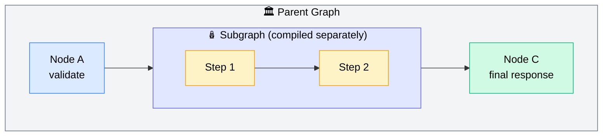
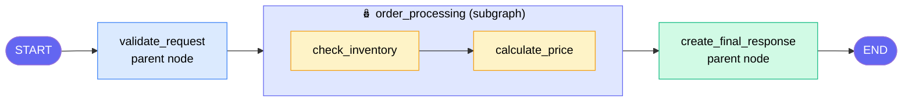
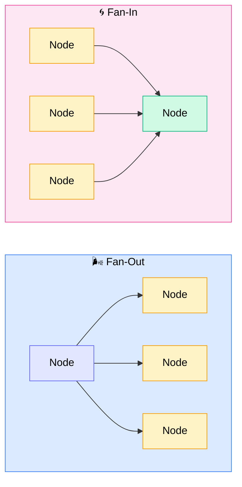
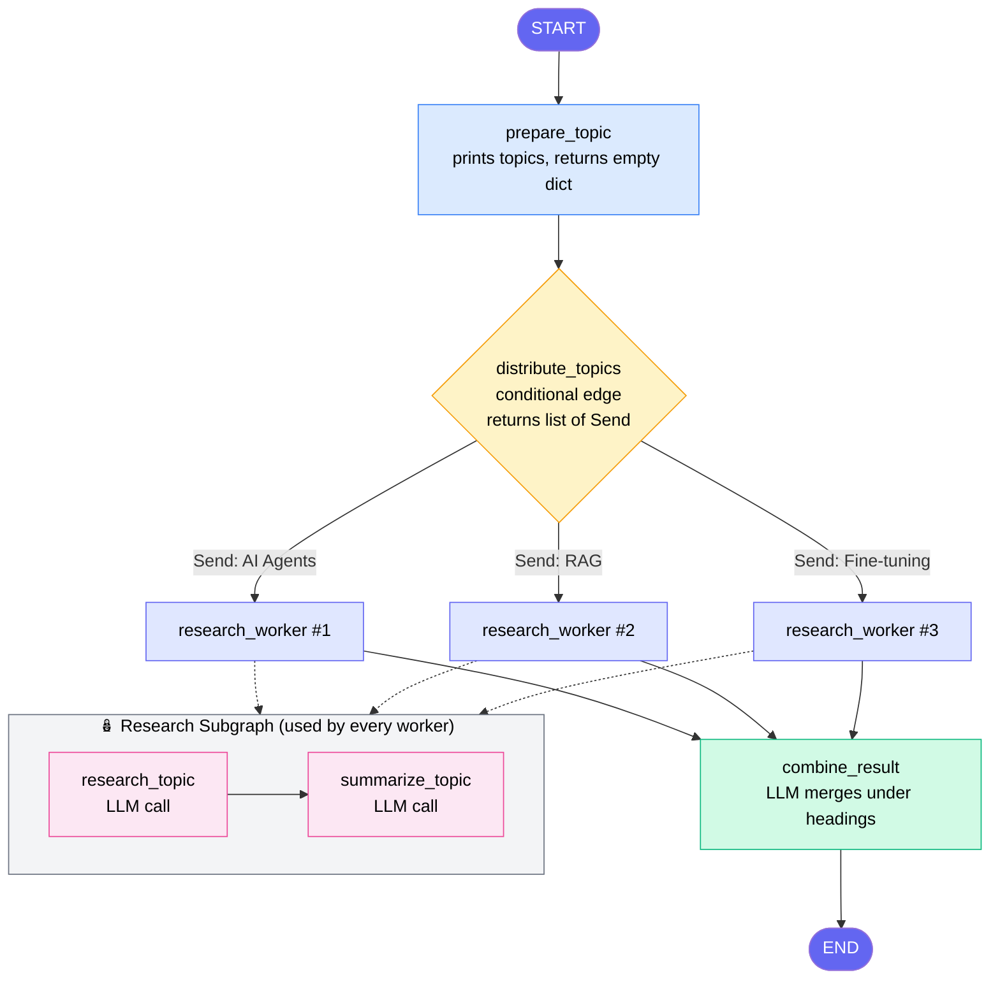
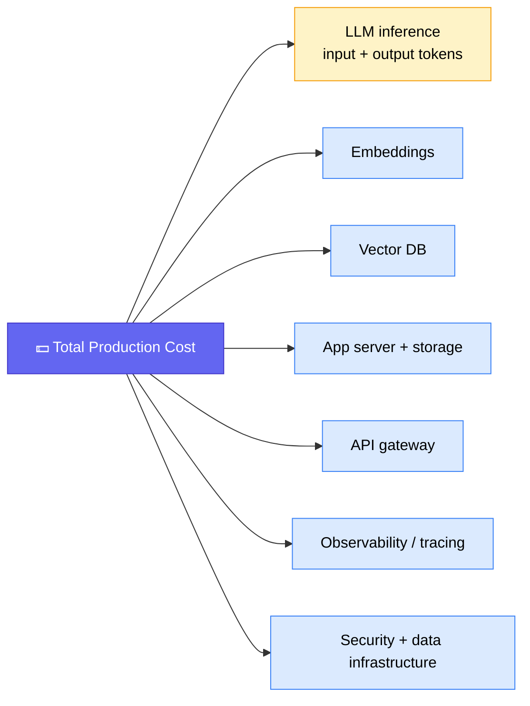

# 🧩 LangGraph: Subgraphs, Send API & Workflow Orchestrators

---

## 🧭 Where This Session Fits

Earlier sessions covered the LangGraph basics: state, nodes and edges, memory, human-in-the-loop, and the `interrupt` API. This session adds **two more building blocks: subgraphs and the `Send` API**. It closes with a **revision of all six workflow orchestrators** in LangGraph.

```mermaid
flowchart LR
    A["✅ Done<br/>State, Nodes, Edges,<br/>Memory, Human-in-Loop"] --> B["🎯 Today<br/>Subgraphs + Send API<br/>+ Orchestrator Revision"]
    B --> C["⏭️ Next Class<br/>Multi-Agentic Flow<br/>+ Command API"]
    C --> D["🔌 MCP + A2A"]
    D --> E["🛡️ Guardrails"]
    E --> F["📊 Evaluation<br/>DeepEval / RAGAS"]
    F --> G["🏗️ End-to-End Projects<br/>+ Cloud Deployment"]

    style A fill:#d1fae5,stroke:#10b981,color:#000
    style B fill:#6366f1,color:#fff,stroke:#4338ca,stroke-width:2px
    style C fill:#dbeafe,stroke:#3b82f6,color:#000
    style D fill:#e0e7ff,stroke:#6366f1,color:#000
    style E fill:#fef3c7,stroke:#f59e0b,color:#000
    style F fill:#fce7f3,stroke:#ec4899,color:#000
    style G fill:#d1fae5,stroke:#10b981,color:#000
```

> 💡 **How to study:** every notebook has the theory and explanations written inside it. Sunny suggests feeding the notebook to Claude or ChatGPT for revision, or reading it standalone before an interview.

---

## 🗂️ Housekeeping Announcements

| Topic                        | Update                                                                                                                                                                                                                                                           |
| ---------------------------- | ---------------------------------------------------------------------------------------------------------------------------------------------------------------------------------------------------------------------------------------------------------------- |
| 📁 GitHub folders            | Lecture folders were renamed to match their topics (e.g. _Human in Loop_, _Subgraph & Workflow Orchestrators_, _Multi-Agentic Flow_). **Follow the GitHub folder names, not the class titles.** Class titles on the dashboard will be corrected within 1–2 days. |
| 📼 Recordings                | Up to date (last session before this one was 13 September).                                                                                                                                                                                                      |
| 📝 Assignment 6              | On GitHub. It has boilerplate **memory** code that you enhance.                                                                                                                                                                                                  |
| 📌 Prerequisite              | Finish the **RAG + Agentic** sessions before starting the projects.                                                                                                                                                                                              |
| 💼 Job openings              | If your company has openings, post them in the community group.                                                                                                                                                                                                  |
| 🧾 Multimodal RAG assignment | Practice is fine. To submit, use the Google Form (Sunny will re-share it).                                                                                                                                                                                       |
| ☁️ Azure                     | A deployment-on-Azure session is possible.                                                                                                                                                                                                                       |

---

## 🧱 Core Concept Refresher: Graph, Node, Edge

- 🔵 **Graph** = a collection of **nodes** and **edges**. In short, a workflow.
- ⚙️ **Node** = a _functionality_, i.e. a plain Python function that takes state and returns state updates.
- ➡️ **Edge** = the _connectivity_ between nodes.
- 🧠 **State** = the data flowing through every node. Sunny also calls it the "session".

> 🎯 Agentic AI is built using this graph concept. Any workflow you design is nodes and edges with shared state.

---

## 🪆 What Is a Subgraph?

A **subgraph is a complete graph that is used as a node inside another (parent) graph.**

**Key rules from Q&A:**

- ✅ **State is shared** between parent and subgraph. Examples are built around a shared state.
- ✅ A subgraph is **compiled separately**, then added as a node of the parent.
- ✅ A graph that contains subgraphs is itself a parent. It can in turn be a "sub-parent" of a bigger graph.
- ✅ Subgraphs can use their **own state schema**, but **keep the same key names** as the parent for anything you want to inherit, or it may break.

### 🔍 Subgraph vs Single Function

|                 | 🧪 Single function/node    | 🪆 Subgraph                                                    |
| --------------- | -------------------------- | -------------------------------------------------------------- |
| **Use when**    | Functionality is simple    | Functionality is **complex** and needs several steps           |
| **Structure**   | Everything in one function | Broken into multiple nodes, compiled as its own graph          |
| **Maintenance** | Gets messy at scale        | Each process is **isolated** and easy to find and edit         |
| **Parallelism** | N/A                        | Independent subgraphs can be run in parallel                   |
| **Analogy**     | One script                 | Similar to **microservices** (Sunny notes the context differs) |

> ⚖️ **When to create one?** There is no fixed rule. It depends on engineering judgement. For a small example a subgraph isn't needed. In a large system with many processes, delegating each process to its own subgraph keeps the final graph simple.

### 🏭 Real-World Example Shared by Sunny

Sunny built a **pharma manufacturing-setup assessment workflow**. The setup had installation, material and packaging areas, each with its own documents to validate. He made **one subgraph per document/functionality** and ingested them all into a final workflow. To change the installation assessment later, he only had to touch that one subgraph.

---

## 📦 Demo 1: Inventory Management with a Subgraph

**State (schema):** `product`, `quantity`, `inventory_status`, `total_price`, `final_response`
**"Database":** a simple dictionary (product catalog with stock and unit price). In production this comes from a real database.

| Component                             | What it does                                                                                           |
| ------------------------------------- | ------------------------------------------------------------------------------------------------------ |
| 🔎 `check_inventory` _(subgraph)_     | Looks up the product and compares stock ≥ quantity, then sets status to _available_ or _not available_ |
| 💰 `calculate_price` _(subgraph)_     | Returns price 0 if unavailable. Otherwise `unit_price × quantity`                                      |
| ✅ `validate_request` _(parent)_      | Raises an error for an **unknown product** or a **quantity ≤ 0**                                       |
| 📝 `create_final_response` _(parent)_ | Builds the "order placed" or "order not placed" message                                                |

### 🧪 Test Runs

| Input         | Result                                                     |
| ------------- | ---------------------------------------------------------- |
| Keyboard × 2  | ✅ Order placed, total ₹1000                               |
| Keyboard × 50 | ⚠️ Status unavailable, price 0, "order not placed"         |
| Monitor × 5   | ❌ Error: _unknown product_ (raised in `validate_request`) |

> 🔬 **Debug tip:** Sunny wrote a helper that prints the "X-ray" view of the graph, including the subgraph's internal nodes. This is useful for understanding large graphs (in LangGraph this is what `get_graph(xray=True)` gives you).

---

## 🌬️ Fan-Out, Fan-In & the `Send` API

- 🌬️ **Fan-out** = one node sends work to _many_ nodes in parallel. The name comes from a ceiling fan blowing air outward.
- 🌀 **Fan-in** = many nodes feed _one_ node.
- 📨 **`Send` API** = LangGraph's way to dispatch parallel requests **dynamically at runtime** to a node or subgraph, with a different input for each.

### ❓ Why not just wire the edges manually?

> If you build a research app and **100–200 topics arrive at runtime**, you can't know the number in advance, so you can't draw a static graph for it. `Send` handles a dynamic number of parallel branches.

**Requirement:** parallel branches must be **independent** of each other.

---

## 🔬 Demo 2: Parallel Research with Send + Subgraph

### 🔧 How It Works, Step by Step

1. **Parent state** holds `topics`, `research results` (a list) and `final_answer`.
2. `prepare_topic` receives the topics and just logs them.
3. `distribute_topics` iterates over the topics and returns one `Send("research_worker", {"topic": t})` per topic. It is attached via a **conditional edge**.
4. Each `research_worker` calls the **research subgraph** with its own topic (**3 parallel threads for 3 topics**).
5. Every worker's result is collected back into the parent state.
6. `combine_result` prompts the LLM to merge the summaries into one explanation with **each topic under its own heading**.

### 🎛️ Execution Details Clarified in Q&A

- 🔀 **Order isn't fixed.** Which topic runs first is decided dynamically, so don't rely on ordering.
- 📤 A **list is not mandatory** when returning from the distributor. A single `Send` also works.
- 🔑 The conditional edge decides where execution goes next. The distributor's output determines which workers run, and afterwards flow continues to `combine_result`.
- ⚡ Tested with topics like _AI agents / RAG / fine-tuning_ and _American dollar / Indian rupee / Kuwaiti dinar_. All three came back very fast because they ran in parallel.
- 🌐 The demo uses **LLM knowledge only**, with no real-time data. Connecting a search tool would bring in live data.
- 🦙 You can use **Ollama** instead of OpenAI.

### ⚠️ Common Pitfall

> Key names must match between parent and child state. If the parent defines `topic`, use the same `topic` key in the worker/child state, otherwise it may break.

---

## 🗺️ The Six LangGraph Workflow Orchestrators (Revision)

| #   | Pattern                          | Idea                                                 | Status             |
| --- | -------------------------------- | ---------------------------------------------------- | ------------------ |
| 1   | ➡️ **Sequential**                | Nodes run in a fixed order                           | Covered earlier    |
| 2   | 🌬️ **Parallelization**           | Fan-out / fan-in, manually wired                     | Covered earlier    |
| 3   | 🔀 **Conditional Routing**       | Logic picks one dynamic branch (conditional edge)    | ✅ Covered         |
| 4   | 🧑‍🔧 **Orchestrator–Worker**       | Orchestrator dynamically fans out workers via `Send` | ✅ Covered today   |
| 5   | 🔁 **Evaluator–Optimizer**       | Generate → evaluate → feedback loop                  | To revisit         |
| 6   | 🤖 **Agent (Tool-Calling) Loop** | LLM has tools bound and decides which to call        | ✅ Covered earlier |

```mermaid
flowchart TD
    subgraph P1["1️⃣ Sequential"]
        direction LR
        a1["N1"] --> a2["N2"] --> a3["N3"] --> a4["N4"]
    end
    subgraph P3["3️⃣ Conditional Routing"]
        direction LR
        c0["Node"] -->|"if X"| c1["Path A"]
        c0 -->|"else"| c2["Path B"]
    end
    subgraph P5["5️⃣ Evaluator-Optimizer"]
        direction LR
        e0["Generator"] --> e1{"Evaluator"}
        e1 -->|"accept"| e2["Output"]
        e1 -->|"feedback + improve"| e0
    end
    subgraph P6["6️⃣ Agent Loop"]
        direction LR
        g0["LLM<br/>tools bound"] -->|"tool call"| g1["Tool"]
        g1 --> g0
        g0 -->|"final answer"| g2["Done"]
    end

    style P1 fill:#dbeafe,stroke:#3b82f6,color:#000
    style P3 fill:#fef3c7,stroke:#f59e0b,color:#000
    style P5 fill:#fce7f3,stroke:#ec4899,color:#000
    style P6 fill:#d1fae5,stroke:#10b981,color:#000
    style a1 fill:#fff,stroke:#3b82f6,color:#000
    style a2 fill:#fff,stroke:#3b82f6,color:#000
    style a3 fill:#fff,stroke:#3b82f6,color:#000
    style a4 fill:#fff,stroke:#3b82f6,color:#000
    style c0 fill:#fff,stroke:#f59e0b,color:#000
    style c1 fill:#fff,stroke:#f59e0b,color:#000
    style c2 fill:#fff,stroke:#f59e0b,color:#000
    style e0 fill:#fff,stroke:#ec4899,color:#000
    style e1 fill:#fff,stroke:#ec4899,color:#000
    style e2 fill:#fff,stroke:#ec4899,color:#000
    style g0 fill:#fff,stroke:#10b981,color:#000
    style g1 fill:#fff,stroke:#10b981,color:#000
    style g2 fill:#fff,stroke:#10b981,color:#000
```

**Details worth remembering:**

- 🧑‍🔧 **Orchestrator–Worker:** a worker can be a _node_ or a _subgraph_. It is connected to the orchestrator through a **conditional edge**, and requests are dispatched via `Send`.
- 🔁 **Evaluator–Optimizer:** the loop usually has an attempt cap (e.g. 3 attempts, or any limit you choose).
- 🤖 **Agent loop:** the tool is bound **to the model**, not to the workflow. The model itself decides which tool to call (a "model → control → tool loop").
- 🧬 **ReAct-style agents** belong to the **agent/tool-calling pattern**, not the evaluator pattern.
- 🎲 **Determinism:** sequential chains are deterministic. Conditional routing, `Send` and tool-calling loops are dynamic.

### 🧰 LangGraph APIs Seen So Far

| API                        | Purpose                                 |
| -------------------------- | --------------------------------------- |
| `StateGraph`               | Build the graph (nodes, edges, compile) |
| Message/state APIs & edges | Passing state and connecting nodes      |
| `interrupt`                | Human-in-the-loop                       |
| **`Send`** _(today)_       | Dynamic parallel execution / fan-out    |
| `Command` _(upcoming)_     | Used in **multi-agent** systems         |

---

## 🛣️ Upcoming Roadmap (per Sunny)

| Order | Topic                      | Notes                                                                                           |
| ----- | -------------------------- | ----------------------------------------------------------------------------------------------- |
| 1️⃣    | 🤝 **Multi-Agentic Flow**  | Next class, plus an orchestrator/worker example (~30–60 min)                                    |
| 2️⃣    | 🔌 **MCP** (+ **A2A**)     | Multiple hands-on examples                                                                      |
| 3️⃣    | 🛡️ **Guardrails**          | How to add guardrails                                                                           |
| 4️⃣    | 📊 **Evaluation**          | Starts around 3 October. Frameworks like **DeepEval** and **RAGAS** (the ones used in industry) |
| 5️⃣    | 🏗️ **End-to-End Projects** | Agentic RAG etc. Cloud and deployment taught **inside** these projects. Expect **~1 month**     |
| 6️⃣    | 🧰 **Off-track topics**    | **n8n** and **Claude Code** (no-code/AI-tool topics) come after the syllabus                    |

> ⚠️ _The class numbers and dates (class 49–51, 26–27 Sept, 3 Oct) were spoken ad hoc and are unclear in the transcript. Please confirm against the official schedule._

**📚 Extra material promised:** comparative notes on how the same systems are built in **CrewAI, AutoGen** and similar frameworks, given as self-study (not taught live).

---

## ❓ Live Doubt Session Highlights

| Question                                                                                      | Answer                                                                                                                                                                                                                                                                                                                                    |
| --------------------------------------------------------------------------------------------- | ----------------------------------------------------------------------------------------------------------------------------------------------------------------------------------------------------------------------------------------------------------------------------------------------------------------------------------------- |
| Do I have to submit the multimodal RAG assignment? Which PDFs?                                | Practice is fine. Submit via Google Form if you like. Use the PDF from class (with images, graphs, tables) or any similar PDF from the internet.                                                                                                                                                                                          |
| Is using ChatGPT/LLMs to write assignment code okay?                                          | Yes. Sunny says this is a **common, accepted practice** today.                                                                                                                                                                                                                                                                            |
| How long will the project phase run?                                                          | Plan for **at least one month**.                                                                                                                                                                                                                                                                                                          |
| A 10-step graph fails at step 3 (outage/AZ failure). Can the remaining 7 steps run elsewhere? | Yes. Use a **shared checkpointer** so another instance (e.g. another Kubernetes pod) can load the saved checkpoint with the **same thread ID** and continue. Covered in the checkpointing class.                                                                                                                                          |
| How do I turn a user prompt into a state object?                                              | Use **structured output** (covered earlier).                                                                                                                                                                                                                                                                                              |
| Are LangGraph flows deterministic?                                                            | Some are, some are dynamic. Sequential is deterministic. Conditional routing, `Send` and tool-calling are dynamic.                                                                                                                                                                                                                        |
| Planner → Researcher → Writer → Reviewer: how do I send work back if the reviewer objects?    | Add an **evaluator** with a conditional edge to route back to the researcher.                                                                                                                                                                                                                                                             |
| Why use `Send` instead of normal edges?                                                       | It handles a **dynamic number** of parallel tasks at runtime.                                                                                                                                                                                                                                                                             |
| Interview Q: "How can an LLM identify invisible/hidden text?"                                 | Ask which context. A **.docx** is really XML, so it can hold visible text, metadata and hidden text. Converting docx → XML exposes it, and LLM parsing can be instructed to look for it. (A participant also suggested hidden text for prompt injection.)                                                                                 |
| When will RAG/LLM evaluation metrics be covered?                                              | In the evaluation module (RAGAS, DeepEval, etc.), in 2–3 classes.                                                                                                                                                                                                                                                                         |
| Is Agentic RAG covered?                                                                       | It is a **feedback loop** that re-runs the pipeline when results aren't satisfactory. Built with the pieces already learned, and shown in an upcoming session.                                                                                                                                                                            |
| Do I need GraphRAG?                                                                           | Not required. Data can be arranged three ways: **embeddings** (most used), shallow indexing, and **graph**. Graph adds complexity and isn't right for every solution. A YouTube video exists if you want it.                                                                                                                              |
| Databricks migration agent (Hive metastore → Unity Catalog): can I pitch it?                  | Yes, an agentic approach with data from Unity Catalog is feasible on Databricks. Sunny is releasing a Databricks agentic-pipeline series on YouTube. Genie is a Databricks-integrated bot, **not** a general agent framework. **MCP isn't required** unless the architecture uses a tool-based approach.                                  |
| Semantic layer, ontology, data control plane?                                                 | **Semantic layer** turns raw technical data into business-friendly concepts (e.g. `txn_amt` → "transaction amount"). **Ontology** captures relationships (customer owns account → has transactions → applies for loan → has risk category). **Data control plane** is governance and monitoring of data. Try it on a banking dataset.     |
| What is harness engineering vs loop engineering?                                              | **Harness engineering:** building the full execution environment around an agent (tools, memory, MCP, permissions, sandbox, logging, metrics, tests, verification). **Loop engineering:** running an agent repeatedly in a controlled cycle (observe → think → act → check/evaluate), which includes feedback, evaluator and ReAct loops. |
| Are Claude Skills and OpenAI agent skills covered?                                            | Yes, Claude Skills will be taught in the live class.                                                                                                                                                                                                                                                                                      |
| Can I build my own Claude Code?                                                               | A basic coding agent, yes. A full-fledged one needs heavy backend engineering.                                                                                                                                                                                                                                                            |

---

## 💰 Cost Insight: What Do "Token Prices" Actually Cover?

Sunny's answer to a question about API pricing pages:

- 🔤 Published token pricing is **inference cost only**: **input tokens + output tokens**, priced separately.
- 🧪 For a **proof of concept**, the pricing page gives a reasonable estimate.
- 🏭 For **production**, total cost also includes:

Many of these come from vendors unrelated to the LLM provider, such as the vector database.

> 🖥️ On tools that can "control your computer" (e.g. building Power BI/Tableau reports): possible only if you give the agent access, typically via a desktop version. Sunny hasn't personally tested Power BI.

---

## 🎓 Career & Interview Guidance

### 📚 How to Prepare for Interviews

- 📖 **Build your own handbook** from the notes, notebooks and solutions (use Claude/ChatGPT to help), and **read 1–2 chapters daily**. Sunny used this approach himself when learning data science; after 5–6 repetitions it sticks permanently.
- 🎯 **Priority order if time is short:** **RAG → LangGraph agentic flow → MCP, guardrails, evaluation → projects and cloud.**
- 🧪 Ask an AI to evaluate and rate the material, then add what's missing.
- 🏗️ If you have domain experience, **build a project in your own domain**, using Sunny's projects only as a reference.

### 📄 Resume Feedback (5 years' experience, applying for AI roles)

| Problem                                                      | Fix                                                                                                                                           |
| ------------------------------------------------------------ | --------------------------------------------------------------------------------------------------------------------------------------------- |
| Summary says "Software Engineer" while applying for AI roles | Automated screening may reject it. Write an **AI Engineer**-oriented summary with AI-specific keywords (e.g. "2–3 years of experience in AI") |
| Contradictory titles                                         | Show the AI-relevant role as _AI Engineer_, the older one as _Software Engineer_                                                              |
| No projects                                                  | Add **at least 3 projects**: company, duration, problem solved, how it was solved, tech stack                                                 |
| Long experience descriptions                                 | 3–4 lines per role, or replace them with project descriptions                                                                                 |
| Data-engineering framing                                     | Frame pipeline work as AI work ("built the data pipeline using AI and parsing techniques")                                                    |
| Length                                                       | **Two pages** is fine                                                                                                                         |
| Suggested order                                              | Summary → AI skills → Experience → Projects                                                                                                   |

**Other advice:**

- 🧭 **FDE (Forward-Deployed Engineer)** is an emerging role that blends software engineering with AI engineering.
- 📊 5 years = **mid-level**; 2–4 years is "early career", and 10+ years moves toward senior/director tracks.
- 🏢 **Product-based companies** (e.g. Amazon, Uber) typically test **DSA/programming**. Consultancies are comparatively easier and often have daily AI openings.
- 🤝 **Referrals** get interview calls directly. LinkedIn and Naukri work too, but referrals worked best for Sunny.
- 👔 At 5–6 years there are generally **no leadership rounds**, only generic questions about your role, team size and how you'd own a project.

---

## 💡 Key Takeaways

1. 🪆 **A subgraph is just a compiled graph used as a node.** Use it to isolate complex functionality, keep the parent graph simple and make maintenance easier.
2. 🔗 **State is shared.** Keep key names consistent between parent and child schemas.
3. 🌬️ **`Send` = dynamic fan-out.** It runs an unknown number of parallel branches, each with its own input.
4. 🔀 **The conditional edge decides where flow goes** after the distributor returns.
5. 🗺️ **Six orchestrator patterns** cover most LangGraph designs. Knowing them helps you both design and review AI-generated code.
6. 💾 **Checkpointer + thread ID** gives you resilience and resumability across instances.
7. 🧠 **Don't over-engineer:** use a plain function for simple logic and a subgraph only when complexity justifies it.

---

## ✅ Action Items for Learners

- [ ] 📥 Pull the latest GitHub code and follow the **GitHub folder names**
- [ ] 📓 Open the _Subgraph & Workflow Orchestrators_ notebook and run every cell yourself
- [ ] 🔁 Re-implement the **inventory subgraph** with your own product catalog
- [ ] 🌬️ Modify the **parallel research** demo with new topics and observe the parallel logs
- [ ] 🔑 Check that parent and child state **keys match**
- [ ] 📝 Finish **Assignment 6** (memory enhancement)
- [ ] 📤 Submit the multimodal RAG assignment via Google Form (optional)
- [ ] 🧾 Start writing your personal **handbook** (1–2 chapters per day)
- [ ] 📄 Update your resume: AI summary, skills, and 3 detailed projects
- [ ] 👀 Preview the **multi-agentic flow** notebook before the next class
- [ ] 🔍 Revise **checkpointing** and **structured output** from earlier sessions

---

_📝 Notes compiled from the full session transcript — Generative AI Bootcamp (Agentic AI Module): Subgraphs, Send API & Workflow Orchestrators, 19 September 2026. Some speech-to-text errors in the transcript (e.g. "oncology" for ontology, "Nitin" for n8n, "Cloud code" for Claude Code) were corrected from context._
