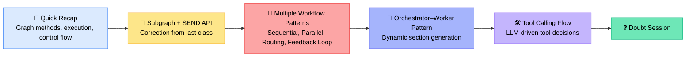
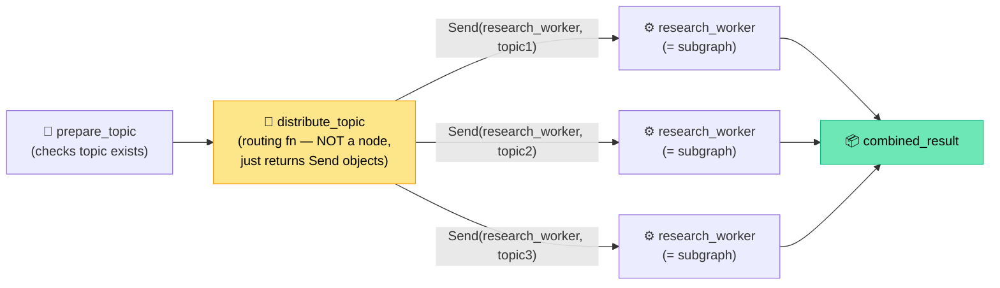
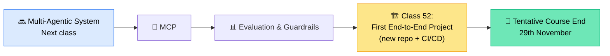

# 🧠 LangGraph Deep Dive: Subgraphs, SEND API & Orchestration Flows
### 📋 Live Class Notes — Krish Naik Academy (Agentic AI)

**🎙️ Speaker:** Sunny (Mentor)
**⏱️ Duration:** ~3 hours (incl. break) + Doubt Session
**🎯 Session Type:** Revision + New Concepts + Live Q&A

---

## 🧭 Session Roadmap

This class was a **deep revision of LangGraph internals** — building on the previous session's subgraph and workflow discussion — before moving toward the Multi-Agentic system (planned for the next class).

---

## 🧱 LangGraph Functionality Cheat Sheet (Blackboard Recap)

Sunny grouped every LangGraph capability into **three buckets** — this is the mental model to memorize.

| Category | Methods/Concepts |
|---|---|
| 🏗️ **Building a Graph** | `add_node`, `add_edges`, `add_conditional_edges`, `add_sequence`, `set_conditional_entry_point`, `set_finish_point`, `StateGraph` |
| ▶️ **Execution** | `.invoke`, `.stream`, `.getState`, `.getStateHistory`, `.updateState`, `.getConfig`, `.getStore`, `.getRuntime` |
| 🎛️ **Control Flow Primitives** | `Send` (dynamic fan-out), `Command` (go-to / update / resume), `interrupt` (pause for human/external input) |

> 💡 **Note:** `getConfig`, `getStore`, and `getRuntime` let you inspect a node from the inside — useful for debugging execution-time details.

---

## 🗂️ Workflow Patterns Covered

```mermaid
flowchart TD
    W1["➡️ Sequential Flow<br/>Fixed order of steps, single direction"] 
    W2["🔀 Parallel Flow<br/>Fan-out + Fan-in, independent jobs run together"]
    W3["🧭 Conditional Routing<br/>Choose correct path based on a condition"]
    W4["🔁 Feedback Loop<br/>Evaluator + Optimizer pattern, loops until pass/max-attempts"]
    W5["🧑‍💼 Orchestrator–Worker<br/>Dynamic parallelization via SEND"]
    W6["🛠️ Tool Calling Flow<br/>LLM decides which tool to invoke"]

    style W1 fill:#dbeafe,stroke:#3b82f6,color:#000
    style W2 fill:#fde68a,stroke:#f59e0b,color:#000
    style W3 fill:#fca5a5,stroke:#ef4444,color:#000
    style W4 fill:#fbcfe8,stroke:#ec4899,color:#000
    style W5 fill:#a5b4fc,stroke:#6366f1,color:#000
    style W6 fill:#6ee7b7,stroke:#10b981,color:#000
```

### ➡️ 1. Sequential Flow
- Steps and their **order are known in advance**
- Built using plain `add_edges` in a single direction
- Example used: `generate → improve → polish` (a topic gets drafted, improved, then finalized)

### 🔀 2. Parallel Flow (Fan-out / Fan-in)
- **Fan-out:** one node's output triggers multiple independent nodes simultaneously
- **Fan-in:** results of multiple parallel nodes converge back into a single node
- Example used: `create_summary`, `extract_keyword`, `create_questions` all run in parallel → `aggregate` combines them
- ⚠️ This fixed fan-out/fan-in (via `add_edges`) is **deterministic** — the same nodes always run. To make it **dynamic**, you need the `Send` API + conditional edges instead.

### 🧭 3. Conditional Routing
- Based on a condition, the graph picks the **correct path** to execute
- Implemented via `add_conditional_edges`
- Example used: a support-ticket router classifying a query as `technical`, `billing`, or `general` and routing accordingly (a credit-card double-charge query correctly routed to **billing**)

### 🔁 4. Feedback Loop (Evaluator–Optimizer)
- A node's output is evaluated; if it fails, the flow **loops back** to regenerate
- Loop continues until either `accepted` or a `max_attempt` threshold is hit
- **"Loop threshold is a hyperparameter — decide it based on your requirement."** — Sunny
- Example used: generate an answer → evaluate → if "need improvement," regenerate; stops after N attempts even if not accepted

### 🧑‍💼 5. Orchestrator–Worker Pattern
- **Orchestrator** = a simple (often sequential) planning step, e.g., generating a list of report sections from a topic
- **Worker** = the unit that actually executes each piece of work — can be a **standalone node** or a **subgraph**
- **Synthesizer** = combines all worker outputs into the final result
- The link between orchestrator and worker **must** be a conditional edge (not a plain edge), because the number/identity of `Send` calls is only known at runtime
- Example used: generating a full report (Intro, Types of AI Agents, Applications, Benefits, Challenges, Case Studies, Future Trends, Conclusion) — each section processed in parallel, then synthesized into one report

### 🛠️ 6. Tool Calling Flow
- Tools (e.g., `multiply`, `add`) are **bound to the LLM**
- The **LLM itself decides at runtime** which tool to call — this is different from `Send`, where parallel threads are explicitly defined by code, not by the LLM
- Loops back from `tool_node → AI assistant` until no more tool calls are needed, then ends
- Example used: query "multiply 12 and 8, then add 10" → LLM sequentially invokes the right tools and returns the final answer

---

## 🔍 The SEND API — Clearing Up the Confusion

This was the **most-corrected and most-debated** topic of the session. Sunny explicitly fixed an error from the previous class.

### ❌ Correction from Previous Session
> Previously stated: "the parent state and subgraph state must share the same keys." **This is incorrect.** You *can* define different keys in a subgraph's state — it doesn't have to mirror the parent state. You may also choose to use a single shared state throughout the graph if preferred; both approaches are valid.

### 🤔 Why Is There a Conditional Edge Before `Send`?
The recurring doubt: *"If the routing function just prepares `Send` calls and doesn't execute anything, why do we need a conditional edge at all?"*

**Answer:** `Send` calls are **dynamically decided at runtime** — there's no fixed, deterministic sequence of which worker/topic gets called first. Because the next target can't be known ahead of time, LangGraph requires a **conditional edge** to represent that dynamic dispatch — an `if-else` isn't sufficient because the number of parallel branches itself is variable.

### ⚠️ Critical Rule: One `Send` Call Cannot Target Two Different Subgraphs
- ❌ **Wrong:** `Send(subgraph_1, input)` and `Send(subgraph_2, input)` issued together as if from one dispatch — LangGraph does not permit routing to two *different* subgraphs from the same conditional-edge logic directly like a flat list.
- ✅ **Correct approach 1:** Wrap both subgraph calls inside a **single node**, and from that node issue two separate `Send` calls (each pointing to its own subgraph) — this works because the dispatch logic lives inside one node's function.
- ✅ **Correct approach 2 ("wrapper" pattern):** Create a **wrapper node** that internally calls `uppercase_graph.invoke(...)` and `word_count_graph.invoke(...)` directly (regular function calls, not `Send`), then returns combined results. `Send` still only ever targets **one node/subgraph per call**, but a single node can *contain* multiple invocations.

> 🎯 **Key takeaway:** A `Send` call can carry exactly **two parameters** — (1) the worker (a standalone node or a subgraph), and (2) the input (passed as a state/dict). To fan out across multiple *different* subgraphs, funnel that logic through one node rather than expecting `Send` to branch across separate subgraphs on its own.

### 📌 Orchestrator / Worker / Synthesizer — Naming Convention
| Term | Meaning |
|---|---|
| **Orchestrator** | The planning/sequential step that decides what work needs to happen (can also be called "planner" or "workflow") |
| **Worker** | The executor — a standalone node *or* a subgraph — invoked via `Send`, can run n-number of parallel instances |
| **Synthesizer** | Combines/aggregates all worker outputs into the final result |

---

## 💻 Practical Scenarios Demonstrated

| Scenario | What It Showed |
|---|---|
| Subgraph + SEND (3 topics: RAG, AI Agent, Memory) | Basic dynamic fan-out into one subgraph, fan-in to combined result |
| Two different subgraphs via one node | Correct pattern for routing to multiple distinct subgraphs |
| Wrapper node with direct `.invoke()` calls | Alternative to `Send` when you want custom control logic combining subgraph outputs |
| Sequential workflow (`generate → improve → polish`) | Simple deterministic chain using topic "Retrieval Augmented Generation" |
| Parallel fan-out/fan-in (summary, keyword, questions) | Fixed workflow (no `Send`) vs. dynamic workflow (with `Send`) contrast |
| Conditional router (technical/billing/general) | Real routing decision — correctly classified a "credit card charged twice" query as billing |
| Evaluator–Optimizer loop | Answer to "What is an Agentic RAG?" accepted on the **first attempt** |
| Orchestrator–Worker report generation | Topic "AI Agents in Enterprises" → auto-generated 7 sections in parallel → synthesized report |
| Tool calling flow | "multiply 12 and 8, then add 10" → LLM dynamically called the right tools in sequence |

---

## 💡 Engineering Philosophy Shared During the Session

> *"While you're designing a system, I would suggest you design in a simple manner... Don't start with the toughest approach."* — Sunny

- 🧱 Build a **simple/deterministic flow or tool-calling flow first** — only reach for `Send`/subgraphs once you deeply understand them
- 🤖 With modern coding copilots, **you are primarily a reviewer now** — learn the concepts well enough to debug and review AI-generated code, not necessarily hand-write everything from scratch
- 🔁 Loop threshold in feedback loops is a **hyperparameter** — tune based on your use case, not a fixed rule

---

## 🧑‍💻 Forward Deployed Engineer (FDE) — What It Really Means

Explained in response to a student question:

- **Not a brand-new role** — it's an existing "tech lead"-style responsibility rebranded with a new title
- An FDE/tech lead: understands the business/user requirement → builds a POC → assembles the team → oversees architecture (low-level + high-level) → manages the SDLC → integrates AI → owns deployment
- One person typically **can't do everything** in a real project — the FDE coordinates the team while owning the end-to-end solution accountability
- The course's positioning: master **AI engineering + LLMOps end-to-end pipeline**, with working exposure to (not mastery of) backend/API/database development

---

## 📅 Course Timeline Update

- 📌 Remaining topics (Multi-Agentic, MCP, Evaluation & Guardrails) expected to take **4–5 classes** from mid-October
- 🏗️ Project phase begins mid-October, expected to take **~1 month**
- 🏁 Tentative course completion: **29th November** (99.99% of syllabus)
- 📁 Project code will be maintained in a **new repo** for CI/CD, but also mirrored into the existing course folder

---

## ❓ Live Doubt Session Highlights

| Question (Asked By) | Answer |
|---|---|
| Where can I find the "prompt rewriting" topic from an earlier class? (Rahul Kumar) | Covered inside **Class 36 – Retrieval** notebook (query rewriting/compression prompt); same pattern can be reused inside any orchestration node |
| Will event streaming be covered? (Rahul Kumar) | Not deep-dived yet; will be demonstrated during the **project phase** to avoid delayed/stuck UI responses |
| How do I implement AI on top of an existing C# SaaS application? (Rahul Kumar) | Check if LangGraph/your framework supports C#. If not, either convert the relevant logic to Python, or **write the AI logic from scratch** in C# — no framework is mandatory |
| Where can I learn fine-tuning in more depth? (Shivaay) | Refer to Sunny's dedicated **"Complete LLM Fine-Tuning"** YouTube playlist (~32 videos) — covers broader fine-tuning concepts beyond what's shown in this batch |
| How should I architect a system correlating stock scripts (e.g., HDFC vs. ICICI) based on user prompts? (bhagwandas armani) | Vector DB is **not always required** — only needed for RAG/knowledge-assistant-style semantic retrieval. For structured correlation tasks: fetch historical data per entity in separate nodes → clean/align data → compute correlation → LLM explains result → return final answer. LangGraph is a **general-purpose orchestration framework**, well-suited for this |
| Will the course's real-world project help understand production-grade systems? (Santosh P) | Yes — hands-on project work will make production concepts click naturally |

---

## ✅ Action Items for Learners

- [ ] 🔁 Re-run and step through the **subgraph + SEND API notebook** end-to-end — don't just read, execute every cell
- [ ] 📓 Review the **orchestrator/worker notebook** to reinforce the dynamic parallelization pattern
- [ ] 🧠 Internalize the **3-bucket mental model**: Building the Graph → Execution → Control Flow Primitives
- [ ] 🛑 Avoid jumping straight to `Send`/subgraphs for new projects — start simple (sequential or tool-calling flow) first
- [ ] 📺 Check out the **"Complete LLM Fine-Tuning"** YouTube playlist if going deeper into fine-tuning
- [ ] 📂 Locate the **prompt rewriting** example inside the Class 36 retrieval notebook
- [ ] 🗓️ Block time for the **Multi-Agentic System** class next, followed by MCP and Evaluation/Guardrails
- [ ] 🏗️ Prepare for **Class 52 (first end-to-end project)** — expect a new repo with CI/CD setup

---

*📝 Notes compiled from the full session transcript — LangGraph Deep Dive: Subgraphs, SEND API & Orchestration Flows, Krish Naik Academy.*
