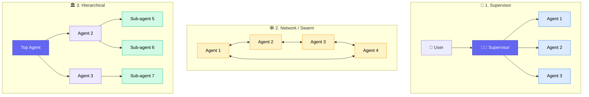
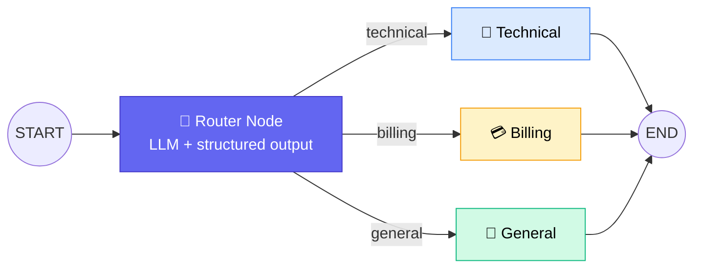
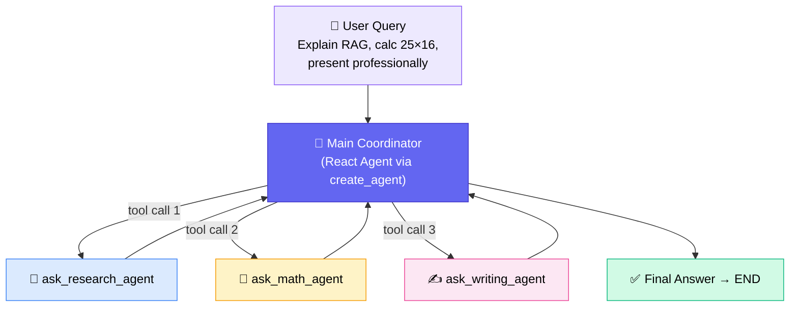
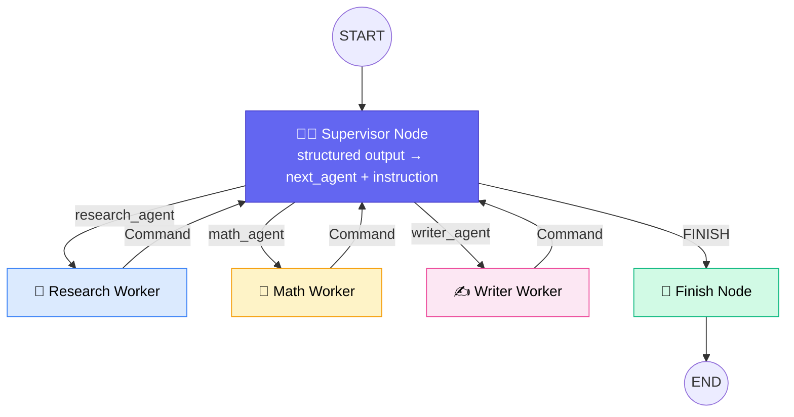

# 🤖 Multi-Agentic Systems with LangGraph

## 🧭 Session Agenda & Housekeeping

- 📂 Class 48 handwritten notes uploaded to GitHub (inside the respective topic folder); dashboard topic names now match GitHub names
- 📓 Today's code is in an `.ipynb` on GitHub — **run it yourself, don't just watch**
- 🔜 Coming up: MCP → A2A → Evaluation → Guardrails → **Projects** (~2–3 weeks away, 5–6 more classes first)
- 📌 Note: the Functional API is not used in this course — we work with `StateGraph`

```mermaid
flowchart LR
    A["🧠 LangGraph<br/>Recap"] --> B["🤝 Multi-Agent<br/>Theory"]
    B --> C["💻 Code: Router<br/>Flow"]
    C --> D["💻 Code: Agent<br/>as a Tool"]
    D --> E["💻 Code: Supervisor<br/>Flow"]
    E --> F["⚖️ Compare 3<br/>Architectures"]
    F --> G["❓ Doubt<br/>Session"]

    style A fill:#dbeafe,color:#000,stroke:#3b82f6
    style B fill:#e0e7ff,color:#000,stroke:#6366f1
    style C fill:#fef3c7,color:#000,stroke:#f59e0b
    style D fill:#fde68a,color:#000,stroke:#f59e0b
    style E fill:#a5b4fc,color:#000,stroke:#6366f1
    style F fill:#d1fae5,color:#000,stroke:#10b981
    style G fill:#fce7f3,color:#000,stroke:#ec4899
```

---

## 🔁 Quick LangGraph Recap

| Concept                 | Meaning                             |
| ----------------------- | ----------------------------------- |
| 🔵 **Node**             | A function                          |
| 🔗 **Edge**             | Connectivity between nodes          |
| ➡️ **Normal edge**      | Sequential, fixed path              |
| 🔀 **Conditional edge** | Path chosen based on state/decision |

Workflows split into two kinds:

|            | 🧱 Deterministic Flow  | 🌊 Dynamic Flow         |
| ---------- | ---------------------- | ----------------------- |
| Steps      | **Defined in advance** | Decided **at run time** |
| Autonomy   | Low                    | High (autonomous)       |
| Label used | "Partial agentic flow" | "Agentic flow"          |

Inside agentic flows there are two styles: **(1)** fixed nodes + fixed edges, and **(2)** the **LLM itself decides which tool to call**.

> ⚠️ _"If you forget LangGraph, revise it — interviewers ask about it again and again."_

---

## 🤝 What Is a Multi-Agentic System?

- **Multi-agent = more than one agent working together** (multi-agent and multi-agentic are synonyms)
- **Agent** = a system running in a dynamic/autonomous mode (an LLM + tools that decides what to call)
- Agents must be able to **talk to / collaborate with each other**
- A workflow is _one thing_; a multi-agentic system adds **autonomy** on top

### 🧠 Where does "Deep Agent" fit?

- **Deep Agent ≠ a special kind of multi-agent** — it's a generic term for an agent that does **long-horizon, multi-step, planning-heavy work** (e.g., 100 iterations until the problem is solved)
- **Any single agent OR any multi-agent system can be a deep agent**
- LangChain ships a `Deep Agents` **class** — you only tweak parameters, the internals are a black box
- For full control, build your own deep-agent system in **LangGraph**
- 💸 Deep agents are **expensive** (frequent LLM/API calls) — check model capability + budget before production

---

## 🕸️ The 3 Multi-Agent Topologies

| Topology                      | How it works                                                                | Notes                                                         |
| ----------------------------- | --------------------------------------------------------------------------- | ------------------------------------------------------------- |
| 👔 **Supervisor**             | One central agent/LLM receives the query and **delegates** to worker agents | Most popular pattern                                          |
| 🕸️ **Network (a.k.a. Swarm)** | Agents connect **independently** to each other, no central boss             | Not every agent must link to every other; you define the flow |
| 🏛️ **Hierarchical**           | Supervisor-of-supervisors — agents have **their own sub-agents**, in levels | Full picture; **supervisor is a subset of hierarchical**      |

- 🔀 **Hybrid / custom flows are allowed** — LangGraph has a "custom" category for mixing patterns
- 🔌 Tools can be exposed across agents via **MCP**; agent-to-agent communication is via **A2A** (covered in upcoming classes)

---

## 🚨 The Reality Check (Most Important Message)

> _"99% of things can be solved with basic orchestration — conditional edges, subgraphs. Think twice before productionizing a fully autonomous system."_

- ⚠️ More autonomy → **more chances of breaking** and **higher cost**
- 🧪 Only productionize after **well-tested evaluation** with evidence
- 🧍 Keep **human-in-the-loop** wherever permission/approval is needed
- 👶 **Start with baby steps** — build something solid, add complexity only when a real requirement demands it
- 🏢 **Real story:** In an org architecture review, senior architects debated converting a working deterministic flow into a fully autonomous supervisor system — the conclusion was **"if it does the job, don't add critical complexity"**; it was approved as a _partial agentic system_
- 🎤 **Interview tip:** Answer this way (simplicity + evaluation + human-in-loop) and interviewers get impressed
- 📚 **Framework advice:** Master **LangGraph** (≈95% of companies ask for it). Don't chase every framework (OpenAI SDK, Google ADK, Claude SDK…) — a comparison notebook will be provided at the end

---

## 💻 Code Walkthrough

**Setup:** `TypedDict`/Pydantic state · `ChatOpenAI` (GPT-4.1 mini) · `StateGraph`, `START`, `END` · `Command` API · `Send` API · `InMemorySaver` · `create_agent` (from `langchain.agents`)

### 🅰️ Flow 1 — Router-Based Workflow _(Partial Agentic System)_

- A Pydantic class with 3 categories is passed to `with_structured_output`, forcing the LLM to classify into **technical / billing / general**
- State (`TypedDict`): `query`, `route`, `response`
- `route_to_specialist` maps the router output → the correct node via **conditional edges**
- Test query _"my subscription payment was charged twice"_ → routed to **Billing** ✅

**Why is it only "partial agentic"?**

- ❌ Nodes are **fixed, specialized LLM nodes**, not autonomous agents
- ❌ Technical "agent" doesn't decide whether to search docs, call an API, or query a DB
- ✅ It **becomes** a true agent if each specialist decides its own tools dynamically
- 💼 Yet **~90% of industry systems look like this** — reliable and sufficient

---

### 🅱️ Flow 2 — Agent as a Tool _(Sub-agent as a Tool)_

**Key ideas**

- **React = Reasoning + Act.** `create_agent(model, tools, system_prompt, name)` builds a React agent (LLM + tool calling loop until the answer is sufficient)
- Two ways to build one: **(a)** LangChain's inbuilt `create_agent`, **(b)** from scratch in LangGraph
- Three sub-agents (research, math, writing) are each built with `create_agent`, then **wrapped in `@tool` functions** and handed to a _main coordinator_ agent
- Each sub-agent's `tools=[]` is **empty for now** but can hold web/Wikipedia/DB/calculator tools — the sub-agent then decides its own tool calls
- The `name` parameter is just a custom label; it doesn't need to match the variable
- State: **one shared state** flows across agents (no per-agent explicit state defined)
- Order of tool calls is **decided by the LLM**, not by the order you define them
- Final answer = `result["messages"][-1].content`
- 🏭 Used by Sunny in a **report-generation POC**; example comes straight from the LangGraph docs

> ⚠️ **Common mistake:** This _looks_ like a supervisor but is **not** the classic supervisor pattern — here **agents are tools**, not independent graph nodes.

---

### 🅲 Flow 3 — True Supervisor Flow

- **`SupervisorDecision` (Pydantic):** `next_agent` ∈ {research_agent, math_agent, writer_agent, FINISH} + `instruction: str`
- **`SupervisorState` (TypedDict):** `task`, `next_agent`, `instruction`, `worker_output` (`list[str]` with `operator.add` to accumulate), `final_answer`, `supervisor_turns`
- 🔒 **Loop guard:** `supervisor_turns` counter caps iterations so it can't run infinitely (forces FINISH after the limit)
- The supervisor prompt gets the original task + work completed so far → picks the next agent and writes it an instruction
- Workers return control to the supervisor via **`Command`**
- Test: _"Can you research about RAG?"_ → `next_agent = research_agent`, instruction = _"research RAG including definition, applications, significance"_
- Workers here are simple, but can be upgraded into full React agents / sub-agent hierarchies

---

## ⚖️ Comparing the 3 Architectures

|                        | 🅰️ Router Flow                   | 🅱️ Agent-as-Tool                        | 🅲 Supervisor Flow                         |
| ---------------------- | -------------------------------- | --------------------------------------- | ----------------------------------------- |
| **Who decides?**       | LLM classifies once, fixed edges | Coordinator LLM picks tools dynamically | Supervisor LLM picks next agent each turn |
| **Autonomy**           | 🔴 Low                           | 🟢 High                                 | 🟢 High                                   |
| **Classification**     | Partial agentic / shallow        | True multi-agent (agents as tools)      | True multi-agent                          |
| **Depth of reasoning** | Shallow                          | Shallow single React loop               | 🧠 **Deep** — more iterations             |
| **Cost/Risk**          | 💰 Low                           | 💰💰 Medium                             | 💰💰💰 High                               |

- 🐚 **Shallow agent** (`create_agent`) → single React agent, more deterministic
- 🌊 **Deep agent** (`Deep Agents` class / long supervisor loops) → long-horizon, in-depth research, heavy LLM involvement
- 🎯 **Rule:** If a simpler architecture solves your problem, **don't use the complex one** unless you truly need heavy reasoning

---

## 🗺️ Roadmap Ahead

```mermaid
flowchart LR
    A["✅ Today:<br/>Router • Agent-as-Tool • Supervisor"] --> B["🔀 Next class:<br/>Command API + goto<br/>Handoff • Triage"]
    B --> C["🐝 Swarm<br/>(Network) Agent"]
    C --> D["🏛️ Hierarchical<br/>Supervisor"]
    D --> E["🔌 MCP & A2A<br/>(2–3 classes)"]
    E --> F["📏 Evaluation &<br/>Guardrails"]
    F --> G["🏗️ End-to-End<br/>Project"]

    style A fill:#d1fae5,color:#000,stroke:#10b981
    style B fill:#dbeafe,color:#000,stroke:#3b82f6
    style C fill:#e0e7ff,color:#000,stroke:#6366f1
    style D fill:#ede9fe,color:#000,stroke:#8b5cf6
    style E fill:#fef3c7,color:#000,stroke:#f59e0b
    style F fill:#fde68a,color:#000,stroke:#f59e0b
    style G fill:#6366f1,color:#fff,stroke:#4338ca
```

- 🧩 **Command API** — has a `goto` parameter to control agent flow; core to **handoff** (used for triage → specialist)
- 📓 Bonus notebook examples for homework: hierarchical system, **parallel multi-agent collaboration with `Send`**, coordinator-guided peer network
- 📚 Also promised: a **new LangChain notebook** (latest version) + a **framework-difference notebook** (Google ADK, Semantic Kernel, etc.) for interviews
- 🔭 Observability will be folded into the project

---

## 🎯 Interview-Ready Topic Checklist

1. 📄 **RAG** (incl. multimodal RAG)
2. 🤖 **Agents / Agentic systems**
3. 📏 **Evaluation**
4. 🛡️ **Guardrails** + **AI Security** _(increasingly asked)_
5. 🔌 **MCP**
6. ☁️ **GenAI / Agentic AI on cloud**
7. 🏗️ **End-to-end project**
8. 🧱 Basics: LLMs, transformers, fine-tuning

> 💬 _"If you know these, you can crack any GenAI / Agentic AI interview."_ — Sunny

---

## ❓ Doubt Session Highlights

| Question                                                                                                           | Answer                                                                                                                                                                                                                                                                                                                         |
| ------------------------------------------------------------------------------------------------------------------ | ------------------------------------------------------------------------------------------------------------------------------------------------------------------------------------------------------------------------------------------------------------------------------------------------------------------------------ |
| **Will "JAB" (new classification/decision model) replace LLMs?** _(name as heard in transcript — verify spelling)_ | No — it's a **decision/classification model**, not generative. Great for **routing, ranking, decision gates** at lower cost/latency, but LLMs have far more depth. Expect it to **work alongside** LLMs (simple cases → JAB, heavy reasoning → LLM). **Test it yourself** before concluding — don't trust YouTube videos alone |
| Can JAB replace LLM-as-judge/routing?                                                                              | Possibly for classification-style tasks; needs **your own experiments** and proof                                                                                                                                                                                                                                              |
| Can I mix supervisor + hierarchical?                                                                               | Yes — LangGraph supports **custom/hybrid flows**. Supervisor is a subset of hierarchical                                                                                                                                                                                                                                       |
| Does agent order matter in the tool approach?                                                                      | No — the LLM picks whichever agent is needed, in any order                                                                                                                                                                                                                                                                     |
| What is a Deep Agent, really?                                                                                      | A generic term: multi-step planning + reasoning + multiple tools toward a larger goal. A well-configured supervisor/React agent can be one                                                                                                                                                                                     |
| `create_agent` vs LangGraph from scratch?                                                                          | Simple needs (model + tools) → **inbuilt method**. Need custom nodes, observability, extra logic → **LangGraph from scratch**. Validate via **POC**                                                                                                                                                                            |
| Java dev (green card pending) wants AI skills                                                                      | Keep the current role; add AI skills **alongside** (replicate concepts in Python/Java, do side/community projects). Advice from Sandeep: don't jeopardize the GC process                                                                                                                                                       |
| Weak in Python before project starts?                                                                              | Take the Python course on Krishnaik.in; use ChatGPT/Claude to generate short practice snippets                                                                                                                                                                                                                                 |
| Data engineer → GenAI transition?                                                                                  | **Strong foundation.** Add Python, LLM fundamentals, RAG, agents, evaluation/observability, deployment; grab an AI project at work                                                                                                                                                                                             |
| Will data-engineering roles disappear?                                                                             | Role remains but **demand may shrink** as copilots automate routine pipelines; future is AI engineering, FDE, end-to-end design                                                                                                                                                                                                |
| How to apply RAG/agents on GBs of daily transactional data?                                                        | **Don't embed everything into a vector DB.** Keep warehouse/lakehouse as source of truth → add **semantic/metadata layer + text-to-SQL** → fetch/aggregate → pass to LLM                                                                                                                                                       |
| What AI did Sunny build on Databricks?                                                                             | A **Databricks app** (agentic "AI reviewer") reading from Unity Catalog                                                                                                                                                                                                                                                        |

---

## ✅ Action Items for Learners

- [ ] 📓 Pull the latest notebook from GitHub and **run every cell**
- [ ] 🔁 Revise LangGraph fundamentals (nodes, edges, conditional edges, `StateGraph`)
- [ ] 🔧 Experiment: add real tools (web/Wikipedia/calculator) inside the research/math/writing sub-agents
- [ ] 🎨 Draw all 3 flows (router, agent-as-tool, supervisor) and label which is **partial agentic** vs **fully autonomous**
- [ ] 📂 Check the Class 48 handwritten notes folder on GitHub (subgraphs & workflows)
- [ ] 🐍 Non-Python folks: start the Python course _before_ projects begin
- [ ] 🧪 Try comparing JAB vs LLM router on your own data
- [ ] 📝 Submit the NPS feedback link shared in class
- [ ] 📚 Read up: `Command` API, `goto`, handoff — next class prep

---

_📝 Notes compiled from the full Class 49.1 transcript — Multi-Agentic Systems with LangGraph. Assumptions: session date taken from the instructor's "26th of September" mention; "JAB/Jeb/Zev" spellings in the auto-transcript were ambiguous and are flagged above._
