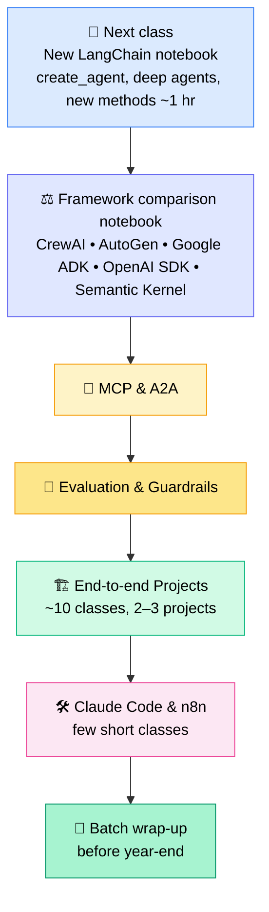
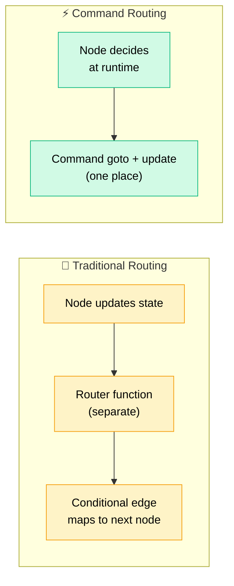
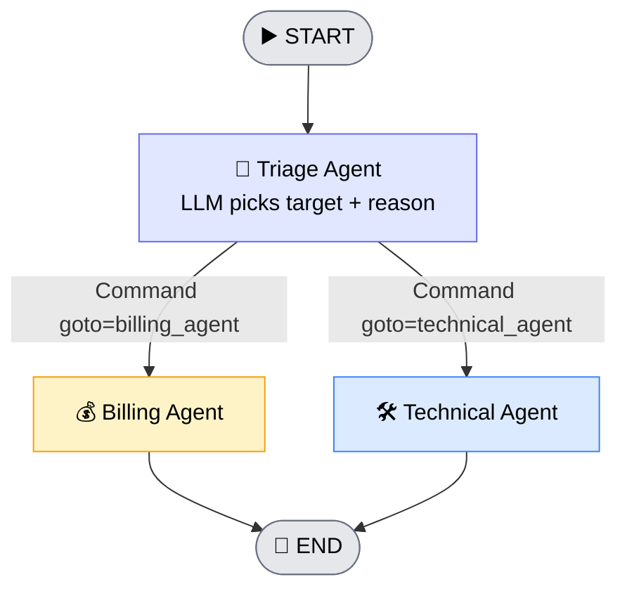
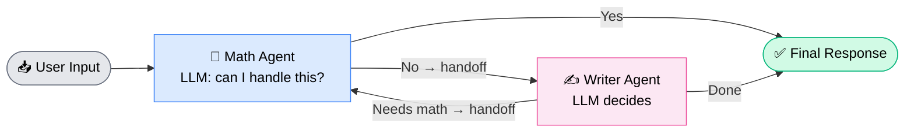
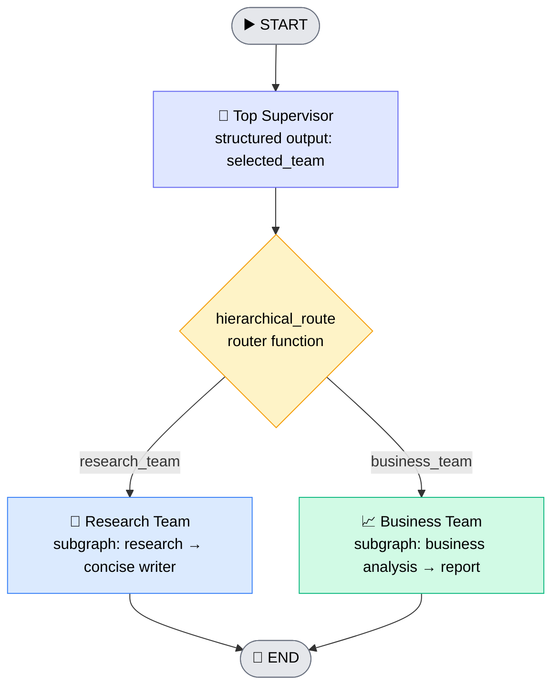
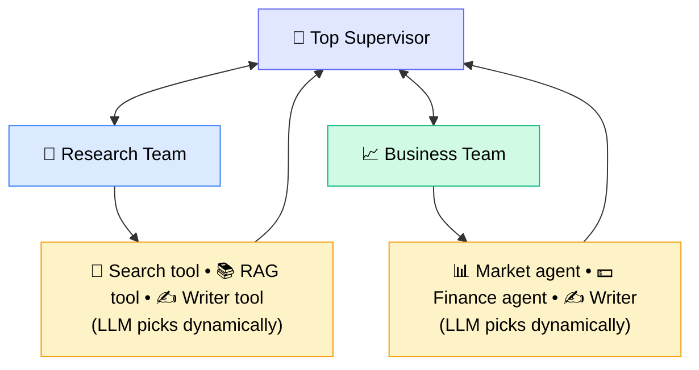
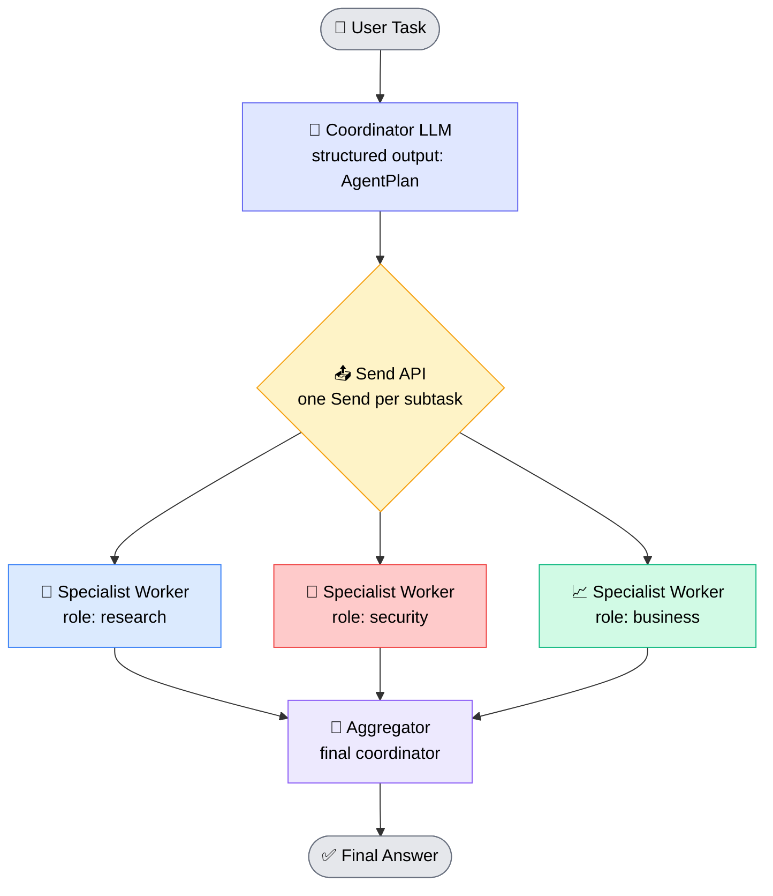

# 🤖 Multi-Agentic Systems — Command API, Swarm, Hierarchical & Send

## 🧭 Session Roadmap

```mermaid
flowchart LR
    A["📣 Announcements<br/>& Career Talk"] --> B["🧠 Recap<br/>Workflow vs Agent"]
    B --> C["🎯 Command API<br/>Handoff Demo"]
    C --> D["🐝 Swarm / Network<br/>Agents"]
    D --> E["🏛️ Hierarchical<br/>Flow"]
    E --> F["📤 Send API<br/>Parallel Fan-out"]
    F --> G["❓ Doubt<br/>Session"]

    style A fill:#fef3c7,color:#000,stroke:#f59e0b
    style B fill:#dbeafe,color:#000,stroke:#3b82f6
    style C fill:#e0e7ff,color:#000,stroke:#6366f1
    style D fill:#fce7f3,color:#000,stroke:#ec4899
    style E fill:#d1fae5,color:#000,stroke:#10b981
    style F fill:#ede9fe,color:#000,stroke:#8b5cf6
    style G fill:#fed7aa,color:#000,stroke:#f97316
```

> 💡 **Core message of the day:** Multi-agentic systems are mostly about _who decides where the task goes next_ — a supervisor, the agents themselves (swarm), a hierarchy of supervisors, or a planner that fans work out in parallel.

---

## 📣 Announcements & Career Insights

### 🗓️ Course & Batch Updates

- 🎉 **50 classes done** — about **10–15 more classes** remain before wrap-up
- 🚀 **Generative AI 2.0 batch** planned for **February** (after January). It will focus on **AI security, evaluation, and end-to-end projects tied to the FDE role** — theory will be trimmed since the Data Science Bootcamp already covers it
- 🏗️ **AI Infrastructure / Platform Engineer batch** likely **Nov–Dec** — deploying LLMs on GPUs, inference, and hosting RAG/agentic apps on cloud
- 🧑‍💻 **FDE (Forward Deployed Engineer) bootcamp** starts next Sunday
- 📆 Batches stay **weekend-only** — no weekday batches planned

### 💼 Market Observations (from Sunny's recent projects)

| Role                                   | Trend               | Sunny's take                                                    |
| -------------------------------------- | ------------------- | --------------------------------------------------------------- |
| 🧾 **Business Analyst (BA)**           | ⬇️ Demand shrinking | Not extinct, but AI copilots + senior devs now cover most of it |
| 📋 Scrum Master / Project Manager      | ➡️ Still needed     | Not yet fully automated                                         |
| 🤖 **AI Engineer**                     | ⬆️ Very high demand | Colleagues switching jobs with **100%+ hikes**                  |
| 🧑‍💼 **FDE (Forward Deployed Engineer)** | ⬆️ Rising           | Senior person who handles business + AI systems + full SDLC     |

> 🎯 **Advice for everyone (BA, PM, Scrum Master, dev):** learn the AI stack, get **mastery over Claude/ChatGPT-class tools**, then step up toward AI Engineer / FDE roles. Basic skills like _only_ Power BI won't hold up against AI assistants.

---

## 🛣️ What's Coming Next

- 📌 **5–6 classes** remain before projects begin; projects start after roughly **18 October**
- ⚙️ **Async** is plain Python, not an agentic concept — material will be shared
- 🌿 **Celery** is recommended for multiprocessing / parallel heavy-data workloads
- 🎉 A virtual + in-person celebration will be discussed in **November** (Sunny plans a Delhi visit that month)

---

## 🧠 Recap: Workflow vs Agent vs Command

| Term            | What it is                                                                 |
| --------------- | -------------------------------------------------------------------------- |
| 🔄 **Workflow** | The **overall execution structure** (deterministic, dynamic, or hybrid)    |
| 🧠 **Agent**    | A **decision-making component** inside a workflow                          |
| 🎯 **Command**  | A LangGraph **control primitive** — a mechanism to control graph execution |

- 🟢 **Fully agentic** = autonomous, dynamic decisions
- 🟡 **Partial / hybrid agentic** = some steps are deterministic, some dynamic
- 🔵 _LangGraph docs call the dynamic one "agent" and the deterministic one just "workflow"; "partial agentic" is Sunny's own, industry-friendly label_

---

## 🎯 The Command API & Handoff

### 🤝 What is a Handoff?

Transferring control from one agent to a **more suitable specialist agent**, so the new agent continues the task.

> 📌 _Example:_ A **research agent** receives a code-writing task → it can't do it → it **hands off** to the **coding agent**.

> ⚠️ `Command` is **not mandatory**. The same result can be built with conditional edges + a router. It's a **built-in shortcut**.

### 🧩 Command Parameters

| Parameter | Purpose                                                                  |
| --------- | ------------------------------------------------------------------------ |
| `goto`    | Name of the next node/agent to route to                                  |
| `update`  | Update the graph **state** at the same time                              |
| `resume`  | Resume an interrupted graph (human-in-the-loop), e.g. `resume="approve"` |

### ⚖️ Conditional Edges vs Command

- 🧭 **Normal workflow:** developer defines the path while building the graph
- ⚡ **With Command:** the node decides at runtime; **routing + state update happen in the same place**
- 🧠 The **LLM is the decision-maker**; **Command only applies the decision** — Command itself is _not_ an agent
- 🛠️ **Command vs Tool:** a tool is a full-fledged function; Command is a built-in mechanism controlling graph execution

### 🧪 Live Demo: Triage Handoff (Billing vs Technical)

**Build steps:**

1. 📐 Pydantic class `HandoffDecision` → `target` (billing / technical) + `reason`
2. 🧠 Model with **structured output** using that class
3. 📦 State = `MessagesState` + `active_agent: str`
4. 🧭 Triage node returns `Command(goto=decision.target, update={"active_agent": ...})`
5. 🧱 Graph edges: `START → triage`, `billing → END`, `technical → END` — **no conditional edge, no router function**

**Test results:**

- 💬 _"Internet issue while connecting to Teams"_ → ➡️ **Technical agent**
- 💬 _"API keeps returning 410 authentication error"_ → ➡️ **Technical agent** (with follow-up questions)

> 🔍 The triage prompt describes each specialist's scope (billing = payment/invoices/refund/subscription; technical = software errors/login/API issues). In real projects, add more categories.

---

## 🐝 Swarm / Network Multi-Agent System

### 🧠 Concept

- Agents are **directly connected to each other**
- **No supervisor** — agents coordinate among themselves
- Whichever agent is **specialised** for the task handles it; otherwise it **hands over**

> 🧑‍🤝‍🧑 **Analogy:** Two developers — one specialised in **Android**, one in **Swift/iOS**. A task to build an Android app lands on the iOS dev → they hand it over to the Android dev. That's a swarm.

### 🔧 Implementation (built-in LangGraph helpers)

- 📦 From `langgraph_swarm`: **`create_handoff_tool`** and **`create_swarm`**
- 🏗️ Each agent made via **`create_agent`** (model + tools + system prompt + name)
- 🔗 Each agent's **handoff tool points to the other agent** (math ↔ writer)
- 🚩 `default_active_agent` = **math agent** (entry point); a checkpointer is attached
- 🧾 Result trace: `Human → AI (tool call) → Tool → AI → Tool → AI` — agents behave like tools to each other
- ✅ Test: _"Calculate this and present result as a professional one-liner"_ → product **4000**

### ⚠️ Sunny's Recommendation

- 🚫 Built-in `create_handoff_tool` / `create_swarm` are **recent additions** (didn't exist ~1.5–2 years ago) — used only to _demonstrate_ the idea
- ✅ **Prefer building with `Command`** or **from scratch with nodes + edges** to truly understand it
- 🧪 A supervisor _can_ be added, but it changes the pattern — not typical for swarm

### 📝 Assignment 1 — Build These Swarm Patterns

| Pattern                                     | Agents                   |
| ------------------------------------------- | ------------------------ |
| ✍️ Research ↔ Writer                        | 2 agents                 |
| 💻 Coder ↔ Reviewer                         | 2 agents                 |
| 🔗 Research + Coder + Reviewer + Writer     | 4 fully-connected agents |
| 📊 Data → Analysis → Visualization → Report | 4 connected agents       |

> 💡 Build each **twice**: once with `Command`, once from scratch with nodes/edges — then compare.

---

## 🏛️ Hierarchical Multi-Agent Flow

### 🧠 Concept

A **top supervisor** delegates to **team-level subgraphs**, each of which can have its own logic. Supervisor flow is a **subset** of hierarchical flow.

### 🔧 Build Walkthrough

1. 📦 **`TeamState`** → `task`, `team_output` (used inside each team subgraph)
2. 🔬 `research_team_node` — research specialist → writer condenses it
3. 📈 `business_team_node` — analyses the task from a business view → final report
4. 🧱 Each team compiled as its own **subgraph**
5. 📦 **`HierarchicalState`** → `task`, `selected_team`, `final_answer`
6. 👔 `top_supervisor` — chooses best team via structured output
7. 🔀 `hierarchical_route` — maps `selected_team` to the right node via conditional edge
8. ✅ Test: _"Explain the business value of using Agentic RAG in an enterprise"_ → routed to **business team** → final report

### 🔎 Is It Fully Agentic? — **No!**

| Question             | Answer                                                      |
| -------------------- | ----------------------------------------------------------- |
| Hierarchical flow?   | ✅ Yes                                                      |
| Supervisor flow?     | ✅ Yes (a subset of hierarchical)                           |
| Fully agentic?       | ❌ No                                                       |
| Fully deterministic? | ❌ No                                                       |
| **What is it?**      | 🟡 **Hybrid / LLM-enabled workflow / partial agentic flow** |

> 🏢 **Why teach it?** In enterprise & user-facing apps, a _fully autonomous_ system has a higher chance of failing. Hybrid flows are **more reliable and deterministic** — this is what you'll build most often in industry.

### 🚀 Making It _Truly_ Agentic

- 🔁 Teams return control to the **supervisor in a loop**; the supervisor decides what's next or whether the task is done
- 🛠️ Each team **dynamically chooses tools/agents**
- 🧩 Two ways to build: **(1)** nodes + edges from scratch, **(2)** `Command` API

### 🌍 Real-World Hierarchy Examples

| Domain                     | Hierarchy                                                                                |
| -------------------------- | ---------------------------------------------------------------------------------------- |
| 💻 **SDLC Automation**     | Supervisor → Dev team (frontend / backend / DB) or QA team (testing / DevOps / security) |
| 🛒 **E-commerce**          | Supervisor → domain teams → specialist agents                                            |
| 🔬 **Research & Analysis** | Supervisor → research / analysis teams                                                   |
| 🏢 **4-Level Org**         | CEO → Division (e.g., Engineering) → Director → Specialist (frontend / backend / DB)     |

> 🎫 **Course project hint:** Automating **Jira tasks** — task arrives → supervisor routes to dev/QA → backend agent builds → supervisor sends to testing → approval. Similar to **Copilot's Agent / Plan mode**, which loops _plan → code → test_.

### 📝 Assignment 2 — Build Hierarchical Systems

- Build the **2-level** examples (SDLC, e-commerce, research & analysis)
- The **4-level** example will be given later
- Only generate results for now — evaluation loops are optional
- Build with **both** `Command` and from-scratch approaches

---

## 📤 Send API — Parallel Fan-Out Collaboration

### 🧠 Concept

A **coordinator** (planner) dynamically breaks a task into subtasks, and the **Send API** runs the **same specialist worker node in parallel**, one per subtask. An **aggregator** then merges the outputs.

### 🔧 Build Walkthrough

1. 📐 Pydantic **`AgentTask`** → `role` (research / security / business) + `task`
2. 📐 Pydantic **`AgentPlan`** → `tasks: list[AgentTask]`
3. 🧠 `multi_agent_planner` = model with structured output of `AgentPlan`
4. 📦 States: **`CollaborationState`** (user_task, task, output, final_answer) and **`CollaborationWorkerState`** (role, task, output)
5. 🧭 `collaboration_coordinator` — breaks the query into only _useful_ specialist tasks
6. 📤 `send_collaboration_worker` — loops `for item in state.task` and returns a `Send("specialist_worker", {...})` per item (used via conditional edge)
7. 👷 `specialist_worker` — picks role prompt → `model.invoke` → returns output
8. 🧩 `aggregator` — merges all outputs into one coherent final response
9. 🧱 Edges: `START → coordinator → (Send) → specialist_worker → aggregator → END`

**Test:** _"Evaluate the use of AI agents inside a large financial enterprise"_ → planner produced **3 subtasks** (research, security, business) → ran **in parallel** → aggregated.

> 🚀 **Making it more agentic:** Give each `specialist_worker` its own autonomy (tools, decisions), or add **multiple specialist workers** — a pure Send fan-out becomes a true multi-agentic architecture.

---

## 📊 Pattern Comparison Cheat Sheet

| Pattern                | Who decides next step?                  | Supervisor?     | Best for                               | Autonomy level         |
| ---------------------- | --------------------------------------- | --------------- | -------------------------------------- | ---------------------- |
| 🎯 **Supervisor**      | Central supervisor                      | ✅ Yes          | Clear delegation to workers            | Medium–High            |
| 🐝 **Swarm / Network** | The agents themselves (handoffs)        | ❌ No           | Peer specialists that pass work around | High                   |
| 🏛️ **Hierarchical**    | Supervisors at multiple levels          | ✅ Yes (nested) | Large, org-like systems, SDLC          | Medium (hybrid) → High |
| 📤 **Send (fan-out)**  | Planner splits, workers run in parallel | ✅ Coordinator  | Parallel research / analysis           | Medium → High          |

> ⭐ **Sunny's priority:** **Master Supervisor + Hierarchical first**, then Swarm. Treat the rest (Send variants, peer coordinator) as **additional knowledge**.

---

## 🧰 Quick Revision — Key Concepts

- 🎯 `Command(goto=..., update=...)` → route **and** update state in one place
- 🔁 `Command(resume=...)` → resume an interrupted human-in-the-loop graph
- 🤝 **Handoff** = transfer control to a better-suited agent
- 🐝 **Swarm** = no supervisor; agents hand off to each other
- 🏛️ **Hierarchical** = supervisors → teams (subgraphs) → specialists; usually **hybrid**
- 📤 **Send** = dynamic **parallel fan-out** of one worker node over many subtasks
- 🧱 Everything built with `Command` can also be built with **nodes + conditional edges**
- 🏢 **In industry:** prefer reliable hybrid / LLM-enabled workflows over fully autonomous ones

---

## ❓ Doubt Session Highlights

| Question                                                                         | Answer                                                                                                                                                                                                                                                                      |
| -------------------------------------------------------------------------------- | --------------------------------------------------------------------------------------------------------------------------------------------------------------------------------------------------------------------------------------------------------------------------- |
| **Pokhraj:** Is "one system with multiple agents" multi-agentic?                 | Yes — multiple agents inside one workflow, which can be **partial (deterministic)** or **fully autonomous**. "Agent" is a generalized term                                                                                                                                  |
| Is a router calling tools a multi-agent system?                                  | Only if the **tool behaves like an agent** (can decide and call other tools autonomously). Plain tool-calling is just a tool-calling workflow                                                                                                                               |
| A subgraph inside a flow — multi-agentic?                                        | Not by itself. It becomes multi-agentic when workers are **autonomous / dynamic / parallel** (e.g., the Send pattern)                                                                                                                                                       |
| Is **MCP** an agent?                                                             | ❌ No — MCP is just a way of **exposing tools**. It's multi-agent only if a tool acts as an agent                                                                                                                                                                           |
| **Piyush:** How do I give my agent Gmail / VS Code tools?                        | Wrap capabilities as tools. **Gmail** needs the Gmail API + OAuth credentials (Google Cloud Console → create project, enable Gmail API, client ID/secret, download `credentials.json`). **VS Code** needs local Python/OS commands. The LLM then chooses which tool to call |
| How does Whisper Flow clean up dictation?                                        | Likely an **AI cleanup step** after speech-to-text (removes filler words, fixes punctuation, formats text). You can prototype with OpenAI Whisper + an LLM                                                                                                                  |
| Sequential vs dynamic — when to use which?                                       | Depends on the **use case**. Use **sequential** when the next step is always known (open → draft → send mail); use **dynamic/conditional** when there are multiple possibilities                                                                                            |
| **GRM:** Agent vs autonomous agent?                                              | An agent = dynamic tool selection by the LLM. **Deterministic** = path fixed by edges; **autonomous** = LLM decides dynamically. A sequential LLM pipeline is just an _LLM-enabled deterministic workflow_. Real agentic = tool-calling loop                                |
| What should I revise?                                                            | Revise the **LangGraph introduction through the last ~7–8 classes** — expect 1–2 weeks, but understanding becomes concrete                                                                                                                                                  |
| **Krish S:** How to enforce security / prompt-injection defences at agent level? | Use **layers**: authentication → authorization → guardrail layer → tool-permission check → **human approval** before touching DB/bank APIs. Plus enterprise controls: **IAM, RBAC, ABAC, transaction limits, MFA, fraud detection, API gateway**                            |
| Which frameworks for centralised agent security?                                 | **Guardrails AI, NVIDIA NeMo Guardrails, Microsoft Agent Framework, Llama Firewall, Garak, PyRIT** — study these to learn agentic security                                                                                                                                  |

---

## ✅ Action Items for Learners

- [ ] 📓 Pull the latest changes from GitHub — new **Command notebook**, swarm and hierarchical notebooks (⚠️ GitHub's notebook preview may error — **download the file locally** and open it)
- [ ] 🐝 Complete **Assignment 1** — swarm patterns (Command **and** from-scratch)
- [ ] 🏛️ Complete **Assignment 2** — 2-level hierarchical systems (SDLC, e-commerce, research & analysis)
- [ ] 📤 Deep-dive the **Send API** collaboration notebook and try making the worker more autonomous
- [ ] 🔁 Revise LangGraph classes from the introduction to the latest — **practice 2–3 times**
- [ ] 🔐 Explore security frameworks: Guardrails AI, NeMo, Microsoft Agent Framework, Llama Firewall, Garak, PyRIT
- [ ] 🌿 Read up on **Celery** (multiprocessing) and Python **async**
- [ ] 🛠️ Optional: practise with **Cursor / Claude / Copilot** in agent mode
- [ ] 🔗 Submit the **feedback / NPS form** shared in chat
- [ ] 📌 Keep a strong grip on **RAG + Multi-Agentic** — both will feed the end-to-end projects

---

_📝 Notes compiled from the full Class 50 transcript — Multi-Agentic Systems (Command API, Swarm, Hierarchical, Send), including the doubt session._
